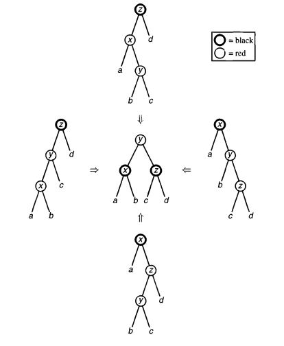
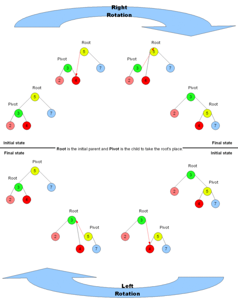

# Algorithms

# Сумма двух

Имея массив целых чисел, нужно вернуть индексы двух элементов, сумма которых будет равна заданному числу

## Пример
    
    Given nums = [2, 7, 11, 15], target = 9,
    
    Because nums[**0**] + nums[**1**] = 2 + 7 = 9,
    return [**0**, **1**].

## Решение

  1. Отсортировать массив по возрастанию.
  2. Идти с двух концов навстречу друг другу счетчиками i (слева) и j (справа)
  3. Если nums[i] + nums[j] < target, то увеличиваем i
  4. Иначе, если nums[i] + nums[j] > target, то уменьшаем j
  5. А если равны, то очевидно возвращаем

# Самая длинная подстрока без повторяющихся символов

Имея строку, найти в ней самую длинную подстроку без повторяющихся символов.

## Examples

"abcabcbb" => "abc" (3)

"bbbbb" => "b" (1)

pwwkew => "wke" (3)

## Решение 1. Скользящее окно.

Нам понадобится set символов. Если известно, что все символы входят в некое подмножество (например a-z), то можно вместо set использовать массив на n элементов, где n = длина подмножества.

1. Инициализируем start = 0, это будет левая граница нашего скользящего окна.
2. Идем счетчиком i с левого края. 
3. Если set содержит `input[i]`, то мы встретили первый повторяющийся символ в текущем окне. 

3.1. `i - start + 1` будет длина соответствующей подстроки, нужно ее сравнить с максимумом. 

3.2. Теперь нам нужно сдвинуть левый край окна и мы можем его сдвинуть сразу к символу справа от первого повторяющегося символа из нашей пары, т.к. для любого края левее этого, подстрока уже заведомо будет содержать повторяющийся символ. Таким образом, `start = set[input[i]] + 1`.

4. Запоминаем в set индекс текущего символа: `set[input[i] = i`.

# Медиана 2 отсортированных массивов

Имея 2 отсортированных массива, найти их медиану. Сложность должна быть `O(log(n+m))` 

## Пример 1
    
    nums1 = [1, 3]
    nums2 = [2]
    
    The median is 2.0
    

## Пример 2
    
    nums1 = [1, 2]
    nums2 = [3, 4]
    
    The median is (2 + 3)/2 = 2.5

## Решение

Массивы a и b, длины - m и n соответственно. 

Медиана - это число, разделяющее множество на 2 подмножества одинаковой длины, одно из которых всегда меньше другого. 

Значит, нам нужно удовлетворить 2 условия: 

1. Условие равенства длин 
2. Условие соотношения граничных элементов отсортированных подмножеств 

Допустим, мы разбиваем массив A в точке i, а массив B в точке j. 

```
left | right 

A[0], A[1], ..., A[i-1] | A[i], A[i+1], ..., A[m-1] 

B[0], B[1], ..., B[j-1] | B[j], B[j+1], ..., B[n-1] 
```

Тогда условия будут выглядеть так: 

1. `len(left) = len(right) => i + j = (m - i) + (n - j) => j = (m + n) / 2 - i => (учтем нечетные длины, прибавив к числителю 1) j = (m + n + 1) / 2 - i` 
2. `max(left) <= min(right) => A[i-1] <= B[j] && B[j-1] <= A[i]` 

Если эти условия соблюдены, то: 

`median = (max(left) + min(right)) / 2` 

Значит, задача свелась к следующей: 

	Найти i в [0, m] такую, что: 
	A[i-1] <= B[j] && B[j-1] <= A[i] где j = (m + n + 1) / 2 - i 

Это мы можем сделать половинным делением.

Когда нашли i, медиана будет: 

	max(A[i-1], B[j-1]), когда m+n нечетное 
	( max(A[i-1], B[j-1]) + min(A[i], B[j]) ) / 2, когда m+n четное

# Найти подмассив с максимальной суммой

## Вариант 1. Разделяй и властвуй

Делим массив на 2 половины и возвращаем максимум из:

  1. максимальная сумма в левой половине
  2. максимальная сумма в правой половине
  3. максимальная сумма в подмассиве, пересекающем середину

1 и 2 пункт - это просто рекурсивные вызовы.

3 пункт посложнее - там нужно от середины идти влево и вправо, и считать масимальную сумму элементов левой и правой полвоины, а потом суммировать их. 

То есть, если у нас такой массив:

	-2 1 -3 4 -1 3 -5 4

Масимальная сумма левой половины = 4

Максимальная сумма правой = 2

Общая сумма = 4+2 = 6

Сложность - `O(nlogn)`

И есть специализированный алгоритм - **Kadane's Algorithm.**

На псевдокоде описывается очень просто:
    
    Initialize:
        max_so_far = 0
        max_ending_here = 0
    
    Loop for each element of the array
      (a) max_ending_here = max_ending_here + a[i]
      (b) if(max_ending_here < 0)
                max_ending_here = 0
      (c) if(max_so_far < max_ending_here)
                max_so_far = max_ending_here
    return max_so_far

Идея так же проста - ищем последовательные подмассивы, сумма которых больше нуля и берем максимальную сумму из них.

Пример:

	2 -3 8 -1

Алгоритм выдаст 8 и это правильно.

Если бы кусок перед 8 выдавал результат больше нуля, то он бы увеличивал масимальную сумму и мы бы его правильно взяли.

Если он меньше нуля, то он точно уменьшает сумму и мы его правильно не берем.

# Найти отсутствующий элемент

Есть массив из N-1 различных чисел от 1 до N. Нужно найти отсутствующий элемент.

## 1 вариант

Суммируем все числа и вычитаем результат из суммы всех элементов от 1 до N = n * (n+1) / 2. Результат вычитания будет ответов.

## 2 вариант

XOR-им все числа от 1 до N, затем поверх этого XOR-им все элементы нашего массива. Результат будет ответом.

Объяснение:

	(A1 ^ A2 ^ A3) ^ (A1 ^ A3) = (A1 ^ A1) ^ A2 ^ (A3 ^ A3) = 0 ^ A2 ^ 0 = A2

# Найти точку эквилибриума в массиве

Точка эквилибриума - это такой элемент массива, у которого сумма всех элементов слева равна сумме всех элементов справа.

## Решение 1

Можно создать массив сумм, пройти слева направо по массиву и в массив сумм писать "подвижную сумму", Потом идти справа налево, так же считать подвижную сумму и сравнивать ее с элементов в массиве сумм на 2 левее текущего.

Пример:

```
1 2 3 4 5 6 7 2 9 10

1 3 6 10 15 21 28 30 39 49 - массив подвижных сумм слева

21 19 10 - начали считать массив справа, остановились на третьем элементе, т.к. в массиве левых сумм 5-й элемент тоже равен 21.
```

Но для этого решения нужен дополнительный массив. Можно и без него.

## Решение 2

  1. Считаем сумму всех элементов массива sum
  2. leftsum = 0
  3. rightsum = sum
  4. Идем по массиву слева направо, на каждом шаге:
    1. rightsum -= a[i]
    2. Если leftsum == rightsum, то точка эквилибриума найдена
    3. leftsum += a[i]

# External sorting (внешняя сортировка)

Применяется для сортировки огромных массивов данных, которые не уменьшаются в память. Массив делится на чанки, помещающиеся в память, каждый из чанков сортируется и пишется на диск. Затем из каждого файла берется начальный мини-чанк и между мини-чанками производится merging на диск. Когда какой-то из мини-чанков пустеет, он заполняется следующими данными из своего файла.

## Пример

Есть 900 МБ файл и 100 МБ памяти.

1. Делим файл на 9 чанков по 100 МБ, сортируем каждый quicksort-ом и пишем в отдельный файл на диске.
2. Из каждого файла берем первые 10 МБ (мини-чанки) и еще 10 МБ выделяем на выходной буфер.
3. Проходим по 9 мини-чанкам, берем первый элемент, ищем минимальный. Когда нашли - аппендим его в выходной буфер, а из мини-чанка удаляем.
4. Если после очередного удаления мини-чанк опустел, то заполняем его следующими 10 МБ из его файла.
5. Если после очередной записи в выходной буфер он заполнился, то флашим его на диск и очищаем.

Этап мержа (шаг 3) здесь неэффективен, так как требует приблизительно `N * (k - 1)` сравнений.

Можно на этом этапе использовать [min-heap](https://en.wikipedia.org/wiki/Heap_\(data_structure\)) с ключом равным первому элементу чанка. Тогда уложимся в (???) 

# QuickSort

```csharp
public static class QuickSort
{
	public static void Sort<T>(T[] input) where T:IComparable
	{
		SortImpl(input, 0, input.Length);
	}
	private static void SortImpl<T>(T[] a, int lo, int hi) where T : IComparable
	{
		if (hi - lo <= 1) return;
		T pivot = a[lo];
		int l = lo, r = hi - 1;
		while (l <= r)
		{
			while (a[l].CompareTo(pivot) < 0 && l < hi) l++;
			while (a[r].CompareTo(pivot) > 0 && r >= lo) r--;
			if (l <= r)
			{
				Swap(a, l, r);
				l++;
				r--;
			}
		}

		Swap(a, lo, l - 1);
		SortImpl<T>(a, lo, l);
		SortImpl<T>(a, l, hi);
	}

	private static void Swap<T>(T[] input, int a, int b)
	{
		T tmp = input[a];
		input[a] = input[b];
		input[b] = tmp;
	}
}
```


# Красно-черные деревья

Это бинарные поисковые деревья, удовлетворяющие следующим условиям:

  1. Каждый узел может быть либо красным, либо черным
  2. Корень всегда черный
  3. Родителем красного узла не может быть красный узел
  4. Для каждого листового узла количество черных узлов на пути до корня одинаково

Для обеспечения этих свойств при вставке узла проводится ребалансировка дерева. Сначала пробуем **перекрашивание**, если оно не работает, то **вращение**. Если дядя красный, то перекрашиваем, если черный - то вращаем и/или перекрашиваем.

Алгоритм вставки (x - вставляемый узел):

  1. Делаем x красным и производим стандартную вставку в поисковое бинарное дерево
  2. Если x - корень, то делаем его черным и завершаем вставку, иначе - красным
  3. Если родитель x - красный и он корень, то просто делаем его черным и завершаем вставку
  4. Если x не корень или родитель x не черный (в этом случае дедушка точно будет черный), то мы получили **красный-красный-черный**, что нарушает свойство 3. Попробуем это исправить:
    1. если дядя x - красный, то мы можем просто перекрасить папу и дядю, так как они оба красные и перекрашивание их в черный увеличит количество черных узлов для обоих ветвей деда и не нарушит свойство 4. Однако чтобы не менять количество черных в ветвях нашего поддерева и чтобы не пришлось ребалансировать поддерево брата деда, мы еще и перекрашиваем деда в красный:
      1. перекрашиваем родителя и дядю в черный
      2. перекрашиваем деда в красный


  
   2. eсли дяди нет, или дядя х - черный, то мы не можем перекрасить папу в черный, т.к. это увеличит количество черных узлов на одной ветви, оставим неизменным на остальных и автоматически нарушится свойство 4. Поэтому приходится вертеть:
      1. p - parent узла х, g - grandfather узла х
      2. возможны 4 случая:
        1. p слева от g, x слева от p
        2. p слева от g, x справа от p
        3. p справа от g, x справа от p
        4. p справа от g, x слева от p
      3. Для каждого из этих 4 случаев нам нужно нарушающий свойство 3 путь от x вида **красный-красный-черный** в **красный с двумя черными детьми**. Как это сделать - смотрим на картинке (картинка из другой книги, поэтому там добавляемый узел - не x, а просто тот, который самый нижний и в кружочке. На этих случаях всегда x < y < z, поэтому y в результате становится корнем поддерева: 



      4. После этого нужно перекрасить наше поддерево, сделав корень черным, а его детей красным.

Вращение дерева:



# Нахождение простых чисел

Самый быстрый алгоритм на сегодня - решето Аткина. Но его сложно запомнить, поэтому можно на собеседовании использовать решето Эратосфена.

  

