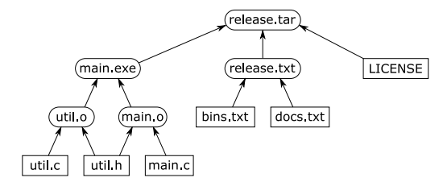
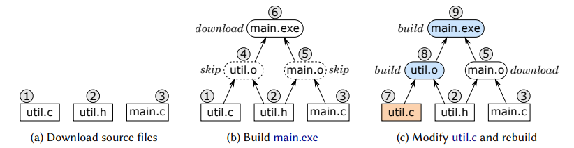
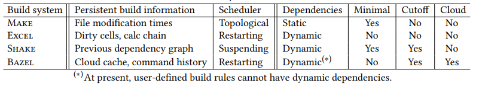

## Make:

Создается Makefile:

```
util.o: util.h util.c
	gcc -c util.c
main.o: util.h main.c
	gcc -c main.c
main.exe: util.o main.o
	gcc util.o main.o -o main.exe
```

Если граф ацикличный, то каждый таск должен быть выполнен 0-1 раз.
Цикличные графы обычно не поддерживаются билд-системами.

Make: 
- использует время модификации файла
- создает граф зависимостей тасков и запускает их в топологическом порядке

Такой подход удовлетворяет свойству минимальности:
	билд-система является *минимальной*, если она выполняет такси не больше одного раза в процессе билда и только если они транзитивно зависят от инпутов, которые изменены со времени прошлого билда.

## Excel

Может быть рассмотрен как билд-система с динамическими меняющимися зависимостями.

Пример:

```
	A1: 10 B1: INDIRECT("A" & C1) C1: 1
	A2: 20
```

Так как значение B1 определяется значением C1, то невозможно построить граф зависимостей до начала билда.

Чтобы поддерживать динамические зависимости, используется **calc chain**:

ячейки обрабатываются в последовательности **calc-chain**, но если вычисление ячейки C требует значения ячейки D, которая еще не вычислена, то Excel *прекращает* вычисление C, перемещает D вперед C в **calc-chain** и возобновляет билд, начиная с D.

Когда значения или формулы меняются, то Excel использует финальную **calc-chain** из предыдущего билда и начинает с нее.

Такой подход не удовлетворяет свойству *минимальности*. B1 должен быть перевычислен только если изменяются A1 или C1, но это не очевидно. Excel использует "приблизительную" минимальность:
	формула пересчитывается, если:
		- упоминает изменившуюся ячейку
		- использует INDIRECT, чьи зависимости не видны статически
		- ячейка изменилась сама

То есть в нашем случае B1 будет пересчитываться всегда, а это явное нарушение минимальности.

## Shake

Попытка удовлетворить свойству минимальности при решении проблемы динамических зависимостей.



Содержимое `release.tar` определяется содержимым `release.txt`. Makefile так не может и приходится использовать костыли типа *build phases*.

В Shake можно указать правило для `release.tar` так:

```
"release.tar" %> \_ -> do
	need ["release.txt"]
	files <- lines <$> readFile "release.txt"
	need files
	system "tar" $ ["-cf", "release.tar"] ++ files
```

Отличия от Make и Excel:
	- Shake использует граф зависимости из предыдущего билда, чтобы определить, какие файлы должны быть перебилжены.
	- вместо *прекращения* выполнения тасков, чьи зависимости пока не построены (как делает Excel), они приостанавливаются (suspend).
	- поддерживается *early cutoff optimization*. Когда выполняется таск и результат не изменился относительно предыдущего билда, зависимые таски можно не выполнять. Make и Excel так не умеют.

## Bazel

Облачная файловая система. Результаты билдов шарятся между членами команды. Локально появляются только конечные результаты, а все промежуточные остаются в облаке.

Пример (в кружках - хэши от содержания):



## Сравнение систем




