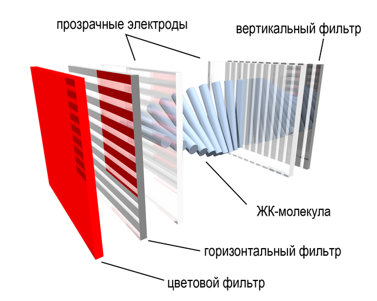
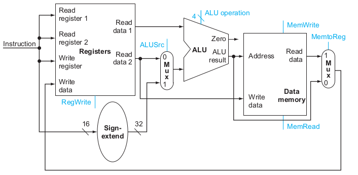
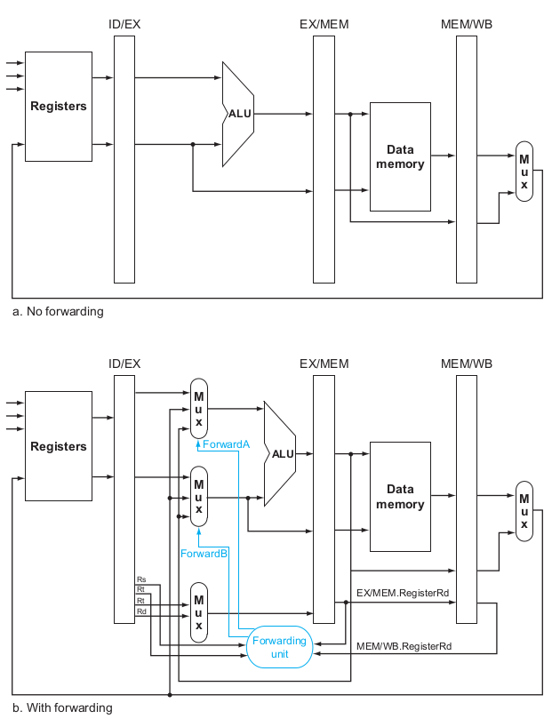

# Computer organization and design

```toc
exclude: Computer organization and design
```

Источники: 

- [Computer Organization and Design MIPS Edition](https://www.amazon.com/Computer-Organization-Design-MIPS-Architecture/dp/0124077269)
- [Логическая организация кэш-памяти процессора](https://habr.com/post/179647/)
- [Кэш в многопроцессорных системах. Когерентность кэша. Протокол MESI](https://habr.com/post/183834/)

# I/O

## LCD

Состоит из двух фильтров с перпендикулярной поляризацией, а между ними - стержнеобразные молекулы (кристаллы) в жидкости. Эти молекулы формируют закручивающуюся спираль, которая изгибает свет, проходящий через дисплей.

Когда напряжения нет, то кристалы, примыкающие к горизонтальному фильтру, повернуты горизонтально, а к вертикальному - вертикально. Когда через эти кристалы проходит свет, то он "изгибается" и меняет свою поскость поляризации с горизонтальной на вертикальную, в результате чего проходит через оба фильтра без потерь (не считая половины неполяризованного света, поглощенного первым фильтром, ну то есть вертикально поляризованный свет не смог пройти через горизонтальный фильтр).

Если же к кристаллам приложено напряжение, молекулы стремятся выстроиться в направлении электрического поля, что искажает их винтовую структуру. Свет уже ко второму фильтру приходит не совсем вертикально поляризованный, а отклоненный на сколько-то градусов, поэтому степень прозрачности понижмается. Варьируя напряжение, можно управлять степенью прозрачности.



Раньше использовалась **пассивная матрица**. Это значит, что для управления экраном NxM пикселей использовались N+M линий адресации, то есть N - для выбора строки и M - для выбора столбца. На выбранные строки подавалось напряжение, пиксель на пересечении загорался и должен был хранить свое состояние до следующей активации. Таким образом, при смене кадра последовательно изменялись все пиксели экрана. Из-за большой емкости ячеек напряжение на них меняется медленно, а значит и кадры тоже медленно меняются.

В настоящее время большинство ЖК-дисплеев используют **активную матрицу** на тонкопленочных транзисторах (thin film transistors / TFT). Раньше широко применялись матрицы на тонкопленочных диодах (TFD), но сейчас таких почти нет. В схеме активной матрицы с каждой точкой изображения последовательно включена собственная тройка транзисторов, управляющих цветами R, G, B. Все пиксели изменяются параллельно.

На уровне железа поддержка графики состоит в основном из **фреймбуфера**, в котором хранится битовая карта. Изображение, которое нужно отобразить на экране, сохраняется в фреймбуфере. Если у нас 24-битный цвет, то для каждого пикселя во фреймбуфере сохраняется 24 бита.

## Тачскрин

На данный момент в большинстве тачскринов используются емкостностные экраны.

### Поверхностно-емкостной экран

Экран покрывается прозрачным проводящим материалом, а по углам экрана располагаются 4 электрона, подающие на этот слой небольшое напряжение. Когда человек прикасается к экрану, возникает утечка точка. Чем ближе палец к электроду, тем меньше сопротивление экрана, а значит больше сила тока. Ток регистрируется датчиками в углах и передается на контроллер, вычисляющий координаты точки касания.

Не умеет в мультитач.


### Проекционно-емкостной экран

На внутренней стороне экрана нанесена сетка электродов. Электрод вместе с телом человека образует конденсатор; электроника измеряет ёмкость этого конденсатора (подаёт импульс тока и измеряет напряжение).

Такие экраны применяются в айфонах. 


# Память

| Тип памяти     | Время доступа           |
|----------------|-------------------------|
| DRAM           | 50-150 наносекуд        |
| Магнитный диск | 5-20 милисекунд         |
| Флэш-память    | 5-50 микросекунд        |

## Производство процессоров и памяти

1. Из расплавленного кремния на специальном оборудовании выращивают монокристалл цилиндрической формы
2. Получившийся слиток охлаждают и режут на «блины», поверхность которых тщательно выравнивают и полируют до зеркального блеска
3. Затем в «чистых комнатах» полупроводниковых заводов на кремниевых пластинах методами фотолитографии и травления создаются интегральные схемы
4. После повторной очистки пластин, специалисты лаборатории под микроскопом производят выборочное тестирование процессоров – если все «ОК», то готовые пластины разрезают на отдельные процессоры, которые позже заключают в корпуса

Подробности [здесь](https://habr.com/company/intel/blog/110234/)

# Инструкции MIPS

**Слово** - единица доступа к памяти компьютера. Совпадает с размером регистра. В 32-битной архитектуре слово = 32 бита, регистр = 32 бита и к памяти мы можем обращаться шагами по 32 бита или 4 байта. Чем больше регистров, тем дольше будет такт, потому что расстояние до регистров будет больше и сигналы будут его дольше проходить. Помимо этого, чем больше регистров, тем больше бит занимает инструкция в памяти.

Разница между переменными и регистрами в том, что количество регистров ограничено, и некоторые инструкции могут работать только с данными, лежащими в определенных регистрах. Поэтому перед выполнением этих инструкций нжуно выполнить операцию **load**, которая загружает значение из памяти в регистр. Команда **store** - наоборот, сохраняет значение из регистра в переменную в памяти.

В архитектуре MIPS 32 32-битных регистра. Регистры в MIPS обозначаются знаком доллара и 2-буквенным обозначением, например: $s0, $s1 - регистры общего назначения. $t0, $t1 - временные регистры.

## Команды перемещения данных

**Команда загрузки в регистр состоит из**:

- название операции
- регистр, в который загружаем
- константа, обозначающая **сдвиг**, измеряемый в *байтах*. Это обязательно должна быть костанта. Если сдвиг определяется динамически, то нужно предварительно записать сдвиг в какой-нибудь регистр, затем этот регистр подать как адрес в памяти, а сдвиг указать равный 0.
- регистр, обозначающий адрес в памяти, называемый **базовый регистр**

```
g = h + A[8] => 

	lw $t0, 32($s3) 
	add $s1, $s2, $t0
```

- `lw` = load word
- `$t0` = регистр, куда попадет значение
- `32` = сдвиг. Нас интересует 8-й элемент массива, то есть 8-е слово. Каждое слово состоит из 4 байт, значит нас интересует 32-й байт. 
- `$s3` = адрес начала массива `A` в памяти
- `$s2` = ассоциирован с `h`
- `$s1` = результат сложения, ассоциирован с `g` 

Из-за выравнивания памяти адреса всех слов должны быть кратны 4.

**Пример обращения с динамическим сдвигом**:

$s0 = i
$a0 = A

```
g = A[i] =>

	sll $t0 $s0 2   # сдвигаем на 2, то есть умножаем на 4, чтобы из кол-ва слов получить кол-во байт
	add $t1 $a0 $t0 # t1 = a0 + t0, то есть узнаем адрес в памяти элемента A[i]
	lw $t2 0($t1)   # t2 = A[i]
```

Компьютеры делятся на те, которые используют адрес самого левого (старшего) байта в слове в качестве адреса слова (*big-endian*) и на те, которые используют адрес правого (младшего) байта (*little-endian*). MIPS относится к *big-endian* архитектурам.

**Команда выгрузки из регистра в память** называется **store** и имеет аналогичный с командой **load** синтаксис: название операции *sw*, сохраняемый регистр, сдвиг и базовый регистр.

```
A[12] = h + A[8] =>

	lw $t0, 32($s3)
	add $t0, $s2, $t0
	sw $t0, 48($s3)
```

## Константы

Команда `add` принимает в качестве операндов регистры. Если нам нужно что-то сложить с константой, то пришлось бы сначала записать константу в регистр, что неэффективно. Для решения проблемы есть специальная команда `addi`, что означает *add immediate*. Так как константы могут быть отрицательными, то нет надобности в команде `subi`.

```
addi $s3, $s3, 4    # $s3 = $s3 + 4
```

Для константы 0 даже есть специальный регистр `$zero`.

## Знаковые числа

В большинстве систем сейчас используется техника представления знаковых чисел под назваием **two's complement**, или *второе дополнение*. Второе дополнение числа определяется как величина, полученная вычитанием числа из наибольшей степени двух.

В знаковых числах старший бит означает знак. Если он равен 0, то в остальных разрядах записаноположительное число.
Если 1, значит число отрицательное. Предществующие 1 в этом случае выполняют роль предшествующих 0 в положительных числах, то есть все подряд идущие 1 слева становятся незначимыми, значимая только самая правая в ряду подряд идущих единиц. При этом самый старбишй бит - всегда НЕ значимый. Если после него идет 0, то первым значащим битом становится этот ноль. 

Разница 2^(количество значимых бит справа) - число, закодированное в этих битах = абсолют нашего искомого отрицательного числа.

Пример:

```
1111 1111 1111 1111 1111 1111 1111 1101 = -3

 1111 1111 1111 1111 1111 1111 1111 1 101 = -3
|                                    |   |
------------------------------------- ----
              ^                        ^
              |- не значимые           |- значимые 101 = 5

Количество значимых бит = 3

2^3 - 5 = 3

Искомое число = -3

```

Другой пример, когда у нас после знака сразу идет 0:

```
1010 = -6
         1           010 = -6
|                   |   |
-------------------------
 ^                    ^
 |- не значимый бит   |- значимый 010 = 2

Количество значимых бит = 3

2 ^ 3 - 2 = 6

Искомое число = -6

```

Иначе говоря, число со знаком может быть представлено как:

```
(x[31] * -2^31) + (x[30] * 2^30) + (x[29] * 2^29) + ... + (x[1] * 2^1) + (x[0] * 2^0)
```

То есть в случае `signed` числа знаковый бит умножается на -2^31, а в случае `unsigned` - на 2^31.

Другой способ преобразования - инвертировать число и прибавить 1, получаем абсолют. То есть в нашем случае это будет `10 = 2`, прибавляем 1 - получаем 3.


Неиспользуемая ныне техника **one's complement** получает отрицательное число как `2^n - x - 1`. Все отрицательные числа получаются из положительных установкой знакового бита в 1 и инвертацией всех остальных позиций. Сейчас техника не используется, так как требует больше шагов для арифметических операций (в two's complement отрицательное число равняется `2^n - x`).

## Представление инструкции в машинном коде

Регистры $t0-$t7 имеют номера 8-15, а $s0-$s7 - 16-23.

Для примера возьмем инструкцию сложения:

```
add $t0, $s1, $s2
```

Она представляется в памяти в следующем виде:

```
0 17 18 8 0 32
```

Где:

0 - первая часть идентификатора команды `add`
17 - `$s1`
18 - `$s2`
8 - `$t0`
0 - не используется в этой команде
32 - вторая часть идентифкатора команды `add`.

В бинарном виде команда имеет вид:

```
000000 10001 10010 01000 00000 100000
```

1 и 6 части имеют по 6 бит, 2-5 по 5. Итого каждая инструкция занимает 32 бита, то есть сколько же, сколько занимает слово в этой архитектуре.

Каждое из полей команды имеет свое название:

```
|   op  |   rs  |   rt  |   rd  | shamt | funct |
| 6 бит | 5 бит | 5 бит | 5 бит | 5 бит | 6 бит |
```

- *op*: 6 бит, *opcode*, определяет операцию и формат инструкции
- *rs*: 5 бит, первый входной регистр
- *rt*: 5 бит, второй входной регистр
- *rd*: 5 бит, регистр назначения
- *shamt*: 5 бит, сдвиг
- *funct*: 6 бит, *function code*, определяет конкретный варинт операции, указанной в поле *op*.

Этот формат называется *R-type* или *R-format*, от слова register.

Есть еще другой формат - *I-type* / *I-format*, который используется для операций с константами и операций сохранения/загрузки данных. Дело в том, что при использовании R-формата размер константы ограничен 5 битами, а значит может принимать значения от 0 до 32. Это очень мало для константы и особенно для адресации внутри массива в случае команд *load/store*. 

I-формат:

```
|   op  |   rs  |   rt  | constant or address |
| 6 бит | 5 бит | 5 бит | 16 бит              |
```

При этом в этом формате регистр `rt` означает регистр назначения.

Еще есть самый простой формат - *J-type*, используемый для инструкции `j`:

```
|   op  | address |
| 6 бит | 26 бит  |
```


## Условия

`beq reg1 reg2 L1` - если значение регистра 1 = значению регистра 2, то перейти к метке L1

`bne reg1 reg2 L1` - если значение регистра 1 != значению регистра 2, то перейти к метке L1

`slt reg1 reg2 reg3` - set on less than, если reg2 < reg3, то reg1 = 1, иначе 0

`slti reg1 reg2 10` - set on less than immediate, если reg2 < 10, то reg1 = 1, иначе 0

Есть еще `sltu - set on less than unsinged` и `sltiu - set on less than immediate unsgined`. 

### Быстрая проверка на выход за границы цикла

```
sltu $t0 $s1 $t2  # $t0=0 if $s1 >= length or $s1<0
beg $t0 $zero IndexOutOfBounds  # if bad, goto Error
```

## Цикл

Допустим, мы хотим преобразовать следующий код в ассемблер:

```c
while (save[i] == k)
	i += 1;
```

Пускай переменные у нас лежат в следующих регистрах:

	i = $s3
	k = $s5
	save = $s6

Тогда код на ассемблере будет таким:

```asm
While: 
	sll $t1 $s3 2  # умножаем i на 4 путем сдвига влево на 2 знака, чтобы из количества слов получить количество байт
	add $t1 $t1 $s6 # получаем адрес save[i]
	lw $t0 0($t1) # загружаем в регистр значение save[i]
	beq $t0 $s5 Exit # if(save[i] != k) break;
	addi $s3 $s3 1 # i += 1
	j While # возвращаемся в начало 
Exit:
```

## Вызов процедуры

Для вызова процедуры, нужно сделать следующее:

1. Положить параметры в место, откуда процедура сможет их получить
2. Передать контроль процедуре
3. Получить ресурсы, необходимые процедуре
4. Выполнить процедуру
5. Положить результат в место, откуда вызывающая программа сможет его получить
6. Вернуть контроль точке вызова процедуры

В MIPS для вызова процедур служат следующие регистры:

- *$a0-$a3*: 4 регистра, куда можно положить параметры
- *$v0-$v1*: 2 регистра, куда можно положить результат
- *$ra*: return address, то есть регистр, куда кладется адресс точки вызова перед вызовом процедуры

Если нужно передать больше 4 параметров, то все дополнительные параметры кладутся на стек сразу над `$fp`.

Для вызова есть специальная инструкция `jal (jump-and-link)` - она кладет адрес следующей инструкции в регистр `$ra`, после чего вызывает процедуру. 

Синтаксис прост:

```
jal ProcedureAddress
```

Процедура возвращается вызовом `jr $ra`.

Адрес текущей выполняемой инструкции почти всегда называется *program counter* или *PC*. Команда jal просто сохраняет в регистр $ra значение PC + 4.

## Стек

Когда регистров не хватает, на помощь приходит **стек**. Например, после вызова процедуры нужно подчистить все следы и вернуть все используемые процедурой регистры к тем значениям, которые были *до* вызова процедуры. А для этого их нужно где-то хранить. Вот на стеке они и хранятся. Также в нем хранятся локальные массивы и структуры.

Для работы со стеком используется *stack pointer*, указывающий на адрес последнего сохраненного в стек значения. При сохранении или извлечении каждого значения, стэк пойнтер изменяется на 1 слово. Обратиться к нему можно по регистру `$sp`.

Стек растет от высших адресов к низшим. Это означает, что для пуша на стек нужно вычитать 1 слово из значения стэк пойнтера. А увеличение стэк пойнтера уменьшает стэк, выдавливая из него значения.

Пример процедуры:

```c
int leaf_example(int g, int h, int i, int j)
{
	int f;
	f = (g + h) - (i + j);
	return f;
}
```

g,h,i,j = $a0,$a1,$a2,$a3

f = $s0

Скомпилированная процедура будет выглядеть так:

```asm
leaf_example:
	addi $sp, $sp, -12  # выделяем в стеке место для 3 локальных переменных
	sw $t1, 8($sp)
	sw $t0, 4($sp)
	sw $s0, 0($sp) # бэкапим на стек значение регистров, которые будем использовать в теле функции

	add $t0, $a0, $a1
	add $t1, $a2, $a3
	sub $s0, $t0, $t1 # делаем наши арифметические операции
	add $v0, $s0, $zero # возвращаем результат

	lw $s0, 0($sp)
	lw $t0, 4($sp)
	lw $t1, 8($sp) # ресторим из стека значение регистров
	addi $sp, $sp, 12 # уменьшаем стек на 3 элемента

	jr $ra   # возвращаемся к точке вызова
```

Теперь посмотрим, как выглядит рекурсия:

```c
int fact (int n)
{
	if (n < 1) return 1;
	else return ( n * fact(n-1));
}
```

```asm
fact:
	addi $sp $sp -8
	sw $ra 4($sp)
	sw $a0 0($sp) # бэкапим аргументы и адрес возврата, чтобы восстановить их после вызова другой процедуры внутри этой

	slti $t0 $a0 1
	beq $t0 $zero L1 # if n > 1 goto L1

	addi $v0 $zero 1 # else return 1
	addi $sp $sp 8 # уничтожаем забекапленные значения, так как внутренний вызов не пригодился
	jr $ra # возвращаемся к точке вызова

L1: 
	addi $a0 $a0 -1 
	jal fact   # fact(n-1)
	lw $a0 0($sp) # восстанавливаем из стека значение регистров после внутреннего вызова
	lw $ra 4($sp)
	addi $sp $sp 8

	mul $v0 $a0 $v0 # return n * fact(n-1)
	jr $ra
```

Рассмотрим, какие регистры нужно обязательно сохранять перед вызовом процедуры и ресторить после возврата из нее, а какие необязательно

| Сохранять    | Можно не сохранять|
|--------------|-------------------|
| $s0-$s7      | $t0-$t9           |
| $sp          | $a0-$a3           |
| $ra          | $v0-$v1           |
| Стэк над $sp | Стэк под $sp      |

### Выделение места на стеке

Сегмент стека, содержащий сохраненные процедурой регистры и ее локальные переменные, называется *фрейм процедуры*.

Для обозначения начала фрейма используется регистр `$fp` - frame pointer, указывающий на адрес первого слова фрейма процедуры. Stack pointer может измениться во время процедуры, а frame pointer - нет.

На рисунке изображен стек до, во время и после вызова процедуры:


На следующей схеме - распределение данных в памяти для архитектуры MIPS

[!MIPS Memory allocation](mips-memory-allocation.png)

Указанные адреса не являются частью архитектуры, а просто соглашение на уровне приложений. 

Вершина стека инициализируется самым старшим адресом доступной памяти, то есть `$sp = 7fff fffc`. Оттуда стек будет расти вниз.

Затем идет сегмент динамической памяти, или *куча*. Она растет вверх, навстречу стеку. Это память, выделяемая командами `malloc` и `new`. Здесь всякие массивы, структуры.

Затем сегмент статической памяти, который начинается с адреса `1000 0000`. Здесь хранятся константы и другие статические переменные.

Затем сегмент Text, содержащий машинный код исполняемой программы.

`$gp` указывает на середину сегмента статической памяти и с его помощью, указывая положительный или отрицательный сдвиг, можно обратиться к любому адресу статического сегмента.

И в конце сегмент зарезервированной памяти.

### Tail call optimization

```c
int sum(int n, int acc) {
	if (n > 0)
		return sum(n-1, acc+n);
	else
		return acc;
}
```

 Преобразуется в:

 $a0 = n
 $a1 = acc

```
sum:
	slti $t0 $a0 1                 # if n <= 0
	bne $t0 $zero sum_exit         # goto sum_exit if n <= 0
	add $a1 $a1 $a0 			   # acc += n
	addi $a0 $a0 -1				   # n -= 1
	j sum
sum_exit:
	add $v0 $a1 $zero			   # return acc
	jr $ra
```

## Манипуляции со строками

Для работы со строками есть инструкции `lb` и `sb`, которые загружают из памяти 1 байт и сохраняют его в младший байт регистра - и наоборот. В этом случае адрес памяти необязательно должен быть кратным 4.

```
lb $t0 0($sp)   # read byte from source
sb $t0 0($gp)	# write byte to destination
```

А для чтения юникодных символов есть инструкции `lh` и `sh` (load half/store half), которые читают по 2 байта из памяти и сохраняют в младшие 2 байта регистра - и наоборот. Адрес должен быть кратен 2.

В **С** строка ограничена символом с кодом 0 справа.

```c
void strcpy(char x[], char y[])
{
	int i;

	i = 0;
	while((x[i] = y[i]) != '\0')
		i += 1;
}
```

$a0 = x
$a1 = y
i = $t0

```
strcpy:
	add $t0 $zero $zero
loop:
	add $t1 $t0 $a1 
	lbu $t2 0($t1)		# $t2 = y[i]

	add $t3 $t0 $a0
	sb $t2 0($t3) 		# x[i] = y[i]

	beq $t2 $zero exit
	add1 $t0 $t0 1
	j loop

exit:	
	jr $ra
```

Так как вложенных вызовов процедур нет, то нам удалось обойти только временными регистрами `$t`. Если есть вложенные вызовы, то перед вызовом:

1) если есть значение, которое полностью используется до вызова и не будет использоваться после вызова, то оно пишется во временный регистр
2) остальные значения пишутся в сохраняемые регистры `$s`, бэкапятся перед вызовом процедуры и ресторятся после вызова (либо в начал и в конце процедуры, зависит от соглашения вызова).

## Работа с большими константами

Если нужно работать с константой, которая не влезает в 16 бит, на этот случай есть команда `lui` - `load upper intermediate`. Она загружает старшие 16 бит в регистр, позволяя затем указать младшие 16 бит, используя инструкцию `ori`.

Пример:

допустим, хотим в регистр `$s0` загрузить значение `0000 0000 0011 1101 0000 1001 0000 0000`

Сначала загружаем старшие 16 бит, которые составляют число 61:

`lui $s0 61`

После этого в `$s0` лежит значение: `0000 0000 0011 1101 0000 0000 0000 0000`

Затем через OR соединяем с младшими 16 битами (которые составляют 2304) и результат кладем в тот же регистр:

`ori $s0 $s0 2304`

Готово!

## Работа с большими адресами

Если используем команду `j`, то там используется формат J-type, который выделяет 26 бит на адрес слова. Этого достаточно для адресации в пределах 256 MB.

Если же используются бранч-команды, типа `beq` или `bne`, то там на адрес остается всего лишь 16 бит. Но этого достаточно, так как такие команды используются обычно, чтобы перейти к какой-то близлежащей инструкции в коде. Используя в качестве базового адреса `$pc` мы можем перейти на команду, отстоящую на +-2^15 от текущей. К тому же адресация идет по словам, а не по байтам, так что эти числа можно умножить еще на 4. В результате получаем относительную адресацию в пределах +-128 КБ.

Ну а если не хватает, то мы всегда можем воспользоваться следующим хаком:

```
	beq $s0 $s1 L1
```

преобразуем в:

```
	bne $s0 $s1 L2
	j L1
L2:
```

## Синхронизация потоков

Для реализации атомарных операций есть две специальных инструкции:

- `ll`: load linked. Аналогична обычной загрузке, но обозначает начало атомарной операции
- `sc`: store conditional. Сохраняет регистр в указанный адрес в памяти, но только *если* значение указанного адреса памяти было изменено между этой инструкцией и инструкцией `ll`, прочитавшей значение из этого же адреса. При этом случае успеха он меняет значение этого регистра в 1, а в случае неудачи - 0.

Таким образом, потокобезопасная замена значения, лежащего в `$s1` будет выглядеть так:

```
again:
	addi $t0 $zero 1
	ll $t1 0($s1)
	sc $t0 0($s1)
	beq $t0 $zero again
	add $s4 $zero $t1
```

В этом коде мы прочитали значение по адресу `$s1` и записали туда новое значение из регистра `$t0`.	

На основании конструкции *load linked/store conditional* могут быть построены другие примитивы синхронизации, такие как *atomic compare*, *swap* или *atomic fetch-and-increment*.

## Системные вызовы

Реализация системных вызовов зависит от ОС и архитектуры процессора, рассмотрим, как реализованы сисколлы в x86_64 на линуксе:

1. Номер системного вызова кладется в регистр RAX
2. Аргументы вызова кладутся в регистры RDI, RSI, RDX...
3. Выполняется инструкция ассемблера SYSCALL. Эта инструкция переводит процессор на кольцо защиты 0 и выполняет код, на который ссылается регистр `MSR_LSTAR`, а он ссылается на функцию `system_call`. Эта функция пушит регистры в стек ядра и берет из таблицы `sys_call_table` адрес функции, в строке с номером, соответствующим номеру системного вызова, лежащему в RAX. 

## Компиляция программы

### Компилятор

#### Фронтенд

На вход фронтенду компилятора поступает код программы, а на выходе - некая промежуточная форма, не зависящая от архитектуры. Фронтенд - единственный этап процесса компиляции, который зависит от языка.

Шаги фронтенда:

1. **Сканирование** - читает символы и создает поток *токенов*. **Токены** - это атомарные единицы языка, например: зарезервированные слова, имена, операторы, знаки пунктуации. В коде `while (save[i] == k) i += 1;` токенами будут: while, (, save, [, i, ], ==, k, ), i, +=, 1, ;.
2. **Парсинг** - берет поток токенов, проверяет синтаксис и строит **AST - abstract syntax tree**. Это дерево, в котором представлена ситнактическая структура программы.
3. **Семантический анализ** - берет AST и проверяет программу на семантическую корректность. Обычно на этом этапе проверяется, что переменные и типы правильно объявлены, типы операторов и объектов совпадают. В процессе составляется таблица символов, в которую заносятся все именованные объекты - классы, функции, переменные.
4. **Генерация промежуточного представления** - берет AST со 2 шага, таблицу символов с 3 шага и генерирует текст программы на языке промежуточного представления. Это что-то вроде байткода или MSIL. Обычно этот язык представляет собой подобие MIPS, но с бесконечным количеством виртуальных регистров.

После фронтенда идет шаг высокоуровневых оптимизаций

Потом глобальные оптимизации - оптимизации, которые влияют на несколько блоков кода

И наконец генерация машинного кода

### Ассемблер

На выходе из ассемблера получается object file - комбинация инструкций на машинном языке, данных и информации, необходимой для загрузки инструкций в память. Для создания бинарной версии, ассемблер поддерживает *таблицу символов*, в которой записаны соответствия меток и их адресов в памяти.

В объектном файле на UNIX обычно содержатся 6 блоков:

- **object file header**: описывает размер и расположение остальных блоков
- **text segment**: содержит код на машинном языке
- **static data segment**: содержит статические данные, которые никогда не меняются
- **relocation information**: содержит адреса инструкций, в которых происходит обращение по абсолютному адресу. Блок нужен, чтобы можно было изменить адреса, когда мы линкуем модуль с другими модулями и стартовый адрес нашей памяти изменяется
- **symbol table**: содержит незарезолвленные метки, то есть внешние ссылки
- **debugging information**: инфа о том, как были скомпилированы модули, чтобы дебаггер мог сассоциировать машинные инструкции со строками исходного кода

### Линкер

Берет независимо собранные программы на ассемблере и "линкует" их вместе.

Работает в 3 шага:

1. Помещает код и данные в память
2. Определяет новые адреса для данных и меток инструкций
3. Патчит внутренние и внешние ссылки

Для 2 и 3 шага линкер использует *relocation information* и *symbol table* каждого объектного модуля, чтобы зарезолвить ссылки на внешние процедуры. 

В 3 шаге линкер просто проходит по всему коду, отыскивает ссылки и заменяет адреса в них новыми адресами. Польза линкера в том, что патчить код ораздо проще и быстрее, чем перекомпилировать его заново.

На выходе линкера получается *исполняемый файл*. Обычно он имеет тот же формат, что и объектный файл, только теперь в нем нет незарезолвленнхы ссылок.

Далее мы видим пример того, как линкер линкует 2 модуля в один:


Здесь мы видим 2 модуля. До прохода линкера `$gp` указывает на начало сегмента данных.

Процедура А в строчке 0 ссылается на строчку 0 в сегменте данных, где у нас лежит переменная Х.

В строчке по адресу 4 мы ссылаемся на адрес 0, но в *relocation information* мы видим, что строчка 4 зависит от процедуры B, а значит это адрес 0 не в нашем модуле, а в модуле B.

Процедура B в строчке 0 ссылается на строчку 0 в сегменте данных, где у нас лежит переменная Y.

В строчке по адресу 4 мы ссылаемся на адрес 0, но в *relocation information* мы видим, что строчка 4 зависит от процедуры A, а значит это адрес 0 не в нашем модуле, а в модуле A.


Мы видели ранее, что после линка сегмент текста начинается по адресу `0х40 0000`, а сегмент данных - по `0х1000 0000`. Текст процедуры А располагается по первому адресу, а ее данные - по второму. Заголовок процедуры А говорит, что ее текст занимает `0х100` байт, а данные - `0х20` байт, поэтому текст процедуры B располагается сразу после А по адресу `0х40 0100`, а ее данные - по `0х1000 0020`.

Шаг 1 закончен. Теперь линкер обновляет адреса в инструкциях. Он проходит по каждой строчке в сегменте *relocation information* и патчит соответствующие инструкции. Чтобы определить используемый формат, он читает поле *instruction type*.

В нашем случае используется 2 типа команд:

1. `jal`. C ними все просто, потому что они используют абсолютные адреса. `jal` по адресу `0х40 0004` должен обращаться к 0 строчке процедуры B. B у нас лежит по `0x40 0100`, значит и целевой адрес такой же. Аналогично `jal` по адресу `0x40 0104` преобразуется в `0х40 0000`.
2. `lw` и `sw` посложнее, потому что они используют относительные смещения от `$gp`. Как мы видели ранее, `$gp` инициализируется значением `0х1000 8000`. В строчке `0х40 0000` нам нужно обратиться к переменной Х, то есть бывшей 0 строке сегмента данных процедуры А. 0 строка данных А теперь получила адрес `0х1000 0000`. Значит ее относительный адрес относительно `$gp` будет `0х-8000`. Аналогично в строчке `0х40 0100` относительный адрес меняется на `0х8020`.

### Загрузчик

Кладет программу в память, чтобы она могла выполниться.

Для этого выполняет следующие шаги:

1. Читает заголовок программы в память, чтобы определить размер сегментов кода и данных
2. Выделяет адресное пространство, достаточное чтобы вместить текст и данные
3. Копирует инструкции и данные из исполняемого файла в память
4. Копирует параметры главной программы на стек
5. Инициализирует регистры и устанавливает stack pointer
6. Переходит к процедуре запуска, которая копирует параметры в регистры аргументов и вызывает главный метод программы

### Динамически загружаемые библиотеки

Поблемы вышеописанного способа линковки:

1. Все библиотеки становятся часть исполняемого файла, новая версия библиотеки означает перелинковку.
2. При старте в память загружаются все функции всех модулей даже если эти функции не запускаются

Эти проблемы решают динамически связываемые библиотеки (DLL). В таком способе линковки библиотеки не линкуются и не связываются, пока программа не запущена. 

Для этого:

1. Объектный файл динамически загружаемой библиотеки содержит дополнительную информацию о расположении процедур внутри нее
2. При старте загрузчика запускается динамический линкер, который использует эту информацию для связывания библиотек и обновления всех внешних ссылок

Недостаток первоначальной версии был в том, что в память все равно загружались все функции программы, а не только те, которые будут использоваться. Поэтому в следующей версии каждая функция линкуется индивидуально только **после** того, как она была вызвана.


Когда вызывается функция библиотеки, то: происходит переход по адресу, лежащему в некой переменной (первый прямоугольник). Эта переменная лежит в области данных (второй прямоугольник) и при первом вызове указывает на заглушку (третий). Заглушка загружает в регистр идентификатор функции и переходит в динамический загрузчик (четвертый). Загрузчик по идентификатору определяет, где лежит эта функция, динамически ее линкует, загружает и вызывает. А вместе с этим он переписывает переменную из 2-го прямоугольника так, чтобы она указывала сразу на адрес загруженной в память реальной функции. Таким образом при последующих вызовах мы попадаем сразу в функцию, правда через адрес, лежащий в переменной. Но количество инструкций остается тем же, просто вместо `j` используется `jr`.

# Архитектура ARMv7 (32-bit)

Для ARMv8 мануал [здесь](https://www.element14.com/community/servlet/JiveServlet/previewBody/41836-102-1-229511/ARM.Reference_Manual.pdf)

Основное отличие от MIPS: меньше регистров, больше схем адресации

|                       | ARM         | MIPS        |
|-----------------------|-------------|-------------|
| Размер инструкции     | 32          | 32          |
| Адресное пространство | 32-битное   | 32-битное   |
| Выравнивание данных   | Есть        | Есть        |
| Схем адресации        | 9           | 3           |
| Регистры              | 15 х 32 бит | 31 х 32 бит |

Сравнение инструкций:


Обратите внимание, в ARM нет инструкции для деления!

Сравнение схем адресации:


**Следующий блок относится только к ARMv7 и более ранним моделям. В ARMv8 от условно-выполняемых инструкций отказались**

---------------------------------------------------

Еще одно важное отличие: для выполнения условий условных переходов в MIPS используется содержимое регистров. В ARM же используется 4 условных бита (**condition codes**), которые хранятся в *program status word*: negative, zero, carry, overflow. Эти биты могут быть изменены любой инструкцией, но выставлять их необязательно.

Например, CMP (Compare) вычитает один операнд из другого и выставляет условные биты соответственно результату вычитания. CMN (Compare negative) *складывает* операнды и так же выставляет условные биты соответственно результату. TST делает операндам логическое И и выставляет все условные биты кроме overflow, а TEQ делает им OR и так же выставляет все биты кроме overflow.

Необычная особенность ARM заключается в том, что каждая инструкция может быть выполнена или не выполнена в зависимости от состояния условных битов. Каждая инструкция начинается с 4-битового поля, которое определяет, будет ли инструкция превращена в nop. Засчет этого можно сэкономить время и место, когда нужно, например, перепрыгнуть через одну инструкцию - теперь не нужно вставлять дополнительное условие и инструкцию j для этого.

---------------------------------------------------

Сравнение форматов инструкций: 


Еще в ARM есть сохранение и загрузка групп регистров. 

# Архитектура x86

Архитектура поддерживает следующие комбинации оперендов в инструкциях:

- регистр-регистр
- регистр-константа
- регистр-память
- память-регистр
- память-константа

Не поддерживается только комбинация память-память. В это время, в ARM и MIPS большинством инструкций не поддерживается адрес памяти в качестве одного из операндов.

Все регистры, начинающиеся с Е, являются расширениями 16-битных регистров до 32-битных. Большинство инструкций имеют только 2 операнда, это значит что один из операндов часто является и входным и выходным.

Среди используемых методов адресации есть:

- *based mode with 8- or 32-bit displacement* - адрес равен содержимое регистра плюс сдвиг на 8 или 32 бита
- *base plus scaled index* - адрес равен содержимому регистра плюс 2^scale * index, где scale = 0, 1, 2 или 3. Этот режим нужен, чтобы избежать умножения на 4 при адресации по байтам. scale = 1 используется для 16-битных слов, 2 для 32-битных, 3 - для 64-битных. 0 означает, что не скейлим.
- *base plus scaled index with 8- or 32-bit displacement* - комбинация первых двух режимов

Каждая инструкция в 80386 может занимать от 1 до 15 байт. Обычно опкоды включают указание, используется ли 8-битный или 16-битный операнд. Некоторые опкоды включают в себя указание метода адресации и регистра. Другие инструкции включают дополнительный байт опкода, называемый **постбайт** содержащий метод адресации и регистр. Режим адресации *base plus scaled index* использует еще и второй постбайт.

# Архитектура ARMv8 (64-bit)

Первая архитектура ARM, поддерживающая 64-битное адресное пространство.

По сравнению с ARMv7 отброшены почти все необычные возможности, которых не было в MIPS:

- нет условного выполнения инструкций
- под константы выделено простое 12-битное поле, а не функция, производящая константу, как было в v7
- нет загрузки и сохранения групп регистров
- PC больше не регистр

Добавлены новые возможности, которые наоборот оказались полезными в MIPS:

- добавлены регистры общего назначения, теперь их тоже 32. Один из регистров привязан к константе 0
- режимы адресации работают для всех размеров слов
- добавлена инструкция деления
- добавлены эквиваленты команд BEQ и BNE

В целом, главное сходство между ARMv7 и ARMv8 это имя.

# Арифметика в компьютерах

## Сложение и вычитание

При вычитании мы можем либо вычитать, либо складывать с отрицательным числом, полученным по методу *two's complement*. При переполнении в 32-й бит знака попадает перенос из сложения битов на 31-й позиции и знак меняется. Если складывать A и B, а N - количество доступных бит для представления числа (включая знакомый), то результат сложения при переполнении будет равен `A + B - 2^N`.

Пример: 

допустим, у нас есть только 4 бита и мы складываем 5 и 5:

```
  0101
+ 0101
  ----
  1010 == -6

  N = 4
  Результат равен 5 + 5 - 2^4 = -6
```

Для `unsigned` операций MIPS НЕ выбрасывает исключения (прерывания) при переполнении, потому что чаще всего беззнаковые операции выполняются для адресной арифметики и там переполнение может быть не важно. Для `signed` операций исключения выбрасываются.

При исключении/прерывании адрес инструкции записывается в регистр и происходит переход на инструкцию обработчика этого прерывания. Адрес инструкции сохраняется, чтобы после обработки исключения программа могла продолжить выполнение. В MIPS есть регистр EPC (exception program counter), в который записывается адрес этой инструкции. Инструкция *mfc0* используется для загрузки этого значения из EPC в регистр общего нзаначения, после чего можно сделать джамп на соответствующую инструкцию. Причем по соглашению значение EPC пишется в специальные регистры $k0 или $k1, так как если писать в другой регистр общего назначения, то по возвращению в функцию, из которой было выброшено исключение, никто не будет восстанавливать значение этого регистра, и оно будет потеряно.

## Умножение

Рассмотри первую версию множителя.

В качестве примера умножим 8 на 9 столбиком:

```
      1 0 0 0
    X 1 0 0 1
    ---------
      1 0 0 1
    0 0 0 0
  0 0 0 0
1 0 0 1
-------------
1 0 0 1 0 0 0
```

Мы видим, что первый операнд (множимое) на каждом i-м шаге сдвигается на одну позицию влево и в зависимости от значения i-го бита множителя либо идет в сумму, либо нет. То есть на каждом шаге:

1. если младший бит множителя = 1, то множимое суммируется с текущим результатов
2. множимое сдвигается на 1 позицию влево
3. множитель сдвигается на 1 позицию вправо

Эти 3 шага повторяются 32 раза - по количеству бит в операндах. Если бы каждый шаг занимал один такт, то любое умножение занимало бы 96 тактов. Однако операция может быть ускорена засчет распараллеливания - операции сдвига и сложения выполняются одновременно, засчет этого мы получаем 34 такта.

Этот алгоритм может быть реализован в виде следующей схемы:


Обычно эту схему усложняют за счет того, что в блоке Product мы можем хранить одновременно множитель (в правой половине) и результат (в левой половине). ЭТо возможно благодаря тому, что на каждом шаге у нас множитель уменьшается на 1 знак, а результат - увеличивается.

Если нам нужно умножить знаковые числа, то мы сначала запоминаем их знаки, обрубаем их, перемножаем два 31-битных числа, а затем выставляем отрицательный знак если оригинальные знаки различались.

В новых множителях схема гораздо сложнее. К каждому биту множителя подсоединяется свой 32-битный сумматор, которому на вход подается выход предыдущего сумматора и результат AND над множимым и соответствующим битом множителя. Причем все сумматору соединяются не последовательно, а в виде бинарного дерева, чтобы уменьшить количество операций. В результате мы ждем не 32 последовательных сложения, а только 5.


(рисунок немного неверный, так как на каждом следующем слое должно быть больше бит для хранения результата сложения. На втором слое - 34, на третьем - 36 и т.д.)

В MIPS есть специальные регистры для хранения результата умножения 32-битных регистров, называемые Hi и Lo, и инструкции mfhi/mflo, означающие move from hi, move from lo.

Например, при умножении $s2 на $s3:

```
mult $s2, $s3 # верхний бит результата окажется в Hi, нижний бит - в Lo
mfhi $s0 	  # перемещаем верхний бит в s0
mflo $s1	  # перемещаем нижний бит в s1
```

## Деление

Пример деления столбиком, делим 1001010  (делимое) на 1000 (делитель):

```
 1001010 | 1000 <- делитель
-1000 	 |------
-----	 | 1001	<- результат
	1
	10
	101
	1010
   -1000
   -----
   	  10   <- остаток

```

1. Берем максимум знаков слева делимого, чтобы было больше делителя, в нашем случае это 4 знака и 1001. 
2. Делим полученное число на делитель, то есть 1001/1000
3. Результат деления пишем в результат - 1
4. Остаток от деления (1) пишем под вычитанием, приписываем один знак от делимого - 0.
5. Если полученное число (10) меньше делителя, то в результат пишем 0 и приписываем еще один знак делимого. Так до тех пор, пока не сможем разделить полученное число на делитель. В нашем случае мы не смогли разделить 10 и 101 на 1000, поэтому в результат попало два нуля, а вот 1010 уже смогли, поэтому после двух нулей стоит 1.

Итого, алгоритмически деление может быть осуществлено следующим образом:

1. 32-битный делитель представляем как 64-битное число, у которого делитель записан в левой половине, а правая заполнена нулями
2. В остаток вначале операции записывается делимое
3. Затем в цикле повторяем 33 раза:
	1. Вычитаем делитель из остатка, пишем результат в остаток
	2. Если остаток >= 0, сдвигаем частное влево на 1 позицию, выставляем правый бит в 1. Иначе - обратно прибавляем делитель к остатку, после чего сдвигаем частное влево на 1 позицию, выставляем правый бит в 0
	3. делитель сдвигаем вправо на 1 позицию

Таким образом, в шагах 3.1-3.2 мы определяем, является ли текущий остаток большим, чем делитель и если да, то пишем в результат 1 и вычитаем делитель из остатка, а если нет, то пишем 0 и оставляем остаток нертронутым.

Такое деление называется *[восстанавливающее (restoring)](https://en.wikipedia.org/wiki/Division_algorithm#Restoring_division)*. Есть еще *[невосстанавливающее (nonrestoring)](https://en.wikipedia.org/wiki/Division_algorithm#Non-restoring_division)* - оно более быстрое. В нем на 2 шаге не происходит восстановления остатка, а вместо этого прибавляет делитель к сдвинутому остатку на следующем шаге, так как `(r + d) * 2 - d = 2r + 2d - d = 2r + d`.

На картинке изображен пример деления 7 (00000111) на 2 (0010) этим алгоритмом:


На следующей картинке изображена первая версия делителя:


- Divisor - делитель
- Quotient - частное
- Remainder - остаток

В новых делителях используется более сложная схема. Использовать тот же подход, что и в сложном делении мы не можем, так как на каждом шаге нужно знать результат сравнения делителя с остатком. Но есть техники, позволяющие производить более 1 знака частного за шаг. Техника *SRT division* пытается **предугадать** несколько бит частного, используя поиск по таблице по верхним битам делимого и остатка. В последующих шагах алгоритм может исправить предсказания, если они оказались неверными. Обычно считается по 4 бита частного за раз, используя 4 бита делимого и 6 бит остатка в качестве ключа поиска по таблице.

В MIPS для деления используются те же регистры Hi/Lo и операции mfhi/mflo, что и при умножении:

```
div $s2, $s3  # остаток окажется в Hi, частное - в Lo
mfhi $s0 	  # перемещаем остаток в s0
mflo $s1	  # перемещаем частное в s1
```

## Плавающая точка

**Научная нотация записи** чисел имеет один знак слева от запятой, например: `1.2 * 10^9`. Есть еще **нормализованная научная запись**, в которой слева от запятой должен быть только один знак и он должен быть ненулевым. Например, `0.1 * 10^-8` и `10.0 * 10^-10` не являются нормализованными научными записями, а `1.0 * 10^-9` - является.

Двоичные числа так же могут быть представлены в научной нотации: `1.0 * 2^-1`. Степень двойки означает, на сколько знаков вправо нужно сдвинуть число в двоичной записи. В данном случае 0.5 будет представлено как 0.1 в двоичной записи.

Числа с плавающей запятой имеют форму `1.xxxxxxxxx * 2^yyyy`

В компьютере числа с плавающей точкой представлены в виде двух частей - мантиссы и экспоненты. Увеличение мантиссы увеличивает точность, увеличение экспоненты увеличивает представимый интервал. 

Мантисса всегда имеет значение от 0 до 1 - это `1.xxxxxxxxx`.

Экспонента - это `yyyy`.

В MIPS числа с плавающей точкой представлены следующим образом:

```
| знак (1 бит) | экспонента (8 бит) | мантисса (23 бита) |
```

Значение = `-1^S * M * 2^E`, где S - знак, M - мантисса, E - экспонента.

Переполнение возникает, когда не хватает знаков для экспоненты. Однако может быть еще и *опустошение / underflow*, когда нам нужно представить настолько маленькое число, что знаков в экспоненте не хватает. Тогда используются типы с удвоенной точностью, имеющие больше бит для экспоненты.

В MIPS число с удвоенной точностью занимает 64 бита, из них 11 - экспонента, а 52 - мантисса.

```
| знак (1 бит) | экспонента (11 бит) | мантисса (52 бита) |
```

Чтобы использовать больше бит, спецификация IEEE 754 предполагает, что 1 слева от запятой в нормализованном представлении числа всегда есть и поэтому она в мантиссе не указывается.

Тогда числа имеют значение: `-1^S * (1 + M) * 2^E`, где мантисса - число от 0 до 1. При этом в мантиссе биты используются "слева-направо". То есть, если пронумеровать биты мантиссы слева направо как s1, s2, s3, то значение будет равно:

`-1^S * (1 + (s1 * 2^-1) + (s2 * 2^-2) + (s3 * 2^-3) + (s4 * 2^-4) + ...) * 2^E`

Помимо этого, чтобы меньшие числа имели меньшее значение, было решено, что наименьшая экспонента (-127) должна иметь значение 0000..00, а наибольшая (128) - 1111..11. Поэтому для записи экспоненты применяется т.н. `biased notation`, где к реальному значению экспоненты прибавляется некий сдвиг. В числах с одинарной точностью сдвиг равен -127. Таким образом, экспонента -1 становится равна `-1 + 127 = 126 = 0111 1110`, а экспонента 1 становится `1 + 127 = 128 = 1000 0000`.

В числах с двойной точностью сдвиг равен 1023.

Таким образом, значение, представленное числов с плавающей точкой, равно:

`-1^S * (1 + M) * 2^(E - bias)`

или, если писать полностью:

`-1^S * (1 + (s1 * 2^-1) + (s2 * 2^-2) + (s3 * 2^-3) + (s4 * 2^-4) + ...) * 2^(E - bias)`, где s1,s2,s3 - биты мантиссы, перечисленные слева направо.


Пример:

преобразуем число в десятичную запись:

```
110000001010000000...

знак = 1
мантисса = 10000001
экспонента = 010000000...

Для начала определим знак, значение 1 - значит отрицательный

Мантисса представлена как 129, нужно отнять 127, получаем 2.

В экспоненте мы видим 01000..., что значит 0*2^-1 + 1*2^-2 + 0*2^-3 + ... = 0.25

Итого получаем: -1 * (1 + 0.25) * 2^2 = -5.0

```

Обратный пример:

преобразуем -0.75 в число с плавающей точкой:

```
-0.75 = -3 * 2^-2 = -1,5 * 2^-1

Знак = 1
Мантисса = 1.5, для представления отбрасываем 1, остается 0.5 = 1 * 2^-1 = 100000...0 в двоичном представлении
Экспонента = -1, для представления нужно прибавить 127, получаем 126 = 0111 1110 в двоичном представлении

Итого, получаем:

1 0111 1110 1000000000...0
```

Хороший источник по чтению и записи чисел с плавающей точкой: http://cstl-csm.semo.edu/xzhang/Class%20Folder/CS280/Workbook_HTML/FLOATING_tut.htm

Еще одна инструкция по переводу из бинарного вида в десятичную дробь: http://sandbox.mc.edu/~bennet/cs110/flt/ftod.html

### Инструкции MIPS по работе с плавающей точкой

- add.s, add.d - сложение single- и double-precision чисел
- sub.s, sub.d
- mul.s, mul.d
- div.s, div.d
- c.x.s, c.x.d - сравнение чисел, где x может быть eq, neq, lt, le, gt, ge
- bclt, bclf - команды перехода
- lwcl, swcl - загрузить/сохранить регистр с плавающей точкой

Для операция с плавающей точкой выделены специальные регистры - $f0, $f1, $f2, ...

## Subword parallelism

Если мы оперируем типами, размер которых меньше машинного слова, то в одном регистре может быть несколько значений такого типа. Инструкции, поддерживающие *subword parallelism*, таким образом, параллельно обрабатывают несколько таких значений, лежащих в одном регистре.

В процессоры ARM такие операции были добавлены расширением ARM NEON.


## Streaming SIMD Extension (SSE)

SSE и MMX (MultiMedia eXtension) - это расширения к x86, реализующие **subword parallelism**.

# Процессор

Далее будет представлен вариант реализации процессора, который поддерживает следующие команды MIPS:

- инструкции работы с памятью: lw, sw
- арифметико-логические инструкции: add, sub, and, or, slt
- инструкции ветвления: beq, j

Не поддерживаются: сдвиг, умножение, деление, операции с плавающей точкой и т.д.

В общем виде каждая из инструкций может быть декомпозирована на следующие шаги:

1. Читаем из памяти инструкцию по адресу, содержащемуся в регистре PC
2. Парсим инструкцию
3. Читаем 1 или 2 регистра в зависимости от инструкции

Дальнейшие действия зависят от инструкции, но сильно похожи. Для всех инструкций, кроме `j`, нужно обратиться к ALU, подав на вход либо значение 2 регистров, либо значение 1 регистра и константу. 

Затем, если у нас инструкция работы с памятью, то нужно обратиться к памяти (для записи или чтения) по полученному из ALU адресу. Если арифметико-логическая инструкция, то нужно результат работы ALU записать в какой-то регистр. А если инструкция ветвления, то нужно изменить значение регистра PC в зависимости от результата сравнения. Если же это не инструкция ветвления, то значение PC должно быть увеличено на 4.

Таким образом, получаем следующую высоко-уровневую схему реализации MIPS:


На этой схеме для понятности опущены мультиплексоры и контроллеры, занимающиеся выбором линий в зависимости от инструкций. Полная схема выглядит так:


Здесь верхний мультиплексор определяет, нужно ли брать PC = PC + 4 или PC = адрес джампа. Ему на вход поступает AND результата сравнения от ALU и бита, определяющего, является ли инструкция инструкцией ветвления. Второй сверху мультиплексор выбирает, в зависимости от инструкции, писать в регистр результат работы ALU или значение, полученное из памяти. Ну и третий - в зависимости от инструкции определяет, подавать вторым операндом в ALU значение регистра, или константу сдвига, полученную из инструкции.

Теперь разберем итеративный процесс построения потока данных (**datapath**).

Для начала нам понадобится блок, который читает инструкции и инкрементирует PC:


Дальше - блок бранчинга:


Здесь синим обозначены управляющие сигналы

- **RegWrite** - сигнал блока регистров, который подается, когда данные, поданные на вход *Write data* нужно записать в регистр *Write register*. Для чтения такого управляющего сигнала нет, поэтому значения регистров *Read register 1* и *Read register 2* **всегда** подаются на исходящие пины *Read data 1* и *Read data 2*.
- **ALU operation** - 4-битовый сигнал, определяющий операцию, которую должен выполнить АЛУ. В данном случае это будет операция сравнения. Управляющий сигнал здесь нужен потому что этот АЛУ будет использован для разных операций в разных инструкциях. А вот для сумматора на этой схеме используется другой АЛУ, у которого всегда будет проводиться операция сложения, поэтому ему управляющий сигнал не нужен. Дублирование АЛУ обусловлено тем, что в конце концов наш процессор должен выполнять инструкцию за один такт, а значит ни один элемент не может быть использован больше 1 раза.

Блок *Sign-extend* нужен, чтобы преобразовать знаковый 16-битный сдвиг в знаковый 32-битный, который можно подать на сумматор.

Далее - блок выполнения инструкций работы с памятью и инструкций R-типа:



Управляющие сигналы:

- **ALUSrc** - определяем, подавать ли вторым операндом в АЛУ значение регистра (для арифметико-логических операций) или константу сдвига (для операций памяти)
- **MemWrite, MemRead** - если сигналы активированы, то происходит запись либо чтение в память. В отличие от блока регистров, здесь чтение должно происходить по сигналу, так как попытка чтения из невалидного адреса может привести к проблемам
- **MemToReg** - определяет, что нужно писать в регистр - результат работы АЛУ, или значение, прочитанное из памяти

На схедующей схеме эти 3 блока объединены в общую схему процессора. Этот процессор может выполнять основные инструкции (чтение/запись слова, сложение/вычитание/сравнение и условные переходы) за один такт. Джампы пока не поддерживаются.


Здесь добавлен один мультиплексор, управляемый сигналом:

- **PCSrc** - определяет, использовать ли для PC следующую инструкцию или перепрыгивать на адрес, указанный в инструкции условного перехода

Итак, у нас готов **datapath**, теперь попробуем реализовать его внутренние элементы.

Наша реализация будет поддерживать следующие команды: lw, sw, beq, add, sub, and, or, slt.

Вспомним, какие у нас используются форматы инструкций:


**а**. арифметические инструкции, `rs` и `rt` - источники, `rd` - регистр, куда кладем результат. `shamt` не используем, а операция АЛУ задается совокупностью полей `op` (31:26) и `funct`.

**b**. Операции с памятью. `rs` - регистр, в котором записан сдвиг, который будет добавлен к адресу памяти. `rt` - регистр, из которого читаем или в который пишем данные.

**c**. Операции бранчинга. `rs` и `rt` - сравниваемые регистры. `address` - адрес перехода при равенстве этих регистров.

В операциях a и b различается поле, в котором записан регистр, куда нужно писать данные, поэтому перед записью в регистр нам понадобится еще один мультиплексор.

Добавим вышеописанную информацию о полях и новый мультиплексор на нашу схему:


Новые управляющие сигналы:

- **ALUOp** - 2-битовый управляющий сигнал, который переводит АЛУ в один из трех режимов - сложение, вычитание, или использование инструкции, указанной в поле `funct`.
- **RegDst** - определяет, брать регистр назначения из `rt` или `rd`.

Итак, у нас есть 9 управляющих сигналов (для `ALUOp` используются два). Все, кроме `PCSrc` могут быть установлены в заисимости от `opcode`. Для определения `PCSrc` нужно еще знать результат сравнения регистров.

В результате наш контроллер принимает на вход 6 бит `opcode` и имеет 9 выходов. На рисунке изображена наша схема с добавлением контроллера:


На этой таблице видим таблицу истинности для контроллера:


Пример работы процессора для операции `add $t1, $t2, $t3`. Жирным выделены активные соединения и элементы. Вся операция выполняется за 1 такт.


А здесь - пример для инструкции `lw $t1, offset($t2)`:


И напоследок - пример для инструкции бранчинга `beq $t1, $t2, offset`:


## Почему однотактовые реализации больше не используются

Наша реализация выполняет всю инструкцию за 1 такт. Тем не менее, такие реализации на данный момент не используются потому что тогда длина такта будет одинакова для всех возможных инструкций, а значит - будет равна длине самой медленной инструкции. Это наверняка будет инструкция загрузки из памяти, так как она последовательно задействует целых 5 элементов: блок инструкций, блок регистров, АЛУ, блок памяти и опять блок регистров, но уже для записи.

Такая реализация может быть приемлема для архитектур с небольшим количеством простых инструкций, так как тогда расхождение между самой быстрой и самой медленной поерацией не очень велико, однако если бы мы добавили операции с плавающей точкой, то такой вариант работал бы совсем плохо.

## Проектирование набора инструкций для пайплайнинга


В MIPS инструкции были спроектированы для пайплайна, этому способствуют следующие свойства:

1. Все инструкции имеют одинаковую длину. 
2. Поле регистра-источника всегда находится в одном и том же месте. Благодаря этому, пока первый шаг определяет тип инструкции, второй шаг может уже начать читать значение регистра. Если бы это свойство не соблюдалось, пришлось бы разбить шаг 2 на 2 шага.
3. Адреса памяти используются только для операций чтения и записи. Благодаря этому мы можем на 4 шаге вычислять адрес памяти и обращаться по этому адресу на шаге 5. Если бы мы могли бы совершать арифметические действия над данными из памяти, то после 4 шага пришлось бы вставить еще один АЛУ.
4. Все операнды выровнены в памяти.

## Риски пайплайна

Риски - это ситуации, в которых следующая инструкция не может быть выполнена в следующем такте. Есть 3 разных типа:

### Структурные риски

Возникают когда аппаратная часть не поддерживает запрашиваемую комбинацию инструкций, которую мы хотим выполнить в одном такте. В MIPS таких рисков нет, так как набор инструкций был тщательно спроектирован для пайплайнинга. Например, если инструкции и данные хранятся в одной памяти, то 1 и 4 шаг нашего пайплайна не может быть выполнен одновременно, так как и там и там происходит чтение из одной памяти.

### Риски данных

Возникает когда данные, необходимые для выполнения шага, еще не доступны

Пример:

```
add $s0 $t0 $t1
sub $t2 $s0 $t3
```

Здесь вторая инструкция ожидает результата выполнения первой. Если не вмешаться, то пайплайн не сработает. Первая инструкция пишет результат только на 5-м шаге, значит второй инструкции придется 3 такта ждать впустую. 

Компилятор может переупорядочивать местами команды чтобы избежать этого, но это помогает не всегда.

Типичное решение - не ждать полного выполнения 1-й инструкции, а сразу подать во 2-ю результат сложения, минуя память.

Однако такое решение помогает не всегда. Если бы первой инструкцией была `lw`, результат был бы доступен только после 4 шага, что уже слишком поздно. Тогда все равно пришлось бы ждать 1 такт впустую и только после него подать выход с 4 шага 1-й инструкции на 3-й шаг 2-й.

### Риски управления

Возникает, когда прочитана не та инструкция, которая нужна. Например, в инструкциях ветвления адрес следующей инструкции выясняется только на последнем шаге, а следующая инструкция к этому момент уже прочитала неверный адрес.

Одно из решений - остановить пайплайн сразу, как только прочитали инструкция бранчинга до тех пор, пока не станет известен следующий адрес.

Но обычно используется *branch prediction*: попытаться предсказать, какой бранч будет выбран и начать загружать его. Если окажется, что выбран не он, то загрузку этого отбрасываем и считаем заново правильный.

Очень популярный подход для предсказания бранчей - для каждого бранча помнить, был ли он в прошлый раз выбран или нет, и предсказывать что в следующий раз будет так же. Это хорошо работает для циклов.

Еще один вариант решения - *отложенное выполнение*: переупорядочить инструкции так, чтобы пока не станет известен адрес бранча для перехода, выполнялись другие инструкции, не зависящие от этого.

## Pipelined datapath

На схеме изображена наша однотактовая схема процессора, на которой выделены шаги пайплайна:


Данные всегда идут слева направо, кроме 2 исключений:

- write-back, где данные из памяти идут в регистр
- выбор следующего значения PC

Но эти исключения не мешают выполнению текущей инструкции - они влияют только на последующие инструкции в пайплайне.

При этом первое исключение может привести к рискам данных, а второе - к рискам управления.

Чтобы каждый из шагов выполнялся в отдельном такте, между ними нужно поместить специальные пайплайн-регистры, которые будут хранить результат выполнения предыдущего шага для передачи его в следующий. При этом, если из шага выходит несколько значений, то и регистр должен быть достаточно большим, чтобы все их вместить.

Например, на следующей схеме регистр `IF/ID` должен быть 64-битным, чтобы вместить 2 выхода из шага `IF`. Остальные регистры содержат 128, 97 и 64 бита соответственно.

Чтение из таких регистров производится в начале такта, а запись - в конце, поэтому конфликта не происходит. 


## Forwarding unit

Форвардинг - направление результата работы АЛУ на текущей инструкции сразу на вход АЛУ следующей, чтобы следующая не дожидалась пока текущая завершится и запишет свой результат в регистр.



Здесь наверху - обычная схема, снизу - схема с добавленной функциональностью форвардинга. 

`Forwarding unit` - смотрит, совпадает ли регистр, куда пишется результат АЛУ на текущей инструкции (`EX/MEM.RegisterRd`) с регистром, откуда берется операнд для АЛУ на следующей (`ID/EX.RegisterRs`) и если да, то активирует контрольную линию `ForwardA`, которая верхнему мультиплексору говорит брать то значение, которое приходит из регистра `EX/MEM`. 

Аналогично обрабатываются 3 других случая:

```

if (EX/MEM.RegWrite
and (EX/MEM.RegisterRd ≠ 0)
and (EX/MEM.RegisterRd = ID/EX.RegisterRs)) ForwardA = 10

if (EX/MEM.RegWrite
and (EX/MEM.RegisterRd ≠ 0)
and (EX/MEM.RegisterRd = ID/EX.RegisterRt)) ForwardB = 10

if (MEM/WB.RegWrite
and (MEM/WB.RegisterRd ≠ 0)
and ( MEM/WB.RegisterRd = ID/EX.RegisterRs)) ForwardA = 01

if (MEM/WB.RegWrite
and (MEM/WB.RegisterRd ≠ 0)
and (MEM/WB.RegisterRd = ID/EX.RegisterRt)) ForwardB = 01
```


## Static Multiple Issue

Компилятор упаковывает несколько разных инструкций в одну длинную инструкцию. За счет дублирования блоков процессор выполняет несколько инструкций за один такт.

## Dynamic Multiple Issue

Тоже самое, что и Static, но инструкции объединяются не компилятором, а самим процессором во время выполнения. Так же такой подход называется **суперскалярным**.

Дублируются обычно блоки АЛУ и блоки регистров. Такой подход используется во всех современных архитектурах.

## Реальные архитектуры процессоров

### ARM Cortex-A8

Использует пайплайн из 14 шагов. Суперскаляр с 2 иструкциями за такт. Инструкции не перемешиваются, а выполняются ровно в том порядке, в котором приходят. Пайплайн состоит из 3 секций: получение инструкции, декодирование и выполнение. 

На схеме ибозражен пайплайн процессора ARM A8:


Первые 3 шага получают 2 инструкции за такт и поддерживают очередь из 12 заранее прочитанных инструкций. Для этого используется 2-уровневый бранч-предиктор, состощий из:

- **BTB: Branch target buffer** на 512 записей, содержащий адреса используемых бранчей
- **GHB: Global history buffer** на 4096 записей, содержащий историю переходов по бранчам
- **RS: Return stack** на 8 записей, предскаывающий будущие возвраты из бранчей

Если предсказание бранча ошиблось, то пайплайн очищается и мы получаем штраф на 13 тактов.

Затем блок из 5 шагов определяет, есть ли зависимости между инструкциями и в какой пайплайн последней секции нужно подать инструкцию.

Последние 6 шагов предоставляют один пайплайн для инструкций сохранения/загрузки и 2 пайплайна для арифметических операций.

### Intel Core i7 920

Архитектура x86. Предоставляет сложный подход к пайплайнингу, использует 14-шаговый пайплайн,  мультискалярность, спекуляции, перемешивание инструкций. 

Из-за очень сложного набора инструкций x86, Intel сначала преобразует их в так называемые *микрооперации*, похожие на операции, используемые в MIPS. Затем эти микрооперации используются сложным, спекуляционным пайплайном с динамическим расписанием, который может выполнять до 6 микроопераций за такт.


Внутренняя организация процессора называется его **микроархитектурой**.

Каждая инструкция x86 проходит через 7 этапов:

1. **Instruction fetch** - используется многоуровненый *branch target buffer* для достижения баланса между скоростью и точностью предсказаний. Ошибочное предсказание влечет штраф на 15 тактов. В результате получаем пакет инструкций длиной 16 байт.
2. **Predecode** - полученные 16 байт кладутся в *predecode instruction buffer* и на этом этапе преобразуются в индивидуальные инструкции x86. Это нетривиальный шаг, так как инструкции x86 имеют длину от 1 до 15 байт. Полученные инструкции кладутся в 18-элементную очередь инструкций.
3. **Micro-op decode** - инструкции x86 транслируются в *микрооперации*. 3 из 4 декодеров работают с инструкциями, которые напрямую транслируются в 1 микрооперацию. Декодер для сложных инструкций транслирует инструкцию в последовательность микроопераций. Он производит до 4 микроопераций за такт и продолжает работать в следующих тактах, пока не сгенерирует всю нужную последовательность. Микрооперации помещаются в 28-элементный буфер микроопераций.
4. **Loop stream detection** - если есть последовательность инструкций (меньше чем 28 штук или 256 байт в длину), которые образуют петлю, то на этом этапе они обнаруживаются и дальше микрооперации будут подаваться напрямую из буфера микроопераций, чтобы не выполнять впустую шаги 1-3
5. **Perform the basic instruction issue** - регистр ищется в таблице регистров, переименовывается, выделяется место в *reorder buffer entry*, из *reorder buffer* и регистров получаются нужные значения прежде чем микрооперации отправятся в *reservation stations*
6. **Reservation** - 6 функциональных блоков поддерживают 36-элементную станцию резервации. На этом этапе микрооперации распределяются между ними. В каждый из блоков можно назначить до 6 микроопераций за такт.
7. Функциональные блоки выполняют микрооперации, результаты посылаются обратно на станцию резервации и в *register retirement unit*, откуда они запишутся в регистры, как только станет известно, что инструкция больше не спекулятивна. После этого инструкция в *reorder buffer* помечается как выполненная
8. Когда одна или несколько инструкций сверху *reorder buffer* помечаются как выполненные, ожидающие записи в *register retirement unit* выполняются, а инструкции удаляются из буфера.

## Кэши процессора

Кэши создаются основе статической памяти RAM или SRAM.

Кэш L1 - свой у каждого ядра. Самый быстрый и самый мелкий. Обычно процессоры имеют два кэша L1 - для инструкций и для данных.

Кэш L2 - разделятся между всеми ядрами и через него ядра могут обмениваться информацией. Некоторые процессоры дублируют данные из L1 в L2. Этот кеш медленнее, но больше, чем L1.

Кэш L3 - тоже разделяется между всеми ядрами, но использует более медленный и дешевый SRAM, чем L2, засчет чего размер L3 может быть сильно больше L2.

Процессор спроектирован так, что самые важные значения кладутся в более быстрый L2, а менее важные - в медленный L3.

При попытке чтения из кэша процессор сначала ищет его в L1, потом в L2, потом в L3, L4 и, когда кеши кончаются - в память.

Логически кэш-память представляет собой набор кэш-линий. Каждая кэш-линия хранит блок данных и дополнительную информацию. Под размером кэш-линии понимают размер блока данных. В архитектуре x86 размер кэш-линии составляет 64 байта. 

Суть кэширования состоит в разбиении RAM на кэш-линии и отображении их на кэш-линии кэш-памяти. Возможно несколько вариантов такого отображения.

### Inclusive vs Exclusive

**(В этом разделе под верхними уровнями подразумеваются более быстрые уровни, то есть L1 - выше, чем L2)**

Если все блоки верхнего уровня кэша присутствуют в блоке нижнего уровня, тогда нижний называется **инклюзивным**. Такие кэши используются в процессорах Intel.

Если же в нижнем уровне только те блоки, которых нет в верхнем - то он **эксклюзивный**. Такие кэши используются в процессорах AMD.

При чтении из инклюзивного кэша:

- если блок Х найден в L1, то читаем оттуда
- если не найден в L1, но найден в L2, тогда копируем его в L1. 
- если же не найден ни L1 ни на L2, но найден в L3, то копируем его в L2 и L1. 

При переполнении одного из уровней **удаляем** один из старых блоков и шлет уровню **выше** команду удаления этого блока, чтобы не нарушить свойство инклюзивности.

При чтении из эксклюзивного кэша:

- если блок Х найден в L1, то читаем оттуда
- если не найден в L1, то найден в L2, тогда **перемещаем** его из L2 в L1. 
- если не найден ни на одном из уровней, то берем из памяти и кладем в L1. 

При переполнении одного из уровней **перемещаем** один из старых блоков на уровень **ниже**, чтобы не нарушить свойство эксклюзивности.

Таким образом, низжие уровни кэша получают блоки только когда они вытесняются высшими уровнями, что делает низжие уровни эксклюзивных кэшей **виктимными кэшами**.

### Виды отображения

#### Direct Mapping

RAM делится на сегменты, причем размер каждого сегмента равен размеру кэша, а каждый сегмент делится на блоки, причем размер каждого блока равен размеру кэш-линии.


Адрес каждого байта представляет собой сумму порядкового номера сегмента, порядкового номера кэш-линии внутри сегмента и порядкового номера байта внутри кэш-линии. 

Тэг кэш-линии хранит порядковый номер сегмента, то есть старшую часть адреса первого байта в данной кэш-линии.

Этапы поиска:

1. извлекается средняя часть адреса, определяющая номер линии в кэше
2. тэг кэш-линии сравнивается со старшей частью адреса, то есть с номером сегмента
3. если совпадает, то внутри этой кэш-линии ищем байт с адресом, совпадающим с младшей частью искомого адреса.

Этот вариант очень подвержен конфликтам, когда две строки соревнуются за одну ячейку, поочередно вытесняя друг друга из кэша.

#### Fully associative mapping

RAM делится на блоки, размер которых равен размеру кэш-линий. Каждый блок RAM может сохраняться в любой кэш-линии кэша.


Адрес каждого байта представляет собой сумму порядкового номера кэш-линии и порядкового номера байта внутри кэш-линии. Адреса байт различаются только старшими частями, поэтому в тэге каждой кэш-линии хранится старшая часть, то есть порядковый номер кэш-линии(блока) в RAM.

Этапы поиска:

1. тэги всех кэш-линий сравниваются со старшей частью адреса одновременно
2. если было совпадение по одному из тэгов, то внутри этой кэш-линии ищем байт с адресом, совпадающим с младшей частью искомого адреса

Этот вариант имеет гораздо меньше конфликтов, но сложен и дорог в реализации.

#### Set associative mapping

Когда говорят об N-ассоциативном кэше, то имеется в виду этот тип отображения с N каналами.

RAM делится так же, как и в прямом отображеии, а сам кэш состоит из k каналов, использующих прямое отображение. Кэш-линии, имеющие одинаковые номера во всех каналах, образуют **сет**.


Структура адреса и тэга такая же, как и в прямом отображении, но алгоритм поиска отличается:

1. извлекается средняя часть адреса, определяющая номер сэта в кеше
2. тэги всех кэш-линий данного сета сравниваются со старшей частью одновременно
3. если было совпадение по одному из тэгов, то внутри этой кэш-линии ищем байт с адресом, совпадающим с младшей частью искомого адреса

Таким образом, количество каналов кэша определяет количество одновременно сравниваемых тэгов.

Этот вариант является общепринятым компромиссом между сложностью реализации и эффективностью.

### Категории промахов

- **Промах по чтению из кэша инструкций**. Обычно дает очень большую задержку, поскольку процессор не может продолжать исполнение программы (по крайней мере, текущего потока исполнения) и вынужден простаивать в ожидании загрузки инструкции из памяти.
- **Промах по чтению из кэша данных.** Обычно дает меньшую задержку, поскольку инструкции, не зависящие от запрошенных данных, могут продолжать исполняться, пока запрос обрабатывается в основной памяти. После получения данных из памяти можно продолжать исполнение зависимых инструкций.
- **Промах по записи в кэш данных**. Обычно дает наименьшую задержку, поскольку запись может быть поставлена в очередь и последующие инструкции практически не ограничены в своих возможностях. Процессор может продолжать свою работу, кроме случаев промаха по записи с полностью заполненной очередью.

### Согласованность кэшей

Кэш L1 - свой у каждого ядра. То есть у нас в несколько разных кэшей копируются одни и те же данные из памяти. Так как они используются на чтение и запись разными потоками, то теоретически могут рассинхронизироваться и значение какого-то адреса в одном кэше может не совпадать со значением этого же адреса в другом.

На практике аппаратные кэши в современных процессорах всегда синхронизируются. Это значит, что если два разных потока в любом месте системы читают данные с одного и того же адреса памяти, то они никогда не должны *одновременно* считывать разные значения.

Наиболее распространенный протокол для обеспечения согласованности между кэшами известен как протокол MESI. 

#### MESI

Каждая строка данных в кэше помечена одним из следующих состояний:

1. **М**odified - данные модифицированы и отличаются от основной памяти. Являются источником истины, а все остальные источники устарели.
2. **E**xclusive - данные не модифицированы и синхронизированы с основной памятью. Ни в одном другом кэше того же уровня нет этих данных.
3. **S**hared - данные не модифицированы и синхронизированы с общей памятью. В других кэшах того же уровня (возможно) есть те же данные
4. **I**nvalid - данные устарели и не должны использоваться

Применяя и обновляя эти состояния, можно добиться согласованности кэша.

Рассмотрим несколько примеров для процессора с четырьмя ядрами, у каждого из которых собственный кэш L1, а также глобальный кэш L2 на кристалле.

##### Запись в память

Предположим, что поток на core-1 хочет записать в память по адресу 0xabcd. Ниже приведены некоторые возможные последовательности событий.

###### Попадание в кэш

В L1-1 есть данные в состоянии E или M.
L1-1 производит запись. Всё готово.
Ни в одном другом кэше нет данных, так что немедленная запись будет безопасной.
Состояние строки кэша изменяется на M, поскольку она теперь изменена.

###### Промах локального кэша, попадание одноуровневого кэша

В L1-1 есть данные в состоянии S.
Это значит, что в другом одноуровневом кэше могут быть эти данные.
Та же последовательность применяется, если в L1-1 вообще нет этих данных.
L1-1 отправляет Request-For-Ownership в кэш L2.
L2 смотрит по своему каталогу и видит, что в L1-2 сейчас есть эти данные в состоянии S.
L2 отправляет snoop-invalidate в L1-2.
L1-2 помечает данные как недействительные (I).
L1-2 отправляет запрос Ack в L2.
L2 отправляет Ack вместе с последними данными в L1-1.
L2 проверяет, что в L1-1 эти данные хранятся в состоянии E.
В L1-1 теперь последние данные, а также разрешение войти в состояние E.
L1-1 осуществляет запись и изменяет состояние этих данных на M.

##### Чтение памяти

Теперь предположим, что поток на core-2 хочет считать с адреса 0xabcd. Ниже приведены некоторые возможные последовательности событий.

###### Попадание кэша

L1-2 имеет данные в состоянии S, E или M.
L1-2 считывает данные и возвращает в поток. Готово.

###### Промах локального кэша, промах кэша верхнего уровня

L1-2 имеет данные в состоянии I (недействительное), то есть не может их использовать.
L1-2 отправляет запрос Request-for-Share в кэш L2.
В L2 тоже нет данных. Он считывает данные из памяти.
L2 возвращает данные из памяти.
L2 отправляет данные в L1-2 с разрешением войти в состояние S.
L2 проверяет, что в L1-2 эти данные хранятся в состоянии S.
L1-2 получает данные, сохраняет их в кэше и отправляет в поток.

###### Промах локального кэша, попадание кэша верхнего уровня

В L1-2 есть данные в состоянии I.
L1-2 отправляет запрос Request-for-S в кэш L2.
L2 видит, что в L1-1 данные в состоянии S.
L2 отправляет Ack в L1-2, вместе с данными и разрешением войти в состояние S.
L1-2 получает данные, сохраняет их в кэше и отправляет в поток.

###### Промах локального кэша, попадание одноуровневого кэша

В L1-2 есть данные в состоянии I.
L1-2 отправляет запрос Request-for-S в кэш L2.
L2 видит, что в L1-1 данные в состоянии E (или M).
L2 отправляет snoop-share в L1-1
L1-1 понижает состояние до S.
L1-1 отправляет Ack в L2 вместе с модифицированными данными, если это применимо.
L2 отправляет Ack в L1-2 вместе с данными и разрешением войти в состояние S.
L1-2 получает данные, сохраняет их в кэше и отправляет в поток.

# Дисковая память

Магнитный жесткий диск состоит из набора металлических пластин, которые вертятся на шпинделе со скоростью 5400-15000 оборотов в минуту. Пластины покрыты с обоих сторон магнитным записываемым материалом, похожим на материал, которым покрываются аудио- или видеокассеты. Чтобы читать и писать информацию на диск, над каждой поверхностью размещается перемещаемая ручка, содержащая на конце маленькую электромагнитную спираль, называемую *головкой чтения/записи*.

Каждая поверхность пластин радлелена на концентрические окружности, называемые "треками". На каждой десятки тысяч таких треков. Каждый трек делится ена сектора, содержащие информацию: на каждом треке тысячи секторов. В секторе обычно от 512 до 4096 байт. На пластине записаны последовательно: номер сектора, пустой промежуток, кусок данных, включающий код коррекции, пустой промежуток, следующий кусок данных с кодом коррекции, и так далее.

Головки дисков соединены и двигаются вместе, так что каждая головка находится над одним и тем же треком. Словом **цилиндр** обозначаются все треки под всеми головками.

Чтобы обратиться к данным, нужно пройти 3 шага:

1. Позиционируем головку над нужным треком. Эта операция называется **seek**.
2. Дождаться, пока нужный сектор попадет под головку. Это время называется **rotational latency** или **rotational delay**. 
3. Передать блок данных. Время передачи зависит от размера сектора, скорости вращения и плотности записи.

Большинство контроллеров дисков имеют встроенный кэш, который сохраняет все сектора, которые через него проходят.