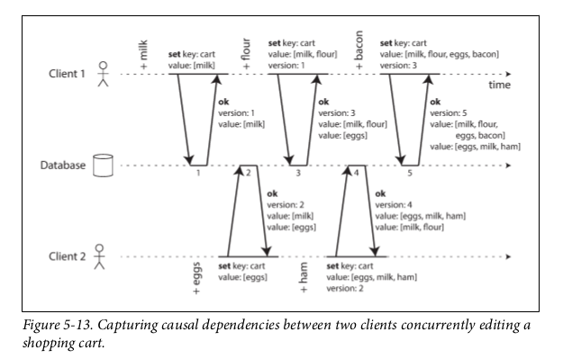
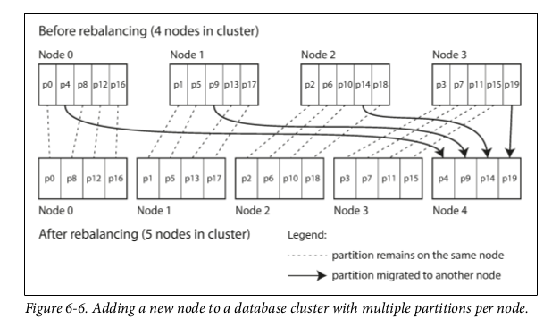
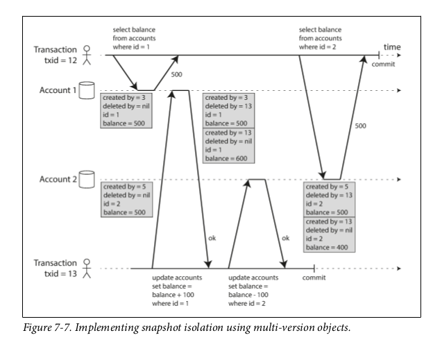
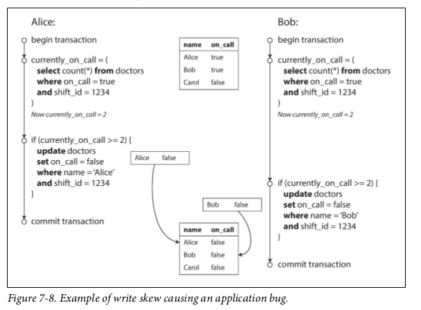
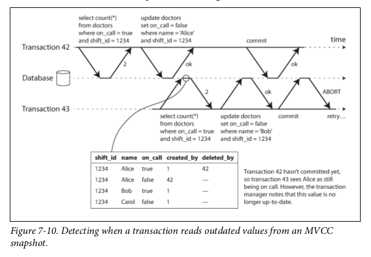
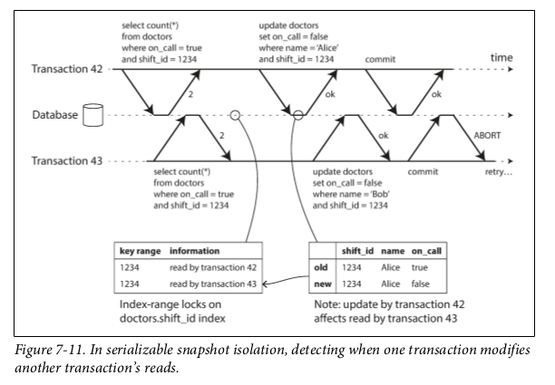
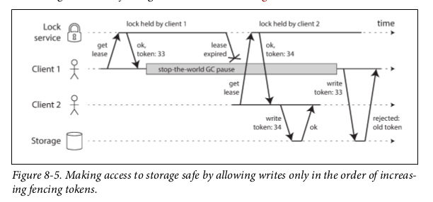
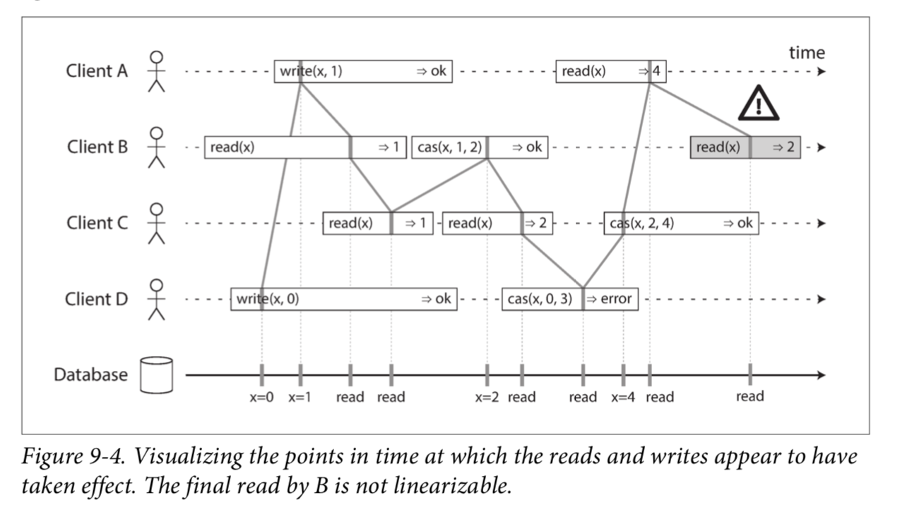
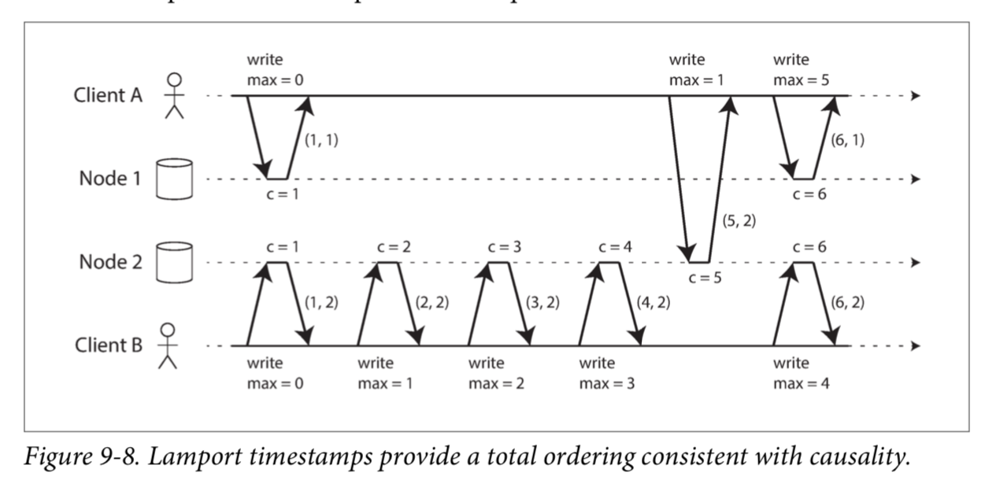

# Designing Data-Intensive Applications

## Data Models and Query Languages

### Документная модель данных

Стоит выбирать, если данные имеют документную структуру, т.е. дерево отношений один-ко-многим, где все дерево обычно загружается за раз). Так же хорошо подходит ,если не у всех жлементов одинаковая внутренняя структура.

Ограничения:

- невозможно сослаться напрямую на элемент внутри документа, приходится писать запросы "второй элемент в списке позиций юзера 251"
- нет джойнов (в основном нет, кое-где есть)
- очень плохо подходит, если есть много отношений многие-ко-многим. Можно избавиться от джойнов, денормализуя данные, но придется постараться, чтобы сохранять данные консистентными.

Если у данных сильная внутренняя связность, то лучше подойдет графовая модель.

Вместо *schemaless* для документных БД больше подходит термин *schema-on-read*.

При апдейте документа, **если размер документа увеличился** - то весь документ нужно переписать заново. Если нужно прочитать часть документа - весь документ загружается целиком. Это влияет на производительность.

## Storage and Retrieval

### Индексы

#### Хэш-индекс

Подходит для записей ключ-значение.

Храним в памяти хэш-мапу, где ключ=ключ, а значение - сдвиг значения в файле данных. Новые и измененные значения всегда дописываются в конец файла данных, а в индекс добавляется или изменяется пара.

Такой подход используется в Bitcask (движок хранения в Riak). 

Ограничение - все ключи должны поместиться в память.

Чтобы на диске не кончилось место, лог разбивается на несколько сегментов фиксированного размера. Когда текущий лог достигает этого размера, он закрывается и начинается запись в следующий файл. В бэкграунде совершается **сжатие** старых сегментов. Во время сжатия из логов выбрасываются повторяющиеся ключи и несколько сегментов объединяются в один. Пока сжатие не завершено, чтение и запись совершается в старые сегменты, когда завершается - делаем свитч на новый смерженный сегмент, а старые - удаляем.

У каждого сегмента свой хэш-индекс. При поиске значения, ищем сначала в текущем, затем в тем что перед ним - и так далее. Благодаря сжатию, сегментов будет немного, так что поиск должен закончиться быстро.

- Если нужно удалить значение, то нужно писать *tombstone* в файл данных. При мержинге *tombstone* говорит, что нужно удалить все предыдущие значения для этого ключа.

- При перезагрузке все индексы стираются из памяти. Можно либо перечитывать их из сегментов (сильно увеличит время запуска), либо снэпшотить их на диск. Для старых сегментов снэншоты будут неизменны, поэтому можно заснэпшотить только один раз, а для текущего будет постоянно меняться, поэтому его можно вычислять при запуске. Либо читать снэпшот с диска, а потом Х последних записей индекста вычитывать из файла данных (где Х можно вычислить как размер файла данных - максимальный сдвиг в индексе).

- При крэше во время записи в лог она может записаться частично. Чтобы отслеживать такие коррапченные части, можно использовать чексуммы.

- Так как записи в лог обычно совершаются строго последовательно, то обычно оставляют только один поток записи. Читать можно и из нескольких.

- Хэш-мапу сложно держать на диске. Придется делать много random access I/O, сложно увеличивать размер, когда мэпа заполняется и сложно разруливать коллизии хэшей.

- range queries не эффективны. Не получится легко отсканировать все ключи между kitty00000 и kitty99999 - придется получать каждый ключ индивидуально.

#### SSTables and LSM-Trees

SSTable получается из тех же сегментов, что в предыдущем пункте, но с условием их **сортировки по ключу** и **уникальности ключей**. Это называется **Sorted String Table** или **SSTable** для краткости.

Преимущества перед хэш-индексом:

- Мержить сегменты легко и просто, даже если размеры файлов больше, чем доступная память: мержить можно как в *mergesort*.

1. Берем Х сегментов, смотрим на первый ключ в каждом файле
2. выбираем самый младший ключ.
3. если несколько сегментов содержат этот ключ, то из соответствующих значений выбираем самое позднее
4. пишем выбранные ключ-значение в смерженный сегмент
5. остальные значения по этому ключу удаляем.

- чтобы найти значение по ключу, больше не нужно хранить в памяти индекс для всех ключей. Можно хранить, допустим, каждый 8-й. Например, нам нужно найти значение для ключа 16, а у нас есть сдвиги для 10 и 18. Не проблема - просматриваем кусок файла между сдвигом для 10 и сдвигом для 18 - нужный нам ключ точно будет где-то там. На практике можно хранить 1 ключ на каждые несколько килобайт сегмента.

- из предыдущего пункта следует, что можно сжимать блоки сегментов (в нашем примере блок 10-18) перед записью на диск.

Структура индексирования, использующая **SSTable**, называется **Log-Structured Merge-Tree** или **LSM-tree**.

Чтобы поддерживать в памяти отсортированную структуру, используются красно-черные деревья или AVL-деревья.

Общий алгоритм работы таков:

- при записи значения, оно пишется в сбалансированное дерево
- когда размер дерева достигает лимита - пишем его на диск как файл SSTable. Это будет просто сделать, так как в дереве данные уже отсортированы. Пока файл пишется, новые значения пишутся в новый инстанс дерева.
- для чтения ищем ключ в текущем дереве, потом в последнем сегменте и так далее.
- в бэкграунде сжимаем и мержим сегменты

Главная проблема:

при крэше теряются данные из текущего дерева. Поэтому нужно держать на диске отдельный несортированный лог, куда аппендить все записи. Его единственная задача - восстановить дерево после крэша. Когда дерево пишется на диск, этот лог можно начинать заново.

LSM-tree используется в:
- LevelDB
- RocksDB
- Cassandra
- HBase
- Lucene

##### Оптимизации

LSM-tree плохо работает, когда ищем ключи, которых нет в базе - нужно просмотреть все сегменты. Решение - *фильтры Блума*.

Для определения времени, когда нужно запускать компакшн, существуют разные стратегии, самые распространенные - *size-tiered* и *leveled*.
- **size-tiered** - новые и маленькие SSTables последовательно мержатся в старые и большие.
- **leveled** - интервал ключей разбивается на более мелкие SSTables и старые данные перемещаются на старые "уровни" (???)

#### B-trees

Самая широко используемая структура для индексов.

Так же, как и SSTables, хранит пары отсортированными по ключу. На этом сходства заканчиваются.

База данных разбивается на *блоки* или *страницы* фиксированного размера (обычно 4 КБ), читает и пишет по одной странице за раз. Это хорошо ложится на hardware, так как с дисков данные тоже читаются/пишутся блоками. У каждой страницы есть свой адрес, поэтому на нее можно сослаться. Одна страница назначается *корнем*, каждый поиск ключа начинается отсюда. Эта страница содержит несколько ключей и ссылок на дочерние страницы. Каждая из страниц ответственна за свой интервал ключей, а ключи в корне обозначают границы этих интервалов.

Например:

Корень содержит ключи 100, 200, 300, 400, 500. Мы ищем ключ 251.

1. Идем в корень, смотрим какой адрес записан между 200 и 300.
2. Открываем страницу, лежащую по этому адресу. Там у нас 210, 230, 250, 270, 290.
3. Берем адрес между 250 и 270.
4. Открываем страницу, лежащую по этому адресу. Там 250, 251, 252, 253, 254 ... 270
5. Так как это "листовая" страница, то здесь между ключами лежат не адреса, а значения (либо сдвиги в файле данных). Берем значение между 251 и 252 и возвращаем его.

Количество *ссылок* в каждой странице называется **фактором ветвления** (branching factor). Обычно составляет несколько сотен.

При апдейте:

1. Ищем листовую страницу для нашего ключа.
2. Меняем значение на этой странице.
3. Пишем страницу обратно на диск (так, чтобы все ссылки на страницу остались валидными).

Добавление ключа:

1. Ищем листовую страницу, которая покрывает этот ключ.
2. Добавляем туда наше значение. Если места на странице не хватает, то страница разбивается на 2, а родительская страница обновляется (туда добавляется новый ключ и адрес).

Алгоритм обеспечивает автоматическую балансировку дерева. Большинство БД умещается в 3-4 уровня дерева. 4-уровневое дерево со страницами по 4 КБ вмещает БД размером 256 ТБ.

##### Надежность

Так как при записи страницы на диске *перезаписываются*, то при крэше могут покорраптиться. Чтобы сделать структуру более устойчивой к крэшам, обычно на диск сохраняют **write-ahead log** или **WAL**. Это лог, куда аппендится каждая операция перед записью в дерево. После крэша лог используется для восстановления дерева к консистентному состоянию.

[Здесь](https://people.eecs.berkeley.edu/~kubitron/cs262/handouts/papers/a1-graefe.pdf) на странице 1.9 объясняется, как происходит восстановление БД после крэша.

Помимо этого, необходима большая осторожность при обеспечении возможности писать из нескольких потоков. Для этого на страницы вешают локи.

##### Оптимизации

- вместо перезаписи страниц и поддержки WAL, использовать copy-on-write. Создается новая страница в новом месте и обновляется адрес в родительской странице. (правда непонятно, как быть с перезаписью родительской, то есть мы либо перезаписываем либо тоже создаем новую и так наверх до самого корня)
- в страницах можно хранить ключи в сокращенном виде, засчет чего увеличить фактор ветвления (см. B+-деревья)
- желательно хранить листовые страницы на диске последовательно, для удобства чтения *range queries*.
- листовые страницы могут хранить указатели на следующую и предыдущую страницу
- есть вариант под названием *fractal tree*, заимствующий некоторые идеи из LSM-деревьев

#### Сравнение B-tree и LSM-tree

LSM-tree быстрее для записи. Читает медленно, потому что нужно просмотреть несколько индексов.
B-tree быстрее для чтения. Пишет медленно, потому что нужно перезаписать страницу и, возможно, страницы выше.

##### Преимущества LSM-деревьев

Запись в SSTable последовательна, что более эффективно, чем случайная в случае B-tree.

LSM-деревья могут быть лучше сжаты, а B-tree оставляют пустое место на диске из-за фрагментации.

##### Недостатки LSM-деревьев

Фоновый процесс сжатия похож на гэрбэдж коллектор, то есть он в непредсказуемые моменты времени начинает влиять на производительность. Если пишут в базу много, а сжатие неправильно настроено, то оно может не справляться со скоростью записи и количество не смерженных сегментов будет расти, пока не закончится место на диске, а чтения будут тормозиться все больше, потому что нужно просмотреть много сегментов.

## Encoding and Evolution

Недостатки XML/JSON/CSV

- в XML/CSV нельзя отличить строку от числа. В JSON - можно, но нельзя отличить целое от числа с плавающей точкой и нельзя указать точность (это нужно, например, для указания чисел больше чем 2^53)

- JSON/XML поддерживают юникодные символы, но не  поддерживают binary strings. Приходится упаковывать в base64, что увеличивает размер на 33%.

- для JSON/XML можно использовать схему

### Бинарные протоколы

#### MessagePack

[Спецификация](https://github.com/msgpack/msgpack/blob/master/spec.md)

- В описании типов может указываться их размерность, при этом все типы ввсе равно поисываются 1 байтов. Например, есть типы str8, str16, str32.
- указываются имена полей

#### Thrift

Задается схема на языке Thrift interface definition language

Есть 3 протокола 

##### BinaryProtocol

- имена полей не указываются, но указывается field tag - порядковый номер поля в схеме. Отсюда следует, что менять порядок полей в схеме нельзя ни в коем случае.
- для строк указывается длина

##### CompactProtocol

- тип поля и field tag упаковываются в 1 байт
- используются variable-length для целых чисел. Например, числа от -64 до 63 описываются 1 байтов, -8192 - 8191 - двумя и т.д.

##### DenseProtocol

Используется только в C++-реализации

#### Protocol Buffers

Тоже нужно задавать схему на IDL.

Очень похож на CompactProtocol у Thrift. 

Одно из отличий - массив в Thrift описывается 2 байтами - 1 байт указывает, что это массив, другой указывает длину и тип элементов. В Protocol Buffers обходятся одним - просто не указывают, что это массив, а несколько полей с одним и тем же field tag автоматически считаются членами массива.

#### Обратная совместимость

Если добавились новые поля, то не стоит их делать обязательными, так как при чтении данных от старой схемы будут ошибки, так как этих полей там нет.

#### Прямая совместимость

Пока из схемы не удаляем старые поля, а новым назначаем новые field tags, то старый код сможет спокойно читать новые схемы.

#### Avro

Необходимо описать схему на Avro IDL или JSON.

- типы не указываются
- для целых чисел используется variable-length

Выдает самый маленький размер данных.

Ключевая особенность - есть 2 схемы данных, одна для писателя, другая для читателя. И они *необязательно* должны совпадать, они должны быть лишь *совместимыми*. При декодинге Avro берет схему писателя, схему читателя и сам резолвит их различия. Например, игнорит лишние поля, заполняет дефолтными значениями недостающие и разруливает разный порядок полей в схемах.

Добавлять и удалять можно только поля с дефолтными значениями.

Схема писателя обычно поставляется вместе с элементами, например в начале файла.

Благодаря отсутствию field tags, Avro более хорошо воспринимает динамически генерируемые схемы. Можно сгенерить схему Avro по БД и прочитать все данные из БД в эту схему. Потом, если схема БД меняется, то генерием по ней новую схему Avro и записываем в нее те же данные, которые прочитали по прошлой схеме. В случае Thrift или Protobuf пришлось бы расставлять руками тэги, здесь все само работает.

## Distributed Data

### Replication

The major difference between a thing that might go wrong and a thing that cannot possibly
go wrong is that when a thing that cannot possibly go wrong goes wrong it usually turns out
to be impossible to get at or repair.
—Douglas Adams, Mostly Harmless (1992)

#### Master-slave replication (active/passive replication)

1. Одна из реплик назначается *лидером* или *мастером*. Когда клиенты хотят совершить запись, они шлют запросы к лидеру, а он пишет данные в локальный сторедж.
2. Остальные реплики становятся *фолловерами* или *слейвами*. Когда лидер пишет данные в локальный сторэдж, он так же рассылает их всем фолловерам как часть *лога репликации* или *потока изменений*. Каждый фолловер применяет все апдейты в том же порядке, что и лидер.
3. Когда клиент хочет прочитать, то может прочитать либо из лидера, либо из фолловера.

##### Когда хотим подключить нового фолловера:

1. Делаем снэпшот лидера
2. Копируем снэпшот на узел фолловера
3. Фолловер запрашивает у лидера все изменения с момента создания снэпшота
4. Когда флловер догнал лидера, он может продолжать работать как обычно

##### Если фолловер крэшится:

1. Каждый фолловер во время работы сохраняет на диск лог апдейтов, пришедших от лидера. 
2. После крэша флловер запрашивает у лидера все апдейты, которые произошли со времени последней записи в лог.

##### Если крэшится лидер:

1. Лидер обычно считается мертвым, если не отвечает в течение некоторого таймаута. 
2. Выбираем нового лидера. Либо голосованием, либо назначаем лидером некий предварительно выбранный *controller node*. Лучше всего выбирать реплику, у которой наиболее поздние изменения.
3. Перенастраиваем систему, чтобы все использовали нового лидера. Не забыть о том, что старый лидер, когда придет в себя, должен тоже стать фолловером.

###### Что может пойти не так:

- у нового лидера может не быть всех записей старого. Обычно нереплицированные записи в этом случае просто игнорятся, что не очень хорошо.
- split-brain - ситуация, когда два узла считают себя лидерами. Некоторые системы включают механизм "убийства" одного из узлов, когда обнаружены 2 лидера. Но следует быть осторожным и не убить обоих.
- сложно выбрать необходимый таймаут для признания лидера мертвым

#### Replication logs

##### WAL shipping

Можно пересылать прям WAL, то есть каждую операцию пишем в WAL и эти же байты шлем фолловерам. Минус в том, что в WAL обычно пишутся операции низкого уровня - какие байты поменять в каких дисковых блоках. Если использовать это для репликации, то будет сильная привязка к движку хранения.

##### Logical replication

Используем разные форматы для WAL и лога репликации. Обычно это последовательность операций уровня строки.

- для вставки запись содержит значения для всех колонок
- для удаления запись содержит идентификатор строки
- для обновления - идентификатор и новые значения для колонок

##### Trigger-based replication

При изменении таблицы срабатывает триггер, который пишет изменение в отдельную таблицу, которую потом подхватывает внешний процесс, трансформирует ее как хочет и реплицирует на другую систему.

#### Проблемы с репликацией

##### Reading Your Own Writes

Когда юзер пишет коммент, он пишется в лидера, но когда читает - читается из фолловера. Если репликация асинхронная, то юзер может не увидеть свой коммент после того, как его написал.

Чтоб такого не было, должна соблюдаться *read-after-write consistency*. Она гарантирует, что когда пользователь перезагрузит страницу, он всегда увидит свои апдейты. 

Возможные варианты реализации:
- когда читаем что-то, что юзер мог изменить - читаем с лидера, иначе - с фоловера. Например, профиль текущего юзера всегда читать с лидера, профили остальных юзеров - с фоловеров.
- если пользователь может редактировать что угодно, то такой подход не применим. Тогда можно отслеживать вмемя последнего апдейта от текущего юзера и в течение минуты после него читать все с лидера. Еще можно мониторить задержку репликации и не допускать обращение к фоловерам, для которых отставание от лидера больше минуты.
- можно запоминать время последнего изменения от юзера и задерживать запрос на чтение до тех пор, пока на реплике не появятся данные для этого времени

Сложнее становится, когда один и тот же юзер пользует сервис с нескольких устройств. Тогда нужна *cross-device read-after-write consistency*. Для этого случая нужно учесть:
- в тех вариантах, в которых мы полагаемся на время последнего апдейта, оно должно храниться где-то централизованно
- если реплики в разных дата-центрах, то запросы от разных устройств могут попасть в разные дата-центры. Тогда в вариантах, где мы какое-то время читаем с лидера, в текущем дата-центре этого лидера может и не быть! Нужно позаботиться о том, чтобы устройства одного юзера шли в один дата-центр.

##### Monotonic Reads

Допустим, пользователь загрузил страницу, получил данные с реплики А. Потом перезагружает страницу и на этот раз читает из реплики Б, а у нее задержка больше. В результате после перезагрузки страницы пользователь увидит более старые данные.

*Monotonic reads* - это гарантия, что при последовательных запросах пользователь не будет читать более старые данные *после того как прочитал более новые*.

Вариант реализации:
- каждый пользователь всегда читает из одной и той же реплики. Выбирать ее можно, например, на основании хэша идентификатора юзера. Если та реплика мертва, то перенаправлять на другую.

##### Consistent Prefix Reads

Допустим, у нас есть событие-причина А от юзера А и событие-следствие Б от юзера Б. И есть внешний юзер В.
событие-А записалось в лидера-А, среплицировалось на фоловера-А1 и фоловера-А2. 
Юзер Б прочитал событие-А из фоловера-А1 и ответил на него событием-Б.
событие-Б записалось в лидера-Б, среплицировалось на фоловера-Б.

Теперь юзер-В прочитал из фоловера-Б событие-Б, **затем** из фоловера-А2 событие-А. И получил следствие раньше чем причину!

*Consistent prefix reads* - гарантия, что если последовательность записей происходит в определенном порядке, то любой читатель увидит их в точно таком же порядке.

Вариант решения:
- все события, которые причинно-следственной связью связаны меж собой, должны быть записаны в один и тот же партишн (??? лидер или фолловер?)

#### Multi-Leader Replication

##### Юз-кейсы

###### Несколько датацентров

В каждом датацентре есть один лидер. Внутри одного датацентра идет обычная репликация на фолловеров, но между датацентрами идет multi-leader репликация.

Можно обращаться всегда к ближайшему датацентру.

Если один лидер упадет, то можно не выбирать нового, так как другие датацентры продолжат работать.

###### Работа в оффлайне

Оффлайн-узел становится лидером и принимает все записи на себя, а потом синкается с другими, когда появляется сеть.

###### Совместное редактирование

Когда юзер редактирует документ, изменения применяются на его локальной реплике (в браузере или приложении), а затем асинхронно реплицируется на сервер.

##### Разруливание конфликтов

###### Избегание

Можно все изменения, которые могут привести к конфликтам, проводить через один датацентр, то есть через одного лидера. 

Будет плохо, когда он упадет, или юзер переместится далеко от него.

###### Стратегии сходимости

- *last write wins* - даем каждому апдейту идентификатор, выигрывает тот, у которого ид больше
- даем каждой реплике идентификатор, выигрывает апдейт с более высокой реплики
- просто мержим изменения
- записываем конфликт в специальную структуру данных с сохранением всей необходимой информации, чтобы потом асинхронно кто-то его разрулил (возможно, юзер)
- CRDT: *conflict-free replicated datatypes* - множество структур данных, которые сходятся сами собой
- *mergeable persistent data structures* - храним историю и мержим *3-way* как в гите
- *operational transformation* - алгоритм, используемый в приложениях типа Google Docs для совместного редактирования

##### Топологии репликации между лидерами

- *все-ко-всем*
- *круговая* - А реплицирует в Б, Б в В, В в Г, Г в А
- *звездная* - А реплицирует в Б, В и Г; Б в А; В в А; Г в А. Может быть преобразована в дерево.

Проблема круговой и звездной в том, что один упавший лидер может заблокировать всю сеть.

#### Leaderless replication

В таких системах обычно клиент сам шлет апдейты на несколько реплик. Если большая часть реплик приняла апдейт, то он считается прошедшим. 

Чтение тоже шлется на несколько реплик и если пришли разные значения, то выбирается тот, у которого большинство. Либо тот, у которого больше версия.

В некоторых реализациях клиент, увидевший, что на какой-то из реплик данные устарели, сам шлет ей нужные апдейты. Данные, которые редко читаются, могут долгое время не реплицироваться.

А в некоторых работает фоновый процесс, который постоянно ищет расхождения в репликах и копирует на них недостающие данные.

#### Кворум

Если есть n реплик, каждая запись подтверждается w репликами, а каждое чтение читается с r реплик, то должно быть: **w + r > n**.

Обычно n делают нечетным числом, а w = r = (n + 1) / 2

##### Недостатки кворумной репликации

- если апдейт не прошел на w репликах, то он не откатывается на тех, где прошел
- если узел крешится, потом восстанавливается и получает catchup-апдейты с устаревшей реплики, то количество узлов с актуальными данными может упасть ниже w
- сложно мониторить актуальность реплик, потому что данные приходят в разном порядке

#### Sloppy quorum & hinted handoff

sloppy quorum - это когда у нас нет w доступных реплик для записи, но мы разрешаем записать значение в те реплики, на которых это значение обычно не живет. Имеется в виду, что обычно каждому ключу привязывается свой набор реплик (см. *consistent hashing ring*), а в случае *sloppy quorum* значения могут писаться в любые w работающих узлов.

Когда нужные реплики появятся в сети, они скачают эти значения с них, это называется *hinted hand-off*

В этом случае, даже если у нас выполняется условие w + r > n, мы не можем быть уверены, что читаем актуальные данные, пока не пройдет *hinted hand-off*.

Такой режим работы опционален в Dynamo, включен по умолчанию в Riak и выключен по умолчанию в Cassandra, Voldemort.

#### Detecting Concurrent Writes

Так как события, произошедшие одновременно, могут прийти на узлы в разном порядке (из-за задержек сети и возможных отказов), то они могут разойтись. Есть разные стратегии разрешения одновременных записей:

##### Last write wins

Каждой записи присваиваем таймстэмп, выигрывает запись с наибольшим таймстэмпом.

Единственый метод, поддерживаемый в Cassandra.

Главная проблема - если Х клиентов делают запись в один и тот же ключ, то все получат результат "запись успешна", но в конце концов Х-1 записей будут перезаписаны самой поздней.

Такое поведение допустимо в системах, где можно терять записи, например, для кэширования.

Ну или можно такое использовать, если приложение гарантирует, что каждый ключ будет записан ровно один раз.

##### Happens-before

В этом алгоритме клиенты сами должны мержить значения.

- сервер для каждого ключа сохраняет номер версии. При каждой записи ключа версия инкрементируется.
- когда клиент читает ключ, он получает все его значения, которые **не перезаписаны**, а так же самый последний номер версии для этого ключа
- когда клиент пишет в ключ, то он должен включить номер версии от своего предыдущего чтения, а так же должен смержить все значения ключа, полученные при предыдущем чтении
- когда сервер получает запись и номер версии, то он **перезаписывает** все значения с этим (либо младшим) номером версии, но сохраняет все версии выше.



Пример:

1. клиент А пишет в ключ "корзина" значение "молоко" без указания версии
2. сервер возвращает ["молоко"] и версию 1
3. клиент Б пишет в ключ "корзина" значение "яйца" без указания версии
4. сервер инкрементирует версию, но сохраняет яйца как еще одно значение. Возвращает значение [молоко], значение [яйца] и версию 2
5. клиент А хочет положить муку, но он пока не знает, что на сервере уже версия 2, поэтому пишет [молоко, мука] и версию 1
6. сервер инкрементирует версию до 3 и перезаписывает значение [молоко] с версией 1 значением [молоко, мука] полученным от клиента А. А значение [яйца] остается неизменным, так как у него было значение 2. Клиенту А возвращается [молоко, мука], [яйца] и версия 3
7. клиент Б мержит полученные значения от сервера на шаге 4, добавляет туда ветчину, получает [молоко, яйца, ветчина] и пишет его с версией 2.
8. сервер перезаписывает значения [молоко] и [яйца] значением [молоко, яйца, ветчина]. Получаются значения [молоко, яйца, ветчина] и [молоко, мука], он их возвращает с версией 4.

Мержить значения легко, когда мы можем только добавлять новые элементы. Однако если пользователи могут удалять, то придется вместо удаления писать томбстоуны.

##### Вектора версий

Когда у нас несколько реплик, то одним значением версии не обойтись. Нужно хранить по одному значению версии на каждую реплику и на каждый ключ. Каждая реплика при записи инкрементирует свою версию, а так же следит за тем, какие версии от какой реплики она получила. При записии чтении от сервера возвращаются *вектора версий*.

В Riak испольщуются [*dotted version vectors*](http://basho.com/posts/technical/vector-clocks-revisited-part-2-dotted-version-vectors/)

Вектора версий также часто называют *векторными часами*, хотя это не одно и то же.

### Partitioning

Партишн - это часть данных, разделенных вертикально. То есть, например, юзеры от A до F. У каждого партишна свой лидер и фолловеры. 

Главная причина для партишнинга - масштабируемость. Все данные могут просто не поместиться на одну ноду. А партишны могут быть размещены на разных нодах. Таким образом, большая БД может быть распределена между многими дисками, а запросы к БД распределены по многим процессорам.

Партиционирование обычно совмещают с репликацией, то есть каждая запись принадлежит к одной партиции, но при этом все равно реплицируется на несколько узлов. Нода может содержать больше 1 партишна, каждая нода может быть лидером для каких-то партишнов и фоловером для других.

#### Стратегии партиционирования

##### По диапазону ключей

Каждому партишну назначем свой диапазон ключей.

Проблема - ключи могут быть распределены не равномерно по всему диапазону ключей. Тогда на одних партишнах ключей будет больше, на других меньше.

Если партиционировать по таймстэмпу, то в каждый момент времени будет активная запись только в один узел, остальные будут простаивать.

##### По хэшу от ключа

Позволяет равномерно распределить данные.

Недостаток - сложно делать запросы по диапазону ключей. За каждым ключом нужно ходить на новый узел.

Стратегия не работает, если у нас много записей и чтений в один ключ (например, селебрити аккаунт). В этом случае можно добавлять к ключу суффикс из 1-2 рандомных цифр. Это позволит разделить ключ на 10/100 партишнов. Недостаток подхода в том, что для чтения данных придется обратиться ко всем этим 10/100 партишнам.

#### Партиционирование по вторичному ключу

##### by-document

Каждый партишн поддерживает свой индекс, в котором перечислены только локальные элементы.

Недостаток - когда хотит сделать запрос по вторичному ключу, то надо ходить по всем партишнам.

##### by-term

Делаем *глобальный* индекс. Но его тоже нухно разделять по партишнам, чтобы он не стал узким местом. 

Например, у нас есть вторичный индекс по полю "Имя". Тогда на партишне 1 хранится кусок индекса с именами от А до Д, на 2 - от Е до Л и так далее.
Индексы по другм полям хранятся так же, если есть индекс по полю "Цвет", то на 1 хранятся первые 10% цветов, на 2-м - следующие 10% и так далее.

Подход называется *term-partitioned*, потому что term/выражение определяет, какой нужен партишн. В нашем случае термом будет "имя: Евгений", по нему мы можем вычислить, что нам нужно идти на партишн 2.

Если термы распределены неравномерно, то мы опять же можем партиционировать по хэшу от терма.

Преимущества: можно все данные получить с одного партишна. 

Недостаток: 

- замедляется запись, так как при записи одной строки пишем на несколько партишнов (если индексы есть на нескольких полях).
- обновление индексов обычно идет асинхронно, поэтому сразу после записи чтение ключа может быть недоступно

#### Ребалансировка партишнов

Нужна, когда:

- увеличилась нагрузка, нужно больше CPU
- увеличился размер, нужно больше дисков и памяти
- машина сдохла, другие машины должны взять на себя ее нагрузку

##### Стратегии ребалансировки

###### Антипаттерн: hash mod N

Если мы разделяем партишны по узлам, пользуясь формулой *index = hash mod N*, то потом словим много проблем при ребалансировке, потому что при добавлении или удалении узла придется перемещать практически все записи на другие узлы.

###### Фиксированное количество партишнов

Делаем очень много партишнов, гораздо больше, чем у нас есть узлов, и храним на каждом узле по несколько партишнов. Когда появляется новый узел - он просто забирает себе часть партишнов с каждого из остальных узлов. И наоборот, если узел пропадает, то каждый из остальных берет на себя часть его партишнов.



**Между узлами партишны перемещаются только целиком. Новые партишны не появляются, новые ключи партишнам не назначаются. Меняется только связь партишнов с узлами.** 

Пока партишн перемещается на новый узел, все запросы к нему продолжает обслуживать старый.

##### Динамическое партиционирование

Если выбрать диапазон ключей для партиционирования неправильно, то ключи будут распределены неравномерно. Поэтому базы с партиционированием на основе диапазона ключей, такие как HBase и RethinkDB создают партиции динамически. 

Когда партишн вырастает до определенного размера (напр. 10 ГБ), он разделяется на 2 примерно равные части. И наоборот, если много данных удалено, и размер падает ниже некоторой границы, то партишны могут быть смержены.

После того как партишн разделяется, одна из половин отправляется на другой узел.

Недостаток - на старте, когда у нас пустая база, будет только один партишн, через который будет проходить вся нагрузка. В HBase и RethinkDB можно задать некоторое количество партишнов по умолчанию, но для этого нужно заранее знать распределение ключей.

##### Пропорциональное партиционирование

В Cassandra и Ketama количество партишнов пропорционально количеству узлов, чтобы иметь фиксированное количество партишнов *на каждом узле*.

Размер каждого партишна растет вместе с датасетом, но когда добавляется новый узел, партишны опять становятся меньше.

Когда узел присоединяется к кластеру, он рандомно выбирает фиксированное количество партишнов, делит их пополам и забирает себе по половине от каждого.

#### Роутинг запросов

Как клиент должен узнать, на какой адрес и порт нужно отправлять данные? Нужен *service discovery*. Есть несколько подходов:

- клиент может подключиться к любому узлу. Если узел не содержит нужный клиенту партишн, то он проксирует запрос клиента на нужный узел, получает ответ от узла и проксирует его обратно клиенту
- все запросы от клиентов направлять на слой маршрутизации, который выступает как балансировщик нагрузки, обладающий информацией о партишнах
- требовать от клиентов, чтобы они знали о распределении партишнов между узлами и сами подключались куда надо

Часто для *service discovery* используется внешний сервис координации, такой как ZooKeeper:

- каждый узел регистрирует себя в зукипере
- остальные акторы (маршрутизаторы и клиенты) подписываются на обновления инфы в зукипере
- когда партишн сменяет узел, или появляется/удаляется узел, ZooKeeper рассылает события на слой маршрутизации, или на клиента.

### Транзакции

Способ атомарно совершить группу операций чтения или записи.

#### ACID

Свойства безопасности, гарантируемые транзакциями:

- Atomicity
- Consistency
- Isolation
- Durability

Системы, которые не удовлетворяют критерию ACID, иногда называют BASE:

- Basically Available
- Soft state
- Eventual consistency

##### Atomicity

Не может быть разделено на более мелкие части.

Означает, что транзакция откатывается целиком, если произошла ошибка в процессе выполнения.

##### Consistency

Транзакция, достигающая своего нормального завершения и, тем самым, фиксирующая свои результаты, сохраняет согласованность базы данных. При этом *в ходе* выполнения транзакции согласованность не требуется.

Это на самом деле больше свойство приложения, чем базы данных. 

##### Isolation

Транзакции, выполняемые параллельно, не влияют друг на друга.

##### Durability 

После завершения транзакции, все данные, которые в ее процессе были записаны, не будут утеряны даже в случае крэша базы. Обычно это означает, что после завершения транзакции данные записаны на диск. Может также означать запись в WAL или реплику на несколько других узлов.

### Уровни изоляции транзакций

#### Read uncommited

Редко используется.

Гарантирует:
1. Когда пишем, то перезаписываем только те данные, которые были закоммичены (no dirty writes)

При этом когда читаем, то можем прочитать грязные данные, то есть те, которые не закоммичены


#### Read Commited

Гарантирует:
1. Когда читаем, видим только те данные, которые были закоммичены (no dirty reads)
2. Когда пишем, то перезаписываем только те данные, которые были закоммичены (no dirty writes)

Грязные чтения необходимо предотвращать, так как база в этот момент находится в неконсистентном состоянии, потому что какая-то параллельная транзакция не успела завершиться.

А еще потому что прочитанные грязные данные могут вообще быть откачены, если в той транзакции произойдет ошибка.

Защита от грязных записей обычно реализуется через локи уровня строчки. Когда транзакция хочет изменить строку, она сначала должна получить на нее лок. Потом она его держит до конца транзакции.

Защита от грязных чтений может быть реализована так же, однако это неэффективно когда читателей много, а писателей мало.  Поэтому обычно в транзакции база запоминает старые значения перезаписываемых полей и пока транзакция не кончилась, дает другим читателям старое значение.

#### Snapshot Isolation (Repeatable Read)

Если мы в одной транзакции читаем много строк а в это время, как над ними совершается параллельная транзакция, изменяющая данные, то может случиться так, что часть строчек мы прочтем до транзакции, а часть - после, и в результате можем получить неконсистентное состояние.

Это может сильно повредить в следующих юзкейсах:

- создание бэкапа
- большие запросы для аналитики
- периодическая проверка целостности

Для решения проблемы есть уровень **Snapshot isolation** (в стандарте SQL он называется *repeatable read*, поэтому в PostgreSQL и MySQL он называется так же). Суть его в том, что каждая транзакция читает закоммиченный снэпшот базы и работает дальше с ним. Даже если эти данные потом поменяются другой транзакцией, наша увидит старые данные из снэпшота.

Благодаря снэпшотам, **читатели не блокируют писателей, а писатели не блокируют читателей**. В результате можно одновременно делать бэкап и продолжать писать в базу без всяких локов.

Для правильной реализации, база данных должна хранить несколько версий объектов. Эта техника известна как *multi-version concurrency control (MVCC)*

##### MVCC

Когда транзакция стартует, ей присваивается уникальный инкрементируемый transaction ID (**txid**). Когда транзакция что-либо пишет в базу, эти данные помечаются её txid.

Каждая строка имеет поле *created_by*, в которой записан txid транзакции, которая вставила эту строку. Также есть поле *deleted_by*, которое выставляется если строка удаляется (сама строка на самом деле при этом не удаляется до тех пор, пока не станет ясно, что она не может больше использоваться никакой транзакцией).

Каждый апдейт превращается в операцию удаления и вставки.

Когда транзакция читает из базы, ее txid помогает определить, какие объекты ей видимы:

1. В начале каждой транзакции, база составляет список txid транзакций, которые сейчас в процессе. В нашей транзакции будут проигнорированы все записи от этих txid.
2. Составляется список абортнутых транзакций, их записи тоже игнорятся.
3. Те записи, у которых txid старше нашего - игнорятся независимо от того, завершены они или нет.
4. Все остальные записи видны.



Если у нас индекс реализован как B-tree, то можно для каждой транзакции создавать новый корень. Тогда отпадает необходимость фильтровать по txid, потому что все записи будут осуществляться только в свою копию дерева. Однако тут понадобится фоновый процесс для сжатия и уборки мусора.

#### Lost Updates

Традиционная запись переменной из разных потоков - два клиента прочли запись, изменили ее, записали. В результате запись одного из клиентов будет потеряна.

Варианты решения:

##### Атомарные операции записи

Многие операции совершаются атомарно, без необходимости чтения-изменения. Например,

```sql
UPDATE counters SET value = value + 1 WHERE key = 'foo';
```

Эта операция будет совершена атомарно.

Атомарность обычно осуществляется путем взятия лока на объект перед чтением. Либо можно все атомарные операции заставить осуществляться через один и тот же трэд.

Недостаток - при использовании ORM сложно следить за атомарностью операций.

##### Явное оборачивание сложных операций в транзакцию

Тут все понятно, если видим что у нас есть чтение-изменение-запись, то оборачиваем в `BEGIN TRANSACTION ... COMMIT`

##### Автоматическое обнаружение потерянных апдейтов

База может сама определять, что какой-то апдейт может быть потерян и выдавать ошибку при коммите. Такие проверки удобно делать, если реализован MVCC. Поэтому уровни изоляции repeatable read в PostgreSQL, serializable в Oracle и snapshot isolation в SQL Server автоматически абортят транзакции, если обнаруживают потерянный апдейт.

##### SELECT FOR UPDATE

Позволяет установить лок на выбранные строки
 
```sql
SELECT * FROM requests WHERE id=5 FOR UPDATE
```

Остальные сессии к базе не смогут выполнить аналогичный запрос на чтение/изменение этих строк, пока наша транзакция не завершится. Если на этих строках уже есть лок, то ждем, пока он не освободится.

В SQL Server выглядит так:

```sql
SELECT * FROM requests WITH(updlock, rowlock) WHERE id=5
```

##### Compare-and-set

На уровне приложения в запрос на запись включаем предыдущее значение, вот так:

```sql
UPDATE wiki_pages SET content = 'new content'
  WHERE id = 1234 AND content = 'old content'
```

Правда такое не прокатит, если у нас snapshot isolation и результат WHERE будет прочитан из снэпшота. Поэтому такой способ стоит применять в базах, где плохо с транзакциями.

##### Разрешение конфликтов

В распределенных базах обычно в случае lost updates делается несколько версий записи с тем, чтобы приложение потом само разрешило конфликт, используя одну из описанных выше стратегий разрешения конфликтов.

#### Write Skew and Phantoms

Write skew - это обобщение аномалии lost updates, но в случае write skew клиенты могут писать в разные строки.



Этот вариант сложнее, чем lost updates:

- атомарные операции над строками не помогут, так как у нас тут несколько строк
- во многих реализациях transaction manager не отлавливает ситуацию
- некоторые базы позволяют выставлять ограничения для записей, однако в нашем случае ограничение олжно охватывать несколько строк, многие базы этого не поддерживают

Схема типичного write skew:

1. Делаем SELECT строк по некоторому критерию
2. В зависимости от результата селекта идем дальше
3. Делаем запись в базу и коммитим транзакцию. Эффект этой записи меняет результат селекта из 1 пункта, то есть если повторить тот селект после этой записи, то результаты будут другими.

Единственный описанный в книге вариант решения - использовать конструкцию `SELECT FOR UPDATE`. Но про него легко забыть, поэтому обычно проще использовать уровень изоляции SERIALIZABLE.


### Serializability

Гарантирует, что даже если транзакции выполняются параллельно, конечный результат будет таким же, как если бы они выполнялись последовательно.

Рассмотрим варианты реализации.

#### Фактическое последовательное выполнение

Все транзакции выполняем в одном потоке. Такой подохд стал приемлем недавно благодаря тому, что:

- память стала дешевая, можно весь датасет держать в памяти и очень быстро проводить транзакции
- OLTP-запросы, изменяющие данные - обычно короткие и составляют лишь малую часть чтений и записей. OLAP же, составляющие основную часть - обычно только читают, поэтому могут проводиться над снэпшотом снаружи треда транзакций.

Системы, использующие этот вариант, не поддерживают транзакции с несколкьими операциями внутри. Для этих целей нужно делать *хранимые процедуры*. Преимущество хранимой процедуры в этом сценарии в том, что ей не нужно передавать туда-сюда промежуточные результаты, что очень сильно затормозило бы наш поток транзакций из-за IO.

Главный недостаток потока транзакций - пропускная способность базы ограничена одним ядром CPU. Если удастся найти такой вариант партиционирования, при котором каждая транзакция работает с данными только одного партишна, то можно сделать по одному потоку транзакций на партишн.

#### Two-phase locking (2PL)

**2PL это не 2PC**

Несколько транзакций могут читать строку, пока ее никто не меняет. Но чтобы поменять, нужен эксклюзивный доступ:

- если транзакция А прочитала объект, а транзакция Б хочет его изменить, то Б должна ждать, пока транзакция А не завершится
- если А изменила объект и Б хочет его прочитать, то Б должна ждать, пока не завершится А

Другими словами, **писатели блокируют и писателей и читателей**. В этом главное отличие от *Snapshot Isolation*.

##### Реализация

Похоже на то, как работает **ReaderWriterLock** в .NET

Используется много локов. Есть локи общие и эксклюзивные. Общие могут держаться несколькими транзакциями, эксклюзивные - только одной. На объекте может быть либо 1 эксклюзивная, либо несколько общих.

- если транзакция хочет читать, сначала получает общий лок;
- если хочет писать, то получает экслюзивный лок
- если читает, а потом пишет, то нужно проапгрейдить свой общий лок до эксклюзивного
- получив лок, держим его до конца транзакции

Название *two-phase-locking* означает, что на первой фазе мы постепенно получаем локи, а на второй фазе разом отпускаем их.

Главный недостаток - производительность. Алгоритм может работать очень медленно. Одна транзакция, которая затрагивает много полей, может затормозить всю систему.

#### Serializable Snapshot Isolation (SSI)

Относительно новый алгоритм, который предлагает хорошую масштабируемость и производительность. Сегодня используется в большинстве баз. В отличие от предыдущих алгоритмов, которые были пессимистичными, этот - оптимистичный.

Суть алгоритма в том, что база отслеживает ситуации, когда транзакция **читает** возможно устаревшие данные. Если при чтении какие-то из записей игнорятся так как их транзакция еще не завершена, а потом мы делаем запись, а потом при нашем коммите та транзакция уже завершена и те записи теперь видны, то получаем ошибку. Если у нас read-only транзакция, то ошибки не будет.



На рисунке транзакция 43 попыталась прочесть, но получила "старые" данные, поскольку транзакция 42 еще не завершена. Однако когда транзакция 43 пытается закоммититься, то получает ошибку, потому что теперь транзакция 42 завершилась, а значит 43 могла сделать выводы, основываясь на данных, которые более не актуальны.

Чтобы это реализовать, база должна запоминать случаи, когда транзакции игнорят чужие записи при чтении.

Но есть и второй случай - обе транзакции прочитали данные, а потом их меняют.



Здесь база должна запоминать все случаи чтения из базы и когда транзакция пишет, то сообщаем транзакциям, которые читали этот объект, что он больше не актуален. 

Как и в обычном **snapshot isolation**, здесь у нас *читатели не блокируют писателей, писатели не блокируют читателей*.

Большое количество аборшнов может сильно подорвать производительность алгоритма, поэтому транзакции должны быть как можно короче и быстрее.

### Проблемы распределенных систем

Основные проблемы:

- сетевые пакеты теряются и задерживаются
- часы рассинхронизируются, прыгают вперед и назад
- процессы могут останавливаться на значительное время (причем не только из-за GC), а потом возвращаются к жизни, не зная, что останавливались
- у узлов нет общей памяти, так что единственный способ обмениваться информацией - это посылать данные по ненадежной сети

#### Как узнать, что узел крэшнулся

- обычно узел считается мертвым, если от него нет ответа в течение таймаута
- если машина осталась в сети, но процесс крэшнулся и никто не слушает нужный порт, то ОС ответит на запрос пакетом RST или FIN
- если процесс узла крэшнулся, но ОС все еще работает и в сети, то скрипт может разослать остальным узлам инфу о крэше, чтобы они могли взять на себя его нагрузку, а не ждать таймаут
- если роутер уверен, что IP-адрес назначения недостижим, то он может ответить пакетом ICMP Destination Unreachable

#### Network congestion

Даже у исправно функционирующей сети могут появляться задержки в доставке пакетов:

- если несколько узлов пытаются послать пакеты в одно и то же место, свитч ставит их в очередь и подает на нужный сокет по одному. Если очередь заполняется, то последующие входящие пакеты дропаются
- если пакет дошел до машины, а все CPU сейчас заняты, то ОС ставит запрос в очередь
- на виртуалках (особенно в облаках) ОС может остановиться на десятки миллисекунд, пока другая виртуальная ОС использует ядро. В это время ОС-реципиент не может получать данные из сети и они опять ставятся в очередь
- TCP реализует *flow control*, что означает что узел сам ограничивает свою отправку пакетов, чтобы не перегрузить принимающую сеть. То есть очередь есть еще и на отправителе.

Таким образом, надежнее всего определять длительность таймаутов экспериментальным путем. В некоторых системах таймауты настраиваются динамически исходя из статистики использования.

#### Как лидеру узнать, что он больше не лидер

Лидер может брать лидерство в "аренду" у узлов на некоторое время. Когда время подходит к концу, нужно брать аренду еще раз. Если не успел взять в течение таймаута, то прекращает быть лидером.

Проблема в том, что после очередной проверки может возникнуть длительная пауза (например, из-за GC, или нагрузки от другой виртуалки в облаке, или виртуальная память читает страницы с диска), в течение которой аренда кончится, но лидер об этом не узнает и обработает реквест на запись.

Чтобы уживаться с GC, применяют следующие методы:

- получать ивент, что на узле скоро будет GC и переставать слать реквесты на этот узел, затем ждать, когда узел обработает текущие реквесты и после этого запускать GC
- использовать GC только для коротко-живущих объектов (которые можно быстро собрать) и перезапускать процесс, когда набирается много долго-живущих

Чтобы не-лидер, думающий, что он лидер, не смог сделать операцию записи, можно использовать т.н. *fencing*:



В ZooKeeper в качестве токена может быть использован *zxid* или *cversion*. 

Недостаток системы в том, что ресурс сам должен определять, кто может получить к нему доступ. Если у ресурса нет своей логики, то можно, например, делать токен частью имени файла, к которому пытаются получить доступ.

#### Byzantine faults

Система называется **Byzantine fault-tolerant**, если продолжает нормально работать даже если некоторые из узлов перестают работают неисправно, не подчиняются протоколу, или на сеть совершаются атаки злоумышленников. 

Юзкейсы:

- в аэрокосмической индустрии данные в памяти и регистрах могут быть изменены под действием радиации
- в системах, где участвуют несколько организаций, некоторые из них могут пытаться сжульничать (например, p2p сети типа биткойна и других блокчейнов)

Алгоритмы для таких систем крайне сложны и здесь не рассматриваются.

#### Корректность алгоритмов

Чтобы считаться корректным, алгоритм в распределенной системе должен удовлетворять некоторым предопределенным свойства. Например, для системы с fencing tokens это могут быть такие свойства:

- **уникальность** - запросы токенов всегда возвращают уникальные значения
- **монотонность** - если запрос x вернул токен Tx, а y вернул Ty и x закончился раньше, чем y начался, то Tx < Ty
- **доступность** - узел, который просит токен и не падает, рано или поздно получит ответ

Свойства бывают двух типов: свойство *безопасности* и *живучести*. В приведенном примере к свойствам *безопасности* относятся **уникальность** и **монотонность**, а к *живучести* - **доступность**.

Свойства *живучести* отличить просто - обычно в их описаниях есть "в конце концов" / "eventually".

Свойства *безопасности* отвечают за то, чтобы не произошло ничего плохого, а свойства *живучести* обеспечивают, что в конце концов произойдет что-то хорошее.

В распределенных системах обычно требуется, чтобы свойства *безопасности* выполнялись **всегда**, даже если падают узлы, или падает вся сеть. А вот свойства *живучести* могут обсуждаться - например, можно поставить условие, что реквест получит респонс только если большинство узлов живы и если сеть в конце концов восстанавливается после отказа.


## Консистентность и Консенсус

### Линеаризуемость

Линеаризуемая система - это система, выглядящая как будто есть только одна копия данных и все операции над ней атомарны.

В нелинеаризуемой системе можно прочитать разные данные с разных узлов, так как на некоторые узлы свежие данные еще не дошли.

Для того, чтобы система была линеаризуемой, недостаточно того, чтобы до начала записи все читали старое значение, а после конца - новое. Должна быть еще некая точка во времени между началом и концом операции записи, в которой значение атомарно меняется со старого на новое. Все, кто читали до этой точки, получают старое значение, кто после - новое.



Чтобы проверить, является ли система линеаризуемой, придется записать все моменты начала запросов и ответов и проверить, могут ли они быть расположны в упорядоченную последовательность.

#### Разница между сериализуемостью и линеаризуемостью

**Сериализуемость** - свойство транзакций, гарантирует что транзакции выполнятся как будто они выполняются в *каком-то* последовательном порядке, который может и не совпадать с тем, в котором транзакции были запущены

**Линеаризуемость** - гарантия "свежести" для чтений и записей объекта

Часто базы данных предоставляют и линеаризуемость и сериализуемость, в этом случае говорят, что база обладает *строгой сериализуемостью* (*strict serializability*). Реализации сериализуемости, использующие two-phase locking или *последовательное выполнение в одном потоке* обычно линеаризуемы.

А вот *serializable snapshot isolation* линеаризуемой не является, так как читает старые данные из снэпшота.

#### Когда нужна линеаризуемость

- локи
- выбор лидера
- констрейнты
- ограничения уникальности
- когда есть посторонний канал коммуникации между клиентами, по которому они могут сообщать друг другу результаты чтения


### Реализация линеаризуемых систем

- в single-leader системах, если читать всегда с лидера, то будет линеаризуемость. Однако сложно всегда знать, кто сейчас лидер.
- алгоритмы консенсуса

НЕ могут быть линеаризуемы multi-leader и leaderless системы.

В случае leaderless соблюдение формулы w + r > n, казалось бы, должно обеспечивать линеаризуемость, однако бывают *sloppy quorums* и *last write wins*, которые мешают линеаризуемости.

Даже строгий кворум не гарантирует линеаризуемость. Представим, что есть три реплики - А, Б, В. 
Клиент 1 пишет значение 1, оно пишется в А, а в Б и В - еще не успело.
Клиент 2 читает из А и Б, получает 0 и 1, выбирает 1.
Клиент 3 читает из Б и В, получает 0 и 0, выбирает 1.

В результате клиент 3 прочитал после клиента 2, но получил старое значение.

Таким образом, безопаснее всего считать, что *leaderless* не линеаризуемы.

Кстати, CAP-теорема говорит только об одной модели консистентности (линеаризуемость) и только об одном виде ошибок (отказы сети). Она не говорит ничего о задержках в сети, отказах узлов и прочем. В наши дни теорема мало применима для проектирования систем.

На деле обычно линеаризуемость не так уж и нужна, а нужна лишь причинность (*casuality*), которая реализуется гораздо проще. Чтобы поддерживать причинность, нужно знать, какая операция *произошла перед* какой. Параллельные операции могут быть обработаны в любом порядке, но если одна операция произошла перед другой, то они должны быть обработаны в этом же порядке на всех репликах. Когда реплика обрабатывает операцию, она должна убедиться, что все предшествующие операции уже выполнены, иначе нужно подождать.

#### Счетчики Лэмпорта

У каждого узла есть уникальный идентификатор, каждый узел хранит счетчик количества операций, которые он обработал. Счетчик Лэмпорта - это пара (счетчик, идентификатор узла).

Счетчик Лэмпорта предоставляет глобальный порядок для событий - при сравнении двух значений, большим считается тот, у которого больше счетчик. Если счетчики равны, то больше тот, у которого больше идентификатор.

Каждый узел и каждый клиент помнит *максимальное* значение счетчика, которое он видел, и включает это значение с каждым запросом. Когда узел получает запрос или ответ со значением счетчика, бОльшим, чем его значение, он немедленно присваивает своему полученное значение.

Пока максимальное значение счетчика используется с каждой операцией, алгоритм гарантирует, что порядок событий согласован с их причинностью, потому что каждая причинно-следственная связь приводит к увеличению счетчика.



Счетчик Лэмпорта часто путают с векторами версий. Отличие в том, что векторы версий различают параллельные и зависимые операции, а счетчик Лэмпорта всегда обеспечивает глобальную сортировку, из которой невозможно понять, были ли 2 операции параллельны, или связаны причинно-следственной связью. Преимущество счетчиков Лэмпорта перед векторами версий в том, что счетчики более компактны.

**Недостаток** счетчиков Лэмпорта в том, что они позволяют упорядочить события *позже*, когда будет собрана вся информация. В данный же момент, получив событие от узла, мы не можем знать, что другой узел параллельно совершает конфликтующее действие. 

Таким образом, обычно недостаточно знать глобальный порядок операций - нужно еще и знать, когда эта последовательность заканчивается. А в этом может помочь *Total Order Broadcast*.

#### Total Order Broadcast

Это протокол обмена сообщениями между узлами. Требует выполнения двух свойств:

- надержная доставка: сообщения не теряются, если сообщение доставлено одному узлу, то должно быть доставлено всем
- глобальный порядок доставки: сообщения доставляются всем узлам в одном и том же порядке

ZooKeeper и etcd реализуют total order broadcast, потому что он нужен для консенсуса.

#### FLP result

Теорема, доказывающая что не существует алгоритма, который способен достигнуть консенсуса в системе, где узлы могут крэшиться.

Однако на самом деле консенсус достижим, так как эта теорема доказана в *асинхронной* модели системы, где нельзя использовать таймауты, чтобы идентифицировать упавшие узлы.

### Two-Phase Commit (2PC)

Алгоритм атомарной транзакции среди нескольких узлов. В результате все узлы либо коммитят, либо абортят.

2PC использует координатора, или менеджера транзакций. Обычно он реализован в виде библиотеки.

Когда приложение собирается коммитить, начинается фаза 1: всем узлам рассылается запрос *prepare*, спрашивающий, готовы ли они коммитить.

- если все узлы отвечают "да", то наступает фаза2, где всем узлам рассылается команда "commit"
- если хотя бы один из узлов отвечает "нет", то наступает фаза2, где всем узлам рассылается команда "abort"

Разберем процесс подробнее:

1. Приложение хочет начать распределенную транзакцию. Оно запрашивает txid у координатора. txid глобально уникален.
2. На каждом из узлов приложение начинает локальную транзакцию, которой присваивает txid распределенной. Все чтения и записи осуществляются внутри этой локальной транзакции.
3. Когда приложение готово коммитить, оно шлет всем узлам команду prepare, помеченную txid нашей распределенной транзакции. Если любой из запросов отвечает отказом или таймаутом, то координатор шлет abort с нашим txid всем узлам.
4. Когда узел получает prepare, он проверяет, что точно может закоммитить свою локальную транзакцию при любых обстоятельствах. Это означает, что он может записать все данные транзакции на диск (в случае кшэра, отказа питания или закончившегося места на диске нужно закоммитить позже), и что все проверки на конфликты и нарушения констрэйнтов прошли успешно.
5. Когда координатор получил все ответы от узлов, он решает коммитить или абортить транзакцию. Координатор должен записать свое решение в лог транзакции на диске, чтобы знать, что решил, если вдруг упадет. Это называется *commit point*.
6. После того, как решение записано в лог транзакции, узлам рассылается запрос на коммит или аборт. Если какой-то из запросов не достигает адресата, или получает в ответ отказ/ошибку, то его нужно повторять бесконечно, пока не ответит успехом. Пути назад нет, после коммит пойнта решение должно быть осуществлено любыми средствами. 

В алгоритме есть две критические "точки невозврата":
- когда участник отвечает "да", он обещает, что **точно** закоммитит позже
- когда координатор принимает решение, оно **точно** должно быть осуществлено

#### Крэш координатора

Если *prepare* не был послан, то узел может проабортить транзакцию. Но если узел получил *prepare* и ответил "да", то он не может ни коммитить, ни абортить до тех пор, пока не получит от координатора соответствующую команду. Если координатор упал, то узлу придется ждать. В это время его состояние называется *неуверенным* (*uncertain*).

Таким образом, в случае крэша координатора транзакция встает и ждет, пока он восстановится. Это плохо тем, что транзакция держит локи на используемые ей объекты БД и если другая транзакция решит использовать эти объекты, то ей тоже придется ждать.

Еще одна проблема - если координатор крэшнулся, а лог транзакций потерялся, или испортился, то транзакции в узлах будут висеть и ждать команды на коммит/аборт вечно! Даже рестарт базы не поможет, так как имплементация 2PC должна хранить информацию о транзакциях в том числе и при рестартах. Единственный путь покончить с этими транзакциями - вручную.

#### Three-phase commit (3PC)

Двухфазный коммит называют еще блокирующим протоколом атомарного коммита. Теоретически, его можно сделать *неблокирующим*, чем и занимается алгоритм трехфазного коммита. 

3PC требует сети, в которой у задержек есть верхняя граница. В большинстве случаев задержки у нас неограничены по времени и у процессов бывают неконтроллируемые паузы. В таких сетях гарантировать атомарность 3PC не может.

Такие ограничения обусловлены тем, что алгоритму нужен совершенный детектор отказа. В сетях с неограниченными задержками метод таймаута не может считаться надежным детектором отказов, потому что таймаут может быть из-за задержек в сети, а сам узел при этом прекрасно работать.

Из-за этого продолжает использоваться 2PC.

#### Распределенные транзакции на практике

Помимо блокировки при крэше координатора, так же есть проблемы производительности. В MySQL распределенные транзакции в 10 раз медленнее локальных, в основном из-за форсирования записи на диск и дополнительных запросов по сети.

#### XA-транзакции

X/Open XA - стандарт реализации двухфазного коммита среди гетерогенных (разных) технологий.

XA это не сетевой протокол, а апишка на языке C для общения с координатором транзакции. Биндинги для этой апишки существуют для многих других языков. Координатор реализует XA API. Стандарт не специфицирует реализацию, но обычно это библиотеа
ка, загружаемая в тот же процесс, что и приложение, инициирующее транзакцию. 

Чтобы использовать XA, нужно использовать драйвер доступа к БД/сервису очереди/другому сервису, поддерживающий XA API. Это значит, что драйвер будет получать инфу, является ли транзакция распределенной, а так же драйвер будет предоставлять коллбэки prepare, commit, abort для координатора.

#### Ограничения распределенных транзакций

- координатор может быть единой точкой отказа, если не реплицируется и работает на одной машине (а так бывает во многих реализациях)
- многие приложения намеренно разрабатываются в модели stateless, чтобы можно было легко подключать и отключать сервера, однако в случае 2PC логи координатора становятся критической частью состояния
- XA работает с разными системами, не только с БД, а значит не может детектить дедлоки и конфликты

### Отказоустойчивый консенсус

Свойства алгоритма консенсуса:

- никакие 2 узла не могут принять разные значения
- никакой узел не голосует за один и тот же вопрос дважды
- если узел голосует за v, значит какой-то узел предложил v
- каждый узел либо крэшится, либо в конце концов принимает какое-то значение

Без 4-го свойства у нас может быть просто single-leader система, где все решения принимает один узел, после чего рассылает решение остальным узлам. Но если он упадет, то 4-го свойство нарушится, так как остальные узлы не смогут принимать от него значения (как в 2PC, когда падает координатор).

Первые 3 свойства являются свойствами *безопасности*, 4-е - свойством *живучести*. 

Эта модель предполагает, что если какой-то узел крэшится, то он никогда не поднимается обратно, поэтому мы не можем его ждать, мы идем дальше.

Коенчно, если упадут все узлы, 4-е свойство не сможет быть выполнено, поэтому все алгоритмы консенсуса будут работать, пока работает *большинство* узлов, то есть крэшнулось меньше половины. Первые 3 свойства обычно поддерживаются даже если упало больше половины узлов. Также предполагается, что в системе нет Byzantine faults, иначе нарушатся свойства безопасности (хотя есть алгоритмы, устойчивые к этим ошибкам, пока количество "врущих" узлов меньше 1/3).

### Алгоритмы консенсуса и total order broadcast

Самые известные алгоритмы:

- Viewstamped Replication (VSR)
- [Paxos](http://harry.me/blog/2014/12/27/neat-algorithms-paxos/)
- Raft
- Zab

Большинство из этих алгоритмов (VSR, Raft и Zab) поддерживают принятие решения по поводу *последовательности значений*, иными словами они поддерживают **total order broadcast**, то есть рассылку одного и того же набора сообщений в одном и том же порядке по всем узлам системы ровно один раз. Это равнозначно множеству раундов консенсуса, где на каждом раунде выносится решение по поводу одного сообщения.

**Paxos** поддерживает *total order broadcast* в режиме **Multi-Paxos**.

### Epoch number

Каждый раз когда лидер умирает, остальные узлы начинают голосоват за нового лидера. Этому голосованию присуждается новый epoch number, который получается инкрементированием предыдущего. При конфликте лидеров побеждает всегда тот, у которого epoch number больше. Лидер рассылает свой epoch number узлам в каждом раунде голосования и если какой-то узел уже считает лидером другой узел, с большим epoch number, то он ответит отказом.

В каждом раунде у нас сначала выбирается лидер, потом происходит голосование за предложение лидера. Если на этапе голосования никто из кворума не заявил, что знает лидера с эпохой постарше, то предложение считается прошедшим.

### Недостатки алгоритмов консенсуса

- производительность
- много машин
- нельзя изменить количество узлов
- умершие узлы определяются по таймауту, из-за проблем в сети могут быть ложные срабатывания. На безопасность это не повлияет, но часты выборы лидера ударят по производительности.

https://github.com/dgryski/awesome-consensus

## Сервисы координации, конфигурации и членства.

К таким сервисам относятся Zookeeper, etcd.

Они могут быть полезны в следующих кейсах:

- распространение конфигурации
- service discovery - когда нужно определить ip-адрес узла с нужной функциональностью
- membership service - когда нужен какой-то регистр, из которого можно узнать, какие узлы живые, какие нет
