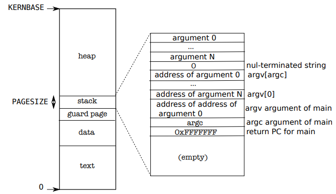

[Комментарии к исходному коду](https://pdos.csail.mit.edu/6.828/2018/xv6/book-rev11.pdf)
[Еще комментарии](https://github.com/YehudaShapira/xv6-explained/blob/master/Explanations.md)

[Исходный код](https://pdos.csail.mit.edu/6.828/2018/xv6/xv6-rev11.pdf)


# xv6

Важное замечание для начала: во всех ассемблерах UNIX, включая используемый здесь, команда mov имеет следующий синтаксис: `MOV src dest`.

То есть `mov $a $b` означает, что значение регистра a будет присвоено регистру b.

## Основные понятия

### Процесс

Память любого процесса состоит из 3 частей: инструкции, данные, стек.

### fork

Создает новый процесс (child process), содержимое памяти которого идентично содержимому памяти вызывающего процесса (parent process). Но это не одна и та же память, это копия. Так как память у процессов одинаковая, значит одинаковые и инструкции, значит в обоих процессах выполнение продолжается со следующей инструкции. Только в child process функция fork возвращает 0, а в родительском - pid созданного процесса.

```c
int pid = fork();
if(pid > 0){
	printf("parent: child=%d\n", pid);
	pid = wait();
	printf("child %d is done\n", pid);
} else if(pid == 0){
	printf("child: exiting\n");
	exit();
} else {
	printf("fork error\n");
}
```

`exit` - запускает процедуру выхода из процесса и освобождает ресурсы (память, открытые файлы)

`wait` - ожидает завершения дочернего процесса и возвращает его pid.

В приведенном примере на экран будет выдано:

```
parent: child=1234
child: exiting
child 1234 is done
```

### exec

Принимает в качестве аргумента путь к исполняемому файлу и заменяет память вызывающего процесса на память, загруженную из этого файла. Файл должен быть в специальном формате (ELF), в котором указано начало секции инструкций, начало секции данных, с какой инструкции начать выполнение и т.д. Если вызов exec совершен удачно, то выполнение продолжится с той инструкции, которая указана первой к исполнению в загруженном файле.

Пример:

```c
char *argv[3];
argv[0] = "echo";
argv[1] = "hello";
argv[2] = 0;
exec("/bin/echo", argv);
printf("exec error\n");
```

Здесь исполняемая программа заменяется программой `/bin/echo`, которая получает в качестве списка аргументов `echo hello`.

### sh

Шелл использует `fork` и `exec` для исполнения программ. В общем структура выполнения выглядит так:

```c
int
main(void)
{
  static char buf[100];

  while(getcmd(buf, sizeof(buf)) >= 0){
    if(fork1() == 0)
      runcmd(parsecmd(buf));
    wait();
  }
  exit();
}

void
runcmd(struct cmd *cmd)
{
  struct execcmd *ecmd;

  switch(cmd->type){  
  	...
  case EXEC:
    ecmd = (struct execcmd*)cmd;
    exec(ecmd->argv[0], ecmd->argv);
    printf(2, "exec %s failed\n", ecmd->argv[0]);
    break;
    ...
  }
  exit();
}

```

- `main` - делает дочерний процесс, в нем парсит команду, подает на выполнение
- `runcmd` - делает `exec`, заменяя текущий процесс (тот, который был создан форком в `main`) на исполняемый файл, указанный в команде

После завершения дочернего процесса исполнение продолжается на инструкции, следующей за `wait()`.

### Дескрипторы файлов

У каждого процесса свой набор дескрипторов файлов, начинающийся с 0. По соглашению, 0 - дескриптор стандартного ввода/stdin, 1 - стандартного вывода/stdout, 2 - дескриптор канала ошибок/stderr.

При открытии файла он всегда получает наименьший из неиспользуемых в текущем процессе дексрипторов.

Вот так, например, выглядит `cat`:

```c
char buf[512];

void
cat(int fd)
{
  int n;

  while((n = read(fd, buf, sizeof(buf))) > 0) { // читаем из указанного дескриптора
    if (write(1, buf, n) != n) {  // пишем в 1, то есть stdout
      printf(1, "cat: write error\n");
      exit();
    }
  }

  // error handling
  if(n < 0){
    printf(1, "cat: read error\n");
    exit();
  }
}

int
main(int argc, char *argv[])
{
  int fd, i;

  if(argc <= 1){ // если аргументов не указано, то читаем из 0, то есть stdin
    cat(0);
    exit();
  }

  for(i = 1; i < argc; i++){ // если аргументы есть, то открываем файлы по этим путям и читаем из дескрипторов этих файлов
    if((fd = open(argv[i], 0)) < 0){
      printf(1, "cat: cannot open %s\n", argv[i]);
      exit();
    }
    cat(fd);
    close(fd);
  }
  exit();
}
```

#### Перенаправление I/O

`exec` заменяет содержимое памяти вызывающего процесса, но при этом **оставляет неизменной его таблицу дескрипторов**. Это позволяет реализовать перенаправление I/O. Вот, что происходит при вызове `cat < input.txt`:

```c
char *argv[2];
argv[0] = "cat";
argv[1] = 0;
if(fork() == 0) {
	close(0);
	open("input.txt", O_RDONLY);
	exec("cat", argv);
}
```

Здесь используется правило "При открытии файла он всегда получает наименьший из неиспользуемых в текущем процессе дексрипторов". Когда вызывается `close(0)`, дескриптор 0 (stdin) освобождается, а значит следующая инструкция `open` назначит открытому файлу `input.txt` дексриптор 0. Затем вызывается программа `cat`, которая при вызове без аргументов читает содержимое из дескриптора 0.

В коде шелла этот кусок выглядит так:

```c
void
runcmd(struct cmd *cmd)
{
  struct redircmd *rcmd;

    switch(cmd->type){
  ...

  case REDIR:
    rcmd = (struct redircmd*)cmd;
    close(rcmd->fd);
    if(open(rcmd->file, rcmd->mode) < 0){
      printf(2, "open %s failed\n", rcmd->file);
      exit();
    }
    runcmd(rcmd->cmd);
    break;
	...
  }
  exit();
}

...

struct cmd*
parseredirs(struct cmd *cmd, char **ps, char *es)
{
  int tok;
  char *q, *eq;

  while(peek(ps, es, "<>")){
    tok = gettoken(ps, es, 0, 0);
    switch(tok){
    case '<':
      cmd = redircmd(cmd, q, eq, O_RDONLY, 0);
      break;
    case '>':
      cmd = redircmd(cmd, q, eq, O_WRONLY|O_CREATE, 1);
      break;
    case '+':  // >>
      cmd = redircmd(cmd, q, eq, O_WRONLY|O_CREATE, 1);
      break;
    }
  }
  return cmd;
}
```

`rcmd` при парсинге получит `fd`, равный 0, при использовании `<` и равный 1 при использовании `>`. В ветке `REDIR` мы закрыли дексриптор, на который будем перенаправлять ввод или вывод, открыли нужный файл и вызвали `runcmd`, внутри которого будет использован `exec`.

#### Использование дескрипторов в fork

При форке таблица дескрипторов копируется, а сдвиги - шарятся между процессами. То есть следующий пример:

```c
if(fork() == 0) {
	write(1, "hello ", 6);
	exit();
} else {
	wait();
	write(1, "world\n", 6);
}
```

Выведет на экран `hello world`. 

Благодаря этому мы можем писать: `(echo hello; echo world)>output.txt`. (хотя пока непонятно, почему тут должен вызываться fork, а не exec).

#### dup

Копирует дескриптор, после чего оба дескриптора шарят сдвиг.

То есть:

```c
fd = dup(1);
write(1, "hello ", 6);
write(fd, "world\n", 6);
```

тоже выведет `hello world`.

Таким образом, два дексриптора файла шарят между собой сдвиг только в том случае, если они были получены из одного и того же дескриптора вызовами `fork` и `dup`. Во всех остальных случаях сдвиги не шарятся.

`dup` позволяет писать такие команды:

```shell
ls existing-file non-existing-file > tmp1 2>&1
```

Здесь `2>&1` как раз копирует дексриптор 1 в дескриптор 2, чтобы все ошибки выводились в stdout.

### pipes

Вызов `pipe` принимает массив из двух элементов и записывает в него 2 дексриптора: первый - для чтения и второй - для записи. Все, что будет записано в дексриптор для записи, можно будет прочитать из дескриптора для чтения.

Пример использования `pipe`:

```c
int p[2];
char *argv[2];
argv[0] = "wc";
argv[1] = 0;

pipe(p);
if(fork() == 0) {
	close(0);
	dup(p[0]);
	close(p[0]);
	close(p[1]);
	exec("/bin/wc", argv);
} else {
	close(p[0]);
	write(p[1], "hello world\n", 12);
	close(p[1]);
}
```

Здесь дочерний процесс закрывает `stdin`, дублирует дескриптор чтения из пайпа в дескриптор 0, закрывает дескриптор чтения и записи и запускает `wc`, который будет принимать ввод от дескриптора 0, то есть будет читать из пайпа.

Родительский процесс пишет в дескриптор записи и закрывает оба дескриптора пайпа.

Приблизительно так же выглядит и ветка `PIPE` в `runcmd`, только она создает 2 дочерних процесса:

```c
void
runcmd(struct cmd *cmd)
{
   struct pipecmd *pcmd;
 
  switch(cmd->type){
 	...
  case PIPE:
    pcmd = (struct pipecmd*)cmd;
    if(pipe(p) < 0)
      panic("pipe");
    if(fork1() == 0){
      close(1);
      dup(p[1]);
      close(p[0]);
      close(p[1]);
      runcmd(pcmd->left);
    }
    if(fork1() == 0){
      close(0);
      dup(p[0]);
      close(p[0]);
      close(p[1]);
      runcmd(pcmd->right);
    }
    close(p[0]);
    close(p[1]);
    wait();
    wait();
    break;
    ...
  }
  exit();
}
```

В шелле пайпы используются при выполнении команд вида `grep fork sh.c | wc -l`.

Преимущества пайпов перед временными файлами:

- автоматическое очищение
- можно передавать очень длинные потоки данных, не беспокоясь, что на диске кончится место
- возможно параллельное выполнение левой и правой команды
- для межпроцессного общения блокирующая модель записи и чтения пайпов удобнее, чем неблокирующая модель файлов

### Файловая система

`fstat` - возвращает информацию о файле, на который указывает дескрриптор

У файла может быть несколько имен, или "линков". Сам файл называется `inode`. Линки создаются командой `link`, например:

```c
open("a", O_CREATE|O_WRONLY);
link("a", "b");
```

После этого `a` и `b` ссылаются на один и тот же `inode` и запись/чтение в `a` равносильно записи/чтению в `b`.

Каждый айнод идентифицируется своим `inode number`. Его можно получить вызовом `fstat`.

Линки удаляются командой `unlink`. Айнод и место на диске очищаются только когда количество линков уменьшится до 0 и не останется дескрипторов, ссылающихся на него.

## Организация операционной системы

### Загрузчик

Загрузчик состоит из 2 частей: `bootasm.s`, написанный на ассемблере и `bootmain.c`, написанный на С.

Когда компьютер стартует, он выполняет программу BIOS, которая записана в энергонезависимой памяти материнской платы. BIOS подготавливает аппаратное обеспечение к работе и передает управление коду, записанному в загрузочный сектор, т.е. первый 512-байтовый сектор загрузочного диска. В этом секторе содержится загрузчик: инструкции по загрузке ядра в память. BIOS загружает содержимое загрузочного сектора в адрес `0x7c00` и переходит на этот адрес. Начинается исполнение файла `bootasm.s`.

Первая инструкция загрузчика - `cli`, которая отключает прерывания. BIOS возможно установил какие-то свои обработчики прерываний, чтобы инициализировать устройства, но мы уже покинули BIOS, поэтому они нам больше не нужны. Когда операционная система загрузится, она включит прерывания обратно.

Затем загрузчик должен перевести процессор из реального режима работы в защищенный.

После этого загрузчик переходит в `bootmain.c`.

Задача `bootmain.c` - загрузить и запустить ядро. Ядро должно быть в формате ELF. `bootmain` загружает первые 4096 байт из бинарника ELF и кладет их копию по адресу `0x10000`. Затем он проверяет, что это действительно ELF путем проверки магического числа в заголовке файла. Затем он проходит по всем сегментам файла, загружает их в память и переходит в точку входа в ядро, а именно `0x10000c`.

### Старт ядра

Когда загрузчик передает управления в ядро, первая выполняемая инструкция - это `entry:` в файле `entry.s`. Первое, что делает ядро - это настраивает аппаратный пэйджинг. Добавляется маппинг виртуальных адресов, начинающихся с `0x80000000` на физические, начинающиеся с `0x0`:

```asm
  movl    $(V2P_WO(entrypgdir)), %eax
  movl    %eax, %cr3
```

`V2P_WO`(virtual to physical) - это макрос, который отнимает от "высокого" адреса `entrypgdir` константу `0x80000000`. Это нужно, потому что у нас еще не работает маппинг виртуальных адресов, но ядро слинковано с их использованием.

Таблица страниц entrypgdir описана в main.c:

```c
__attribute__((__aligned__(PGSIZE)))
pde_t entrypgdir[NPDENTRIES] = {
  // Map VA's [0, 4MB) to PA's [0, 4MB)
  [0] = (0) | PTE_P | PTE_W | PTE_PS,
  // Map VA's [KERNBASE, KERNBASE+4MB) to PA's [0, 4MB)
  [KERNBASE>>PDXSHIFT] = (0) | PTE_P | PTE_W | PTE_PS,
};
```

Затем ядро включает аппаратный пейджинг:

```
  orl     $(CR0_PG|CR0_WP), %eax
  movl    %eax, %cr0
```

Ну и наконец мы переходим в `main.c`:

```asm
  # Set up the stack pointer.
  movl $(stack + KSTACKSIZE), %esp

  # Jump to main(), and switch to executing at
  # high addresses. The indirect call is needed because
  # the assembler produces a PC-relative instruction
  # for a direct jump.
  mov $main, %eax
  jmp *%eax
```

### Создание первого процесса

Процесс описывается следующей структурой:

```c
// Per-process state
struct proc {
  uint sz;                     // Size of process memory (bytes)
  pde_t* pgdir;                // Page table
  char *kstack;                // Bottom of kernel stack for this process
  enum procstate state;        // Process state
  int pid;                     // Process ID
  struct proc *parent;         // Parent process
  struct trapframe *tf;        // Trap frame for current syscall
  struct context *context;     // swtch() here to run process
  void *chan;                  // If non-zero, sleeping on chan
  int killed;                  // If non-zero, have been killed
  struct file *ofile[NOFILE];  // Open files
  struct inode *cwd;           // Current directory
  char name[16];               // Process name (debugging)
};

struct context {
  uint edi;
  uint esi;
  uint ebx;
  uint ebp;
  uint eip;
};
```

`main` инициализирует кучу устройств и подсистем:

```c
// Bootstrap processor starts running C code here.
// Allocate a real stack and switch to it, first
// doing some setup required for memory allocator to work.
int
main(void)
{
  kinit1(end, P2V(4*1024*1024)); // phys page allocator
  kvmalloc();      // kernel page table
  mpinit();        // detect other processors
  lapicinit();     // interrupt controller
  seginit();       // segment descriptors
  picinit();       // disable pic
  ioapicinit();    // another interrupt controller
  consoleinit();   // console hardware
  uartinit();      // serial port
  pinit();         // process table
  tvinit();        // trap vectors
  binit();         // buffer cache
  fileinit();      // file table
  ideinit();       // disk 
  startothers();   // start other processors
  kinit2(P2V(4*1024*1024), P2V(PHYSTOP)); // must come after startothers()
  userinit();      // first user process
  mpmain();        // finish this processor's setup
}
```

Первый процесс создается вызовом `userinit()`, который вызывает `allocproc()`. Задача `allocproc()` - аллоцировать структуру типа `proc` в системной таблице процессов и инициализировать части состояния процесса, чтобы он мог запуститься. `allocproc()` запускается для каждого нового процесса, а `userinit()` - только для первого.

```c
// Look in the process table for an UNUSED proc.
// If found, change state to EMBRYO and initialize
// state required to run in the kernel.
// Otherwise return 0.
static struct proc*
allocproc(void)
{
  struct proc *p;
  char *sp;

  acquire(&ptable.lock);

  for(p = ptable.proc; p < &ptable.proc[NPROC]; p++)
    if(p->state == UNUSED)
      goto found;

  release(&ptable.lock);
  return 0;

found:
  p->state = EMBRYO;
  p->pid = nextpid++;

  release(&ptable.lock);

  // Allocate kernel stack.
  if((p->kstack = kalloc()) == 0){
    p->state = UNUSED;
    return 0;
  }
  sp = p->kstack + KSTACKSIZE;

  // Leave room for trap frame.
  sp -= sizeof *p->tf;
  p->tf = (struct trapframe*)sp;

  // Set up new context to start executing at forkret,
  // which returns to trapret.
  sp -= 4;
  *(uint*)sp = (uint)trapret;

  sp -= sizeof *p->context;
  p->context = (struct context*)sp;
  memset(p->context, 0, sizeof *p->context);
  p->context->eip = (uint)forkret;

  return p;
}
```

* регистр EIP в x86 означает Extended Instruction Pointer

Allocproc:

1. ищет в таблице процессов слот с состоянием UNUSED
2. когда находит, устанавливает ему состояние EMBRYO и дает процессу уникальный pid.
3. затем пытается выделить в памяти 4096 байт для ядерного стека процесса. Если не получается, то выставляет состояние обратно в UNUSED и возвращает 0.
4. если получилось, то поля структуры proc инициализируются адресами в стеке для trap frame, trapret, context. В результате полученный ядерный стек выглядит так:


После заполнения стэка в `p->context->eip` будет адрес функции `forkret`, а над контекстом, там, где обычно пишется адрес возврата - будет адрес функции `trapret`. Созданный поток начинает выполнение со значениями регистров, скопированными из `p->context`, поэтому при старте потока в регистре EIP будет адрес `forkret` и начнет выполняться она. После выполнения будет возврат из функции, а значит переход к инструкции, которая располагается сразу над `p->context`, то есть `trapret`. `trapret` восстанавливает значение регистров из значений, сохраненных наверху стэка и прыгает внутрь процесса.

Такая сложная конструкция нужна, потому что этот же код используется и для форков. А `trapret` нужен потому что переход из юзерспейса в ядро происходит через исключения, или, как они называются в x86, трэпы. При трэпе выстреливается прерывание, побирается соответствующий обработчик прерывания, а этот обработчик сохраняет в стэк все значения регистров и вызывает функцию`trap()`.

После создания процесса, ему указывается программа для выполнения, и в случае userinit это программа `initcode.s`. Но чтобы ее запустить, нужно выделить память, чтобы хранить в ней эту программу, скопировать туда программу, и создать таблицу страниц для этого процесса:

```c
void
userinit(void)
{
  struct proc *p;
  extern char _binary_initcode_start[], _binary_initcode_size[];

  p = allocproc();
  
  initproc = p;
  if((p->pgdir = setupkvm()) == 0)
    panic("userinit: out of memory?");
  inituvm(p->pgdir, _binary_initcode_start, (int)_binary_initcode_size);
  p->sz = PGSIZE;
  memset(p->tf, 0, sizeof(*p->tf));
  p->tf->cs = (SEG_UCODE << 3) | DPL_USER;
  p->tf->ds = (SEG_UDATA << 3) | DPL_USER;
  p->tf->es = p->tf->ds;
  p->tf->ss = p->tf->ds;
  p->tf->eflags = FL_IF;
  p->tf->esp = PGSIZE;
  p->tf->eip = 0;  // beginning of initcode.S

  safestrcpy(p->name, "initcode", sizeof(p->name));
  p->cwd = namei("/");

  // this assignment to p->state lets other cores
  // run this process. the acquire forces the above
  // writes to be visible, and the lock is also needed
  // because the assignment might not be atomic.
  acquire(&ptable.lock);

  p->state = RUNNABLE;

  release(&ptable.lock);
}
```

Процедура `setupkvm` создает таблицу страниц для нашего процесса. 

`inituvm` загружает по 0-му адресу выделенной процессу памяти содержимое скомпилированной процедуры `initcode`, константы `_binary_initcode_start` и `_binary_initcode_size` прописываются в процессе билда ядра и обозначают начало и размер эмбеженной в ядро функции `initcode`.

Затем `userinit` заполняет трэпфрейм, записывая в регистры сегментов селектор сегмента `SEG_UCODE` и `SEG_UDATA` с уровнем привилегий `DPL_USER`, не позволяющим работать в режиме ядра. Указатель стека %esp выставляется в самый большой виртуальный адрес, доступный процессу, а указатель инструкций выставляется в самый маленький, то есть 0. `p->name` выставляется в основном для отладки, `p->cwd` выставляет рабочую папку. 

Когда заполнили все поля процесса, он ставится в очередь на выполнение путем установки поля `state` в `RUNNABLE`.

### Запуск первого процесса

Итак, первый процесс готов к запуску, а мы выходим из `userinit` обратно в `main` и следующая строчка вызывает `mpmain()`, который вызывает `scheduler()`.

`scheduler()` находится в `proc.c`, вот его код:

```c
void
scheduler(void)
{
  struct proc *p;
  struct cpu *c = mycpu();
  c->proc = 0;
  
  for(;;){
    // Enable interrupts on this processor.
    sti();

    // Loop over process table looking for process to run.
    acquire(&ptable.lock);
    for(p = ptable.proc; p < &ptable.proc[NPROC]; p++){
      if(p->state != RUNNABLE)
        continue;

      // Switch to chosen process.  It is the process's job
      // to release ptable.lock and then reacquire it
      // before jumping back to us.
      c->proc = p;
      switchuvm(p);
      p->state = RUNNING;

      swtch(&(c->scheduler), p->context);
      switchkvm();

      // Process is done running for now.
      // It should have changed its p->state before coming back.
      c->proc = 0;
    }
    release(&ptable.lock);

  }
}
```

Шедулер проходит по всем процессам в `ptable` и ищет первый, у которого state равен `RUNNABLE`. Когда такой процесс найден, он записывается в переменную `proc` для процессора текущего треда, после чего вызывается `switchuvm(p)`, которая дает железу команду начать использовать таблицу страниц этого процесса (kvm означает kernel virtual memory, uvm означает user virtual memory).

Затем шедулер устанавливает state в RUNNING и вызывает `swtch`, чтобы переключиться на выбранный поток.

После переключения, поток начинает выполнять `forkret`, потому что `allocproc` записал ее адрес в `p->context->eip`. `forkret` что-то там инициализирует и возвращается. Затем, по заветам `allocproc`, выполняется `trapret`. Он восстанавливает регистры `gs`, `fs`, `es` и `ds` из стека (`swtch` делает то же самое, но для общих регистров). В данном случае они туда попали в процедуре `allocproc`, который пытался новому потоку создать такой стек, как будто он был создан ранее и мы на него переключились в процессе нормального context switch. В обычных ситуациях происходит настоящий context switch и эти регистры в стек попадают в процедуре `alltraps` (см. ниже).

```asm
  # Return falls through to trapret...
.globl trapret
trapret:
  popal
  popl %gs
  popl %fs
  popl %es
  popl %ds
  addl $0x8, %esp  # trapno and errcode
  iret
```

Инструкция `iret` извлекает регистры `cs`, `eip`, `flags`, `esp` и `ss`. Следующей выполняется инструкция, адрес которой записан в `$eip`. В случае `initproc` это адрес 0, а `$esp` получает адрес 4096 (верх страницы, чтобы стек мог расти вниз). Это уже виртуальные адреса.

### Первый системный вызов: exec

Первое, что делает `initcode.S` - это вызывает `exec`:

```asm
# exec(init, argv)
.globl start
start:
  pushl $argv
  pushl $init
  pushl $0  // where caller pc would be
  movl $SYS_exec, %eax
  int $T_SYSCALL

# char init[] = "/init\0";
init:
  .string "/init\0"

# char *argv[] = { init, 0 };
.p2align 2
argv:
  .long init
  .long 0
```

Ну точнее она сначала кладет в стек аргументы командной строки (`$argv` = [init, 0]), адрес вызываемой программы (`$init` = "/init"), адрес возврата (0), а потом кладет в `$eax` номер системного вызова `exec` и выполняет инструкцию `int $T_SYSCALL` - это просьба выстрелить прерывание с номером, соответствующим системному вызову. Если все пройдет хорошо, то в результате в этом же процессе будет вызвана программа `/init`, заменив память процесса памятью этой программы.

`/init` создаст дескриптор консоли, откроет дескрипторы 0, 1, 2, запустит шелл и будет в цикле принимать команды.


## Context switch

Переключение контекста состоит из 3 шагов:

1. Активация прерывания по таймеру
2. Вызов шедулера
3. Переключение контекста

Рассмотрим шаги по отдельности:

### Активация прерывания по таймеру

При билде скрипт `vectors.pl` генерирует обработчики для 256 прерываний, каждый из обработчиков выглядит приблизительно так:

```asm
vector 32:
  pushl $0 //error code
  pushl $32 //vector number of timer interrupt
  jmp alltraps
```

Здесь мы видим обработчик прерывания с номером 32. Он пишет в стек 0 и 32 в качестве аргументов вызова и вызывает процедуру `alltraps`.

Эта процедура описана в файле `trapasm.S`, вот ее код:

```asm
.globl alltraps
alltraps:
  # Build trap frame.
  pushl %ds #data segment register
  pushl %es #extra segment register
  pushl %fs #general segment register
  pushl %gs #general segment register
  pushal	#all local registers (push EAX,EBX,ECX,EDX,ESP,EBP,ESI,EDI)
  
  # Set up data segments.
  movw $(SEG_KDATA<<3), %ax
  movw %ax, %ds
  movw %ax, %es

  # Call trap(tf), where tf=%esp
  pushl %esp
  call trap
  addl $4, %esp

  # Return falls through to trapret...
.globl trapret
trapret:
  popal
  popl %gs
  popl %fs
  popl %es
  popl %ds
  addl $0x8, %esp  # trapno and errcode
  iret

```

Итак, процедура `alltraps` сохранила на стеке значение регистров. Регистр esp мы не трогали, но каждый пуш уменьшает его значение, поэтому сейчас он указывает на низ фрейма. а над ним - сохраненные нами регистры и сегменты. Передавая значение регистра esp внутрь процедуры `trap`, мы, таким образом, передаем внутрь ее структуру `tf` типа `trapframe`. Вот код структуры:

```c
struct trapframe {
  // registers as pushed by pusha
  uint edi;
  uint esi;
  uint ebp;
  uint oesp;      // useless & ignored
  uint ebx;
  uint edx;
  uint ecx;
  uint eax;

  // rest of trap frame
  ushort gs;
  ushort padding1;
  ushort fs;
  ushort padding2;
  ushort es;
  ushort padding3;
  ushort ds;
  ushort padding4;
  uint trapno;

  // below here defined by x86 hardware
  uint err;
  uint eip;
  ushort cs;
  ushort padding5;
  uint eflags;

  // below here only when crossing rings, such as from user to kernel
  uint esp;
  ushort ss;
  ushort padding6;
};
```

В процедуре `alltraps` у этой структуры мы заполняем только верхние поля от `edi` до `padding4`. Поля `trapno` и `err` были ранее заполнены обработчиком прерывания `vector 32`. Оставшиеся поля составляют kernel stack и записываются аппаратным обеспечением.

Итак, перед вызовом `trap` стэк имеет следующий вид:

```
err
trapno
padding4
ds
padding3
es
padding2
fs
padding1
gs
eax
ecx
edx
ebx
oesp
ebp
esi
edi <--- $esp
```

Переход в `alltraps` осуществлялся командой `JMP`, поэтому адрес возврата нигде не записан (для вызова процедуры с возможностью возврата используется `CALL`, который автоматически пишет адрес следующей инструкции в стэк. Вызовы функций изнутри C всегда осуществляются через `CALL`, поэтому стэк трапфрейма составляется на ассемблере).

Далее, в `trap.c (109)` видим, что произошло прерывание по таймеру и вызываем процедуру `yield()` для запуска шедурера:

```c
if(myproc() && myproc()->state == RUNNING &&
   tf->trapno == T_IRQ0+IRQ_TIMER)
yield();
```

### Вызов шедулера

Посмотрим, что делает `yield()`:

```c
// Give up the CPU for one scheduling round.
void
yield(void)
{
  acquire(&ptable.lock);
  proc->state = RUNNABLE;
  sched();
  release(&ptable.lock);
}
```

Здесь ничего особенного, смотрим что там в `sched()`:

```c
// Enter scheduler.  Must hold only ptable.lock
// and have changed proc->state.
void
sched(void)
{
  int intena;

  // If we aren't holding the ptable lock, panic
  if(!holding(&ptable.lock))
    panic("sched ptable.lock");

  // If we aren't 1 pushcli level deep, panic
  if(cpu->ncli != 1)
    panic("sched locks");

  // If the current process is in the running state, panic
  if(proc->state == RUNNING)
    panic("sched running");

  // If the processor can be interrupted, panic
  if(readeflags()&FL_IF)
    panic("sched interruptible");

  intena = cpu->intena;
  swtch(&proc->context, cpu->scheduler);
  cpu->intena = intena;
}
```

Здесь у нас в основном проверки, что мы действительно можем сделать переключение контекста и сохранение поля `intena` (interruptions enabled), неизвестно зачем.

В конце вызывается непосредственно процедура переключения контекста, в которую передается контекст текущего процесса и контекст щедулера, то есть контекст, на который мы будем переключаться (предполагаю, что где-то в другом месте шедулер выбирает процесс, на который переключаемся и подставляет его контекст).

### Переключение контекста

Вот код `swtch.S`:

```asm
# Context switch
#
#   void swtch(struct context **old, struct context *new);
#
# Save current register context in old
# and then load register context from new.

.globl swtch
swtch:
  movl 4(%esp), %eax
  movl 8(%esp), %edx # сохраняем *new в %edx, **old в %eax

  # Save old callee-save registers
  pushl %ebp
  pushl %ebx
  pushl %esi
  pushl %edi

  # Switch stacks
  movl %esp, (%eax)
  movl %edx, %esp   # пишем значение %edx, то есть *new в %esp

  # Load new callee-save registers
  popl %edi
  popl %esi
  popl %ebx
  popl %ebp
  ret
```

Здесь общий смысл такой:

1. мы сохраняем значение регистров на стеке
2. перемещаем указатель стека `esp` на тот, который указан в новом контексте
3. теперь мы работаем со стеком нового контекста, в котором запушены его значения регистров. Нам осталось только сделать `pop` для всех регистров и продолжить выполнение.


## Организация страничной памяти

Каждому процессу доступны 4 ГБ виртуальной памяти, из которых верхние 2 ГБ всегда занимает адресное пространство ядра, а нижние 2 выделены под нужды процесса. Начало области виртуального адресного пространства ядра обозначается константой `KERNBASE`.

### Создание адресного пространства ядра

Процедура `main` вызывает `kvmalloc`, который создает и переключается на страницу памяти, описывающую маппинги страниц выше `KERNBASE`, необходимых для работы ядра:

```c
// Allocate one page table for the machine for the kernel address
// space for scheduler processes.
void
kvmalloc(void)
{
  kpgdir = setupkvm();
  switchkvm();
}
```

Основная работа происходит в `setupkvm`:

```c
// Set up kernel part of a page table.
pde_t*
setupkvm(void)
{
  pde_t *pgdir;
  struct kmap *k;

  if((pgdir = (pde_t*)kalloc()) == 0)
    return 0;
  memset(pgdir, 0, PGSIZE);
  if (P2V(PHYSTOP) > (void*)DEVSPACE)
    panic("PHYSTOP too high");
  for(k = kmap; k < &kmap[NELEM(kmap)]; k++)
    if(mappages(pgdir, k->virt, k->phys_end - k->phys_start,
                (uint)k->phys_start, k->perm) < 0) {
      freevm(pgdir);
      return 0;
    }
  return pgdir;
}

```

Сначала `kalloc` находит и выделяет 1 физическую страницу памяти для ядра:

```c
// Allocate one 4096-byte page of physical memory.
// Returns a pointer that the kernel can use.
// Returns 0 if the memory cannot be allocated.
char*
kalloc(void)
{
  struct run *r;

  if(kmem.use_lock)
    acquire(&kmem.lock);
  r = kmem.freelist;
  if(r)
    kmem.freelist = r->next;
  if(kmem.use_lock)
    release(&kmem.lock);
  return (char*)r;
}
```

Как видим, `kalloc` выделяет страницы по очереди, начиная с первой.

Затем `setupkvm` зануляет полученную страницу: `memset(pgdir, 0, PGSIZE);`.

Затем проходит по перенаправлениям, описанным в массиве `kmap`:

```c
static struct kmap {
  void *virt;
  uint phys_start;
  uint phys_end;
  int perm;
} kmap[] = {
 { (void*)KERNBASE, 0,             EXTMEM,    PTE_W}, // I/O space
 { (void*)KERNLINK, V2P(KERNLINK), V2P(data), 0},     // kern text+rodata
 { (void*)data,     V2P(data),     PHYSTOP,   PTE_W}, // kern data+memory
 { (void*)DEVSPACE, DEVSPACE,      0,         PTE_W}, // more devices
};
```

И для каждого перенаправления создает запись в странице таблиц памяти:

```c
for(k = kmap; k < &kmap[NELEM(kmap)]; k++)
    if(mappages(pgdir, k->virt, k->phys_end - k->phys_start,
                (uint)k->phys_start, k->perm) < 0) {
      freevm(pgdir);
      return 0;
    }
```

Вот как выглядит `mappages`:

```c
// Create PTEs for virtual addresses starting at va that refer to
// physical addresses starting at pa. va and size might not
// be page-aligned.
static int
mappages(pde_t *pgdir, void *va, uint size, uint pa, int perm)
{
  char *a, *last;
  pte_t *pte;

  a = (char*)PGROUNDDOWN((uint)va);
  last = (char*)PGROUNDDOWN(((uint)va) + size - 1);
  for(;;){
    if((pte = walkpgdir(pgdir, a, 1)) == 0)
      return -1;
    if(*pte & PTE_P)
      panic("remap");
    *pte = pa | perm | PTE_P;
    if(a == last)
      break;
    a += PGSIZE;
    pa += PGSIZE;
  }
  return 0;
}
```

Он проходит по каждой странице (`a` - текущий виртуальный адрес, `pa` - текущий физический, в каждой итерации к ним прибавляется `PGSIZE`, то есть размер страницы).

Процедура `walkpgdir` здесь ищет нужную запись в таблице страниц:

```c
// Return the address of the PTE in page table pgdir
// that corresponds to virtual address va.  If alloc!=0,
// create any required page table pages.
static pte_t *
walkpgdir(pde_t *pgdir, const void *va, int alloc)
{
  pde_t *pde;
  pte_t *pgtab;

  pde = &pgdir[PDX(va)];
  if(*pde & PTE_P){
    pgtab = (pte_t*)P2V(PTE_ADDR(*pde));
  } else {
    if(!alloc || (pgtab = (pte_t*)kalloc()) == 0)
      return 0;
    // Make sure all those PTE_P bits are zero.
    memset(pgtab, 0, PGSIZE);
    // The permissions here are overly generous, but they can
    // be further restricted by the permissions in the page table
    // entries, if necessary.
    *pde = V2P(pgtab) | PTE_P | PTE_W | PTE_U;
  }
  return &pgtab[PTX(va)];
}
```

Для адресации используется 2-уровневое дерево, первый уровень называется PD (page directory), в нем ищется запись по индексу, соотв-му первым 10 битам виртуального адреса. полученная запись называется PDE (page directory entry) и она обозначает адрес используемой в этом процессе таблицы страниц. Следующие 10 бит виртуального адреса обозначают индекс в таблице страниц процесса, по которому лежит PTE (page table entry). В каждом PTE записан PPN (physical page number) и несколько флагов, регулирующие доступ к этой физической странице. Для получения необходимой строки внутри страницы используются последние 12 бит виртуального адреса.

Сначала `walkpgdir` использует верхние 10 бит (макрос PDX) виртуального адреса `va`, чтобы получить PDE. Если PDE не найден, значит таблица страниц для этого процесса еще не инициализирована, и если параметр `alloc` выставлен, то мы выделяем для нее память через `kalloc`, зануляем память и сохраняем ее адрес в `pgdir`. Затем получаем в таблице страниц строчку по индексу, состоящему из вторых 10 бит адреса (макрос PTX) и возвращаем ссылку на нее.

Вернувшись в `mappages`, пишем текущий физический адрес в полученную `PTE`:

```c
*pte = pa | perm | PTE_P;
```

### Аллокация физической памяти для ядра

Аллокатор физической памяти использует **free list** (список освобождения), чтобы отслеживать страницы физической памяти, доступные для аллокации. Это связанный список страниц, в котором каждая аллокация памяти удаляет страницу, а каждое освобождение памяти - добавляет. Каждый элемент списка имеет тип `run`:

```c
struct run {
  struct run *next;
};
```

Каждая структура `run` хранится в начале свободной страницы памяти, потому что в ней все равно больше нечего хранить, она же свободная.

Доступ к free list защищается спинлоком:

```c
struct {
  struct spinlock lock;
  int use_lock;
  struct run *freelist;
} kmem;
```

Для инициализации аллокатора процедура `main` вызывает процедуры `kinit1` в начале и `kinit2` в конце. Это нужно потому что нам нужно аллоцировать немножко памяти, чтобы мы могли поднять все остальное (в том числе таблицу страниц), а уже после этого мы можем использовать нормальный стандартный большой аллокатор. Поэтому `kinit1` инициализирует аллокатор на 4 МБ, не использующий локов, а `kinit2` инициализирует полномощный аллокатор:

```c
int
main(void)
{
  kinit1(end, P2V(4*1024*1024)); // phys page allocator
  ...
  kinit2(P2V(4*1024*1024), P2V(PHYSTOP)); // must come after startothers()
  ...  
}

// Initialization happens in two phases.
// 1. main() calls kinit1() while still using entrypgdir to place just
// the pages mapped by entrypgdir on free list.
// 2. main() calls kinit2() with the rest of the physical pages
// after installing a full page table that maps them on all cores.
void
kinit1(void *vstart, void *vend)
{
  initlock(&kmem.lock, "kmem");
  kmem.use_lock = 0;
  freerange(vstart, vend);
}

void
kinit2(void *vstart, void *vend)
{
  freerange(vstart, vend);
  kmem.use_lock = 1;
}
```

`freerange` заносит страницы из указанного ренджа по одной во free list и выставляет каждый байт в них в 1, это нужно чтобы код, который попытается прочесть эту память после ее освобождения, не наткнулся на старые данные и выдал ошибку как можно быстрее.

## Пользовательское пространство

На схеме изображено содержимое памяти для процесса:



Каждый пользовательский процесс стартует с адреса 0. Внизу пространства располагаются текст программы, ее данные и стек. Здесь **важное различие** относительно схемы памяти в илнуксе.

В xv6 стек располагается под кучей. **В линуксе - стек наверху и растет вниз, куча внизу и растет вверх**.

Стек занимает одну страницу и на схеме показан с содержимым после вызова `exec`. Сначала идут аргументы командной строки `argv`, представляющие ссылки на строки, затем аргумент `args` и адрес возврата. Чтобы стек не смог вырасти больше одной страницы, под ним располагается **guard page**. Эта страница не замаплена, поэтому когда стек попытается ее аллоцировать, будет сгенерировано исключение. Реальные ОС позволяют выделить больше пространства для стека, и он располагается на нескольких страницах.

`sbrk` - это системный вызов для увеличения или уменьшения памяти процесса. Реализуется функцией `growproc`. Если аргумент положительный, то аллоцируется 1 или несколько страниц и мапятся наверх пользовательского пространства. Если отрицательный - размапливаются 1 или несколько страниц пользовательского пространства и освобождаются соответствующие им физические страницы.

```c
// Grow current process's memory by n bytes.
// Return 0 on success, -1 on failure.
int
growproc(int n)
{
  uint sz;
  struct proc *curproc = myproc();

  sz = curproc->sz;
  if(n > 0){
    if((sz = allocuvm(curproc->pgdir, sz, sz + n)) == 0)
      return -1;
  } else if(n < 0){
    if((sz = deallocuvm(curproc->pgdir, sz, sz + n)) == 0)
      return -1;
  }
  curproc->sz = sz;
  switchuvm(curproc);
  return 0;
}
```

Для выделения области памяти в пользовательском пространстве используется `allocuvm`:

```c
// Allocate page tables and physical memory to grow process from oldsz to
// newsz, which need not be page aligned.  Returns new size or 0 on error.
int
allocuvm(pde_t *pgdir, uint oldsz, uint newsz)
{
  char *mem;
  uint a;

  if(newsz >= KERNBASE)
    return 0;
  if(newsz < oldsz)
    return oldsz;

  a = PGROUNDUP(oldsz);
  for(; a < newsz; a += PGSIZE){
    mem = kalloc();
    if(mem == 0){
      cprintf("allocuvm out of memory\n");
      deallocuvm(pgdir, newsz, oldsz);
      return 0;
    }
    memset(mem, 0, PGSIZE);
    if(mappages(pgdir, (char*)a, PGSIZE, V2P(mem), PTE_W|PTE_U) < 0){
      cprintf("allocuvm out of memory (2)\n");
      deallocuvm(pgdir, newsz, oldsz);
      kfree(mem);
      return 0;
    }
  }
  return newsz;
}
```

Как видим, она проходит по одной странице от нижней до верхней границы ренджа, выделяет им виртуальную память, зануляет ее и пишет маппинг в таблицу страниц.

Похожим образом работает и деаалоцирование пользовательской памяти:

```c
// Deallocate user pages to bring the process size from oldsz to
// newsz.  oldsz and newsz need not be page-aligned, nor does newsz
// need to be less than oldsz.  oldsz can be larger than the actual
// process size.  Returns the new process size.
int
deallocuvm(pde_t *pgdir, uint oldsz, uint newsz)
{
  pte_t *pte;
  uint a, pa;

  if(newsz >= oldsz)
    return oldsz;

  a = PGROUNDUP(newsz);
  for(; a  < oldsz; a += PGSIZE){
    pte = walkpgdir(pgdir, (char*)a, 0);
    if(!pte)
      a = PGADDR(PDX(a) + 1, 0, 0) - PGSIZE;
    else if((*pte & PTE_P) != 0){
      pa = PTE_ADDR(*pte);
      if(pa == 0)
        panic("kfree");
      char *v = P2V(pa);
      kfree(v);
      *pte = 0;
    }
  }
  return newsz;
}
```

### exec

```c
int
exec(char *path, char **argv)
{
  # ------------------------------------------
  # сначала загружаем образ программы в память
  # ------------------------------------------

  ...
  if((ip = namei(path)) == 0){   # ищет и возвращает inode по адресу path
    end_op();
    cprintf("exec: fail\n");
    return -1;
  }
  ilock(ip);		# лочит полученный inode

  // Check ELF header
  if(readi(ip, (char*)&elf, 0, sizeof(elf)) != sizeof(elf))		# читает заголовок ELF-файла из inode в структуру &elf (которая имеет тип elfhdr)
    goto bad;
  if(elf.magic != ELF_MAGIC)									# проверяет, что это действительно ELF-файл
    goto bad;

  if((pgdir = setupkvm()) == 0)									# аллоцирует новую таблицу страниц для этого процесса
    goto bad;

  // Load program into memory.
  for(i=0, off=elf.phoff; i<elf.phnum; i++, off+=sizeof(ph)){	# проходим по всем program headers ELF-файла, в каждом из которых описано расположение какого-либо сегмента памяти
    if(readi(ip, (char*)&ph, off, sizeof(ph)) != sizeof(ph))	# читает с диска program header
      goto bad;
    if((sz = allocuvm(pgdir, sz, ph.vaddr + ph.memsz)) == 0)	# выделяем в виртуальной памяти кусок под сегмент
      goto bad;
    if(loaduvm(pgdir, (char*)ph.vaddr, ip, ph.off, ph.filesz) < 0)	# загружаем постранично сегмент в память
      goto bad;
  }
  iunlockput(ip); 		# разлочивает inode

  # --------------------------------------------
  # теперь будем создавать пользовательский стек
  # --------------------------------------------

  // Allocate two pages at the next page boundary.
  // Make the first inaccessible.  Use the second as the user stack.
  sz = PGROUNDUP(sz);
  if((sz = allocuvm(pgdir, sz, sz + 2*PGSIZE)) == 0) # аллоцируем 2 страницы над сегментами
    goto bad;
  clearpteu(pgdir, (char*)(sz - 2*PGSIZE));			 # первую страницу удаляем из таблицы страниц, это будет наша guard page
  sp = sz;

  // Push argument strings, prepare rest of stack in ustack.
  for(argc = 0; argv[argc]; argc++) {
    sp = (sp - (strlen(argv[argc]) + 1)) & ~3;
    if(copyout(pgdir, sp, argv[argc], strlen(argv[argc]) + 1) < 0)
      goto bad;
    ustack[3+argc] = sp;
  }
  ustack[3+argc] = 0;

  ustack[0] = 0xffffffff;  // fake return PC
  ustack[1] = argc;
  ustack[2] = sp - (argc+1)*4;  // argv pointer

  sp -= (3+argc+1) * 4;
  if(copyout(pgdir, sp, ustack, (3+argc+1)*4) < 0)		# записываем стек в память
    goto bad;

  # -----------------------------------
  # теперь переключаемся на новый имедж
  # -----------------------------------

  // Commit to the user image.
  oldpgdir = curproc->pgdir;
  curproc->pgdir = pgdir;	# устанавливаем процессу созданную нами таблицу страниц
  curproc->sz = sz;
  curproc->tf->eip = elf.entry;  # следующей выполняемой инструкцией будет точка входа в загруженный образ
  curproc->tf->esp = sp;		# устанавливаем указатель стека на созданный нами стек
  switchuvm(curproc);		# переключаемся на использование образа нового процесса
  freevm(oldpgdir);			# удаляем старую таблицу страниц
  return 0;
}
```

В результате всех этих манипуляций `exec` загружает сегменты программы по тем адресам, которые указаны в ELF-файле. Эти адреса вполне могут указывать на область памяти ядра, поэтому `exec` опасен. Внутри кода `exec` есть некоторые дополнительные проверки для этого, которые здесь были опущены.

В настоящих операционных системах есть еще пейджинг неиспользуемых страниц на диск, copy-on-write, разделяемая память, лениво-аллоцируемые страницы и автоматически расширяемые стеки. В xv6 этого всего нет.

## Трэпы/исключения, прерывания и драйвера

Управление от пользовательской программы в ядро передается в 3 случаях:

1. Системный вызов
2. Исключение (официальная терминология xv6 использует термин trap)
3. Прерывание (разделение времени среди процессов осуществляется по прерыванию таймера)

Все прерывания обрабатываются ядром, потому что обычно только у него есть необходимые привилегии.

Все 3 случая на самом деле реализуются через прерывания: для системного вызова генерируется прерывание инструкцией int, для исключений тоже.

При каждом переходе в ядро ОС сохраняет значения регистров, готовится к выполнению кода в ядре, выбирает точку входа в ядро, получает информация о произошедшем событии. Общий алгоритм работы при прерывании такой:

- прерывание приостанавливает нормальную работу процессора
- процессор сохраняет значения регистров, чтобы можно было потом к ним вернуться
- процессор запускает новую последовательность инструкций, называемую *обработчик прерываний*

### Защита X86

У процессоров x86 есть 4 уровня защиты, именуемые от 0 (самый привилегированный) до 3 (наименее привилегированный). На практике, большинство ОС используют только 0 и 3, которые называются *режим ядра* и  *пользовательский режим*, соответственно. Текущий уровень привилегий хранится в регистре `%cs`.

Обработчики прерываний определены в IDT (interrupt descriptor table). IDT содержит 256 строк, в каждой из которых есть `%cs` и `%eip` для обработки прерывания.

Для выполнения системного вызова на x86, программа выполняет инструкцию `int n`, где `n` - индекс обработчика в IDT. Инструкция `int n` делает следующее:

1. Получает n-ю запись из IDT
2. Берет CPL (current privilege level) из регистра %cs, проверяет, что CPL <= DPL, где DPL = descriptor privilege level, хранящийся в полученной из IDT строке. Благодаря этому пользовательские программы (CPL=3) не могут дергать обработчики уровня ядра (DPL=0).
3. Сохраняет значения `%esp` и `%ss` (stack segment) во внутренних регистрах CPU, но только если уровень привилегий нужного сегмента < CPL
4. Загружает `%ss` и `%esp` из дескриптора сегмента таска (?)
5. Пушит `%ss`, `%esp`, `%eflags`, `%cs`, `%eip`.
6. Очищает бит IF в `%eflags`, но только в случае прерывания
7. Выставляет `%cs` и `%eip` в значения, полученные из дескриптора.

### Реализация системного вызова

Выше я уже описывал, как заполняется файл `vectors.S`, но не было описано, как он используется. Так вот, при старте процедура `main()` вызывает `tvinit()`. Вот ее код:

```c
void
tvinit(void)
{
  int i;

  for(i = 0; i < 256; i++)
    SETGATE(idt[i], 0, SEG_KCODE<<3, vectors[i], 0);
  SETGATE(idt[T_SYSCALL], 1, SEG_KCODE<<3, vectors[T_SYSCALL], DPL_USER);

  initlock(&tickslock, "time");
}

// Set up a normal interrupt/trap gate descriptor.
// - istrap: 1 for a trap (= exception) gate, 0 for an interrupt gate.
//   interrupt gate clears FL_IF, trap gate leaves FL_IF alone
// - sel: Code segment selector for interrupt/trap handler
// - off: Offset in code segment for interrupt/trap handler
// - dpl: Descriptor Privilege Level -
//        the privilege level required for software to invoke
//        this interrupt/trap gate explicitly using an int instruction.
#define SETGATE(gate, istrap, sel, off, d)                \
{                                                         \
  (gate).off_15_0 = (uint)(off) & 0xffff;                \
  (gate).cs = (sel);                                      \
  (gate).args = 0;                                        \
  (gate).rsv1 = 0;                                        \
  (gate).type = (istrap) ? STS_TG32 : STS_IG32;           \
  (gate).s = 0;                                           \
  (gate).dpl = (d);                                       \
  (gate).p = 1;                                           \
  (gate).off_31_16 = (uint)(off) >> 16;                  \
}
```

Видим, что цикл проходит по всем элементам `vectors` и для каждого создает запись в массиве `idt`, потом отдельно добавляет запись, предназначенную для обработки системных вызовов под номером 64.

У обычных обработчиков вторым параметром передается 0, что делает их обработчиками прерываний, а у системного вызова - 1, что делает его исключением или трэпом. Так же ему выставляется `DPL = DPL_USER`, а обработчикам прерываний - `DPL = 0`. xv6 зарещает пользовательскому коду вызывать любые другие прерывания, кроме 64, если они попытаются, то получат `general protection exception`.

Первая часть обработки системного вызова описана в разделе **Context switch**. Для системного вызова там актуально все, что до вызова `trap(tf)`. Там в этой процедуре пошли по ветви, соответствующей прерыванию таймера. Здесь пойдем по ветке, соответствующей `T_SYSCALL`:

```c
void
trap(struct trapframe *tf)
{
  if(tf->trapno == T_SYSCALL){
    ...
    myproc()->tf = tf;
    syscall();
    ...
    return;
  }
  ...
}
```

Шлавное, что здесь происходит - вызывается `syscall()`. Посмотрим на него:

```c
void
syscall(void)
{
  int num;
  struct proc *curproc = myproc();

  num = curproc->tf->eax;
  if(num > 0 && num < NELEM(syscalls) && syscalls[num]) {
    curproc->tf->eax = syscalls[num]();
  } else {
    cprintf("%d %s: unknown sys call %d\n",
            curproc->pid, curproc->name, num);
    curproc->tf->eax = -1;
  }
}
```

Он сохраняет номер вызова из регистра `eax` в переменную `num`, получает по этому индексу функцию из массива `syscalls`, выполняет ее и кладет результат в регистр `eax`.

Массив `syscalls` выглядит так:

```c
static int (*syscalls[])(void) = {
[SYS_fork]    sys_fork,
[SYS_exit]    sys_exit,
[SYS_wait]    sys_wait,
[SYS_pipe]    sys_pipe,
[SYS_read]    sys_read,
[SYS_kill]    sys_kill,
[SYS_exec]    sys_exec,
[SYS_fstat]   sys_fstat,
[SYS_chdir]   sys_chdir,
[SYS_dup]     sys_dup,
[SYS_getpid]  sys_getpid,
[SYS_sbrk]    sys_sbrk,
[SYS_sleep]   sys_sleep,
[SYS_uptime]  sys_uptime,
[SYS_open]    sys_open,
[SYS_write]   sys_write,
[SYS_mknod]   sys_mknod,
[SYS_unlink]  sys_unlink,
[SYS_link]    sys_link,
[SYS_mkdir]   sys_mkdir,
[SYS_close]   sys_close,
};
```

Для получения своих аргументов системные функции используют функции `argint`, `argptr`, `argstr` и `argfd`. Они принимают первым аргументов `n` и возвращают n-й аргумент как число, указатель, строку или файловый дескриптор. n-й аргумент лежит по адресу `%esp+4+4*n` (адрес возврата лежит  %esp, а первый аргумент лежит в %esp+4).

Системные функции лежат в syspoc.c и sysfile.c и в основном являются оболочками - читают аргументы со стека, используя функции `arg*` и вызывают с этими аргументами реальные реализации.

### Реализация прерываний

Раньше у материнских плат был programmable interrupt controller (PIC), который занимался обслуживанием прерываний. Но потом появились системы с несколькими процессорами и пришлось каждому делать свой, интегрированный APIC (advanced PIC). Теперь для работы с прерываниями на уровне ОС используется 2 API: работающий с прерываниями системы I/O (ioapic.c) и работающий с локальными APIC, интегрированными в каждый процессор (lapic.c).

`ioapic.c` предоставляет функцию `ioapicenable`, которая позволяет различным устройствам ввода-вывода включать отдельные прерывания и указывать, на каком процессоре они должны быть обработаны:

```c
void
ioapicenable(int irq, int cpunum)
{
  // Mark interrupt edge-triggered, active high,
  // enabled, and routed to the given cpunum,
  // which happens to be that cpu's APIC ID.
  ioapicwrite(REG_TABLE+2*irq, T_IRQ0 + irq);
  ioapicwrite(REG_TABLE+2*irq+1, cpunum << 24);
}
```

Например, при старте консоль направляет прерывания клавиатуры на процессор 0:

```c
void
consoleinit(void)
{
  ...
  ioapicenable(IRQ_KBD, 0);
}
```

А прерывания от дисков отправляются на последний процессор:

```c
void
ideinit(void)
{
  ...
  ioapicenable(IRQ_IDE, ncpu - 1);
  ...
}
```

`lapic.c` инициализирует все свои прерывания сам, в `lapicinit`. Там же инициализируется и прерывание для таймера, которое потом обрабатывается в `trap.c`.

### Драйвера

Драйвера указывают устройствам, какие операции выполнять и какие прерывания генерировать, когда закончат, а так же реагируют на эти прерывания.

Рассмотрим реализацию драйвера диска.

Диск хранит данные как последовательность 512-байтных *блоков*, или *секторов*. Операционная система использует свои блоки, размер которых обычно кратен размеру сектора. В xv6 блок тоже 512 байт. В памяти блок представлен структурой `buf`:

```c
struct buf {
  int flags;			# B_VALID если данные прочитали, B_DIRTY если они изменились и нужно их записать
  uint dev;				# номер устройства
  uint blockno;			# номер сектора
  struct sleeplock lock;
  uint refcnt;
  struct buf *prev; // LRU cache list
  struct buf *next;
  struct buf *qnext; // disk queue
  uchar data[BSIZE];	# копия данных сектора в памяти
};
```

При загрузке ОС инициализирует драйвер диска вызовом `ideinit` из `main`:

```c
void
ideinit(void)
{
  int i;

  initlock(&idelock, "ide");
  ioapicenable(IRQ_IDE, ncpu - 1);	# включает прерывание диска
  idewait(0);						# ждет, пока диск будет готов к принятию команд

  // Check if disk 1 is present
  outb(0x1f6, 0xe0 | (1<<4));		# проверяет доступен ли еще один диск - диск 1. Для этого пишет в порт 0x1f6, чтобы выбрать этот диск
  for(i=0; i<1000; i++){			# затем в течение 1000 попыток пытается прочесть статус с порта 0x1f7. Если получается - считаем, что диск есть.
    if(inb(0x1f7) != 0){
      havedisk1 = 1;
      break;
    }
  }

  // Switch back to disk 0.
  outb(0x1f6, 0xe0 | (0<<4));		# выбираем обратно диск 0
}
```

`idewait` работает так: материнка выставляет статус диска в I/O порту `0x1f7`, а `idewait` в цикле читает этот статус и ждет, пока бит IDE_BSY не будет снят, а IDE_DRDY не выставлен:

(I/O порт - это такая отдельная память в процессоре, через которую он работает с устройствами ввода-вывода)

```c
// Wait for IDE disk to become ready.
static int
idewait(int checkerr)
{
  int r;

  while(((r = inb(0x1f7)) & (IDE_BSY|IDE_DRDY)) != IDE_DRDY)
    ;
  if(checkerr && (r & (IDE_DF|IDE_ERR)) != 0)
    return -1;
  return 0;
}
```

После `ideinit` диск никто не трогает, пока кэш буфера не решит, что пора выполнить `iderw`, который вызывает `idestart`, который в зависимости от флагов синхронизирует содержимое буфера с содержимым сектора:

```c
// Sync buf with disk.
// If B_DIRTY is set, write buf to disk, clear B_DIRTY, set B_VALID.
// Else if B_VALID is not set, read buf from disk, set B_VALID.
void
iderw(struct buf *b)
{
  struct buf **pp;

  if(!holdingsleep(&b->lock))
    panic("iderw: buf not locked");
  if((b->flags & (B_VALID|B_DIRTY)) == B_VALID)
    panic("iderw: nothing to do");
  if(b->dev != 0 && !havedisk1)
    panic("iderw: ide disk 1 not present");

  acquire(&idelock);  //DOC:acquire-lock

  // Append b to idequeue.
  b->qnext = 0;
  for(pp=&idequeue; *pp; pp=&(*pp)->qnext)  // записываем наш буфер в очередь запросов к диску. idequeue указывает на буфер, который сейчас читается или пишется на диск.
    ;
  *pp = b;

  // Start disk if necessary.
  if(idequeue == b)						// если подошла очередь нашего блока, то сразу его обрабатываем. Иначе - ему придется подождать, пока не сработают прерывания завершения операции для всех блоков перед ним.
    idestart(b);

  // Wait for request to finish.
  while((b->flags & (B_VALID|B_DIRTY)) != B_VALID){
    sleep(b, &idelock);
  }


  release(&idelock);
}

// Start the request for b.  Caller must hold idelock.
static void
idestart(struct buf *b)
{
  if(b == 0)
    panic("idestart");
  if(b->blockno >= FSSIZE)
    panic("incorrect blockno");
  int sector_per_block =  BSIZE/SECTOR_SIZE;
  int sector = b->blockno * sector_per_block;
  int read_cmd = (sector_per_block == 1) ? IDE_CMD_READ :  IDE_CMD_RDMUL;
  int write_cmd = (sector_per_block == 1) ? IDE_CMD_WRITE : IDE_CMD_WRMUL;

  if (sector_per_block > 7) panic("idestart");

  idewait(0);
  outb(0x3f6, 0);  // generate interrupt
  outb(0x1f2, sector_per_block);  // number of sectors
  outb(0x1f3, sector & 0xff);
  outb(0x1f4, (sector >> 8) & 0xff);
  outb(0x1f5, (sector >> 16) & 0xff);
  outb(0x1f6, 0xe0 | ((b->dev&1)<<4) | ((sector>>24)&0x0f));
  if(b->flags & B_DIRTY){
    outb(0x1f7, write_cmd);
    outsl(0x1f0, b->data, BSIZE/4);
  } else {
    outb(0x1f7, read_cmd);
  }
}
```

Делает он это тоже через порты ввода-вывода. Чтение/запись происходят асинхронно, то есть например при чтении мы даем команду и отправляется делать другие вещи, а обработчик прерываний ловит прерывание конца чтения и записывает в буфер данные. При записи мы сразу пишем данные в порт, а в обработчике прерывания только лишь продвигаем очередь к следующему блоку. Вот как это выглядит:

```c
void
trap(struct trapframe *tf)
{
  ...
  case T_IRQ0 + IRQ_IDE:
    ideintr();					# регистрируем вызов нашего обработчика
    lapiceoi();
    break;
  ...  
}

// Interrupt handler.
void
ideintr(void)
{
  struct buf *b;

  // First queued buffer is the active request.
  acquire(&idelock);

  if((b = idequeue) == 0){	# читаем текущий буфер в b
    release(&idelock);
    return;
  }
  idequeue = b->qnext;		# продвигаем очередь к следующему буферу

  // Read data if needed.
  if(!(b->flags & B_DIRTY) && idewait(1) >= 0)	# если флаг b не выставлен, значит у нас не запись, значит - чтение
    insl(0x1f0, b->data, BSIZE/4);				# подаем на ассемблер команду прочесть данные с порта ввода-вывода 0x1f0 в буфер b->data

  // Wake process waiting for this buf.
  b->flags |= B_VALID;
  b->flags &= ~B_DIRTY;
  wakeup(b);

  if(idequeue != 0)			# запускаем обработку следующео буфера в очереди
    idestart(idequeue);

  release(&idelock);
}
```

Некоторые устройства динамически переключаются между получением данных по прерываниям и поллингом, например, если устройство знает, что ей нужно совершить много однотипных операций подряд, то оно может на  переключиться на поллинг. Когда пакет принят - переключается обратно на прерывания.

Некоторые драйверы настраивают APIC так, чтобы балансировать нагрузку между процессорами.

Когда программа читает файл, данные из него копируются дважды - сначала с диска в ядро через порты ввода-вывода, потом из ядра в программу командой `read`. Если после этого мы шлем данные по сети, то они копируются еще два раза - в ядро командой `write` и в сетевое устройство через порты ввода-вывода. Поэтому часто, чтобы избежать этих лишних операций, операционные системы используют специальные функции для избежания копий данных, чтобы данные шли сразу в адресное пространство процесса.

## Потоковая синхронизация

### Локи

В xv6 есть 2 типа локов: спин-локи и слип-локи. Начнем со спинлоков.

#### Спинлоки

Спинлок представлен структурой `spinlock`:

```c
// Mutual exclusion lock.
struct spinlock {
  uint locked;       // Is the lock held?

  // For debugging:
  char *name;        // Name of lock.
  struct cpu *cpu;   // The cpu holding the lock.
  uint pcs[10];      // The call stack (an array of program counters)
                     // that locked the lock.
};
```

Чтобы выставить лок, есть специальная инструкция x86: `xchg`, вот как она используется в нашем коде (x86.h):

```c
static inline uint
xchg(volatile uint *addr, uint newval)
{
  uint result;

  // The + in "+m" denotes a read-modify-write operand.
  asm volatile("lock; xchgl %0, %1" :
               "+m" (*addr), "=a" (result) :
               "1" (newval) :
               "cc");
  return result;
}
```

(Кстати, в этом же файле описаны и все остальные используемые инструкции x86)

`xchg` позволяет атомарно поменять местами содержимое адреса памяти и значение регистра. То есть если в памяти хранилось 1, а в регистре 2, то после операции в памяти будет 2, а в регистре 1.

Функция `acquire` использует эту инструкцию:

```c
// Acquire the lock.
// Loops (spins) until the lock is acquired.
// Holding a lock for a long time may cause
// other CPUs to waste time spinning to acquire it.
void
acquire(struct spinlock *lk)
{
  pushcli(); // disable interrupts to avoid deadlock.

  while(xchg(&lk->locked, 1) != 0);   # пишем в память 1 и проверяем, что там был 0. если мы записали 1, а там и так был 1, значит лок захвачен другим потоком.

  // Tell the C compiler and the processor to not move loads or stores
  // past this point, to ensure that the critical section's memory
  // references happen after the lock is acquired.
  __sync_synchronize();

  lk->cpu = mycpu();
  getcallerpcs(&lk, lk->pcs);
}
```

После захвата лока `acquire` еще пишет в лок номер процессора и стек трейс для отладки в случае проблем.

Функция `release` работает ровно наоборот - сначала очищает отладочную информацию, потом пишет в поле `locked` значение 0:

```c
// Release the lock.
void
release(struct spinlock *lk)
{
  ...
  lk->pcs[0] = 0;
  lk->cpu = 0;

  // Tell the C compiler and the processor to not move loads or stores
  // past this point, to ensure that all the stores in the critical
  // section are visible to other cores before the lock is released.
  // Both the C compiler and the hardware may re-order loads and
  // stores; __sync_synchronize() tells them both not to.
  __sync_synchronize();

  // Release the lock, equivalent to lk->locked = 0.
  // This code can't use a C assignment, since it might
  // not be atomic. A real OS would use C atomics here.
  asm volatile("movl $0, %0" : "+m" (lk->locked) : );
  
  popcli();
}
```

#### Слиплоки

Проблема спин-локов в том, что они отключают прерывания, а значит между `acquire` и `release` не может произойти `context switch`. То есть если у нас какой-то долгий лок, то остальные потоки будут его ждать. Слип-локи допускают переключение контекста в критической секции.

**ПРИМЕЧАНИЕ**: Те спинлоки, которые в дотнете - реализованы в юзерспейсе, поэтому там вполне может быть переключение потока между захватом и освобождением лока. А вот в ядре линукса - не может.

Слиплок описан следующей структурой:

```c
// Long-term locks for processes
struct sleeplock {
  uint locked;       // Is the lock held?
  struct spinlock lk; // spinlock protecting this sleep lock
  
  // For debugging:
  char *name;        // Name of lock.
  int pid;           // Process holding lock
};
```

Реализация слиплока описана в `sleeplock.c`. Вот методы захвата и освобождения:

```c
void
acquiresleep(struct sleeplock *lk)
{
  acquire(&lk->lk);
  while (lk->locked) {
    sleep(lk, &lk->lk);
  }
  lk->locked = 1;
  lk->pid = myproc()->pid;
  release(&lk->lk);
}

void
releasesleep(struct sleeplock *lk)
{
  acquire(&lk->lk);
  lk->locked = 0;
  lk->pid = 0;
  wakeup(lk);
  release(&lk->lk);
}
```

`acquiresleep` ожидает, пока освободится `lk->locked` и выставляет его в 1. `releasesleep` сразу выставляет `lk->locked` в 0. 

Непонятно, как работает ситуация, когда `acquiresleep` взял спинлок, крутится в `while`, а освободить `lk->locked` некому, так как `releasesleep` не может захватить этот же спинлок. Дело в том, что при `sleep` функция `acquiresleep` отпускает спинлок и дает возможность поработать другим функциям.

Вот как реализован `sleep`:

```c
sleep(void *chan, struct spinlock *lk)
{
  struct proc *p = myproc();
  
  if(p == 0)
    panic("sleep");

  if(lk == 0)
    panic("sleep without lk");

  // Must acquire ptable.lock in order to
  // change p->state and then call sched.
  // Once we hold ptable.lock, we can be
  // guaranteed that we won't miss any wakeup
  // (wakeup runs with ptable.lock locked),
  // so it's okay to release lk.
  if(lk != &ptable.lock){  //DOC: sleeplock0
    acquire(&ptable.lock);  //DOC: sleeplock1
    release(lk);
  }
  // Go to sleep.
  p->chan = chan;
  p->state = SLEEPING;

  sched();

  // Tidy up.
  p->chan = 0;

  // Reacquire original lock.
  if(lk != &ptable.lock){  //DOC: sleeplock2
    release(&ptable.lock);
    acquire(lk);
  }
}
```

Она сначала делает `release(lk)`, потом `sched()`, отдавая управление другим потокам, а когда получит управление обратно, делает `acquire(lk)`, захватывая спинлок обратно. Таким образом, если другой поток захватит этот лок, то наш поток какое-то время не сможет вернуться из слипа.


## Файловая система

Состоит из 7 слоев, каждый из которых исплоьзует результаты работы нижележащего:

- слой дескрипторов файлов - абстрагирует многие ресурсы Unix, используя интерфейс файловой системы
- слой путей - предоставляет иерархические пути к файлам и возможность получения файла по пути путем рекурсивного поиска
- слой директорий - предоставляет директории, каждая из которых является специальным видом ай-ноды, в которой хранится последовательность детей директории, для каждого из которых записано имя файла и i-номер
- слой айнодов - предоставляет индивидуальные файлы, каждый из которых представлен как *inode* с уникальным i-номером и несколькими секторами, в которых содержится содержимое файла
- слой логирования - заворачивает операции доступа от высших слоев в транзакции и обеспечивает атомарность изменений секторов
- слой буферного кэша - кэширует сектора в памяти и синхронизирует доступ к ним
- слой диска - читает и пишет сектора на диск через драйвер IDE

### Слой буферного кэша

Описан в файле `bio.c`. Основные функции:

- `bread` - получает `buf`, содержащий копию данных сектора
- `brwite` - записывает модифицированный буффер в соответствующий ему сектор на диске.

Сам кэш описывается следующей структурой:

```c
struct {
  struct spinlock lock;
  struct buf buf[NBUF];  // связанный список секторов в кэше, каждый ссылается на соседние через prev/next
  
  struct buf head;
} bcache;
```

Он содержит фиксированное количество объектов структуры `buf`, каждая из которых содержит данные 1 сектора.

Рассмотрим функции `bread` и `bwrite`:

```c
// Write b's contents to disk.  Must be locked.
void
bwrite(struct buf *b)
{
  if(!holdingsleep(&b->lock))
    panic("bwrite");
  b->flags |= B_DIRTY;
  iderw(b);
}

// Return a locked buf with the contents of the indicated block.
struct buf*
bread(uint dev, uint blockno)
{
  struct buf *b;

  b = bget(dev, blockno);
  if((b->flags & B_VALID) == 0) { // данные неактуальны
    iderw(b);                     // нужно перечитать с диска
  }
  return b;
}

// Look through buffer cache for block on device dev.
// If not found, allocate a buffer.
// In either case, return locked buffer.
static struct buf*
bget(uint dev, uint blockno)
{
  struct buf *b;

  acquire(&bcache.lock);

  for(b = bcache.head.next; b != &bcache.head; b = b->next){  // проходим по закэшированным буфам
    if(b->dev == dev && b->blockno == blockno){   // проверяем, искомый ли это буф
      b->refcnt++;            // если да, то инкрементируем счетчик ссылок и возвращаем сектор
      release(&bcache.lock);
      acquiresleep(&b->lock);
      return b;
    }
  }

  // Если мы оказались здесь, значит в памяти искомого сектора нет
  // Нужно убрать из кэша один сектора и положить на его место прочитанный с диска
  // Убирать из кэша можно только сектор, который никем не используется и не содержт незаписанных на диск изменений. 
  // То есть у него должно быть refcnt == 0 и не стоять флаг B_DIRTY.
  for(b = bcache.head.prev; b != &bcache.head; b = b->prev){ // кэш закольцован, поэтому через head.prev мы можем обратиться к последнему элементу, это будет least recently used элемент
    if(b->refcnt == 0 && (b->flags & B_DIRTY) == 0) {
      b->dev = dev;           // когда нашли неиспользуемый сектор в кэше, то просто перезаписываем его поля
      b->blockno = blockno;
      b->flags = 0;           // это сбросить флаг B_VALID, чтобы bread узнал, что в секторе неактуальные данные и прочитал их туда с диска
      b->refcnt = 1;
      release(&bcache.lock);
      acquiresleep(&b->lock);
      return b;
    }
  }
  panic("bget: no buffers");
}
```

После окончания работы с сектором, его нужно отпустить функцией `brelse`:

```c
// Release a locked buffer.
// Move to the head of the MRU list.
void
brelse(struct buf *b)
{
  if(!holdingsleep(&b->lock))
    panic("brelse");

  releasesleep(&b->lock);

  acquire(&bcache.lock);
  b->refcnt--;
  if (b->refcnt == 0) {
    // no one is waiting for it.
    b->next->prev = b->prev;
    b->prev->next = b->next;
    b->next = bcache.head.next;
    b->prev = &bcache.head;
    bcache.head.next->prev = b;
    bcache.head.next = b;
  }
  
  release(&bcache.lock);
}
```

### Слой логирования

Перед каждой операцией записи ее описание пишется в *лог* на диске. После этого на диск пишется *commit record*, означающая, что лог завершен. После осуществления записи на диск, лог и его *commit record* уничтожается.

После перезагрузки на старте системы, если на диске есть *commit record*, то пишем данные из соответствующего лога на диск. Если лог есть, а коммит рекорда нет - значит, операция записи еще не началась, можем проигнорировать лог. В любом случае лог в конце восстановления удаляется.

Лог состоит из блока заголовка и последовательности копий обновленных секторов (т.н. залогированные сектора). Блок заголовка содержит массив номеров секторов и количество залогированных секторов. Если это количество равно 0, то транзакций в логе нет, а если больше 0, то значит лог содержит закоммиченную транзакцию с указанным количеством блоков. Блог заголовка записывается при коммите и зануляется после записи на диск.

Использование лога в системном вызове выглядит так:

```c
begin_op();
...
bp = bread(...);
bp->data[...] = ...;
log_write(bp);
...
end_op();
```

`begin_op` ожидает, пока система логирования освободится и пока в логе появится достаточное количество места, после чего инкрементирует `log.outstanding`, которое означает количество одновременных системных вызовов к файловой системе, которые зарезервировали место в нашем логе. Общее зарезервированное пространство в логе = `log.outstanding * MAXOPBLOCKS`.

`log_write` - это прокси над `bwrite`, которое пишет номер сектора в память, резервирует слот в логе на диске, и помечает буфер флагом `B_DIRTY`, чтобы слой кэша его не удалил.

`end_op` уменьшает `log.outstanding`, если оно стало 0, значит больше никто в наш лог не пишет, можем вызывать `commit()`.

Коммит состоит из 4 этапов:

1. `write_log()` - копирует каждый сектор, модифицированный в кэше в соответствующий ему слот лога на диске
2. `write_head()` - пишет блог заголовка лога на диск
3. `install_trans()` - читает каждый блок из лога и пишет его на диск
4. `end_op` пишет заголовок сектора еще раз, но уже выставив ему количество блоков в 0.

Логирование описано в файле `log.c`:

```c
// Contents of the header block, used for both the on-disk header block
// and to keep track in memory of logged block# before commit.
struct logheader {
  int n;
  int block[LOGSIZE];
};

struct log {
  struct spinlock lock;
  int start;
  int size;
  int outstanding; // how many FS sys calls are executing.
  int committing;  // in commit(), please wait.
  int dev;
  struct logheader lh;
};
struct log log;

// called at the start of each FS system call.
void
begin_op(void)
{
  acquire(&log.lock);
  while(1){
    if(log.committing){
      sleep(&log, &log.lock);
    } else if(log.lh.n + (log.outstanding+1)*MAXOPBLOCKS > LOGSIZE){
      // this op might exhaust log space; wait for commit.
      sleep(&log, &log.lock);
    } else {
      log.outstanding += 1;
      release(&log.lock);
      break;
    }
  }
}

// Caller has modified b->data and is done with the buffer.
// Record the block number and pin in the cache with B_DIRTY.
// commit()/write_log() will do the disk write.
//
// log_write() replaces bwrite(); a typical use is:
//   bp = bread(...)
//   modify bp->data[]
//   log_write(bp)
//   brelse(bp)
void
log_write(struct buf *b)
{
  int i;

  if (log.lh.n >= LOGSIZE || log.lh.n >= log.size - 1)
    panic("too big a transaction");
  if (log.outstanding < 1)
    panic("log_write outside of trans");

  acquire(&log.lock);
  for (i = 0; i < log.lh.n; i++) {
    if (log.lh.block[i] == b->blockno)   // log absorbtion
      break;
  }
  log.lh.block[i] = b->blockno;
  if (i == log.lh.n)
    log.lh.n++;
  b->flags |= B_DIRTY; // prevent eviction
  release(&log.lock);
}

static void
commit()
{
  if (log.lh.n > 0) {
    write_log();     // Write modified blocks from cache to log
    write_head();    // Write header to disk -- the real commit
    install_trans(); // Now install writes to home locations
    log.lh.n = 0;
    write_head();    // Erase the transaction from the log
  }
}


// called at the end of each FS system call.
// commits if this was the last outstanding operation.
void
end_op(void)
{
  int do_commit = 0;

  acquire(&log.lock);
  log.outstanding -= 1;
  if(log.committing)
    panic("log.committing");
  if(log.outstanding == 0){
    do_commit = 1;
    log.committing = 1;
  } else {
    // begin_op() may be waiting for log space,
    // and decrementing log.outstanding has decreased
    // the amount of reserved space.
    wakeup(&log);
  }
  release(&log.lock);

  if(do_commit){
    // call commit w/o holding locks, since not allowed
    // to sleep with locks.
    commit();
    acquire(&log.lock);
    log.committing = 0;
    wakeup(&log);
    release(&log.lock);
  }
}
```

Восстановление из лога осуществляется в `recover_from_log`, который вызывается в `initlog`:

```c
static void
recover_from_log(void)
{
  read_head();
  install_trans(); // if committed, copy from log to disk
  log.lh.n = 0;
  write_head(); // clear the log
}
```

Процедура читает заголовок и повторяет действия коммита.

Реальный пример использования из процедуры `filewrite`:

```c
begin_op();
ilock(f->ip);
if ((r = writei(f->ip, addr + i, f->off, n1)) > 0)
  f->off += r;
iunlock(f->ip);
end_op();
```

`log_write` вызывается внутри `writei`. Чтобы не превысить размер лога транзакции, кусок кода из примера вызывается в цикле, каждый раз сохраняя в транзакции по несколько блоков.

#### Аллокатор блоков

Файлы и папки хранятся в дисковых блоках, которые тоже должны аллоцироваться и свобождаться. Для этого есть *аллокатор блоков*, вызываемый функциями `balloc` и `bfree`:

```c
// Allocate a zeroed disk block.
static uint
balloc(uint dev)
{
  int b, bi, m;
  struct buf *bp;

  bp = 0;
  for(b = 0; b < sb.size; b += BPB){
    bp = bread(dev, BBLOCK(b, sb));
    for(bi = 0; bi < BPB && b + bi < sb.size; bi++){
      m = 1 << (bi % 8);
      if((bp->data[bi/8] & m) == 0){  // Is block free?
        bp->data[bi/8] |= m;  // Mark block in use.
        log_write(bp);
        brelse(bp);
        bzero(dev, b + bi);
        return b + bi;
      }
    }
    brelse(bp);
  }
  panic("balloc: out of blocks");
}

// Free a disk block.
static void
bfree(int dev, uint b)
{
  struct buf *bp;
  int bi, m;

  readsb(dev, &sb);
  bp = bread(dev, BBLOCK(b, sb));
  bi = b % BPB;
  m = 1 << (bi % 8);
  if((bp->data[bi/8] & m) == 0)
    panic("freeing free block");
  bp->data[bi/8] &= ~m;
  log_write(bp);
  brelse(bp);
}
```

### Слой айнодов

`inode` бывают двух типов:

- хранящиеся на диске - содержат размер файла и список номеров его секторов данных
- хранящиеся в памяти - содержат копию дискового айнода и дополнительную информацию, необходимую ядру

Дисковые айноды лежат последовательно в области диска, называемой "блоки айнодов". Каждый айнод имеет фиксированный размер, поэтому их легко находить по номеру, такие номера называются ай-номеры.

Дисковые айноды описываются структурой `dinode`:

```c
// On-disk inode structure
struct dinode {
  short type;           // Тип айнода: файл, директория, "специальный" файл (девайс). 0 означает, что айнод свободен.
  short major;          // Major device number (T_DEV only)
  short minor;          // Minor device number (T_DEV only)
  short nlink;          // Количество ссылок на этот айнод из директорий. Когда достигает нуля, айнод можно удалять.
  uint size;            // Размер, т.е. количество байт в содержимом файла
  uint addrs[NDIRECT+1];   // Номера секторов данных на диске, в которых записано содержимое файла
};
```

Копии активных дисковых айнодов содержатся в памяти ядра в структурах `inode`:

```c
// in-memory copy of an inode
struct inode {
  uint dev;           // Device number
  uint inum;          // Inode number
  int ref;            // Количество C-указателей на этот айнод, когда достигает нуля - удаляем из памяти.
  struct sleeplock lock; // protects everything below here
  int valid;          // inode has been read from disk?

  short type;         // copy of disk inode
  short major;
  short minor;
  short nlink;
  uint size;
  uint addrs[NDIRECT+1];
};
```

Копия айнода в памяти содержится только если есть указатели, ссылающиеся на этот айнод.

Чтобы аллоцировать новый айнод (например, при создании файла), вызывается `ialloc`:

```c
// Allocate an inode on device dev.
// Mark it as allocated by  giving it type type.
// Returns an unlocked but allocated and referenced inode.
struct inode*
ialloc(uint dev, short type)
{
  int inum;
  struct buf *bp;
  struct dinode *dip;

  for(inum = 1; inum < sb.ninodes; inum++){
    bp = bread(dev, IBLOCK(inum, sb));
    dip = (struct dinode*)bp->data + inum%IPB;
    if(dip->type == 0){  // a free inode
      memset(dip, 0, sizeof(*dip));
      dip->type = type;
      log_write(bp);   // mark it allocated on the disk
      brelse(bp);
      return iget(dev, inum);
    }
    brelse(bp);
  }
  panic("ialloc: no inodes");
}
```

`ialloc` проходит по всем айнодам на диске, ища пустой. Когда находит, помечает его как аллоцированный и возвращает его копию из памяти через `iget`.

```c
// Find the inode with number inum on device dev
// and return the in-memory copy. Does not lock
// the inode and does not read it from disk.
static struct inode*
iget(uint dev, uint inum)
{
  struct inode *ip, *empty;

  acquire(&icache.lock);

  // Is the inode already cached?
  empty = 0;
  for(ip = &icache.inode[0]; ip < &icache.inode[NINODE]; ip++){
    if(ip->ref > 0 && ip->dev == dev && ip->inum == inum){
      ip->ref++;
      release(&icache.lock);
      return ip;
    }
    if(empty == 0 && ip->ref == 0)    // Remember empty slot.
      empty = ip;
  }

  // Recycle an inode cache entry.
  if(empty == 0)
    panic("iget: no inodes");

  ip = empty;
  ip->dev = dev;
  ip->inum = inum;
  ip->ref = 1;
  ip->valid = 0;
  release(&icache.lock);

  return ip;
}
```

Прежде чем читать или писать в айнод, код должен его сначала залочить:

```c
// Lock the given inode.
// Reads the inode from disk if necessary.
void
ilock(struct inode *ip)
{
  struct buf *bp;
  struct dinode *dip;

  if(ip == 0 || ip->ref < 1)
    panic("ilock");

  acquiresleep(&ip->lock);

  if(ip->valid == 0){
    bp = bread(ip->dev, IBLOCK(ip->inum, sb));
    dip = (struct dinode*)bp->data + ip->inum%IPB;
    ip->type = dip->type;
    ip->major = dip->major;
    ip->minor = dip->minor;
    ip->nlink = dip->nlink;
    ip->size = dip->size;
    memmove(ip->addrs, dip->addrs, sizeof(ip->addrs));
    brelse(bp);
    ip->valid = 1;
    if(ip->type == 0)
      panic("ilock: no type");
  }
}

// Unlock the given inode.
void
iunlock(struct inode *ip)
{
  if(ip == 0 || !holdingsleep(&ip->lock) || ip->ref < 1)
    panic("iunlock");

  releasesleep(&ip->lock);
}
```

#### Содержимое айнодов

```c
// Copy stat information from inode.
// Caller must hold ip->lock.
void
stati(struct inode *ip, struct stat *st)
{
  st->dev = ip->dev;
  st->ino = ip->inum;
  st->type = ip->type;
  st->nlink = ip->nlink;
  st->size = ip->size;
}

//PAGEBREAK!
// Read data from inode.
// Caller must hold ip->lock.
int
readi(struct inode *ip, char *dst, uint off, uint n)
{
  uint tot, m;
  struct buf *bp;

  if(ip->type == T_DEV){
    if(ip->major < 0 || ip->major >= NDEV || !devsw[ip->major].read)
      return -1;
    return devsw[ip->major].read(ip, dst, n);
  }

  if(off > ip->size || off + n < off)
    return -1;
  if(off + n > ip->size)
    n = ip->size - off;

  for(tot=0; tot<n; tot+=m, off+=m, dst+=m){
    bp = bread(ip->dev, bmap(ip, off/BSIZE));
    m = min(n - tot, BSIZE - off%BSIZE);
    memmove(dst, bp->data + off%BSIZE, m);
    brelse(bp);
  }
  return n;
}

// PAGEBREAK!
// Write data to inode.
// Caller must hold ip->lock.
int
writei(struct inode *ip, char *src, uint off, uint n)
{
  uint tot, m;
  struct buf *bp;

  if(ip->type == T_DEV){
    if(ip->major < 0 || ip->major >= NDEV || !devsw[ip->major].write)
      return -1;
    return devsw[ip->major].write(ip, src, n);
  }

  if(off > ip->size || off + n < off)
    return -1;
  if(off + n > MAXFILE*BSIZE)
    return -1;

  for(tot=0; tot<n; tot+=m, off+=m, src+=m){
    bp = bread(ip->dev, bmap(ip, off/BSIZE));
    m = min(n - tot, BSIZE - off%BSIZE);
    memmove(bp->data + off%BSIZE, src, m);
    log_write(bp);
    brelse(bp);
  }

  if(n > 0 && off > ip->size){
    ip->size = off;
    iupdate(ip);
  }
  return n;
}
```

### Слой директорий

```c
// Look for a directory entry in a directory.
// If found, set *poff to byte offset of entry.
struct inode*
dirlookup(struct inode *dp, char *name, uint *poff)
{
  uint off, inum;
  struct dirent de;

  if(dp->type != T_DIR)
    panic("dirlookup not DIR");

  for(off = 0; off < dp->size; off += sizeof(de)){
    if(readi(dp, (char*)&de, off, sizeof(de)) != sizeof(de))
      panic("dirlookup read");
    if(de.inum == 0)
      continue;
    if(namecmp(name, de.name) == 0){
      // entry matches path element
      if(poff)
        *poff = off;
      inum = de.inum;
      return iget(dp->dev, inum);
    }
  }

  return 0;
}

// Write a new directory entry (name, inum) into the directory dp.
int
dirlink(struct inode *dp, char *name, uint inum)
{
  int off;
  struct dirent de;
  struct inode *ip;

  // Check that name is not present.
  if((ip = dirlookup(dp, name, 0)) != 0){
    iput(ip);
    return -1;
  }

  // Look for an empty dirent.
  for(off = 0; off < dp->size; off += sizeof(de)){
    if(readi(dp, (char*)&de, off, sizeof(de)) != sizeof(de))
      panic("dirlink read");
    if(de.inum == 0)
      break;
  }

  strncpy(de.name, name, DIRSIZ);
  de.inum = inum;
  if(writei(dp, (char*)&de, off, sizeof(de)) != sizeof(de))
    panic("dirlink");

  return 0;
}
```

### Слой путей

```c
// Copy the next path element from path into name.
// Return a pointer to the element following the copied one.
// The returned path has no leading slashes,
// so the caller can check *path=='\0' to see if the name is the last one.
// If no name to remove, return 0.
//
// Examples:
//   skipelem("a/bb/c", name) = "bb/c", setting name = "a"
//   skipelem("///a//bb", name) = "bb", setting name = "a"
//   skipelem("a", name) = "", setting name = "a"
//   skipelem("", name) = skipelem("////", name) = 0
//
static char*
skipelem(char *path, char *name)
{
  char *s;
  int len;

  while(*path == '/')
    path++;
  if(*path == 0)
    return 0;
  s = path;
  while(*path != '/' && *path != 0)
    path++;
  len = path - s;
  if(len >= DIRSIZ)
    memmove(name, s, DIRSIZ);
  else {
    memmove(name, s, len);
    name[len] = 0;
  }
  while(*path == '/')
    path++;
  return path;
}

// Look up and return the inode for a path name.
// If parent != 0, return the inode for the parent and copy the final
// path element into name, which must have room for DIRSIZ bytes.
// Must be called inside a transaction since it calls iput().
static struct inode*
namex(char *path, int nameiparent, char *name)
{
  struct inode *ip, *next;

  if(*path == '/')
    ip = iget(ROOTDEV, ROOTINO);
  else
    ip = idup(myproc()->cwd);

  while((path = skipelem(path, name)) != 0){
    ilock(ip);
    if(ip->type != T_DIR){
      iunlockput(ip);
      return 0;
    }
    if(nameiparent && *path == '\0'){
      // Stop one level early.
      iunlock(ip);
      return ip;
    }
    if((next = dirlookup(ip, name, 0)) == 0){
      iunlockput(ip);
      return 0;
    }
    iunlockput(ip);
    ip = next;
  }
  if(nameiparent){
    iput(ip);
    return 0;
  }
  return ip;
}

struct inode*
namei(char *path)
{
  char name[DIRSIZ];
  return namex(path, 0, name);
}

struct inode*
nameiparent(char *path, char *name)
{
  return namex(path, 1, name);
}
```

### Слой дескрипторов файлов

```c
// Allocate a file structure.
struct file*
filealloc(void)
{
  struct file *f;

  acquire(&ftable.lock);
  for(f = ftable.file; f < ftable.file + NFILE; f++){
    if(f->ref == 0){
      f->ref = 1;
      release(&ftable.lock);
      return f;
    }
  }
  release(&ftable.lock);
  return 0;
}

// Close file f.  (Decrement ref count, close when reaches 0.)
void
fileclose(struct file *f)
{
  struct file ff;

  acquire(&ftable.lock);
  if(f->ref < 1)
    panic("fileclose");
  if(--f->ref > 0){
    release(&ftable.lock);
    return;
  }
  ff = *f;
  f->ref = 0;
  f->type = FD_NONE;
  release(&ftable.lock);

  if(ff.type == FD_PIPE)
    pipeclose(ff.pipe, ff.writable);
  else if(ff.type == FD_INODE){
    begin_op();
    iput(ff.ip);
    end_op();
  }
}

// Read from file f.
int
fileread(struct file *f, char *addr, int n)
{
  int r;

  if(f->readable == 0)
    return -1;
  if(f->type == FD_PIPE)
    return piperead(f->pipe, addr, n);
  if(f->type == FD_INODE){
    ilock(f->ip);
    if((r = readi(f->ip, addr, f->off, n)) > 0)
      f->off += r;
    iunlock(f->ip);
    return r;
  }
  panic("fileread");
}

//PAGEBREAK!
// Write to file f.
int
filewrite(struct file *f, char *addr, int n)
{
  int r;

  if(f->writable == 0)
    return -1;
  if(f->type == FD_PIPE)
    return pipewrite(f->pipe, addr, n);
  if(f->type == FD_INODE){
    // write a few blocks at a time to avoid exceeding
    // the maximum log transaction size, including
    // i-node, indirect block, allocation blocks,
    // and 2 blocks of slop for non-aligned writes.
    // this really belongs lower down, since writei()
    // might be writing a device like the console.
    int max = ((MAXOPBLOCKS-1-1-2) / 2) * 512;
    int i = 0;
    while(i < n){
      int n1 = n - i;
      if(n1 > max)
        n1 = max;

      begin_op();
      ilock(f->ip);
      if ((r = writei(f->ip, addr + i, f->off, n1)) > 0)
        f->off += r;
      iunlock(f->ip);
      end_op();

      if(r < 0)
        break;
      if(r != n1)
        panic("short filewrite");
      i += r;
    }
    return i == n ? n : -1;
  }
  panic("filewrite");
}
```