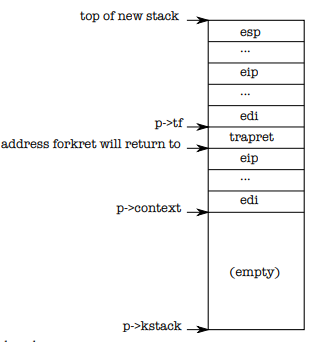

[Комментарии к исходному коду](https://pdos.csail.mit.edu/6.828/2018/xv6/book-rev11.pdf)

[Исходный код](https://pdos.csail.mit.edu/6.828/2018/xv6/xv6-rev11.pdf)


# xv6

## Основные понятия

### Процесс

Память любого процесса состоит из 3 частей: инструкции, данные, стек.

### fork

Создает новый процесс (child process), содержимое памяти которого идентично содержимому памяти вызывающего процесса (parent process). Но это не одна и та же память, это копия. Так как память у процессов одинаковая, значит одинаковые и инструкции, значит в обоих процессах выполнение продолжается со следующей инструкции. Только в child process функция fork возвращает 0, а в родительском - pid созданного процесса.

```c
int pid = fork();
if(pid > 0){
	printf("parent: child=%d\n", pid);
	pid = wait();
	printf("child %d is done\n", pid);
} else if(pid == 0){
	printf("child: exiting\n");
	exit();
} else {
	printf("fork error\n");
}
```

`exit` - запускает процедуру выхода из процесса и освобождает ресурсы (память, открытые файлы)

`wait` - ожидает завершения дочернего процесса и возвращает его pid.

В приведенном примере на экран будет выдано:

```
parent: child=1234
child: exiting
child 1234 is done
```

### exec

Принимает в качестве аргумента путь к исполняемому файлу и заменяет память вызывающего процесса на память, загруженную из этого файла. Файл должен быть в специальном формате (ELF), в котором указано начало секции инструкций, начало секции данных, с какой инструкции начать выполнение и т.д. Если вызов exec совершен удачно, то выполнение продолжится с той инструкции, которая указана первой к исполнению в загруженном файле.

Пример:

```c
char *argv[3];
argv[0] = "echo";
argv[1] = "hello";
argv[2] = 0;
exec("/bin/echo", argv);
printf("exec error\n");
```

Здесь исполняемая программа заменяется программой `/bin/echo`, которая получает в качестве списка аргументов `echo hello`.

### sh

Шелл использует `fork` и `exec` для исполнения программ. В общем структура выполнения выглядит так:

```c
int
main(void)
{
  static char buf[100];

  while(getcmd(buf, sizeof(buf)) >= 0){
    if(fork1() == 0)
      runcmd(parsecmd(buf));
    wait();
  }
  exit();
}

void
runcmd(struct cmd *cmd)
{
  struct execcmd *ecmd;

  switch(cmd->type){  
  	...
  case EXEC:
    ecmd = (struct execcmd*)cmd;
    exec(ecmd->argv[0], ecmd->argv);
    printf(2, "exec %s failed\n", ecmd->argv[0]);
    break;
    ...
  }
  exit();
}

```

- `main` - делает дочерний процесс, в нем парсит команду, подает на выполнение
- `runcmd` - делает `exec`, заменяя текущий процесс (тот, который был создан форком в `main`) на исполняемый файл, указанный в команде

После завершения дочернего процесса исполнение продолжается на инструкции, следующей за `wait()`.

### Дескрипторы файлов

У каждого процесса свой набор дескрипторов файлов, начинающийся с 0. По соглашению, 0 - дескриптор стандартного ввода/stdin, 1 - стандартного вывода/stdout, 2 - дескриптор канала ошибок/stderr.

При открытии файла он всегда получает наименьший из неиспользуемых в текущем процессе дексрипторов.

Вот так, например, выглядит `cat`:

```c
char buf[512];

void
cat(int fd)
{
  int n;

  while((n = read(fd, buf, sizeof(buf))) > 0) { // читаем из указанного дескриптора
    if (write(1, buf, n) != n) {  // пишем в 1, то есть stdout
      printf(1, "cat: write error\n");
      exit();
    }
  }

  // error handling
  if(n < 0){
    printf(1, "cat: read error\n");
    exit();
  }
}

int
main(int argc, char *argv[])
{
  int fd, i;

  if(argc <= 1){ // если аргументов не указано, то читаем из 0, то есть stdin
    cat(0);
    exit();
  }

  for(i = 1; i < argc; i++){ // если аргументы есть, то открываем файлы по этим путям и читаем из дескрипторов этих файлов
    if((fd = open(argv[i], 0)) < 0){
      printf(1, "cat: cannot open %s\n", argv[i]);
      exit();
    }
    cat(fd);
    close(fd);
  }
  exit();
}
```

#### Перенаправление I/O

`exec` заменяет содержимое памяти вызывающего процесса, но при этом **оставляет неизменной его таблицу дескрипторов**. Это позволяет реализовать перенаправление I/O. Вот, что происходит при вызове `cat < input.txt`:

```c
char *argv[2];
argv[0] = "cat";
argv[1] = 0;
if(fork() == 0) {
	close(0);
	open("input.txt", O_RDONLY);
	exec("cat", argv);
}
```

Здесь используется правило "При открытии файла он всегда получает наименьший из неиспользуемых в текущем процессе дексрипторов". Когда вызывается `close(0)`, дескриптор 0 (stdin) освобождается, а значит следующая инструкция `open` назначит открытому файлу `input.txt` дексриптор 0. Затем вызывается программа `cat`, которая при вызове без аргументов читает содержимое из дескриптора 0.

В коде шелла этот кусок выглядит так:

```c
void
runcmd(struct cmd *cmd)
{
  struct redircmd *rcmd;

    switch(cmd->type){
  ...

  case REDIR:
    rcmd = (struct redircmd*)cmd;
    close(rcmd->fd);
    if(open(rcmd->file, rcmd->mode) < 0){
      printf(2, "open %s failed\n", rcmd->file);
      exit();
    }
    runcmd(rcmd->cmd);
    break;
	...
  }
  exit();
}

...

struct cmd*
parseredirs(struct cmd *cmd, char **ps, char *es)
{
  int tok;
  char *q, *eq;

  while(peek(ps, es, "<>")){
    tok = gettoken(ps, es, 0, 0);
    switch(tok){
    case '<':
      cmd = redircmd(cmd, q, eq, O_RDONLY, 0);
      break;
    case '>':
      cmd = redircmd(cmd, q, eq, O_WRONLY|O_CREATE, 1);
      break;
    case '+':  // >>
      cmd = redircmd(cmd, q, eq, O_WRONLY|O_CREATE, 1);
      break;
    }
  }
  return cmd;
}
```

`rcmd` при парсинге получит `fd`, равный 0, при использовании `<` и равный 1 при использовании `>`. В ветке `REDIR` мы закрыли дексриптор, на который будем перенаправлять ввод или вывод, открыли нужный файл и вызвали `runcmd`, внутри которого будет использован `exec`.

#### Использование дескрипторов в fork

При форке таблица дескрипторов копируется, а сдвиги - шарятся между процессами. То есть следующий пример:

```c
if(fork() == 0) {
	write(1, "hello ", 6);
	exit();
} else {
	wait();
	write(1, "world\n", 6);
}
```

Выведет на экран `hello world`. 

Благодаря этому мы можем писать: `(echo hello; echo world)>output.txt`. (хотя пока непонятно, почему тут должен вызываться fork, а не exec).

#### dup

Копирует дескриптор, после чего оба дескриптора шарят сдвиг.

То есть:

```c
fd = dup(1);
write(1, "hello ", 6);
write(fd, "world\n", 6);
```

тоже выведет `hello world`.

Таким образом, два дексриптора файла шарят между собой сдвиг только в том случае, если они были получены из одного и того же дескриптора вызовами `fork` и `dup`. Во всех остальных случаях сдвиги не шарятся.

`dup` позволяет писать такие команды:

```shell
ls existing-file non-existing-file > tmp1 2>&1
```

Здесь `2>&1` как раз копирует дексриптор 1 в дескриптор 2, чтобы все ошибки выводились в stdout.

### pipes

Вызов `pipe` принимает массив из двух элементов и записывает в него 2 дексриптора: первый - для чтения и второй - для записи. Все, что будет записано в дексриптор для записи, можно будет прочитать из дескриптора для чтения.

Пример использования `pipe`:

```c
int p[2];
char *argv[2];
argv[0] = "wc";
argv[1] = 0;

pipe(p);
if(fork() == 0) {
	close(0);
	dup(p[0]);
	close(p[0]);
	close(p[1]);
	exec("/bin/wc", argv);
} else {
	close(p[0]);
	write(p[1], "hello world\n", 12);
	close(p[1]);
}
```

Здесь дочерний процесс закрывает `stdin`, дублирует дескриптор чтения из пайпа в дескриптор 0, закрывает дескриптор чтения и записи и запускает `wc`, который будет принимать ввод от дескриптора 0, то есть будет читать из пайпа.

Родительский процесс пишет в дескриптор записи и закрывает оба дескриптора пайпа.

Приблизительно так же выглядит и ветка `PIPE` в `runcmd`, только она создает 2 дочерних процесса:

```c
void
runcmd(struct cmd *cmd)
{
   struct pipecmd *pcmd;
 
  switch(cmd->type){
 	...
  case PIPE:
    pcmd = (struct pipecmd*)cmd;
    if(pipe(p) < 0)
      panic("pipe");
    if(fork1() == 0){
      close(1);
      dup(p[1]);
      close(p[0]);
      close(p[1]);
      runcmd(pcmd->left);
    }
    if(fork1() == 0){
      close(0);
      dup(p[0]);
      close(p[0]);
      close(p[1]);
      runcmd(pcmd->right);
    }
    close(p[0]);
    close(p[1]);
    wait();
    wait();
    break;
    ...
  }
  exit();
}
```

В шелле пайпы используются при выполнении команд вида `grep fork sh.c | wc -l`.

Преимущества пайпов перед временными файлами:

- автоматическое очищение
- можно передавать очень длинные потоки данных, не беспокоясь, что на диске кончится место
- возможно параллельное выполнение левой и правой команды
- для межпроцессного общения блокирующая модель записи и чтения пайпов удобнее, чем неблокирующая модель файлов

### Файловая система

`fstat` - возвращает информацию о файле, на который указывает дескрриптор

У файла может быть несколько имен, или "линков". Сам файл называется `inode`. Линки создаются командой `link`, например:

```c
open("a", O_CREATE|O_WRONLY);
link("a", "b");
```

После этого `a` и `b` ссылаются на один и тот же `inode` и запись/чтение в `a` равносильно записи/чтению в `b`.

Каждый айнод идентифицируется своим `inode number`. Его можно получить вызовом `fstat`.

Линки удаляются командой `unlink`. Айнод и место на диске очищаются только когда количество линков уменьшится до 0 и не останется дескрипторов, ссылающихся на него.

## Организация операционной системы

### Загрузчик

Загрузчик состоит из 2 частей: `bootasm.s`, написанный на ассемблере и `bootmain.c`, написанный на С.

Когда компьютер стартует, он выполняет программу BIOS, которая записана в энергонезависимой памяти материнской платы. BIOS подготавливает аппаратное обеспечение к работе и передает управление коду, записанному в загрузочный сектор, т.е. первый 512-байтовый сектор загрузочного диска. В этом секторе содержится загрузчик: инструкции по загрузке ядра в память. BIOS загружает содержимое загрузочного сектора в адрес `0x7c00` и переходит на этот адрес. Начинается исполнение файла `bootasm.s`.

Первая инструкция загрузчика - `cli`, которая отключает прерывания. BIOS возможно установил какие-то свои обработчики прерываний, чтобы инициализировать устройства, но мы уже покинули BIOS, поэтому они нам больше не нужны. Когда операционная система загрузится, она включит прерывания обратно.

Затем загрузчик должен перевести процессор из реального режима работы в защищенный.

После этого загрузчик переходит в `bootmain.c`.

Задача `bootmain.c` - загрузить и запустить ядро. Ядро должно быть в формате ELF. `bootmain` загружает первые 4096 байт из бинарника ELF и кладет их копию по адресу `0x10000`. Затем он проверяет, что это действительно ELF путем проверки магического числа в заголовке файла. Затем он проходит по всем сегментам файла, загружает их в память и переходит в точку входа в ядро, а именно `0x10000c`.

### Старт ядра

Когда загрузчик передает управления в ядро, первая выполняемая инструкция - это `entry:` в файле `entry.s`. Первое, что делает ядро - это настраивает аппаратный пэйджинг. Добавляется маппинг виртуальных адресов, начинающихся с `0x80000000` на физические, начинающиеся с `0x0`:

```asm
  movl    $(V2P_WO(entrypgdir)), %eax
  movl    %eax, %cr3
```

`V2P_WO`(virtual to physical) - это макрос, который отнимает от "высокого" адреса `entrypgdir` константу `0x80000000`. Это нужно, потому что у нас еще не работает маппинг виртуальных адресов, но ядро слинковано с их использованием.

Таблица страниц entrypgdir описана в main.c:

```c
__attribute__((__aligned__(PGSIZE)))
pde_t entrypgdir[NPDENTRIES] = {
  // Map VA's [0, 4MB) to PA's [0, 4MB)
  [0] = (0) | PTE_P | PTE_W | PTE_PS,
  // Map VA's [KERNBASE, KERNBASE+4MB) to PA's [0, 4MB)
  [KERNBASE>>PDXSHIFT] = (0) | PTE_P | PTE_W | PTE_PS,
};
```

Затем ядро включает аппаратный пейджинг:

```
  orl     $(CR0_PG|CR0_WP), %eax
  movl    %eax, %cr0
```

Ну и наконец мы переходим в `main.c`:

```asm
  # Set up the stack pointer.
  movl $(stack + KSTACKSIZE), %esp

  # Jump to main(), and switch to executing at
  # high addresses. The indirect call is needed because
  # the assembler produces a PC-relative instruction
  # for a direct jump.
  mov $main, %eax
  jmp *%eax
```

### Создание первого процесса

Процесс описывается следующей структурой:

```c
// Per-process state
struct proc {
  uint sz;                     // Size of process memory (bytes)
  pde_t* pgdir;                // Page table
  char *kstack;                // Bottom of kernel stack for this process
  enum procstate state;        // Process state
  int pid;                     // Process ID
  struct proc *parent;         // Parent process
  struct trapframe *tf;        // Trap frame for current syscall
  struct context *context;     // swtch() here to run process
  void *chan;                  // If non-zero, sleeping on chan
  int killed;                  // If non-zero, have been killed
  struct file *ofile[NOFILE];  // Open files
  struct inode *cwd;           // Current directory
  char name[16];               // Process name (debugging)
};

struct context {
  uint edi;
  uint esi;
  uint ebx;
  uint ebp;
  uint eip;
};
```

`main` инициализирует кучу устройств и подсистем:

```c
// Bootstrap processor starts running C code here.
// Allocate a real stack and switch to it, first
// doing some setup required for memory allocator to work.
int
main(void)
{
  kinit1(end, P2V(4*1024*1024)); // phys page allocator
  kvmalloc();      // kernel page table
  mpinit();        // detect other processors
  lapicinit();     // interrupt controller
  seginit();       // segment descriptors
  picinit();       // disable pic
  ioapicinit();    // another interrupt controller
  consoleinit();   // console hardware
  uartinit();      // serial port
  pinit();         // process table
  tvinit();        // trap vectors
  binit();         // buffer cache
  fileinit();      // file table
  ideinit();       // disk 
  startothers();   // start other processors
  kinit2(P2V(4*1024*1024), P2V(PHYSTOP)); // must come after startothers()
  userinit();      // first user process
  mpmain();        // finish this processor's setup
}
```

Первый процесс создается вызовом `userinit()`, который вызывает `allocproc()`. Задача `allocproc()` - аллоцировать структуру типа `proc` в системной таблице процессов и инициализировать части состояния процесса, чтобы он мог запуститься. `allocproc()` запускается для каждого нового процесса, а `userinit()` - только для первого.

```c
// Look in the process table for an UNUSED proc.
// If found, change state to EMBRYO and initialize
// state required to run in the kernel.
// Otherwise return 0.
static struct proc*
allocproc(void)
{
  struct proc *p;
  char *sp;

  acquire(&ptable.lock);

  for(p = ptable.proc; p < &ptable.proc[NPROC]; p++)
    if(p->state == UNUSED)
      goto found;

  release(&ptable.lock);
  return 0;

found:
  p->state = EMBRYO;
  p->pid = nextpid++;

  release(&ptable.lock);

  // Allocate kernel stack.
  if((p->kstack = kalloc()) == 0){
    p->state = UNUSED;
    return 0;
  }
  sp = p->kstack + KSTACKSIZE;

  // Leave room for trap frame.
  sp -= sizeof *p->tf;
  p->tf = (struct trapframe*)sp;

  // Set up new context to start executing at forkret,
  // which returns to trapret.
  sp -= 4;
  *(uint*)sp = (uint)trapret;

  sp -= sizeof *p->context;
  p->context = (struct context*)sp;
  memset(p->context, 0, sizeof *p->context);
  p->context->eip = (uint)forkret;

  return p;
}
```

* регистр EIP в x86 означает Extended Instruction Pointer

Allocproc:

1. ищет в таблице процессов слот с состоянием UNUSED
2. когда находит, устанавливает ему состояние EMBRYO и дает процессу уникальный pid.
3. затем пытается выделить в памяти 4096 байт для ядерного стека процесса. Если не получается, то выставляет состояние обратно в UNUSED и возвращает 0.
4. если получилось, то поля структуры proc инициализируются адресами в стеке для trap frame, trapret, context. В результате полученный ядерный стек выглядит так:



После заполнения стэка в `p->context->eip` будет адрес функции `forkret`, а над контекстом, там, где обычно пишется адрес возврата - будет адрес функции `trapret`. Созданный поток начинает выполнение со значениями регистров, скопированными из `p->context`, поэтому при старте потока в регистре EIP будет адрес `forkret` и начнет выполняться она. После выполнения будет переход к инструкции, которая располагается сразу над `p->context`, то есть `trapret`. `trapret` восстанавливает значение регистров из значений, сохраненных наверху стэка и прыгает внутрь процесса.

Такая сложная конструкция нужна, потому что этот же код используется и для форков. А `trapret` нужен потому что переход из юзерспейса в ядро происходит через исключения, или, как они называются в x86, трэпы.

После создания процесса, ему указывается программа для выполнения, и в случае userinit это программа `initcode.s`.