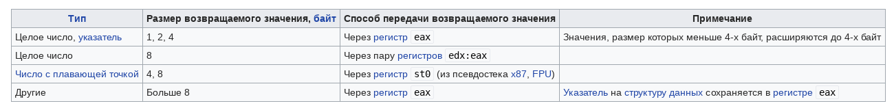

[Вики](https://en.wikibooks.org/wiki/X86_Disassembly/Functions_and_Stack_Frames)

(https://stackoverflow.com/questions/1395591/what-is-exactly-the-base-pointer-and-stack-pointer-to-what-do-they-point)

В X86 8 32-битных регистров.

В X64 регистры 16 64-битных. 64-битные версии Е\* регистров называются R\*. Дополнительные регистры получили названия r8...r15.

В X86 инструкция MOV A, B означает, что значение B копируется в A.

ESP - stack pointer. Указывает на вершину стэка. Операции push и pop берут из него адрес, по которому обращаться к стэку, а затем меняют значение этого регистра. После пролога функции все локальные переменные и аргументы оказываются выше его.

EBP - frame pointer. Все аргументы функции и адрес возврата находятся выше его, а локальные переменные - ниже.

Обычно функция начинается с автосгенерированного пролога:

```
push ebp ; Preserve current frame pointer - сохраняем его, чтобы после выхода из функции наш caller смог обращаться к своим локальным переменным
`mov ebp, esp ; Create new frame pointer pointing to current stack top`
sub esp, 20 ; allocate 20 bytes worth of locals on stack.
```

Именно после этого ebp будет указывать на начало текущего фрейма, а esp - на его конец.

Затем в коде обращение к локальным переменным может выглядеть так:

```
`mov [ebp-4], eax ; Store eax in first local
mov ebx, [ebp - 8] ; Load ebx from second local`</div>
```

А выход из функции (эпилог) выглядит так:

```
`mov esp, ebp ;
pop ebp ;
ret
```

Для перечисленных ниже соглашений (кроме `[cdecl]` перед возвратом значений из функции подпрограмма обязана восстановить значения сегментных регистров, регистров `esp` и `ebp`. Значения остальных регистров могут не восстанавливаться.

Если размер возвращаемого значения функции не больше размера регистра `eax`, возвращаемое значение сохраняется в регистре `eax`. Иначе, возвращаемое значение сохраняется на вершине стека, а указатель на вершину стека сохраняется в регистре `eax`.

### cdecl

`cdecl` (сокращение от англ. c declaration) — соглашение о вызовах, используемое компиляторами для языка Си.

Аргументы функций передаются через стек, справа налево. Аргументы, размер которых меньше 4-х байт, расширяются до 4-х байт. Очистку стека производит **вызывающая** программа. Это основной способ вызова функций с переменным числом аргументов (например, `[printf()](https://ru.wikipedia.org/wiki/Printf)`). Названия функций имеют префикс '\_'. Способы получения возвращаемого значения функции приведены в таблице.



Перед вызовом функции вставляется код, называемый **прологом** и выполняющий следующие действия:

* сохранение значений регистров, используемых внутри функции;
* запись в стек аргументов функции

После вызова функции вставляется код, называемый **эпилогом** и выполняющий следующие действия:

* восстановление значений регистров, сохранённых кодом пролога;
* очистка стека (от локальных переменных).

Пример:

```
    ; // push arguments to the stack, from right to left
    push        3
    push        2

    ; // call the function
    call        _sumExample

    ; // cleanup the stack by adding the size of the arguments to ESP register
    add         esp,8

    ; // copy the return value from EAX to a local variable (int c)
    mov         dword ptr [c],eax
```

The called function is shown below:

```
; // function prolog
push ebp
mov ebp,esp
sub esp,0C0h
push ebx
push esi
push edi
lea edi,[ebp-0C0h]
mov ecx,30h
mov eax,0CCCCCCCCh
rep stos dword ptr [edi]

; // return a + b;
mov eax,dword ptr [a]
add eax,dword ptr [b]

; // function epilog
pop edi
pop esi
pop ebx
mov esp,ebp
pop ebp

ret
```

### stdcall или winapi

`stdcall` или `winapi` — соглашение о вызовах, применяемое в Windows для вызова функций WinAPI.

Аргументы функций передаются через стек, справа налево. Очистку стека производит вызываемая подпрограмма. Названия функция имеют префикс '\_' и постфикс вида '@+необходимое количество байт на стэке'.

Пример:

```
; // push arguments to the stack, from right to left
  push        3
  push        2

; // call the function
  call        _sumExample@8

; // copy the return value from EAX to a local variable (int c)  
  mov         dword ptr [c],eax
```

The function code is shown below:

```
; // function prolog goes here (the same code as in the __cdecl example)

; //    return a + b;
  mov         eax,dword ptr [a]
  add         eax,dword ptr [b]

; // function epilog goes here (the same code as in the __cdecl example)

; // cleanup the stack and return
  ret         8
```

Так как очистку стэка производит вызываемая программа, то размер бинарников получается меньше, чем у cdecl. Однако функциям с переменным числом аргументов приходится использовать cdecl, потому что только вызывающий код знает количество аргументов.

### fastcall

`fastcall` — общее название соглашений, передающих параметры через регистры (обычно это самый быстрый способ, отсюда название). Если для сохранения всех параметров и промежуточных результатов регистров не достаточно, используется стек.

Соглашение о вызовах `fastcall` не стандартизировано, поэтому используется только для вызова процедур и функций, не экспортируемых из исполняемого модуля и не импортируемых извне.
В компиляторах фирмы Borland для соглашения \_\_fastcall, называемого также register[5], параметры передаются слева направо в регистрах eax, edx, ecx, а если параметров больше трёх — в стеке, также слева направо. Исходное значение указателя на вершину стека (значение регистра esp) возвращает вызываемая подпрограмма.

В 32-разрядной версии компилятора фирмы Microsoft[6], а также в компиляторе GCC[7], соглашение \_\_fastcall, также называемое \_\_msfastcall, определяет передачу первых двух параметров слева направо в регистрах ecx и edx, а остальные параметры передаются справа налево в стеке. Очистку стека производит вызываемая подпрограмма.

Названия функций начинаются с @ и заканчиваются на @ + необходимое количество байт на стэке.

Пример:

```
; // put the arguments in the registers EDX and ECX
  mov         edx,3
  mov         ecx,2

; // call the function
  call        @fastcallSum@8

; // copy the return value from EAX to a local variable (int c)  
  mov         dword ptr [c],eax
```

Function code:

```
; // function prolog

  push        ebp  
  mov         ebp,esp
  sub         esp,0D8h
  push        ebx  
  push        esi  
  push        edi  
  push        ecx  
  lea         edi,[ebp-0D8h]
  mov         ecx,36h
  mov         eax,0CCCCCCCCh
  rep stos    dword ptr [edi]
  pop         ecx  
  mov         dword ptr [ebp-14h],edx
  mov         dword ptr [ebp-8],ecx
; // return a + b;
  mov         eax,dword ptr [a]
  add         eax,dword ptr [b]
;// function epilog  
  pop         edi  
  pop         esi  
  pop         ebx  
  mov         esp,ebp
  pop         ebp  
  ret
```

### thiscall

thiscall — соглашение о вызовах, используемое компиляторами для языка C++ при вызове методов классов в объектно-ориентированном программировании.

Аргументы функции передаются через стек, справа налево. Очистку стека производит вызывающая программа. Соглашение thiscall отличается от cdecl соглашения только тем, что указатель на объект, для которого вызывается метод (указатель this), записывается в регистр ecx[8]. Если же используется функция с переменным количеством аргументов, то this кладется на стэк последним.

```
push        3
push        2
lea         ecx,[sumObj]
call        ?sum@CSum@@QAEHHH@Z            ; CSum::sum
mov         dword ptr [s4],eax
```

The function itself is given below:

```
    push        ebp
    mov         ebp,esp
    sub         esp,0CCh
    push        ebx
    push        esi
    push        edi
    push        ecx
    lea         edi,[ebp-0CCh]
    mov         ecx,33h
    mov         eax,0CCCCCCCCh
    rep stos    dword ptr [edi]
    pop         ecx
    mov         dword ptr [ebp-8],ecx
    mov         eax,dword ptr [a]
    add         eax,dword ptr [b]
    pop         edi
    pop         esi
    pop         ebx
    mov         esp,ebp
    pop         ebp
    ret         8
```

To cut a long story short, we'll outline the main differences between the calling conventions:

* `__cdecl` is the default calling convention for C and C++ programs. The advantage of this calling convetion is that it allows functions with a variable number of arguments to be used. The disadvantage is that it creates larger executables.
* `__stdcall` is used to call Win32 API functions. It does not allow functions to have a variable number of arguments.
* `__fastcall` attempts to put arguments in registers, rather than on the stack, thus making function calls faster.
* `Thiscall` calling convention is the default calling convention used by C++ member functions that do not use variable arguments.

## X64

В X64 все Е\* регистры называются R\*. https://msdn.microsoft.com/ru-ru/library/9z1stfyw.aspx

В X64 используется только \_\_fastcall, причем регистры используются для передачи первых 4 аргументов. Аргументы передаются в регистрах RCX, RDX, R8 и R9.
