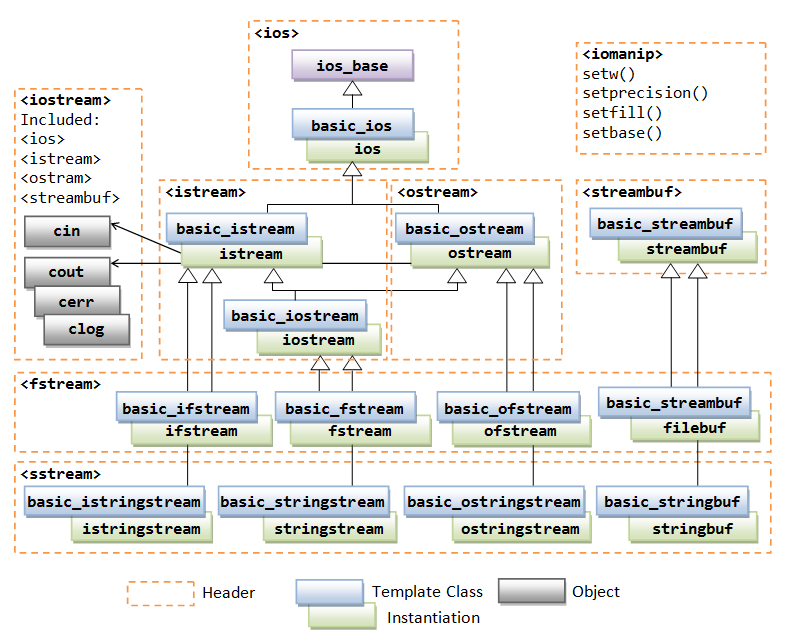

[Spiral rule](http://c-faq.com/decl/spiral.anderson.html)

# Suggestions for C++ programmers (C++11 features)

1. Use constructors to establish invariants (§2.4.3.2, §13.4, §17.2.1).
2. Use constructor/destructor pairs to simplify resource management (RAII; §5.2, §13.3).
3. Avoid ‘‘naked’’ new and delete (§3.2.1.2, §11.2.1).
4. Use containers and algorithms rather than built-in arrays and ad hoc code (§4.4, §4.5,
§7.4, Chapter 32).
5. Prefer standard-library facilities to locally developed code (§1.2.4).
6. Use exceptions, rather than error codes, to report errors that cannot be handled locally
(§2.4.3, §13.1).
7. Use move semantics to avoid copying large objects (§3.3.2, §17.5.2).
8. Use unique_ptr to reference objects of polymorphic type (§5.2.1).
9. Use shared_ptr to reference shared objects, that is, objects without a single owner that is
responsible for their destruction (§5.2.1).
10. Use templates to maintain static type safety (eliminate casts) and avoid unnecessary use
of class hierarchies (§27.2).

# Suggestions for C Programmers

1. Don’t think of C++ as C with a few features added. C++ can be used that way, but only
suboptimally. To get really major advantages from C++ as compared to C, you need to
apply different design and implementation styles.
2.  Don’t write C in C++; that is often seriously suboptimal for both maintenance and perfor-
mance.
3. Use the C++ standard library as a teacher of new techniques and programming styles.
Note the difference from the C standard library (e.g., = rather than strcpy() for copying
and == rather than strcmp() for comparing).
4. Macro substitution is almost never necessary in C++. Use const (§7.5), constexpr (§2.2.3,
§10.4), enum or enum class (§8.4) to define manifest constants, inline (§12.1.5) to avoid
function-calling overhead, template s (§3.4, Chapter 23) to specify families of functions
and types, and namespace s (§2.4.2, §14.3.1) to avoid name clashes.
5. Don’t declare a variable before you need it, and initialize it immediately. A declaration
can occur anywhere a statement can (§9.3), in for -statement initializers (§9.5), and in con-
ditions (§9.4.3).
6. Don’t use malloc() . The new operator (§11.2) does the same job better, and instead of
realloc() , try a vector (§3.4.2). Don’t just replace malloc() and free() with ‘‘naked’’ new and
delete (§3.2.1.2, §11.2.1).
7. Avoid void∗ , unions, and casts, except deep within the implementation of some function
or class. Their use limits the support you can get from the type system and can harm per-
formance. In most cases, a cast is an indication of a design error. If you must use an
explicit type conversion, try using one of the named casts (e.g., static_cast ; §11.5.2) for a
more precise statement of what you are trying to do.
8. Minimize the use of arrays and C-style strings. C++ standard-library string s (§4.2), array s
(§8.2.4), and vector s (§4.4.1) can often be used to write simpler and more maintainable
code compared to the traditional C style. In general, try not to build yourself what has
already been provided by the standard library.
9. Avoid pointer arithmetic except in very specialized code (such as a memory manager) and
for simple array traversal (e.g., ++p ).
10. Do not assume that something laboriously written in C style (avoiding C++ features such
as classes, templates, and exceptions) is more efficient than a shorter alternative (e.g.,
using standard-library facilities). Often (but of course not always), the opposite is true.

# Suggestions for Java/C# Programmers

1. Don’t simply mimic Java style in C++; that is often seriously suboptimal for both main-
tainability and performance.
2. Use the C++ abstraction mechanisms (e.g., classes and templates): don’t fall back to a C
style of programming out of a false feeling of familiarity.
3. Use the C++ standard library as a teacher of new techniques and programming styles.
4. Don’t immediately invent a unique base for all of your classes (an Object class). Typi-
cally, you can do better without it for many/most classes.
5. Minimize the use of reference and pointer variables: use local and member variables
(§3.2.1.2, §5.2, §16.3.4, §17.1).
6. Remember: a variable is never implicitly a reference.
7. Think of pointers as C++’s equivalent to Java references (C++ references are more lim-
ited; there is no reseating of C++ references).
8. A function is not virtual by default. Not every class is meant for inheritance.
9. Use abstract classes as interfaces to class hierarchies; avoid "brittle base classes", that is, base classes with data members.
10. Use scoped resource management ("Resource Acquisition Is Initialization"; RAII) when-
ever possible.
11. Use a constructor to establish a class invariant (and throw an exception if it can’t).
12. If a cleanup action is needed when an object is deleted (e.g., goes out of scope), use a de-
structor for that. Don’t imitate finally (doing so is more ad hoc and in the longer run far
more work than relying on destructors).
13. Avoid "naked" `new` and `delete` ; instead, use containers (e.g., `vector`, `string`, and `map`) and handle classes (e.g., `lock` and `unique_ptr` ).
14. Use freestanding functions (nonmember functions) to minimize coupling (e.g., see the
standard algorithms), and use namespaces (§2.4.2, Chapter 14) to limit the scope of free-
standing functions.
15. Don’t use exception specifications (except `noexcept`; §13.5.1.1).
16. A C++ nested class does not have access to an object of the enclosing class.
17. C++ offers only the most minimal run-time reflection: `dynamic_cast` and `typeid` (Chapter
22). Rely more on compile-time facilities (e.g., compile-time polymorphism; Chapter 27,
Chapter 28).

# Ключевые слова

## constexpr

`const` - константное выражение, которое может быть вычислено на этапе выполнения.

`constexpr` - константное выражение, которое должно быть вычислено на этапе компиляции. Необходимо для экономии ресурсов, а так же в некоторых синтаксических конструкциях. 

- Переменная может быть объявлена как `constexpr`, если она имеет **литеральный тип** и инициализирована. Если инициализация осуществляется через конструктор, то конструктор должен быть помечен как `constexpr`. 

- Ссылка может быть объявлена как `constexpr`, если объект, на который она ссылается инициализирован константным выражением и все преобразования, выполняемые при инициализации, тоже являются константными выражениями.

# Указатели

Проверка, указывает ли указатель на объект:

`if (p==nullptr) return 0;`

## Разница между указателями и ссылками


1. Указатель может быть переназначен сколько угодно раз, ссылка - не может.
2. Указатель может указывать в никуда (`nullptr`), ссылка - не может.
3. Адрес ссылки получить нельзя.
4. Нет "арифметики ссылок".
5. Можно иметь указатель на указатель на указатель и т.д. У ссылок может быть только один уровень.
6. Чтобы получить значение по ссылке, не нужно использовать символы \* и ->.

## Когда использовать ссылки

- аргументы функций
- возвращаемые значения функций

## Когда использовать указатели

- в алгоритмах
- в структурах данных

# Конструктор инициализации

```
class Vector {
public:
    Vector(int s) :elem{new double[s]}, sz{s} {}
private:
    double* elem;
    int sz;
};
```

Здесь запись `Vector(int s) :elem{new double[s]}, sz{s} {}` означает, что при использовании этого конструктора нужно приватные поля `elem` и `sz` инициализировать указанными значениями.

# Ассершны

Ассерты в рантайме осуществляются командой `static_assert`:

`static_assert(4<=sizeof(int), "Integers are too small");`

# RAII

Формулируется так: владение ресурсом есть инварианта класса. Это означает, что захват ресурса должен производиться в конструкторе, а освобождение - в деструкторе.

Рантайм обеспечивает, что деструктор вызывается только, если конструктор не возбудил исключения. Поэтому если в конструкторе не удалось захватить ресурс - нужно стрелять исключение. Если в деструкторе не удалось освободить - тоже стрелять исключение.

# initializer_list

Если мы инициализируем контейнер следующей конструкцией:

`Vector v = {1,2,3,4,5};`

то у него вызывается вот такой конструктор:

`Vector(initializer_list<double> lst)`

## Пример реализации

```cpp
#include <initializer_list>
#include <algorithm>

Vector(std::initializer_list<double> lst) {
	std::copy(lst.begin(), lst.end(), elem);
}
```

# Типы и префиксы строк

- **char** - 8-битные символы, нужен для ASCII и UTF-8
- **char16_t** - 16-битные символы, нужен для UTF-16
- **char32_t** - 32-битные символы, нужен для UTF-32
- **wchar_t** - любые "широкие" символы (wide characters), то есть символы с размером, большим чем 8 бит. Имеет размер, достаточный для того, чтобы представить любой поддерживаемый символ Unicode.

Префиксы:

|  Префикс  |             Тип              |
|----------:|------------------------------|
| "Hello"   | const char*                  |
| L"Hello"  | const wchar_t*               |
| u8"Hello" | const char* / const char8_t* |
| u"Hello"  | const char16_t*              |
| U"Hello"  | const char32_t*              |

Пример:

```
#include <iostream>
#include <string>
using namespace std;

int main()
{
    cout << "\n\n Hello World! (plain) \n";
    cout << u8"\n Hello World! (u8) \n";
    cout << u"\n Hello World! (u) \n";
    cout << U"\n Hello World! (U) \n";
    cout << L"\n Hello World! (plain) \n\n";

    cout << "\n\n\n";
}
```

3-5 `cout` вернут ерунду типа `0x47f0d8`. Так происходит из-за того, что оператор `<<` для класса `std::cout` принимает `const char*`, но не содержит перегрузок для `const char16_t*`, `const char32_t*`, `const wchar_t*`. Поэтотому он применит перегрузку для печати указателей.

Однако для вывода последнего есть специальный класс: `std::wcout`.

# Инициализация

Есть 4 синтаксических стиля инициализации объектов:

```cpp
X a1{v};
X a2 = {v};
X a3 = v;
X a4(4);
```

Самая предпочтительная - первая, через `{}`. Она же и самая новая - появилась в C++11.

Ее преимущество в том, что она не допускает "сужения" типов, то есть:

- char приводить к int можно, наоборот - нельзя
- float приводить к double можно, наоборот - нельзя
- число с плавающей точкой нельзя приводить к целому
- целое число нельзя приводить к числу с плавающей точкой

Однако если используется `auto`, то лучше использовать форму `a3`, то есть через `=`. Во-первых, в этом случае инициализация через `{}` не дает никаких преимуществ, а во-вторых тип может быть определен не так, как мы хочем:

```cpp
auto z1 {99}; // initializer_list<int>
auto z2 = 99; // int
```

Пустой список инициализации `{}` присвоит дефолтное значение:

```cpp
int x{}; // 0
char* p {}; // nullptr
char buf[1000] {}; // массив из тысячи нулей
```

# Алиасы типов

## using

```cpp
using Pchar = char*;
using PF = int(*)(double);
```

Можно эти алиасы даже объявлять внутри типов и обращаться потом извне:

```cpp
template<class T>
class vector {
public:
    using value_type = T;
    //...
};

vector<int>::value_type vt; //int
```

## typedef

Это более старый синтаксис, служащий в тех же целях. Но он сложнее в понимании, потому что объявляемое имя стоит там, где стояло бы имя переменной при ее объявлении. В определении не могут быть использованы шаблоны. Не рекомендуется к использованию в современном C++. 

Примеры:

```cpp
typedef int int32_t; // using int32_t = int;
typedef short int16_t; // using unt16_t = short;
typedef void(*PtoF)(int) // using PtoF = void(*)(int);
```

Суффикс `_t` в названиях типов по соглашению используется для алиасов.

# Константные указатели

Если константным должен быть сам указатель, то вместо `*` нужно использовать `*const`:

```cpp

char* p;
char s[] = "Hello";

const char* pc = s; // указатель на константу
pc[3] = 'g'; // ОШИБКА
pc = p;      // ok

char *const cp = s; // константый указатель
cp[3] = 'g'; // ok
cp = p;      // ОШИБКА

const char *const cpc = s; // константный указатель на константу
cpc[3] = 'g';  // ОШИБКА
cpc = p;       // ok
```

Если ошибиться и вместо `*const` написать `const*`, то это опять будет указатель на константу:

```cpp
char *const cp;  // константный указатель
char const* pc;  // указатель на константу
const char* pc2; // опять указатель на константу
```

Удобнее читать эти определения справа налево: `cp` это константый указатель на `char`, а `pc2` это указатель на `char const`.

# rvalue/lvalue

http://thbecker.net/articles/rvalue_references/section_01.html

**lvalue** - объект, который занимает идентифицируемое место в памяти (например, имеет адрес)

**rvalue** - все остальное. То есть это выражение, которое не представляет собой объект, занимающий идентифицируемое место в памяти.

lvalue можно менять, rvalue - нет.

lvalue может быть преобразовано в rvalue, но **rvalue в lvalue преобразовано быть не может**.

Ссылка на lvalue формируется приписыванием "&": `A& a_ref = a;`, а ссылка на rvalue - приписыванием "&&": `A&& a_ref = a;`.

Оператор "\*" принимает rvalue, а возвращает lvalue: `*(p + 1) = 10`

Оператор "&" - наоборот, принимает lvalue, а возвращает rvalue: `int *addr = &v;`, поэтому символ `&` еще называют "ссылкой на lvalue".

Неконстантной ссылке на lvalue не может быть присвоено rvalue, так как это потребовало бы невалидного преобразования rvalue в lvalue. Однако если ссылка на lvalue - константна, то можно, так как в этом случае отсутствует проблема модификации rvalue:

```
const std::string &ref = std::string();
```

Именно благодаря этому свойству в функции можно передавать константные ссылки на значения:

```cpp
#include <iostream>

int length (std::string& s) {
  return s.size();
}

int lengthConst (const std::string& s) {
  return s.size();
}

int main() {
  std::cout << length("Hello!");		// не скомпилится, потому что пытаемся передать rvalue как неконстантную ссылку

  std::string h = "Hello!";
  std<<cout << length(h);				// а тут нормально скопилится, потому что передаем уже lvalue

  std::cout << lengthConst("Hello!");	// скомпилится, потому что ссылка принимается константная

  return 0;
}
```


Копии rvalue обычно создаются конструктором перемещения, а копии lvalue - конструктором копирования.

Если у нас есть такое объявление функции:

```cpp
void someFunc(Widget w);
```

vмы ничего не можем сказать о стоимости копирования `w` в функцию `someFunc`, так как не знаем, это rvalue или lvalue.

# Конструктор

Если у класса есть конструктор, принимающий один аргумент, то этот конструктор будет вызываться при инициализации аргументов этого типа.

Пример:

```cpp
class uri {
public:
    uri(const char* s): _c{s} {}
private:
    const char* _c;
};

uri u = "http://www.ya.ru";   // будет вызван конструктор
```

# Копирование объектов

По дефолту при присваивании происходит полное копирование всех членов объекта.

Например,

```cpp
1 Vector bad_copy(Vector v1) 
2 {
3 	Vector v2 = v1;
4 	v1[0] = 2;   // v2[0] теперь тоже равен 2
5 	v2[1] = 3;   // v1[1] теперь тоже равен 3
6 	return v2;
7 }
```

В большинстве случаев это совсем не то, чего мы хотели, так как это может нарушить RAII. Простое правило - если у класса есть деструктор, то это скорее всего означает, что дефолтная семантика копирования нам не подходит.

Варианта решения два: *конструктор копирования* и *присваивание копированием*.

## Конструктор копирования

Этот конструктор будет неявно вызываться каждый раз, когда мы передаем значение в функцию (не по ссылке), либо возвращаем из функции (опять же не по ссылке).

```cpp
Vector::Vector(const Vector& a)
	:elem{new double[sz]},
	sz{a.sz}
{
	for(int i=0; i<sz; ++i)
		elem[i]=a.elem[i];
}
```

В вышеуказанном примере конструктор копирования будет вызван в строчках 1 и 6.

## Присваивание копированием

Этот метод будет вызываться, когда происходит присваивание не по ссылке.

```cpp
Vector& Vector::operator=(const Vector& a)
{
	double* p = new double[a.sz];
	for(int i=0; i < sz; ++i)
		p[i]=a.elem[i];
	delete[] elem;
	elem=p;
	sz=a.sz;
	return *this;
}
```

В вышеуказанном примере конструктор копирования будет вызван в строчке 3.

# Перемещение объектов

Допустим, у нас есть такой код:

```cpp
1 Vector operator+(const Vector& a, const Vector& b)
2 {
3     Vector res(a.size());
4     for (int i=0; i!=a.size(); ++i)
5         res[i]=a[i]+b[i];
6     return res;
7 }
```

Аргументы передаются по ссылке, тут все нормально. Но возвращать ссылку мы не можем (переменная на стеке res будет уничтожена как только мы выйдем из функции). Поэтому возвращаем значение и тут опять будет вызван конструктор копирования. Если вектор большой, то это будет весьма затратная операция.

Более того, если клиент будет использовать суммирование так:

`Vector v = v1 + v2 + v3`

то в процессе будет осуществлено как минимум одно побочное копирование, которое нам в конечном счете совсем не нужно.

Чтобы избежать копирования большого количества полей объекта, можно реализовать семантику перемещения через *конструктор перемещения* или *присваивание перемещением*. 

Обе эти конструкции используют `&&`, что означает не ссылку на ссылку, а **rvalue reference**.

Реализуется конструктор/присваивание таким образом, чтобы нужные поля "переместились" из правой части в левую, то есть из правой части значения пропадают, а в левой - появляются.

Также мы можем "помочь" компилятору, указав явное перемещение командой `std::move`.

При присваивании объекта, если компилятор находит у его типа операции перемещения, то использует их. Если нет = то находит и использует операции копирования. С `std::move` то же самое, если он не найдет операции перемещения, то воспользуется копированием.

## std::move

Все, что делает `std::move` - принимает аргумент в виде lvalue или rvalue и возвращает его как rvalue БЕЗ вызова конструктора копирования:

```cpp
template<class T>
typename remove_reference<T>::type&&
move(T&& a) {
	return a;
}
```

После этого в клиентском компилятор подбирает для копирования либо операцию перемещения, либо копирования, в зависимости от того, реализована ли операция перемещения (которая, напомню, принимает rvalue). Если не реализована, то rvalue превращается обратно в lvalue и подается в конструктор копирования.

## Perfect forwarding

Допустим, у нас есть такая функция:

```cpp
template <typename T, typename A1>
std::unique_ptr<T> factory(A1& a1)
{
    return std::unique_ptr<T>(new T(a1));
}
```

Мы не можем вызвать `factory<foo>(5)`, потому что 5 это rvalue, функция принимает `A1&` - lvalue, а rvalue к lvalue не приводится.

Мы могли бы принимать константную ссылку:

```cpp
template <typename T, typename A1>
std::unique_ptr<T> factory(const A1& a1)
{
    return std::unique_ptr<T>(new T(a1));
}
```

но что если конструктор `T` должен принимать не-константные ссылки?

Нам поможет использование rvalue и `std::forward`:

```cpp
template <typename T, typename A1>
std::unique_ptr<T> factory(A1&& a1)
{
    return std::unique_ptr<T>(new T(std::forward<A1>(a1)));
}
```

`std::forward` просто передает аргумент дальше, сохраняя его "rvalue/lvalue-ness". То есть rvalue он передает как rvalue, а lvalue - как lvalue.


## Moveable но non-copyable типы

Некоторые типы поддерживают присваивание только перемещением. К ним относятся:

- `fstream`
- `unique_ptr`
- типы, представляющие треды

Засчет того, что они всегда перемещаются, мы можем их спокойно возвращать из фабричных функций по значению, не боясь, что возникнет копия или протухнет ссылка.

Так же мы можем такие типы спокойно передавать в стандартные контейнеры и если контейнеру нужно скопировать значение, то он обязательно сначала попробует его переместить:

```cpp
vector<unique_ptr<base>> v1, v2;
v1.push_back(unique_ptr(new derived()));  // ok, moving, not copying
...
v2 = v1;             // Compile time error.  This is not a copyable type.
v2 = move(v1);       // Move ok.  Ownership of pointers transferred to v2.
```

## Конструктор перемещения

Имеет сигнатуру `Vector(Vector&& a)`.

Пример реализации:

```cpp
Vector::Vector(Vector&& a)
	:elem{a.elem},
	sz{a.sz}
{
	a.elem = nullptr;
	a.sz = 0;
}
```

В указанном примере компилятор распознает возможность и вызовет конструктор перемещения в строке 6.

## Присваивание перемещением

Имеет сигнатуру `Vector& operator=(Vector && a)`.

## Автогенерируемые типы

Конструктор перемещения и присваивание перемещением генерируются автоматически для типов, у которых не определены операции перемещения, копирования и деструктор.

Конструктор копирования генерируется автоматически для типов, у которых он не определен, а так же удаляется если определена хотя бы одна операция перемещения.

Оператор присваивания копированием генерируется автоматически для типов, у которых он не определен, а так же удаляется если определена хотя бы одна операция перемещения.

# Шаблоны

Синтаксис такой:

```cpp
template<typename T>
class Vector {
private:
	T* elem;
	...
}
```

Причем если есть функции, определенные снаружи скоупа класса, то для них шаблон должен быть определен точно так же:

```cpp
template<typename T>
T& Vector<T>::operator[](int i) const
{
    return elem[i];
}
```

Причем придется так писать даже если тип внутри метода не используется:

И еще **важное примечание**. Шаблонные реализации методов **не могут** быть описаны в файле .cpp, только в .h! Поэтому если у нас в .h заголовке описывается шаблонный класс, то это нормально, если у него нет соответствующего .cpp файла и все реализации описаны прямо в заголовке!

Причина этого - в том, что все .cpp файлы компилируются по отдельности (а потом соединяются воедино линковщиком). В .cpp файле у нас, допустим, встречается `Vector<int>`. Чтобы скомпилировать эту строчку, компилятору нужно сгенерить новый класс, а для этого он должен видеть реализацию шаблона. Если реализация описана в другом файле .cpp, то на данном этапе у компилятора нет к нему доступа, а есть только к тем, которые описаны в текущем файле в секциях `#include` (обычно это файлы заголовков). Когда же он дойдет до компиляции того файла .cpp, в котором описана реализация шаблона, то он уже забудет, что нужно было сгенерить `Vector<int>`, так как (см. выше) все файлы компилятся отдельно.

Еще часто делают так:

```cpp
// Foo.h
template <typename T>
struct Foo
{
    void doSomething(T param);
};

#include "Foo.tpp"

// Foo.tpp
template <typename T>
void Foo<T>::doSomething(T param)
{
    //implementation
}
```

## Вывод типов для шаблонов

Допустим, у нас есть такое объявление функции:

```cpp
template<typename T>
void f(ParamType param);   // ParamType - это какая-то производная от T, например, const T&
```

и вызов функции выглядит так:

```cpp
f(expr);
```

то в зависимости от типа `expr` будут получаться разные типы `T` и `ParamType`, причем вовсе не обязательно одинаковые. Неодинаковы они потому, что `ParamType` может содержать ограничения, такие как `const` или `&`. 

При выводе этих типов есть 3 варианта:

### ParamType является указателем или ссылкой

В этом случае:

1. если тип `expr` - ссылка, то она отбрасывается
2. после этого тип `expr` паттерн-матчится против `ParamType` для определения `T`.

Примеры:

```cpp
template <typename T>
void f(T& param);

int x = 27;
f(x);		// T -> int, ParamType -> int&

const int cx = x;
f(cx);		// T -> const int, ParamType -> const int&

const int& rx = x;
f(rx);		// T -> const int, ParamType -> const int& (ссылка игнорится)
```

```cpp
template <typename T>
void f(const T& param);

int x = 27;
f(x);		// T -> int, ParamType -> const int&

const int cx = x;
f(cx);		// T -> int, ParamType -> const int&

const int& rx = x;
f(rx);		// T -> int, ParamType -> const int& (ссылка игнорится)
```

```cpp
template <typename T>
void f(T* param);

int x = 27;
f(&x);		// T -> int, ParamType -> int*

const int *px = &x;
f(px);		// T -> const int, ParamType -> const int*
```

### ParamType является универсальной ссылкой

Универсальная ссылка - это когда объявление шаблонного типа выглядит как `T&&`. Универсальная - потому что это может означать как *rvalue*, так и *lvalue*.

В этом случае:

1. Если `expr` - *lvalue*, то `T` и `ParamType` выводятся как ссылки на *lvalue*.
2. Если `expr` - *rvalue*, то используются "нормальные" правила, то есть как в 1 случае

Примеры:

```cpp
template<typename T>
void f(T&& param);

int x = 27;
f(x);		// x: lvalue, T -> int&, ParamType -> int&

const int cx = x;
f(cx);		// cx: lvalue, T -> const int&, ParamType -> const int&

const int& rx = x;
f(rx);		// rx: lvalue, T -> const int&, ParamType -> const int&

f(27);		// 27: rvalue, T -> int, ParamType -> int&&
```

### ParamType - не указатель и не ссылка

В этом случае:

1. Если тип `expr` - ссылка, то она отбрасывается
2. Если после отбрасывания ссылки `expr` является `const`, то это отбросить тоже. Если она `volatile`, то и это отбрасываем.

Примеры:

```cpp
template<typename T>
void f(T param);

int x = 27;
f(x);		// T -> int, ParamType -> int

const int cx = x;
f(cx);		// T -> int, ParamType -> int

const int& rx = x;
f(rx);		// T -> int, ParamType -> int
```

## Вариативные шаблоны

Вариативные шаблоны - это шаблоны с заранее неизвестным числом аргументов.

Пример:

```cpp
template<typename T, typename ... Tail>
void f(T head, Tail... tail)
{
	g(head); // сделать что-то с первым параметром
	f(tail...); // рекурсивно вызвать себя с оставшимися параметрами
}

void f() { }  // когда ничего не осталось в списке типов - не делать ничего

template<typename T>
void g(T x)
{
	cout << x << " ";
}

f(1, 0.2, "hello")  // выведет 1 0.2 hello
```

# Функторы

Функторы - это объекты-функции, то есть объекты, которые могут быть вызваны как функции.

Чтобы создать функтор, нужно всего лишь у класса переопределить ооператор `()`.

```cpp
template<typename T>
class Less_than {
	const T val;  // value to compare against
public:
	Less_than(const T& v) :val(v) { }
	bool operator()(const T& x) const { return x<val; } // call operator
};

Less_than<int> lti {42};
// lti(i) will compare i to 42 using < (i<42)
Less_than<string> lts {"Backus"}; // lts(s) will compare s to "Backus" using < (s<"Backus")

void fct(int n, const string & s)
{
	bool b1 = lti(n);  // true if n<42
	bool b2 = lts(s);  // true if s<"Backus"
	// ...
}
```

# Лямбды

Лямбды описываются так:

`[&](int a){ return a<x; }`

Здесь `[&]` - это capture list, или лист захвата. Возможные значения:

- `[&]` что все переменные, используемые в теле лямбды, будут переданы по ссылке
- `[&x]` - передается только `x`, по ссылке
- `[=]` что все переменные, используемые в теле лямбды, будут переданы в виде копий
- `[=x]` - передается только `x`, в виде копии
- `[]` - не передается ничего

Принимать лямбду в качестве аргумента можем, используя тип `std::function<R(Args...)>`, где `R` - тип результата, а `Args...` - типы аргументов.

Пример:

```cpp
void f(const std::function<void(string)> callback); // принимаем функцию, принимающую string и возвращающую ничего
```

# Стандартная библиотека

## Коллекции

- `vector<T>` - стандартный массив с динамическим размером. Проверок на выход за границы не делает, выдает мусор в этом случае
- `list<T>` - двойной связанный список
- `forward_list<T>` - одинарный связанный список
- `deque<T>` - очередь с двумя концами
- `set<T>` - множество
- `multiset<T>` - множество, в котором значение может встречаться несколько раз
- `map<K,V>` - ассоциативный массив, реализованный в виде красно-черного дерева поиска. Сложность поиска - **O(log(n))**.
- `multimap<K,V>` - ассоциативный массив, в котором значение может встречаться несколько раз
- `unordered_map<K,V>` - ассоциативный массив, реализованный в виде хэш-таблицы.
- `unordered_multimap<K,V>` - ассоциативный мульти-массив, реализованный в виде хэш-таблицы.
- `unordered_set<T>` - множество, реализованное как хэш-таблица
- `unordered_multiset<T>` - мультимножество, реализованное как хэш-таблица

Все эти коллекции представлены в заголовках: `<vector>, <list>, <map>`.

Помимо перечисленных есть еще:

- `queue<T>`
- `stack<T>`
- `priority_queue<T>`


### list

Вставка и удаление реализуются с использованием итераторов:

```cpp
void f(const Entry& ee, list<Entry>::iterator p, list<Entry>::iterator q)
{
	list.insert(p, ee);
	list.erase(q);
}
```

### map

Инициализация:

```cpp
map<string, int> book {
	{"Ann", 123},
	{"John", 456}
};
```

### unordered_map

Инициализация такая же, как и у `map`.

Вставка:


### Итерирование по любой коллекции

Через begin-end:

```cpp
for(auto p = list.begin(); p!=list.end(); ++p)
	cout << p->name;
```

Через местный форыч:

```cpp
for(const auto& p: list)
{
	cout << p.name;
}
```

# Управление ресурсами

В первую очередь нужно использовать RAII и контейнеры. Указатели стоит использовать лишь тогда, когда нужна именно семантика указателей, и даже в этом случае стоит по минимуму использовать `new` и `delete`, а вместо этого прибегать к смарт-указателям: `unique_ptr` и `shared_ptr`.

## unique_ptr

```cpp
1  void f(int i, int j)
2  {
3  	X* p = new X;
4	unique_ptr<X> sp {new X};
5
6	if(i<99) throw Z{};
7	if(j<77) return;
8	p->do_something();
9	sp->do_something();
10	//...
11	delete p;
12 }
```

В строчках 6-9 может произойти преждевременный выход и тогда указатель `p` не освободится. А указатель `sp` гарантирует, что его объект будет уничтожен не зависимо от того, каким образом мы выйдем из функции.

Кстати, если бы мы объявили `x` как `X x;`, то достигли бы того же эффекта.

`unique_ptr` без проблем приводится к `shared_ptr`, что очень удобно, когда мы вовзращаем результат из фабричных функций и не знаем, какая семантика владения понадобится клиенту:

```cpp
template<typename T>
unique_ptr<T> create() {
  return unique_ptr<T>(new T());
}

int main() {
  unique_ptr<Foo> foo = create<Foo>();
  shared_ptr<Foo> foo2 = create<Foo>();
  ...
}
```

В `unique_ptr` вторым параметром можно передать функцию deleter, которая будет вызвана для удаления ресурса (по умолчанию делается просто `delete`):

```cpp
using namespace std;

template<typename T>
unique_ptr<T, std::function<void(T*)>> create() {
  return unique_ptr<T, std::function<void(T*)>>(new T(), [](T* data) {
    cout << "Deleting " << typeid(T).name() << endl;
    delete data;
  });
}

int main() {
  unique_ptr<Foo, std::function<void(Foo*)>> foo = create<Foo>();

  return 0;
}
```

Для удобства можно использовать `decltype`:

```cpp
using namespace std;

class Foo {};

template<typename T>
void deleter(T* ptr) {
  cout << "Deleting " << typeid(T).name() << endl;
  delete ptr;
};

template<typename T>
unique_ptr<T, decltype(&deleter<T>)> create() {
  return unique_ptr<T, decltype(&deleter<T>)>(new T(), deleter<T>);
}

int main() {
  auto foo = create<Foo>();

  return 0;
}
```


## shared_ptr

Семантика похожа на `unique_ptr`, только эти указатели копируются, а не перемещаются.

```cpp
void f(shared_ptr<fstream>);
void g(shared_ptr<fstream>);

void user(const string& name, ios_base::openmode mode)
{
	shared_ptr<fstream> fp {new fstream(name, mode)};
	if (!∗fp) throw No_file{}; // make sure the file was properly opened
	f(fp);
	g(fp);
	// ...
}
```

Файл, открытый конструктором `fp` будет уничтожен, когда последняя из использующих его функций (`user`, `f`, `g`) уничтожит свою копию указателя.

`shared_ptr` усложняет рассуждения о времени жизни объекта, поэтому его стоит использовать только когда точно нужно разделяемое владение.

Опасно создавать `shared_ptr` из указателя на объект:

```cpp
auto pw = new Widget;
std::shared_ptr<Widget> spw1(pw, loggingDeleter);
std::shared_ptr<Widget> spw2(pw, loggingDeleter);
```

потому что так может возникнуть несколько `shared_ptr` на один объект, когда закончится время жизни первого - объект будет уничтожен и тогда все остальные получает сегфолт при попытке обращения к нему. 

Избежать этого помогает функция `make_shared`:

```cpp
std::shared_ptr<Widget> spw1 = std::make_shared<Widget>();
std::shared_ptr<Widget> spw2 = std::make_shared<Widget>();
```

Но `make_shared` не принимает кастоный делитер. В таких случаях поможет правило - не сохранять указатель в переменную, а создавать его прям в конструкторе `shared_ptr`:

```cpp
std::shared_ptr<Widget> spw1(new Widget, loggingDeleter);
std::shared_ptr<Widget> spw2(new Widget, loggingDeleter);
```

# Многопоточность

Чтобы создать новый поток, нужно создать объект `std::thread` и передать ему функтор в качестве аргумента:

```cpp
void f();

struct F {
	void operator()();
}

void user()
{
	thread t1 {f};
	thread t2 {F()};

	t1.join();
	t2.join();
}
```

Если в функтор нужно передать аргументы, то они перечисляются как остальные аргументы `thread` после самого функтора:

```cpp
void f(int a);

thread t1 {f, 42};
```

Если из потоков нужно что-то вернуть, то придется одним из аргументов передавать указатель на место, куда вернуть результат:

```cpp
void f(int a, int* res);

int res;
thread t1 {f, 52, &res};
```

## Синхронизация

### mutex

Вот так используем мютексы, чтобы синхронизировать доступ к разделяемой переменной из нескольких потоков:

```cpp
mutex m;
int sh;

void f() 
{
	unique_lock<mutex> lck{m};
	sh+=7;
}
```

Структура `unique_lock` поддерживает RAII, поэтому мютекс будет автоматически захвачен (`m.lock()`) в ее конструкторе и автоматически освобожден (`m.unlock()`) в ее деструкторе по выходу из функции `f`.

### condition_variable

Механизм, позволяющий одному потоку ждать другого. В частности, позволяет потоку ждать выполнения некоего условия (события), которое выполняется как результат работы другого потока.

Функция `cond.wait(unique_lock<mutex>& lock)` блокирует текущий поток, пока кто-то не вызовет `cond.notify_one` или `cond.notify_all`. При вызове `wait` автоматически отпускается `lock`, а когда события дождались - он захватывается обратно. Иногда бывают ложные выстрелы события, поэтому лучше использовать в виде `while(mcond.wait(lck))`. Перед вызовом `wait` блокировка `lock` должна быть уже захвачена.

В качестве второго параметра может принимать предикат, который будет автоматически проверяться для избежания ложных выстрелов события.

На этом основании можно решить классическую задачу producer-consumer:

```cpp
class Message { ...}

queue<Message> mqueue;
condition_variable mcond;
mutex mmutex;

void consumer() 
{
	while(true) {
		unique_lock<mutex> lck{mmutex};			// захватываем lck
		while(mcond.wait(lck))  /*do nothing*/; // lck отпускается, а мы ждем события mcond
												// когда дождались события mcond, lck автоматически захватывается вновь
		auto m = mqueue.front();
		mqueue.pop();
		lck.unlock();							// совсем отпускаем lck
		// ... process m...
	}
}

void producer() 
{
	while(true) {
		Message m;
		unique_lock<mutex> lck {mmutex};	// захватываем lck
		mqueue.push(m);
		mcond.notify_one();					// "стреляем" событие, означающее, что в mqueue появились элементы
											// lck автоматически отпускается
	}
}
```

## Таски

Есть несколько конструкций, более высокоуровневых, чем треды:

- `future`, `promise`
- `packaged_task`
- `async()`

Все они находятся в заголовке `<future>`.

### `future` и `promise`

Позволяют передавать значение между тасками без использования локов.

Футуры получаются из промисов методом `get_future()`. В промис можно записать значение методом `set_value` или эксепшн методом `set_Exception`, а из футура потом его прочитать методом `get()`. При этом текущий поток будет заблокирован, пока результат не будет записан в соответствующий промис, а если в промис записан эксепшн, то `get()` выстрелит его же.

```cpp
void product(std::promise<int>&& intPromise, int a, int b){
  intPromise.set_value(a*b);
}

int main(){

  int a = 20;
  int b = 10;

  std::promise<int> prodPromise;

  std::future<int> prodResult= prodPromise.get_future();

  std::thread prodThread(product,std::move(prodPromise),a,b);

  std::cout << "20*10= " << prodResult.get() << std::endl;

  prodThread.join();
}
```

Если нужно в пропис передать исключение, то нужно вызвать `promise.set_exception(e)`. Тогда при попытке получения результата через `future.get()` пользователь получит это исключение.

`future.get()` можно вызывать лишь единожды. Все последующие вызовы выбросят исключение.

К `std::future` можно обращаться только из одного потока. Если нужно из нескольких, то можно использовать `std::shared_future`. `future` реализует семантику перемещения, а `shared_future` - копирования.

Футуры хороши когда нужно ждать какого-то одноразового события.

### packaged_task

Принимает в конструктор функцию `f`. Имеет функцию `task.get_future()`, возвращающую футуру. Когда функция `f` будет выполнена, эта футура перейдет в состояние `ready` и вернет результат `f`.

Удобно использовать, например, для реализации тред-пулов или других менеджеров заданий.

Пример очереди сообщений для GUI:

```cpp
#include <deque>
#include <mutex>
#include <future>
#include <thread>
#include <utility>

std::mutex m;
std::deque<std::packaged_task<void()> > tasks;

bool gui_shutdown_message_received();
void get_and_process_gui_message();

void gui_thread()
{
	while(!gui_shutdown_message_received())
	{
    	get_and_process_gui_message();
    	std::packaged_task<void()> task;
    	{
    		std::lock_guard<std::mutex> lk(m);
			if(tasks.empty())
    			continue;
			task=std::move(tasks.front());
			tasks.pop_front();
    	}
		task(); 
	}
 }

std::thread gui_bg_thread(gui_thread);

template<typename Func>
std::future<void> post_task_for_gui_thread(Func f)
{
    std::packaged_task<void()> task(f);
    std::future<void> res=task.get_future();
    std::lock_guard<std::mutex> lk(m);
    tasks.push_back(std::move(task));
	return res; 
}
```

Здесь функция `post_task_for_gui_thread` добавляет задания в очередь обработки для GUI-треда и возвращает соответствующие им футуры, а функция `gui_thread()` по очереди обрабатывает задания. При выполнении очередного задания соответствующая ему футура получит состояние **ready**.

### async

Наиболее близко к ключевому слову `async` в С# (но все еще далеко). Без использования `std::async` то же самое можно реализовать и при помощи `std::packaged_task` и `std::thread`, но если есть возможность использовать `std::async`, то лучше использовать его.

Функция `std::async` принимает на вход функцию и запускает ее в новом треде, а возвращает футуру, которая получит состояние `ready` как только завершится переданная функция.

```cpp
#include <future>
#include <iostream>

int find_the_answer_to_ltuae();
void do_other_stuff();

int main()
{
    std::future<int> the_answer=std::async(find_the_answer_to_ltuae);
    do_other_stuff();
    std::cout<<"The answer is "<<the_answer.get()<<std::endl;
}
```

Один из параметров имеет тип `std::launch` и он определяет, будет ли функция запущена в отдельном потоке, или в этом же. По умолчанию он имеет значение `std::launch::deferred | std::launch::async`.

# Утилиты

## Время

```cpp
using namespace std::chrono;

auto t0 = high_resolution_clock::now();
do_work();
auto t1 = high_resolution_clock::now();
cout << duration_cast<milliseconds>(t1-t0).count() << "msec\n";
```

## Type functions

Это такие функции, выполняемые во время компиляции и принимающие в качестве аргументов типы, или возвращающие типы.

Примеры:

```cpp
constexpr float min = numeric_limits<float>::min();
constexpr int szl = sizeof(int);
vector<decltype(*beg)> v;
```

Отдельно проходят предикаты над типами:

```cpp
bool b = is_arithmetic<int>();
```

Еще есть `is_class`, `is_pod`, `is_literal_type`, `has_virtual_destructor`, и `is_base_of`.

### iterator_traits

Это такая функция над типом, позволяющая получить некоторые свойства типа итератора.

Пример:

```cpp
template<class Iterator>
void some_algorithm(Iterator start, Iterator end)
{
	typename std::iterator_traits<Iterator>::value_type value = *start;  // так получили тип значения, используемого в итераторе Iterator
	...
}
```

Структура `iterator_traits` содержит следующие поля:

```cpp
template <class T>
struct iterator_traits {
  typedef typename T::value_type value_type;
  typedef typename T::difference_type difference_type;
  typedef typename T::iterator_category iterator_category;
  typedef typename T::pointer pointer;
  typedef typename T::reference reference;
}
```

# Макросы

Оператор `#` перед использованием аргумента обернет его в кавычки и будет использовать как строковый литерал.

```cpp
#define PRINT_TOKEN(token) printf(#token " is %s", token);

char* foo = "hello";
PRINT_TOKEN(foo) // => printf("foo" " is %d" "hello")   => "foo is hello"


```

Оператор `##` берет два токена и объединяет их в один. Результат может быть названием переменной, класса, или любым другим идентификатором.

```cpp
#define FIT(function_index) fit##function_index(int X, int Y, int x, int y)

int FIT(1)
{
    return (X / x) * (Y / y);
}

int FIT(2)
{
    return std::fmax(fit1(X, Y, x, y), fit1(X, Y, y, x));
}
```

# Работа с потоками

## Примеры

### Чтение всего файла

```cpp
std::string readWholeFile(const std::string* filepath)
{
	ifstream file(filepath);
    return std::string(((std::istreambuf_iterator<char>(file)), std::istreambuf_iterator<char>()));
}
```

## Теория

В C стандартная работа с IO осуществляется через пакеты `stdio.h` и `unistd.h` стандартной библиотеки. Там есть `read()`, `write()`, `printf()`, `scanf()` и другие.

В С++ стандартная работа с IO осуществляется через библиотеки `iostream`, `fstream` для файлов, `sstream` для стрингов.



Для поддержки различных чарсетов (char, wchar_t, char16_t, char32_t) классы потоков реализованы как шаблонные классы:

```cpp
template <class charT, class traits = char_traits<charT> >
class basic_istream;

template <class charT, class traits = char_traits<charT> >
class basic_ostream;
```

- `char_t` - тип символа, зависящий от чарсета/кодировки, например, `char` или `wchar_t`.
- `traints` - тип, содержащий свойства этого типа символа, например, порядок сортировки и прочее

Предоставлены куча алиасов для конкретизаций этих шаблонных типов:

```cpp
typedef basic_ios<char>				ios;
typedef basic_ios<wchar_t>			wios;
typedef basic_istream<char>			istream;
typedef basic_istream<wchar_t>		wistream;
typedef basic_ostream<char>			ostream;
typedef basic_ostream<wchar_t>		wostream;
typedef basic_iostream<char>		iostream;
typedef basic_iostream<wchar_t>		wiostream;
typedef basic_streambuf<char>		streambuf;
typedef basic_streambuf<wchar_t>	wstreambuf;
```

Далее речь будет идти только о конкретизациях для типа `char`, но вместо него можно подставить и другой тип:

- `ios_base`, `ios`: общие свойства потоков, такие как  флаги формата, ширина поля, точность, локаль.
- `istream`, `ostream` - интерфейсы для ввода и вывода. Каждый из потоков - ондонаправленный.
- `iostream` - интерфейс для двунаправленного ввода/вывода. Определен в заголовке `<istream>`, не в `<iostream>`.
- `ifstream`, `ofstream`, `fstream` - однонаправленный и двунаправленный ввод/вывод в файлы
- `streambuf`, `filebuf`, `stringbuf` - буферы памяти для потока, файлового потока и строкового потока соответственно

Заголовок `<iostream>` содержит также стандартные объекты потоков:

```cpp
istream cin;
wistream wcin;
ostream cout;
wostream wcout;
ostream cerr;
wostream wcerr;
ostream clog;
wostream wclog;
```

## ostream

Содержит два набора функций - для форматированного и неформатированного вывода. Форматированный (через оператор `<<`) берет числовые типы, конвертит их в строки и затем в поток символов. Неформатированный - принимает сразу поток байт.

Перегрузка оператора форматированного вывода выглядит так:

```cpp
ostream & operator<< (type)
```

Благодаря тому, что оператор возвращает ссылку на поток, оператор можно чейнить ( `cout << 123 << 1.13 << endl`).

### Флаш

Флашить буфер вывода можно 3 способами:

- `ostream & flush()`, причем можно так: `cout.flush()`, а можно даже и так: `cout << "hello" << flush`
- выводя в поток `endl` (причем вывод `\n` может и не флашить, а вот `endl` флашит всегда)
- нажав ожидание на потоке ввода: `cout << "Enter a number"; cin >> number";` - на втором операторе флашится `cout`.

## istream

Также содержит форматированный и неформатированный ввод.

```cpp
istream & operator>> (type &)
```

## Неформатированный ввод/вывод

`put()` - выводит `char`, возвращает ссылку на поток и может чейниться

```cpp
ostream & put(char c);
```

`get()` - получает `char` из инпута:

```cpp
/// класс istream
int get ();   // берет один символ, возвращает его как int, если достигли конца файла, возвращает EOF
istream & get (char & c);
istream & get (char * cstr, streamsize n, char delim = '\n'); // берет n-1 символов, или пока не встретит указанный разделитель, и сохраняет его в C-строке cstr, символ разделителя при этом не сохраняет
```

`getline()` - получает из потока линию и сохраняет в указанную строку вместе с разделителем строки

```cpp
istream & getline (char * cstr, streamsize n, char delim = '\n');
```

`read()`

```cpp
/// класс istream
istream & read (char * buf, streamsize n); // читает n символов из инпута, в отличие от get()/getline() не добавляет \0 в конце. Читает бинарные данные, а не строку.
```

`write()`

```cpp
/// класс ostream
ostream & write(const char * buf, streamsize n); // пишет n символов из буфера
```

`gcount()`

```cpp
streamsize gcount() const; // возвращает количество символов, полученное предыдущей операцией неформатированного ввода get(), getline(), ignore() или read()
```

## Состояния потока:

На любом потоке могут быть вызваны следующие функции, возвращающие bool:

```cpp
good(); 	- ошибок нет
eof();		- конец файла
fail();		- последняя операция не смогла прочесть или записать данные
bad();		- серьезная ошибка IO или буфера потока
clear();	- сбросить состояние
```

## Файловый ввод/вывод

Чтобы работать с файловыми потоками, нужно включить заголовки `<iostream>` и `<fstream>`.

Запись в файл осуществляется так же, как и с обычными потоками, но добавляются операции `open()` и `close()`, которые есть только у файловых потоков:

```cpp
#include <fstream>

...
ofstream fout;
fout.open(filename, mode);
...
fout.close();
```

Также можно открывать файл прямо в конструкторе потока:

```cpp
#include <fstream>

ofstream fout(filename, mode);
```

**open() принимает только C-string, если нужно передать string, то нужно юзать c_str()**.

```cpp
void open (const char* filename, ios::openmode mode = ios::in | ios::out); // можно указать несколько режимов через |, дефолтный для вывода равен ios::out | ios::trunc, для ввода - ios::in
void close ();   
bool is_open ();  
```

**Для работы с бинарными данными обязательно при открытии нужно указать флаг `ios::binary`**

При чтении из файла все точно так же:

```cpp
#include <fstream>

...
ifstream fin;
fin.open(filename, mode);
...
fin.close();
```

ИЛИ

```cpp
#include <fstream>

ifstream fin(filename, mode);
```

Для бинарных данных использовать `read()`/`write()`, для строковых - `get()`/`getline()`/`put()`.

### Случайный доступ

```cpp
// для входящих файлов (g означает get)
istream & seekg (streampos pos);  // абсолютное позиционирование
istream & seekg (streamoff offset, ios::seekdir way);
      // относительное (возможно отрицательное) позиционирование относительно seekdir:
      // ios::beg (beginning), ios::cur (current), ios::end (end)
streampos tellg ();  // возвращает текущую абсолютную позицию

// для исходящих файлов (p означает put)
ostream & seekp (streampos pos);  // абсолютное позиционирование
ostream & seekp (streamoff offset, ios::seekdir way);  // относительное
streampos tellp ();		// возвращает текущую абсолютную позицию
```

## Строковые потоки

Описаны в заголовке `<sstream>`:

```cpp
typedef basic_istringstream<char> istringstream;
typedef basic_ostringstream<char> ostringstream;
```

### istringstream

```cpp
explicit istringstream (ios::openmode mode = ios::in);  // default with empty string
explicit istringstream (const string & buf,
                        ios::openmode mode = ios::in);  // with initial string
```

### ostringstream

```cpp
explicit ostringstream (ios::openmode mode = ios::out);  // default with empty string
explicit ostringstream (const string & buf, 
                        ios::openmode mode = ios::out);  // with initial str

string str () const;           // Get contents
void str (const string & str); // Set contents
```

# Регулярные выражения

```cpp
std::string subject("Name: John Doe");
std::string result;
try {
  std::regex re("Name: (.*)");
  std::smatch match;
  if (std::regex_search(subject, match, re) && match.size() > 1) {
    result = match.str(1);
  } else {
    result = std::string("");
  } 
} catch (std::regex_error& e) {
  // Syntax error in the regular expression
}
```

Матч может быть одним из типов:

- `std::cmatch` - для массива `char`
- `std::smatch` - для `std::string`
- `std::wcmatch` - для массива `wchar_t`
- `std::wsmatch` - для `std::wstring`

Функции:

- `regex_search()` - ищет и возвращает матчи, возвращает true или false
- `regex_match()` - определяет, подходит ли ВСЯ строка subject под указанный регэксп, так же возвращает true или false

# Работа с файловой системой

## Рекурсивное удаление директории

```cpp
void removeDirectoryRecursively(const std::string& path)
{
    DIR* dir = opendir(path.c_str());
    struct dirent *nextFile;

    while((nextFile = readdir(dir)) != NULL)
    {
        if(strcmp(nextFile->d_name, ".") == 0 || strcmp(nextFile->d_name, "..") == 0)
            continue;

        char filepath[256];
        sprintf(filepath, "%s/%s", path.c_str(), nextFile->d_name);

        struct stat direntStat;
        lstat(filepath, &direntStat);
        bool isDirectory = S_ISDIR(direntStat.st_mode);
        if(isDirectory)
            removeDirectoryRecursively(filepath);

        remove(filepath);
    }
    closedir(dir);
    remove(path.c_str());
}
```

# Правила выведения общего типа

- Перед сравнениями и арифметическими операциями числа приводятся к общему типу
- Все типы размера меньше `int` приводятся к `int`
- Из двух типов выбирается больший по размеру
- Если размер одинаковый, выбирается беззнаковый

# Словарь

`std::unordered_map<Key, Value>`

## Получение элемента по ключу

Оператор [] создает элемент с дефолтным значением, если его там нет, поэтому он не константный.

Если нужен константный, то использовать `map.at(int key)`, но он выбросит исключение, если такого ключа нет. Поэтому нужно предварительно всегда проверять наличие ключа через `find()`.

Пример:

```cpp
if(map.find(key) != map.end())
	return map.at(key);
```

## Итерирование по всем ключам

```cpp
for(const auto& iterator: map) {
	std::cout << "Key: " << iterator.first << ", value: " << iterator.second;
}
```

# Лямбды

В лямбду можно захватить только локальные переменные и аргументы функции. Если хочется передать член класса, то есть 2 варианта:

1. передавать `this` в лямбду, тогда все его поля будут автоматически переданы в лямбду по ссылке. 

```cpp
auto f = [this]{ std::cout << a << std::endl; };
```

На эту тему есть [правило](http://isocpp.github.io/CppCoreGuidelines/CppCoreGuidelines#Rf-this-capture) - **если передаем в лямбду `this`, то нужно явно указывать все остальные переменные**, которые туда передаем, чтобы не было иллюзий, будто члены класса переданы по значению:

2. кэшировать нуэное поле в локальную переменную и передавать ее:

```cpp
auto a = this->a;
auto f = [a]{ std::cout << a << std::endl; };
```

И еще одно важное [правило](http://isocpp.github.io/CppCoreGuidelines/CppCoreGuidelines#Rf-value-capture) - **избегать передачи любых переменных в лямбду по ссылке, если эта лямбда будет использовано не-локально, то есть возвращена, сохранена на куче, или передана в другой поток**

В тех лямбдах, что будут использоваться строго локально - наоборот, стоит предпочитать передачу всегда по ссылке.

# Вывод типов для шаблонов

Допустим, у нас есть такое объявление функции:

```cpp
template<typename T>
void f(ParamType param);   // ParamType - это какая-то производная от T, например, const T&
```

и вызов функции выглядит так:

```cpp
f(expr);
```

то в зависимости от типа `expr` будут получаться разные типы `T` и `ParamType`, причем вовсе не обязательно одинаковые. Неодинаковы они потому, что `ParamType` может содержать ограничения, такие как `const` или `&`. 

При выводе этих типов есть 3 варианта:

## ParamType является указателем или ссылкой

В этом случае:

1. если тип `expr` - ссылка, то она отбрасывается
2. после этого тип `expr` паттерн-матчится против `ParamType` для определения `T`.

Примеры:

```cpp
template <typename T>
void f(T& param);

int x = 27;
f(x);		// T -> int, ParamType -> int&

const int cx = x;
f(cx);		// T -> const int, ParamType -> const int&

const int& rx = x;
f(rx);		// T -> const int, ParamType -> const int& (ссылка игнорится)
```

```cpp
template <typename T>
void f(const T& param);

int x = 27;
f(x);		// T -> int, ParamType -> const int&

const int cx = x;
f(cx);		// T -> int, ParamType -> const int&

const int& rx = x;
f(rx);		// T -> int, ParamType -> const int& (ссылка игнорится)
```

```cpp
template <typename T>
void f(T* param);

int x = 27;
f(&x);		// T -> int, ParamType -> int*

const int *px = &x;
f(px);		// T -> const int, ParamType -> const int*
```

## ParamType является универсальной ссылкой

Универсальная ссылка - это когда объявление шаблонного типа выглядит как `T&&`. Универсальная - потому что это может означать как *rvalue*, так и *lvalue*.

В этом случае:

1. Если `expr` - *lvalue*, то `T` и `ParamType` выводятся как ссылки на *lvalue*.
2. Если `expr` - *rvalue*, то используются "нормальные" правила, то есть как в 1 случае

Примеры:

```cpp
template<typename T>
void f(T&& param);

int x = 27;
f(x);		// x: lvalue, T -> int&, ParamType -> int&

const int cx = x;
f(cx);		// cx: lvalue, T -> const int&, ParamType -> const int&

const int& rx = x;
f(rx);		// rx: lvalue, T -> const int&, ParamType -> const int&

f(27);		// 27: rvalue, T -> int, ParamType -> int&&
```

## ParamType - не указатель и не ссылка

В этом случае:

1. Если тип `expr` - ссылка, то она отбрасывается
2. Если после отбрасывания ссылки `expr` является `const`, то это отбросить тоже. Если она `volatile`, то и это отбрасываем.

Примеры:

```cpp
template<typename T>
void f(T param);

int x = 27;
f(x);		// T -> int, ParamType -> int

const int cx = x;
f(cx);		// T -> int, ParamType -> int

const int& rx = x;
f(rx);		// T -> int, ParamType -> int
```

# Вывод типа в рантайме

```cpp
std::cout << typeid(x).name() << '\n\''
```

Второй вариант, с использованием Boost:

```cpp
#include <boost/type_index.hpp>

template<typename T>
void f(const T& param)
{
	using std::cout;
	using boost::typeindex::type_id_with_cvr;

	cout << "T = " << type_id_with_cvr<T>().pretty_name() << "\n";

	cout << "param = " << type_id_with_cvr<decltype(param)>().pretty_name() << "\n";
}
```