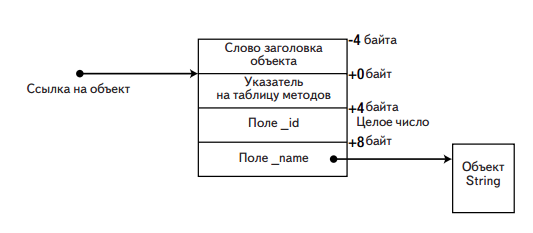
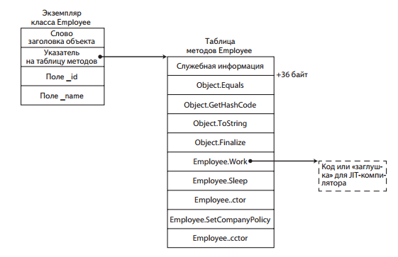
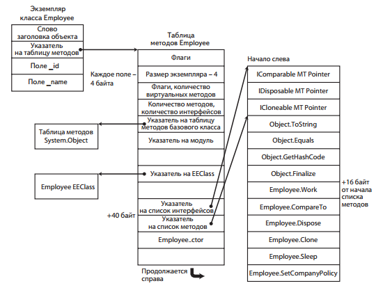
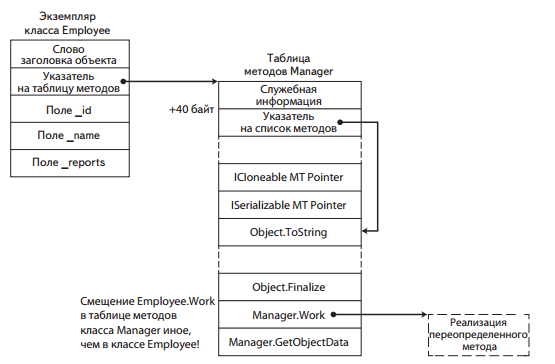
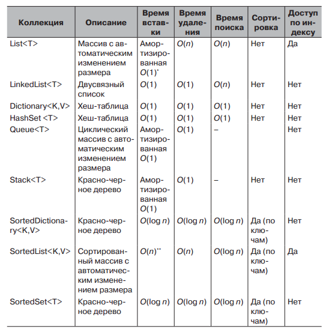

# value/reference types

Если создать структуру с 2 членами типа short, то она будет занимать 4 байта.

Если создать аналогичный класс, то он в 32-битной системе будет занимать 16 байт. 4 байта на члены, 4 байта на ссылку на объект, 4 байта на ссылку на объект типа/указатель на таблицу виртуальных методов и еще 4 - на ссылку на индекс блока синхронизации/заголовок объекта. Фактически, из-за выравнивания памяти, даже объект с единственным полем размером 1 байт, все равно будет занимать в памяти 16 байт.

В 64-битной ссылка на объект, указатель на таблицу методов и заголовок объекта занимают по 8 байт, а обращение к памяти происходит по адресам, кратным 8 (see выравнивание памяти), а значит, объект будет занимать 32 (!) байта.

Если создавать массив с членами типа значения, то процессору будет легче осуществлять последовательный доступ к ним. Если же тип будет ссылочный, то процессору придется постоянно гулять туда-сюда по памяти.

Рассмотрим размещение ссылочного типа в памяти:

```
public class Employee
{
	private int _id;
	private string _name;
	private static CompanyPolicy _policy;
	public virtual void Work() {
		Console.WriteLine("zzzz...");
	}
	public void TakeVacation(int days)
	{
		Console.WriteLine("zzzz...");
	}
	public static void SetCompanyPolicy(CompanyPolicy policy)
	{
		_policy = policy;
	}
}
```



Указатель на таблицу методов ссылается на другую внутреннюю структуру - EEClass (Execution Engine). В MT+EEClass хранится информация, необходимая для выбора виртуального метода, метода интерфейса, статической переменной, определения типа объекта во время выполнения, доступа к методам базового класса и многих других целей. В MT хранится информация, нужная часто, а в EEClass - та, которая редко, например, для рефлексии (можно посмотреть командами !DumpMT и !DumpClass).

Размещение статических полей определяется таблицей EEClass, однако для обращения к статическому полю необязательно обращаться к EEClass, так как их адреса зашиваются в код при компиляции (массив ссылок на статические поля фиксируется в памяти, а статические поля простых типов размещаются в Method Table, чтобы GC их не трогал).



Методы в таблице методов располагаются в следующем порядке:

1.  унаследованные виртуальные (включая переопределенные)
2.  новые виртуальные
3.  невиртуальные
4.  статические

В момент создания таблицы она заполняется заглушками, содержащими инструкцию CALL, которая вызывает JIT-компиляцию метода и затем подставляет вместо заглушки переход JMP на скомпилированный метод.

Более подробное описание таблицы методов:



Методы объектов вызываются, используя Method Table. Допустим, что по адресу EBP-64 хранится адрес объекта Employee. Тогда вот так может быть вызван его метод Work:

```
mov ecx, dword ptr [ebp-64] ; копируем ссылку со стека в ECX, получаем указатель на объект (который указывает на указатель на таблицу методов)
mov eax, dword ptr [ecx] ; разыменовываем ECX, чтобы получить указатель на таблицу методов объекта
mov eax, dword ptr [eax+40] ; из картинки видно, что перечисление методов начинается со смещением в 40 байт
call dword ptr [eax+16] ; метод Work 5-й в списке, то есть 16 байт от начала списка методов.
```

Теперь допустим, что есть класс Manager, наследующий от Employee и к тому же реализующий интерфейс ISerializable. Пусть он переопределяет метод Work:

```
public class Manager : Employee, ISerializable {
	public override void Work() {
		...
	}
	...
}
```

Его таблица методов будет выглядеть так:



Здесь список методов находится на 4 байта ниже, так как в списке интерфейсов добавилась ссылку на ISerializable. Но это привело лишь к тому, что увеличилось на 4 байта значение указателя на список методов, а смещение самого указателя и смещение метода Work в списке методов остались прежними! Вызов manager.Work будет точно таким же:

```
mov ecx, dword ptr [ebp-64] ; копируем ссылку со стека в ECX, получаем указатель на объект (который указывает на указатель на таблицу методов)
mov eax, dword ptr [ecx] ; разыменовываем ECX, чтобы получить указатель на таблицу методов объекта
mov eax, dword ptr [eax+40] ; из картинки видно, что перечисление методов начинается со смещением в 40 байт
call dword ptr [eax+16] ; метод Work 5-й в списке, то есть 16 байт от начала списка методов.
```

До CLR 4.0 список реализуемых интерфейсов всегда находился в конце. Это значило, что во всех наследниках смещение виртуальных методов всегда одно и то же, а значит в конструкции для вызова метода 3-я строчка была не нужна.

Помимо дополнительных инструкция для вызова метода, виртуальные методы так же не могут быть встроены (inline).

Для вызова невиртуальных методов обращение к таблице методов не нужно, так как можно использовать статические адреса методов. Вот так вызывается метод TakeVacation:

```
mov edx, 5 ; кладем в стек аргумент для метода
mov ecx, dword ptr [ebp-64] ; необходимо, чтобы положить в ecx указатель на this
call dword ptr [0x004a1260] ; вызов метода
```

В принципе этих строк было бы достаточно, однако JIT-компилятор вставляет еще одну строчку, чтобы обезопаситься от вызова метода с пустой ссылкой на объект:

```
mov edx, 5 ; кладем в стек аргумент для метода
mov ecx, dword ptr [ebp-64] ; необходимо, чтобы положить в ecx указатель на this
cmp ecx, dword ptr [ecx]
call dword ptr [0x004a1260] ; вызов метода
```

Результат cmp не используется, однако если при попытке разыменования ecx там будет лежать NULL, то произойдет ошибка, которую CLR преобразует в NullReferenceException. (в последних версиях CLR эта строчка не всегда вставляется, так как компилятор может увидеть, что только что вызывался другой метод этого же объекта)

Статические методы вызываются точно так же, как и невиртуальные.

А вот в случае вызова методов интерфейсов все сложнее. Смещение ссылки на "свой" метод в списке методов может меняться как угодно. В предыдущих версиях CLR местоположение методов интерфейсов хранилось в глобальной таблице (уровня AppDomain). В таблице методов по смещению 12 хранилась ссылка на список методов интерфейса в глобальной таблице, а там обратная ссылка на таблицу методов.

Теперь куски этой глобальной таблицы хранятся уже в объекте типа. Вызов метода интерфейса выглядит примерно так:

```
mov ecx, dword ptr [ebp-64] ; получаем ссылку на объект
mov eax, dword ptr [ecx] ; получаем ссылку на таблицу методов
mov eax, dword ptr [eax+12] ; получаем ссылку на таблицу методов интерфейса
mov eax, dword ptr [eax+30h] ; получаем ссылку на начало реализаций методов нашего интерфейса в таблице методов. 30h - смещение интерфейса, вычисляемое на этапе компиляции.
call dword ptr [eax] ; наконец вызываем первый метод интерфейса. Если нужно второй, то адрес будет eax+4. Это тоже вычисляется на этапе компиляции.
```

На самом деле такая многословная конструкция никогда не используется, так как JIT применяет много оптимизаций. Например, может для конкретных часто используемых реализация сразу подставлять адрес метода.

<http://blogs.microsoft.co.il/sasha/2012/03/15/virtual-method-dispatch-and-object-layout-changes-in-clr-40/>

MONO: <https://monoruntime.wordpress.com/2009/04/22/interface-method-dispatch-im-table-and-thunks/>

**UPDATE:** Кажется, инфа по вызовы интерфейсов выше - неактуальна (помимо того что непонятна), так как в современных реализациях CLR вызов идет через Virtual Stub Dispatch (<https://github.com/dotnet/coreclr/blob/master/Documentation/botr/virtual-stub-dispatch.md>). С этим я пока не разобрался. Кажется, это означает механизм кэширования, описанный выше.

# Индекс блока синхронизации

При первом использовании объекта для синхронизации CLR создает блок синхронизации в глобальной таблице блоков синхронизации. Блок синхронизации содержит обратную слабую ссылку на объект и ссылку на механизм синхронизации (монитор). Числовой индекс этого блока сохраняется в слове заголовка объекта. Когда объект будет использован для синхронизации, будет получен его блок синхронизации и взят его монитор.

Когда блок синхронизации долго не используется, GC его удаляет и записывает вместо него недопустимое значение.

При первом использовании GetHashCode() полученный хэш-код в целях оптимизации записывается в заголовок объекта. Когда этот объект будет использован в целях синхронизации, в заголовок объекта записывается индекс блока синхронизации, а хэш-код пишется в сам блок синхронизации. При этом в заголовке есть даже специальный бит, который указывает, занят ли заголовок сейчас индексом блока синхронизации, либо же хэш-кодом объекта.

# Сравнение типов-значений

```
struct Point2D { ... }
Point2D a;
Point2D b;
a.Equals(b); // этот метод, так как определен как виртуальный в object, требует упаковки от a, а так же принимает на вход object, поэтому требует упаковки b.
```

Переопределение метода Equals в Point2D избавит от упаковки a, а добавление метода bool Equals(Point2D c) - от упаковки b.

```
public struct Point2D
{
	public int X;
	public int Y;
	public override bool Equals(object obj)
	{
		if (!(obj is Point2D)) return false;
		Point2D other = (Point2D)obj;
		return X == other.X && Y == other.Y;
	}

	public bool Equals(Point2D other)
	{
		return X == other.X && Y == other.Y;
	}
}
```

А чтобы у нас этот метод всегда использовался, то нужно еще и унаследоваться от IEquatable<Point2D>

Ниже перечислено несколько эффективных приемов, которые следует применять при использовании типов значений для решения некоторых задач:

- используйте типы значений, если объекты достаточно малы и предполагается, что в программе будет создаваться большое их количество;
- используйте типы значений, если требуется высокая плотность размещения их в памяти;
- переопределяйте Equals, определяйте перегруженные версии Equals, реализуйте интерфейс IEquatable<T>, перегружайте операторы == и != в своих типах значений;
- перегружайте GetHashCode в своих типах значений;
- подумайте о возможности сделать свои типы значений неизменяемыми.

## Сборка мусора

<https://github.com/dotnet/coreclr/blob/master/Documentation/botr/garbage-collection.md>

<https://docs.microsoft.com/ru-ru/dotnet/standard/garbage-collection/fundamentals>

Состоит из 3 фаз:

1.  mark - выявляются все объекты, на которые есть ссылки от GC Roots. Чтобы повторно не посещать объекты, GC маркирует их (выставляет флаг в заголовке).
2.  sweep - освобождение памяти, занимаемой неиспользуемыми объектами
3.  compact - перемещение живых объектов, чтобы они располагались в памяти друг за другом

### GC Roots:

- стек
- статичные (глобальные) объекты
- финализируемые объекты
- неуправляемые Interop-объекты (CLR-объекты, принимающие участие в COM/unmanaged вызовах)
- регистры процессора
- другие CLR-объекты со ссылками

Память выделяется очень быстро, так как не нужно искать блок нужного размера, достаточно наращивать указатель.

При JIT-компиляции для каждой локальной переменной в таблицу записывается адрес первой и последней инструкции, где эта переменная остается активным корнем.

Так же при JIT-компиляции в коде расставляются безопасные точки, в которых можно приостановить выполнение потока и начать сборку мусора.

Фаза mark занимается преимущественно чтением, поэтому может выполняться вместе с остальным кодом приложения. Чтобы при этом новые объекты, появившиеся в уже маркированной части графа, не были ошибочно приняты за неиспользуемые, все создания объектов отслеживаются и объекты маркируются. Если объект на самом деле не используется, то ничего страшного - будет очищен на следующейи терации GC.

Фаза чистки уже сложнее, поэтому она не может выполняться одновременно с прикладными потоками (в JVM есть сборщик Azul Pauseless и он - может)

Режимы работы сборщика мусора (<https://blogs.msdn.microsoft.com/seteplia/2017/01/05/understanding-different-gc-modes-with-concurrency-visualizer/>):

- workstation GC - Сборка выполняется для пользовательского потока, запустившего сборку мусора, и сохраняет тот же приоритет. Так как пользовательские потоки обычно выполняются с обычным приоритетом, сборщик мусора (выполняемый для потока с обычным приоритетом) должен конкурировать с другими потоками за время процессора. Потоки, выполняющие машинный код, не приостанавливаются. Если доступно очень много свободной памяти, то SOH не дефрагментируется.
- server GC - разделяет управляемую кучу на сегменты по количеству логических процессоров и запускает для обработки каждого из них по одному потоку с приоритетом HIGHEST.

У обоих режимов есть режимы работы non-concurrent и concurrent. При concurrent сборке поколение 2 постоянно очищается в фоне и потоки приложения при этом не останавливаются. Останавливаются только для сборки поколений 0 и 1, которые очищаются очень быстро.

Background-режим это то же самое, но на потоки приложения накладывается меньше ограничений. Например, в concurrent-режиме сборщик иногда блочит кучу и потоки могут аллоцировать память только в определенном ее сегменте. Если это не подходит, то потоку приходится все-таки приостановиться, пока коллектор не разлочит кучу. В Background-режиме куча не лочится.

А еще во время сборки мусора в поколении 2 прикладные потоки могут аллоцировать память только пока не будет исчерпана память, выделенная для поколений 1 и 0. После этого - блок. В background-режиме сборка мусора может выполняться в поколениях 0 и 1 даже одновременно с полной сборкой мусора. Для этого CLR запускает 2 потока: основной поток сборщика и фоновый. Фоновый очищает поколение 2 и отслеживает запросы на очистку поколений 0/1. Когда получает запрос, он приостанавливается и вызывает основной поток, который блочит прикладные потоки, быстро очищает 0/1 и разблокирует прикладные потоки и фоновый поток обратно.

Начиная с .NET 4 concurrent в workstation GC заменен на background. Начиная с .NET 4.5 background-режим доступен и для серверного сборщика.

Также одним из главных отличий является свойство GCSettings.LatencyMode, доступное с .NET Framework 3.5 SP1 (состоящее из трех режимов).

По-умолчанию, LatencyMode для Workstation Concurrent GC установлен как Interactive, Server – Batch.

Существует еще и LowLatency, но его использование может привести к OutOfMemoryException, т.к. в данном режиме GC Полная сборка мусора происходит только в случае высокой нагрузки на память. Также его нельзя включить для Server GC.

Запуск GC не детерминирован, за исключением вызова метода GC.Collect().

Однако все же существуют приблизительные критерии, по которым можно это предсказать (следует помнить, что нижеперечисленные условия приблизительны и CLR сама приспосабливается к поведению приложения, многое еще зависит и от вида сборщика мусора):

- При достижении поколения Gen0 размера в 256 KB
- При достижении поколения Gen1 размера в 2 MB
- При достижении поколения Gen2 размера в 10 MB

Также сборка мусора запускается при нехватке системной памяти. CLR для этого использует Win32-функции **CreateMemoryResourceNotification** и **QueryMemoryResourceNotification**.

Первоначальный размер каждого сегмента (SOH, LOH) варьируется и зависит от конкретной машины (обычно это 16 MB для десктопа и 64MB для сервера).

В LOH попадают объекты не только размером более 85 000 байт, но также некоторые типы массивов.

Так массив из System.Double при размере 10 600 элементов (85000 / 8 байт) должен попасть в LOH. Однако это происходит уже при размере 1000+.

LOH никогда не дефрагментируется (почти никогда). Это потребовало бы большое количество времени, что может сказаться плохо на работе приложения. Однако это не значит, что CLR начинает потреблять все больше и больше памяти просто так. Во время Full-GC (Gen0, Gen1, Gen2) система все же возвращает ОС память, освобождаясь от уже мертвых объектами из LOH (или дефрагментацией SOH).

Также CLR располагает новые объекты в LOH не только один за другим, как в SOH, например, но и на местах уже свободной памяти, не дожидаясь Full-GC.

### Поколение 0

**От 256 Кб до 4 Мб**. Помимо разрядности операционной системы, на размер поколения 0 влияют также размеры кешей L2 и L3. Размер области может динамически изменяться сборщиком мусора.

Когда новый запрос на выделение памятит не может быть удовлетворен из-за переполненной области поколения 0, инициируется сборка мусора в этой области. В ходе ее выполнения сборщик мусора просматривает только объекты из поколения 0.

Сборка в поколении 0 очень эффективна, потому что:

- поколение 0 немногочисленно и вероятность утилизации крайне высока
- размер поколения зависит от размера кэша процессора, что повышает вероятность попадания объектов поколения 0 в этот кэш
- из-за временной локальности весьва вероятно, что объекты поколения 0 будут ссылаться на другие объекты поколения 0 и лежать рядом с ними
- после сборки память остается в кэше процессора и новые операции выделения памяти и обращения к объектам будут выполняться быстрее

Объекты поколения 0, пережившие сборку мусора, копированием переносятся в поколение 1.

Большое количество закрепленных объектов в поколении 0 приводит к высокой фрагментации памяти. Чтобы этого избежать, CLR может объявить все пространство поколения 0 следующим поколением и выделить новую область памяти для новых объектов, объявив ее поколением 0.

### Поколение 1

**От 512 Кб до 4 Мб**. Когда область для поколения 1 заполняется, запускается процедура сборки мусора в поколении 1. Маркируются и удаляются только объекты из поколения 1.

### Поколение 2

Объем памяти не ограничивается искуственно. Может занимать все пространство, выделяемое операционной системой процессу, то есть, до 2 Гб в 32-битной системе и до 8 Тбайт в 64-битной. Однако пороговые значения, по достижении которых запускается сборка, все-таки определены.

Сборка мусора выполняется по достижении порогового значения в поколении 2 или в LOH.

Сборка мусора в поколении 2 является полной. Она самая долгая и самая неэффективная, поэтому производится реже всех.

### Куча больших объектов

LOH - специальная область, зарезервированная для очень больших объектов (больше 85000 байт). Это значение относится к одному объекту, а не к графу объектов с корнем в одном объекте. То есть, например, объект с 1000 полей типа string по 100 символов, сюда не попадет, так как содержит только 1000 ссылок по 4 Кб. А если ссылок 50000, то уже попадет.

Сборка мусора в LOH выполняется по достижении порогового значения в LOH или в поколении 2.

В LOH для чистки используется другой алгоритм, чтобы избежать копирования больших объектов. GC поддерживает список неиспользуемых блоков памяти и выделяет блоки из этого списка (похоже на malloc, то есть имеет высокую стоимость выделения памяти и высокую стоимость освобождения). То есть в LOH объекты не перемещаются, а, фактически, становятся закрепленными. Но это не гарантируется.

## Ссылки между поколениями

На фазе маркировки при сборке мусора в поколении 0, в целях производительности было бы хорошо не просматривать графы объектов, относящихся к старшим поколениям. Однако это делать нельзя, потому что объект из поколения 1/2 может ссылатсья на объект из поколения 0 и тогда мы не маркируем этот объект и он очистится. Чтобы отслеживать такие ссылки между поколениями, JIT-компилятор находит ситуации, которые могут к этому привести и вставляет вызов JIT_WriteBarrierEAX. Это так называемый "барьер записи". Во время выполнения он проверяет, не относится ли объект-родитель к поколению 1/2 (путем сравнения адреса присваивания с нижней границей области поколения 1). Если да, то пишет 0xFF в таблице, в байт, соответствующий адресу объекта-родителя (в этой таблице каждому Кб соответствует 1 байт, поэтому адрес получается сдвигом адреса объекта на 10 бит вправо).

Сборщик мусора в фазе маркировки проверяет содержимое таблицы, чтобы определить какие диапазоны адресов следует рассматривать как корни для поколения 0. Затем выполняет обход объектов в этом диапазоне и отыскивает в них ссылки на объекты в поколении 0, маркируя их. После этого можно спокойно применять указанную выше оптимизацию, при обходе графа останавливаясь, когда встречаем объект из старшего поколения.

## Эфемерные поколения и сегменты

На запуске процессу выделяется два блока в виртуальной памяти, называемые сегментами сборщика мусора (GC segments). Один из них - эфемерный сегмент. В нем содержится 0 и 1 поколение. Второй сегмент - для LOH.

Так как объекты в поколениях 0 и 1 являются короткоживущими, эти поколения называются эфемерными поколениями. Каждый новый сегмент, полученный сборщиком мусора, становится новым эфемерным сегментом и содержит объекты, пережившие сборку мусора для поколения 0. Старый эфемерный сегмент становится новым сегментом поколения 2.
Объекты поколения 0 и 1 всегда должны содержаться в одном сегменте. Объекты поколения 2 могут использовать несколько сегментов (столько, сколько требуется процессу и сколько разрешает память).

Размер эфемерного сегмента зависит от того, является ли система 32- или 64-разрядной, и от типа сборщика мусора. В таблице ниже представлены значения по умолчанию.


Из-за модели сегментов может возникать OutOfMemoryException на пустом месте. Допустим, после опустошения сегмент вернулся операционной системе, а неуправляемый код аллоцировал для себя память в середине этой области. Тогда второй раз ОС выдать сегмент CLR уже не сможет, так как сегмент должен быть представлен непрерывным диапазоном адресов. Если предположить, что размер сегмента равен 64 Мбайт, точность выделения блоков виртуальной памяти равна 4 Кб, и адресное пространство составляет 2 Гб (32 сегмента), то управляемому коду достаточно выделить 32 Кб \* 4 = 128 Кб памяти, чтобы устроить OOM.

Фрагментацию памяти можно определить с помощью VMMap.

Избежать проблем с фрагментацией памяти можно, используя 64-битную версию процесса в 64-битной ОС. Такие процессы имеют адресное пространство объемом 8 Тб против 4 Гб в 32-битной.

## Финализация

В C# только ссылочные типы могут определить финализатор.

Когда создается объект с финализатором, ссылка на него сразу добавляется в очередь финализации. Эта очередь воспринимается GC как корень, так что даже если не останется ни одной ссылки на объект, он все равно будет удерживаться этой очередью. Когда останется только эта ссылка, GC перемещает ссылку в очередь объектов, готовых к завершению (f-reachable queue), которая тоже воспринимается как корень.

Во время сборки мусора финализация не выполняется. Эту процедуру выполняет специальный finalizer thread (создается при старте CLR, по одному на каждый процесс, с приоритетом HIGHEST). Этот поток постоянно ожидает события финализации, которое посылается если хотя бы один объект перемещается в f-reachable queue. Поток финализации удаляет ссылку из очереди и выполняет финализатор. В следующем цикле GC освободит память объекта.

Зачем такие сложности, почему не вызывать финализатор прям в процессе сборки мусора? А потому что хрен знает, что программисты в финализаторе понаписали, вдруг там слипы, а сборка мусора должна быть быстрой, а то прикладные потоки ждут.

Из всего вышеописанного такие следствия:

- объекты с финализаторами гарантированно достигнут поколения 1;
- создание объекта с финализатором дороже, так как нужно еще добавить его в очередь финализации;
- если финализаторов слишком много, то могут быть утечки, так как объекты будут создаваться быстрее, чем уничтожаться.

Из-за того, что порядок финализации не определен, например, в классе StreamWriter нет метода финализации, так как при освобождении объекта он должен записать содержимое буфера в неуправляемый файловый дескриптор. Если делать это в финализаторе, то на момент его вызова файловый дескриптор уже может быть уничтожен своим финализатором. (для решения таких проблем можно было бы унаследовать дескриптор **FileStream** от **CriticalFinalizerObject** (что он и делает). Этот класс гарантирует, что его "критический" финализатор будет вызван после всех остальных некритических финализаторов)

CLR ограничивает время выполнения финализаторов на этапе завершения процесса или выгрузки домена. Каждому дается по 2 секунды, а всем вместе - 40 секунд.

## Dispose pattern

Нужен на случай, когда мы хотим реализовать IDisposable, при этом защититься от случаев, когда пользователь забывает его вызвать. Для этого нужно реализовать финализатор, но в этом случае объект попытается освободить ресурс дважды.

```
public class ComplexResourceHolder : IDisposable
{
	private IntPtr buffer; // unmanaged memory buffer
	private SafeHandle resource; // disposable handle to a resource
	public ComplexResourceHolder()
	{
		this.buffer = ... // allocates memory
		this.resource = ... // allocates the resource
	}
	protected virtual void Dispose(bool disposing)
	{
		ReleaseBuffer(buffer); // release unmanaged memory
		if (disposing){ // release other disposable objects
			if (resource!= null)
				resource.Dispose();
		}
	}
	~ ComplexResourceHolder()
	{
		Dispose(false);
	}
	public void Dispose()
	{
		Dispose(true);
		GC.SuppressFinalize(this);
	}
}
```

## Триггеры сборки мусора

1.  Заполнение области памяти для поколения 0. Это происходит всякий раз, когда приложение создает новый объект в небольшой области памяти.
2.  Заполнение кучи больших объектов достигло порогового значения. Это происходит при создании больших объектов.
3.  Явный вызов метода GC.Collect.
4.  Операционная система сообщила о нехватке памяти. Для слежения за утилизацией памяти и соблюдения типичных требований, предъявляемых операционной системой, среда CLR использует Win32 API уведомлений.
5.  Выгрузка экземпляра AppDomain.

6.  Завершение процесса (или CLR). В этом случае производится вырожденная сборка мусора – ничто не интерпретируется как корень, объекты не переносятся в старшие поколения и сжатие динамической памяти не производится. Основная цель этого цикла сборки мусора – выполнить методы-финализаторы.

## Дженерики

Для всех дженериков со ссылочным типом T, JIT-компилируется одна и та же реализация методов, так как они все работают с 4-байтовыми ссылками. Однако со значениями так не получится (кто-то весит 4 Кб, а кто-то 8), так что для всех T типа значений, компилируются свои методы.

Преимущество перед шаблонами С++ - можно экспортировать обобщенные типы из сборок

## Коллекции



Проход по T[] выполняется быстрее, чем проход по LinkedList<T> (T типа значения), потому что в случае T[] элементы в памяти лежат подряд и при загрузке первого элемента в кэше процессора остается еще n-1 элементов строчки кэша (процессор загружает в кэш память строками). А в случае с LinkedList<T> помимо элемента лежат еще ссылки Next, и Previous и потом по ссылке на Next еще куда-то идти, то есть кэш вообще особо не задействуется.

## Пул потоков

В CLR 4.0 когда какой-то поток, не принадлежащий пулу, передает задания пулу потоков, они ставятся в глобальную очередь FIFO. А если задание создает поток, уже принадлежащий пулу потоков, то он кладет его в свою локальную очередь LIFO. Когда поток из пула освобождается, он обращается сначала к своей очереди. Когда своя очередь опустеет, он пытается взять задание из локальных очередей других потоков в порядке FIFO. Когда у всех потоков пустеют локальные очереди, они лезут в глобальную очередь FIFO и берут задания оттуда.

Смысл локальных очередей потоков в режиме LIFO - в том, что когда поток пула потоков создает задание, то скорее всего это задание будет использовать те же переменные, что и текущее задание, а значит взяв его сразу же в работу, мы сможем максимально задействовать кэши данных и инструкций.

Помимо этого, беря задание из своей локальной очереди, нужноменьше сихронизации и меньше вероятность конфликта с другими потоками. А когда крадем задание другого потока, то берем ее в режиме FIFO, чтобы тот поток мог продолжать брать с другого конца в режиме LIFO и сохранять свои кэши.

## Многопоточность

Чтение/запись всех простых типов, уменьшающихся в 4 байта, производится атомарно. Это: `bool, char, byte, sbyte, short, ushort, uint, int, float`

Все семейства процессоров, на которых выполняется Windows, поддерживают аппаратный примитив синхронизации compare-and-swap (CAS)</div>

В Intel X86 инструкция называется LOCK CMPXCHG</div>

В C# это операция:

```csharp
public static int CompareExchange(
	ref int location,
	int value,
	int comparand
)
```

Она сравнивает значение по адресу location с comparand и если location == comparand, то делает location = value. Возвращает, в любом случае, прочитанное значение location.

Есть реализации для int, double, long, intptr, object, single и даже T, обменивающий ссылки.</div>

На основании CAS можно реализовать SpinLock:</div>

```csharp
public class SpinLock {
	private volatile int locked;
	public void Acquire()
	{
		while (Interlocked.CompareExchange(ref locked, 1, 0) ! = 0);
	}

	public void Release()
	{
		locked = 0;
	}
}
```

Недостаток:

- попусту расходуется процессорное время
- такая блокировка несправедлива к процессорам. Процессор может вызвать Acquire последним, но все равно получить блокировку первым
- когда один из процессоров наконец получает блокировку, это приводит к актуализации кэша и cache miss на ВСЕХ процессорах

**Актуализация кэша** означает, что когда один из процессоров выполняет запись в память, прочитанную в кеш другим процессором, аппаратное окружение вызывает актуализацию кеша, помечая строку в кеше другого процессора, как недействительную. Попытка обратиться к недействительной строке кеша приводит к промаху.

В ядре Windows используется спинлок с очередью: stack queued spinlock. Такая блокировка гарантирует, что блокировку получит первый процессор. В реализации этой блокировки каждый из процессоров "крутится" вокруг своей области памяти, а процессор, освободивший критический участок, берет первый процессор из очереди и освобождает его блокировку.

В целом на блокировку потока может быть затрачено несколько тысяч тактов процессора, и примерно такое же количество тактов требуется для его разблокировки, когда механизм синхронизации освободится. Очевидно, что если механизм синхронизации в ядре применяется для защиты продолжительной операции, такой как вывод большого буфера в файл или выполнение обмена по сети, накладные расходы на общем фоне будут незаметны, но если механизм синхронизации в ядре применяется для защиты такой операции, как ++i, накладные расходы приведут к непозволительному замедлению.

Чтобы преобразовать поток байт к потоку значений некого типа, можно использовать класс BinaryReader. Например, чтобы прочесть файл как список double, можно сделать FileStream, обернуть его в BinaryReader и у него вызывать ReadDouble()

## JIT-оптимизации

_Как можно отключить jit-оптимизации?_

Во-первых, jit-оптимизации не применяются в режиме сборки Debug.

Но даже с Release можно провернуть следующее:

Нужно создать файл с именем приложения и расширением .ini и добавить в него такие строчки:

```
[.NET Framework Debugging Control]

GenerateTrackingInfo = 1

AllowOptimize = 0
```

Методы, которые никогда не встраиваются:

- методы со сложной структурой вызовов (например, циклы);
- методы, включающие обработку исключений;
- рекурсивные методы;
- методы, имеющие аргументы, локальные переменные или возвращаемые значения; не-примитивных типов значений (начиная с .NET 3.5 некоторые типы значений все же встраиваются)
- методы, размеры тел которых превышают 32 байта на языке IL(это ограничение можно преодолеть с помощью значения MethodImplOptions.AggressiveInlining атрибута [MethodImpl])
