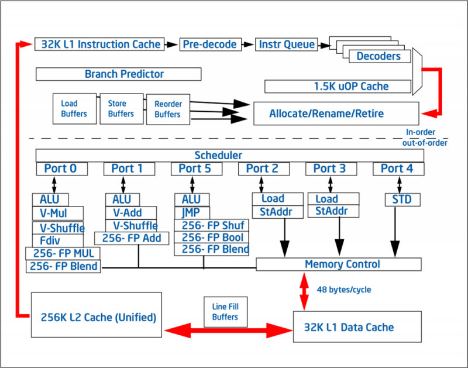
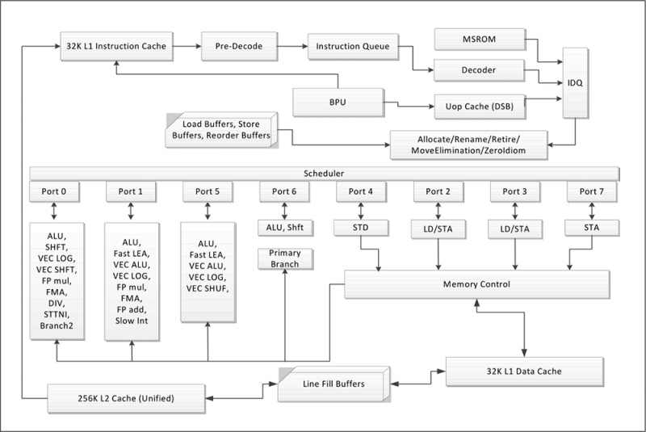
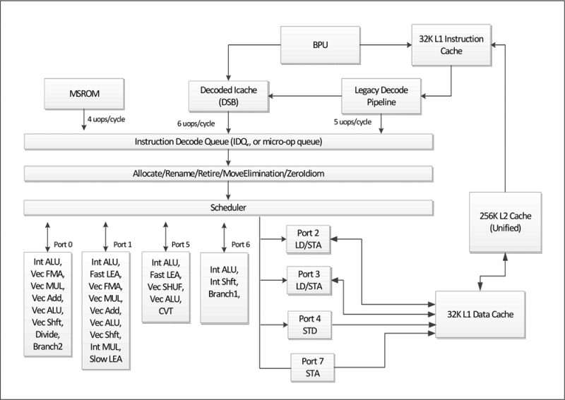

Источники:

https://3dnews.ru/969891

# Зачем уменьшать техпроцесс?

1. Чтобы больше чипов умещалось на кристалле
2. Чтобы уменьшить энергопотребление и теплоотдачу чипов

В 2018 текущий техпроцесс современных процессоров - 14 нм

# Intel

## Стратегия Тик-так

В сентябре 2006 года Intel объявил о своей новой стратегии разработки микропроцессоров, называемой Тик-так.

Цикл разработки делится на две стадии — «тик» и «так»:

**«Тик»** означает уменьшение технологического процесса на основе существующей микроархитектуры.

**«Так»** означает выпуск микропроцессоров с новой микроархитектурой на основе существующего технологического процесса.

По планам Intel, каждая часть цикла должна занимать примерно год.

В 2016 году стратегия была изменена. Теперь Тик – это Процесс, а Так – Архитектура и Оптимизация.

## Современные микроархитектуры

Последней широко используемой (на 4 кв. 2018) микроархитектурой является Coffee Lake.

| Поколение Core |	Кодовое имя			  | Техпроцесс | Этап разработки    | Время выхода |
|----------------|------------------------|------------|--------------------|--------------|
|       1        | Nehalem				  |   45 нм    | Так (Архитектура)  | 4 кв. 2008   |
|       1        | Westmere				  |   32 нм    | Тик (Процесс)      | 4 кв. 2010   |
|       2        | Sandy Bridge			  |   32 нм    | Так (Архитектура)  | I кв. 2011   |
|       3        | Ivy Bridge			  |   22 нм	   | Тик (Процесс)	    | II кв. 2012  |
|       4        | Haswell  			  |	  22 нм	   | Так (Архитектура)  | II кв. 2013  |
|       5        | Broadwell			  |   14 нм	   | Тик (Процесс)	    | II кв. 2015  |
|       6        | Skylake	  			  |   14 нм	   | Так (Архитектура)  | III кв. 2015 |
|       7	     | Kaby Lake  			  |   14+ нм   | Оптимизация        | I кв. 2017   |
|       8	     | Coffee Lake			  |   14++ нм  | Оптимизация        | IV кв. 2017  |
|       8	     | Cannon Lake			  |   10 нм	   | Тик (Процесс)      | 2019         |
|       9        | Coffee Lake Refresh    |   14++ нм  | Так (Архитектура)  | 2019         |

### Nehalem

Вместе с релизом микроархитектуры **Nehalem** в ноябре 2008 года, Intel объявила о своей новой схеме именования процессоров Core. Теперь есть 3 варианта - Core i3, Core i5 и Core i7, но имена больше не отражают какие-либо технические характеристики, как, например, количество ядер. Вместо этого они означают низко-производительные (i3), средне-производительные (i5) и высоко-производительные (i7) процессоры.

В этой микроархитектуре:

- в процессор встроен контроллер памяти DDR3
- встроен контроллер шины PCI Express
- появился разделяемый L3-кэш

### Sandy Bridge

Почти все основные черты, присущие современным массовым CPU от Intel вошли в обиход именно со 2 поколением и архитектурой **Sandy Bridge**.

В этой микроархитектуре:

- появился отдельный кеш нулевого уровня для декодированных микроопераций
- появился физический регистровый файл, снижающий энергозатраты при работе инструкций ветвления
- впервые встроено полноценное графическое ядро
- для соединения ядер и "внеядерных" частей внедрена масштабируемая кольцевая шина, применяемая по сей день
- **самое главное**: впервые реализован подход унифицированная система-на-чипе, которая может быть использована и на десктопе и не сервере и на мобильных устройствах

На уровне архитектуры:

- появилась поддержка инструкций AVX (Advanced Vector Extensions), предназначенных для работы с 256-битными векторами
- кардинальные изменения в branch prediction. Оптимизированы алгоритмы и увеличены буферы, благодаря чему процент миссов сокращен почти вдвое.

Последняя модель - Core i7 2700K с частотой 3,5 ГГц.

### Ivy Bridge

Относился к фазе "тик", поэтому изменений в микроархитектуре почти нет - только перевод старой микроархитектуры на новый 22-нм чип.

Были выполнениы косметические переделки микроархитектуры, ускоряющие операции деления и немного повышена эффективноть Hyper-Threading.

Улучшены "внеядерные" компоненты: контроллер PCI Express получил совместимость с 3 версией протокола, контроллер памяти увеличил возможности и стал поддерживать DDR3.

Рост производительности по отношению к Sandy Bridge составил 3-5%.

Последняя модель - Core i7 3770K, с частотой 3,5 ГГц, то есть такая же как и у предыдущего поколения. Но зато уменьшилось энергопотребление.

Также уменьшились возможности для разгона, так как начиная с этой модели перестала использоваться бесфлюсовая пайка и произошел переход на термопасту.

### Haswell

Основное:

- IPC (instructions per cycle) вырос на треть
- появилось 2 дополнительных исполнительных порта для целочисленных операций, ветвлений и генерации адресов
- получена совместимость с AVX2, которые благодаря 3-операндным FMA-командам увеличили пиковую пропускную способность вдвое
- увеличена емкость некоторых внутренних буферов
- увеличено окно планировщика
- увеличены регистровые файлы, что улучшило возможности по переупорядочиванию инструкций
- L1- и L2-кеши получили вдвое более широкую шину

Проблемы:

- оставлена без изменений входная часть исполнительного конвейера
- декодер x86-команд сохранил ту же производительность

Без использования AVX2-инструкций прирост производительности составил 5-10%.

Последняя модель Core i7-4770K опять получила 3.5 ГГц

У Intel появились проблемы с новым техпроцессом, поэтому через год была представлена вторая очередь Haswell, называемая Haswell Refresh или Devil's Canyon.

В этой микроархитектуре благодаря косметическим изменениям в схеме питания и улучшению теплопроводящих свойств термопасты были заметно увеличены тактовые частоты на 22-нм чипе. Старшая модель Core i7-4790K получила 4,0 ГГц.

### Broadwell

В CPU было интегрировано самое мощное на тот момент видеоядро Iris Pro GT3e. Для его работы потребовалось внедрить дополнительный 22-нм кристалл Crystall Well, представляющий собой основанную на eDRAM кеш-память L4. Он был необходим для графядра, но им могли пользоваться и ядра CPU.

В результате десктопные Broadwell стали единственными массовыми процессорами с 128 МБайт L4-кеш. Правда при этом объем L3-кеша пришлось уменьшить с 8 до 6 МБайт.

Немного изменена входная часть исполнительного конвейера:

- увеличено окно планировщика
- в 1,5 раза вырос объем таблицы ассоциативной трансляции адресов второго уровня
- добавлен второй обработчик промахов, что позволило обрабатывать по 2 операции преобразования адресов параллельно

В сушше эти изменения повысили эффективность внеочередного исполнения команд и предсказания сложных ветвлений кода. Попутно улучшены механизмы умножения.

По итогам производительность увеличена на 5% несмотря на то, что это был этап "Тик".

Но несмотря на все это, из-за проблем с техпроцессом у этого поколения были очень низкие частоты. Старшая модель Core i7-5775C имела 3,3 ГГц, что было ниже предыдущего поколения на 700 МГц.

### Skylake

Была проведена работа по усовершенствованию слабых мест исходной архитектуры Core:
- увеличены внутренние буфера для более глубокого внеочередного исполнений инструкций
- увеличена пропускная способность кеш-памяти
- усовершенствован блок предсказания переходов
- усовершенствована входная часть исполнительного конвейера
- увеличен темп выполнения инструкций деления
- перебалансированы механизмы исполения операций сложения, умножения, FMA.
- повышена эффективность Hyper-Threading

В целом производительность повышена на 10%.

Здесь Intel смогла добиться нормальных тактовых частот - Core i7-6700K получила 4,0 ГГц.

В целом Skylake можно охарактеризовать как достаточно глубокую оптимизацию исходной архитектуры Core, с таким расчётом, чтобы в дизайне процессора не оставалось никаких узких мест. 

Например, Haswell и Broadwell имели по два порта для исполнения умножений и FMA-операций над вещественными числами, но только один порт предназначался для сложений, что плохо соответствовало реальному программному коду. В Skylake этот дисбаланс был устранён и сложения стали выполняться уже на двух портах. Кроме того, количество портов, способных работать с целочисленными векторными инструкциями, выросло с двух до трёх. В конечном итоге всё это привело к тому, что практически для любого типа операций в Skylake всегда есть несколько альтернативных портов. А это значит, что в микроархитектуре наконец были успешно устранены практически все возможные причины простоя конвейера.

Заметные изменения затронули и подсистему кеширования: пропускная способность кеш-памяти второго и третьего уровня была увеличена. Кроме того, сократилась ассоциативность кеша второго уровня, что в конечном счёте позволило улучшить его КПД и уменьшить штраф при обработке промахов.

Существенные перемены произошли и на более высоком уровне. Так, в Skylake вдвое выросла пропускная способность кольцевой шины, которая соединяет все процессорные блоки. Кроме того, в CPU этого поколения обосновался новый контроллер памяти, который получил совместимость с DDR4 SDRAM. А в дополнение к этому для соединения процессора с чипсетом стала применяться новая шина DMI 3.0 с увеличенной вдвое пропускной способностью, что дало возможность реализовать скоростные линии PCI Express 3.0 в том числе и через чипсет.

Впрочем, как и все предшествующие версии архитектуры Core, Skylake представлял собой ещё одну вариацию на тему изначального дизайна. А это значит, что и в шестом поколении микроархитектуры Core разработчики Intel продолжили придерживаться тактики поэтапного внедрения улучшений на каждом цикле разработки. В целом это – не слишком впечатляющий подход, который не позволяет увидеть какие-то значимые изменения в производительности сразу – при сравнении CPU из соседних поколений. Но зато при модернизации старых систем ощутимый прирост производительности заметить совсем несложно. Например, сама Intel охотно сравнивала Skylake с Ivy Bridge, демонстрируя при этом, что за три года быстродействие процессоров выросло более чем на 30 процентов.

И в действительности это был достаточно серьёзный прогресс, потому что потом всё стало значительно хуже. После Skylake какое бы то ни было улучшение удельной производительности процессорных ядер прекратилось совсем. Те процессоры, которые представлены на рынке в настоящее время, всё ещё продолжают использовать микроархитектурный дизайн Skylake, несмотря на то, что с момента его появления в десктопных процессорах прошло уже почти три года. Неожиданный простой случился из-за того, что Intel не смогла справиться со внедрением следующей версии полупроводникового процесса с 10-нм нормами. В результате весь принцип «тик-так» рассыпался, вынудив микропроцессорного гиганта как-то выкручиваться и заниматься многократным перевыпуском старых продуктов под новыми именами.

### Kaby Lake

Intel честно говорила, что это уже не "тик" и не "так", а оптимизация предыдущего дизайна. Под оптимизацией понимались улучшения в структуре 14-нм транзисторов, которые открывали возможность увеличения тактовых частот без изменения рамок теплового пакета. Для измененного техпроцесса придуман термин "14+ нм".

Старшая модель Core i7-7700K получила частоту 4,2 ГГц (4,5 ГГц - в турборежиме).

### Coffee Lake

К 2018 году техпроцесс 10-нм все еще не был внедрени на базе Skylake была выпущена новая разновидность процессоров - Coffee Lake.

Но говорить о Coffee Lake как о третьем обличье Skylake не совсем правильно. Прошлый год стал периодом кардинальной смены парадигмы на процессорном рынке. В «большую игру» вернулась AMD, которая смогла переломить устоявшиеся традиции и создать спрос на массовые процессоры с числом ядер более четырёх. Внезапно Intel оказалась в роли догоняющей, и выход Coffee Lake стал не столько попыткой заполнить паузу до долгожданного появления 10-нм процессоров Core, сколько реакцией на выход шести- и восьмиядерных процессоров AMD Ryzen.

В результате впервые число ядер увеличено до 6, но никаких изменений на уровне микроархитектуры введено не было, так что Coffe Lake - это только лишь 6-ядерный Skylake с увеличенным до 12 МБайт L3-кешем (чтобы было по 2 МБ на ядро).

Старшая модель Core i7-8700K получила частоту 3,7 ГГц, но в турборежиме разгонялся до 4,7 ГГц, то есть почти не замедлился, несмотря на увеличение количества ядер.

Все это стало возможным благодаря очередному улучшению техпроцесса, который на этот раз назвали "14++ нм". Перекомпоновка полупроводникового кристалла позволили существенно улучшить производительность в пересчёте на каждый затраченный ватт и поднять суммарную вычислительную мощность. Внедрением шестиядерности Intel, пожалуй, смогла совершить даже более значительный шаг вперёд, чем любым из предшествующих тому улучшений микроархитектуры. И сегодня Coffee Lake смотрится весьма соблазнительным вариантом для модернизации старых систем, основанных на предыдущих носителях микроархитектуры Core.

### Cannon Lake

В начале 2018 года Intel наконец анонсировала процессор на 10-нм техпроцессе.

Из известных улучшений: 
- внедрена моддержка инструкций AVX-512
- поддержка памяти LPDDR4

Пока существует только одна модель мобильного процессора Core i3-8121U с 2 ядрами, 4 потоками и частотой 2,2 ГГц, но без графического ядра. Остальные модели ожидаются в 2019 году.

### 9 поколение

В конце 2018 года Intel представила новые процессоры 9-го поколения. Представлена новая линейка - Core i9. Первый представитель - Core i9-9900K имеет 8 ядер, 16 потоков, базовую частоту 3,6 ГГц, турбо частоту 5,0 ГГц. Контроллер памяти по прежнему рассчитан на DDR4-2666. Кэш L3 по прежнему имеет 2 МБ на ядро, то есть в общем 16 МБ кэша. 

Core i7-9700K тоже имеет 8 ядер, но больше не поддерживает Hyper-threading, то есть у него 8 потоков. Базовая частота 3,6 ГГц, турбо - 4,9 ГГц. Кэш L3 впервые сокращен до 1,5 МБ на ядро, то есть при 8 ядрах - 12 МБ кэша L3. 

Так же в процессорах 9-го поколения термопаста будет заменена на пайку, что увеличит возможности для разгона.