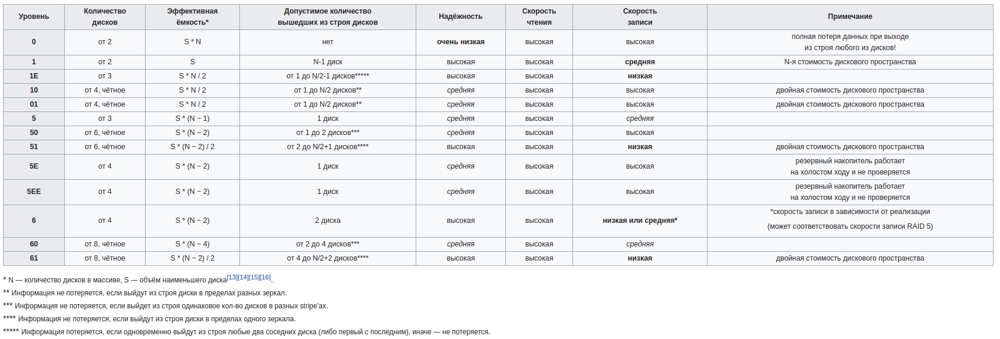

Источники:

- https://medium.com/databasss/on-disk-io-part-1-flavours-of-io-8e1ace1de017

# Disk IO

**Блочное устройство**- вид файла устройств, обеспечивающий интерфейс к HDD или SSD в виде файла в файловой системе. Блочные устройства работают с **секторами** на диске, то есть группами соседних байт. 

**Сектор** - это минимальная единица передачи данных для блочного устройства, меньше чем один сектор передать через него нельзя. Большинство дисков имеют сектора размером 512 байт. 

**Блок** - минимальная адресуемая единица файловой системы. Блок это группа нескольких соседних секторов, запрашиваемая драйвером устройства. Обычно блоки имеют размер 512, 1024, 2048 и 4096 байт. 

Обмен данными с диском обычно происходит через виртуальную память, которая кэширует блоки файловой системы в памяти и служит буфером для промежуточных операций. Типичный размер страницы - 4096 байта.

В результате, *при работе с диском страницы виртуальной памяти мапятся на блоки файловой системы, которые мапятся на сектора блочного устройства*.

## Standard IO

Стандартный IO использует сисколлы *read()* и *write()*. 

При чтении данных сначала идет обращение к Page Cache линукса. Если данных там нет, то триггерится *Page Fault*, обработчик исключения загружает данные с диска в память и данные возвращаются пользователю. Если кэш страниц заполнен, то самые старые страницы флашатся на диск и исключаются из кэша.

При записи, содержимое буфера сначала пишется в *Page Cache* в памяти, а страница помечается как грязная. Ядро запишет эти изменения на диск в процессе флаша. *read()* при этом будет возвращать всегда актуальные данные, даже если они еще не записаны на диск, потому что он читает их из кэша.

Существование кэша страниц объясняется принципом темпоральной локальности, который гласит, что данные, к которым недавно обращались, скорее всего, скоро понадобятся еще раз.

Если нужно писать/читать с диска в обход кэша, то можно использовать флаг **O_DIRECT** при открытии файла. Обычно это ухудшит производительность, но иногда это оправдано. Например, PostgreSQL использует O_DIRECT для WAL, так как нужно записать в него данные как можно быстрее, иметь гарантии записи и плюс к этому мы знаем, что эти данные не будут вскоре использованы еще раз.

# RAID

Существуют следующие уровни спецификации RAID:

## RAID 0

Дисковый массив повышенной производительности с чередованием, без отказоустойчивости. Строго говоря, RAID-массивом не является, поскольку избыточность (redundancy) в нём отсутствует. Информация разбивается на блки данных фиксированной длины и записывается на диски поочередно, то есть один блок на первый диск, второй на второй и т.д.

+ увеличивается скорость считывания файлов
- увеличивается вероятность потери данных

## RAID 1

Зеркальный дисковый массив - массив из 2 или более дисков, являющихся полными копиями друг друга.

+ обеспечивает приемлемую скорость записи и выигрыш при чтении при распараллеливании запросов
+ имеет высокую надежность - работает, пока функционирует хотя бы один диск
- по цене двух дисков пользователь фактически получает объем одного

## RAID 2

На практике используется очень редко.

Диски делятся на 2 группы: для данных и для кодов коррекции ошибок, причем если данные хранятся на `2^n - n - 1` дисках, то для хранения кодов коррекции необходимо `n` дисков. Суммарное количество дисков будет равняться `2^n - 1`. Данные распределяются по дискам так же, как и в RAID 0, но разделение идет не по блокам, а по битам. Каждый бит пишется на разный диск. Оставшиеся диски хранят коды коррекции ошибок, по которым в случае выхода какого-либо диска из строя возможно восстановление информации. 

+ повышение скорости дисковых операций по сравнению с производительностью 1 диска
- минимальное количество дисков, при котором имеет смысл его использовать - 7, где 4 диска будут с данными, а 3 - с кодами коррекции.
- вращение дисков должно быть синхронизировано, чтобы нужной позиции они достигали одновременно. Поэтому невозможно обслуживать несколько запросов одновременно.

## RAID 3

Дисковый массив с чередованием и выделенным диском четности.

В массиве из `n` дисков данные разбиваются на куски размером меньше сектора (разбиваются на байты) и распределяются по `n-1` дискам. Еще один диск используется для хранения блоков четности. 

В RAID 2 использование большего количества дисков с метаданными давало возможность корреции ошибок на лету, однако оказалось что большинству пользователей это не нужно и достаточно простого восстановления информации в случае ее повреждения.

+ высокая скорость чтения и записи данных
+ минимальное количество дисков равно 3
- хорош только для однозадачной работы с большими файлами, так как время доступа к отдельному сектору, разбитому по дискам, равно максимальному из интервалов доступа к секторам каждого из дисков. Для блоков малого размера время доступа намного больше времени чтения.
- большая нагрузка на контрольный диск, из-за чего его надежность сильно падает

## RAID 4

Пожох на RAID 3, но отличается тем, что данные разбиваются на блоки, а не на байты. Таким образом удалось победить проблему низкой скорости передачи данных небольшого объема.

Запись же производится медленно из-за того, что чётность для блока генерируется при записи и записывается на единственный диск.

## RAID 5

Основным недостатком уровней RAID от 2-го до 4-го является невозможность производить параллельные операции записи, так как для хранения информации о чётности используется отдельный контрольный диск. RAID 5 не имеет этого недостатка. Блоки данных и контрольные суммы циклически записываются на все диски массива, нет асимметричности конфигурации дисков. Под контрольными суммами подразумевается результат операции XOR (исключающее или). Xor обладает особенностью, которая даёт возможность заменить любой операнд результатом, и, применив алгоритм xor, получить в результате недостающий операнд. Например: a xor b = c (где a, b, c — три диска рейд-массива), в случае если a откажет, мы можем получить его, поставив на его место c и проведя xor между c и b: c xor b = a. Это применимо вне зависимости от количества операндов: a xor b xor c xor d = e. Если отказывает c, тогда e встаёт на его место и, проведя xor, в результате получаем c: a xor b xor e xor d = c. Этот метод по сути обеспечивает отказоустойчивость 5 версии. Для хранения результата xor требуется всего 1 диск, размер которого равен размеру любого другого диска в RAID.

Минимальное количество используемых дисков равно трём.

+ получил широкое распространение, в первую очередь благодаря своей экономичности. Объём дискового массива RAID 5 рассчитывается по формуле `(n-1)*hddsize`, где n — число дисков в массиве, а hddsize — размер диска (наименьшего, если диски имеют разный размер). Например, для массива из четырёх дисков по 80 гигабайт общий объём будет `(4 − 1) * 80 = 240 гигабайт`, то есть «потеряется» всего 25 % против 50 % RAID 10. И с увеличением количества дисков в массиве экономия (по сравнению с другими уровнями RAID, обладающими отказоустойчивостью) продолжает увеличиваться.

+ RAID 5 обеспечивает высокую скорость чтения — выигрыш достигается за счёт независимых потоков данных с нескольких дисков массива, которые могут обрабатываться параллельно.

- Производительность RAID 5 заметно ниже на операциях типа Random Write (записи в произвольном порядке), при которых производительность падает на 10-25 % от производительности RAID 0 (или RAID 10), так как требует большего количества операций с дисками (каждая операция записи, за исключением так называемых full-stripe write-ов, заменяется на контроллере RAID на четыре — две операции чтения и две операции записи).

- При выходе из строя одного диска надёжность тома сразу снижается до уровня RAID 0 с соответствующим количеством дисков n-1 — то есть в n-1 раз ниже надёжности одного диска — данное состояние называется критическим (degrade или critical). Для возвращения массива к нормальной работе требуется длительный процесс восстановления, связанный с ощутимой потерей производительности и повышенным риском.

## RAID 6

RAID 6 — похож на RAID 5, но имеет более высокую степень надёжности — три диска данных и два диска контроля чётности. Основан на кодах Рида — Соломона и обеспечивает работоспособность после одновременного выхода из строя любых двух дисков. Обычно использование RAID-6 вызывает примерно 10-15 % падение производительности дисковой группы, относительно RAID 5, что вызвано бо́льшим объёмом работы для контроллера (более сложный алгоритм расчёта контрольных сумм), а также необходимостью читать и перезаписывать больше дисковых блоков при записи каждого блока.

## RAID 10

массив RAID 0, построенный из массивов RAID 1

## RAID 01

массив RAID 1, построенный из массивов RAID 0 (имеет низкую отказоустойчивость)

## Сравнение уровней RAID

