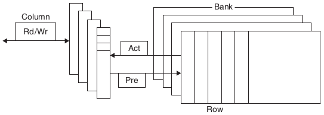
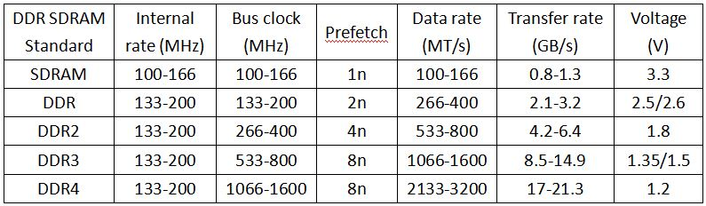

# Иерархия памяти

Сегодня существуют 4 основных технологии памяти. Основная память использует DRAM (dynamic random access memory), кэши процессора используют SRAM (static random access memory). DRAM намного дешевле, но и намного медленнее, чем SRAM. Разница в цене возникает из-за того, что SRAM использует намного большую площадь для каждого слова памяти, то есть намного меньшую плотность хранения данных.

Третья технология - флэш-память. Обычно используется как вторичная память в мобильных устройствах. И, наконец, четвертая - магнитные диски. В этой статье диск не рассматривается

```
Latency Comparison Numbers (~2012)
----------------------------------
L1 cache reference                           0.5 ns
Branch mispredict                            5   ns
L2 cache reference                           7   ns                      14x L1 cache
Mutex lock/unlock                           25   ns
Main memory reference                      100   ns                      20x L2 cache, 200x L1 cache
Compress 1K bytes with Zippy             3,000   ns        3 us
Send 1K bytes over 1 Gbps network       10,000   ns       10 us
Read 4K randomly from SSD*             150,000   ns      150 us          ~1GB/sec SSD
Read 1 MB sequentially from memory     250,000   ns      250 us
Round trip within same datacenter      500,000   ns      500 us
Read 1 MB sequentially from SSD*     1,000,000   ns    1,000 us    1 ms  ~1GB/sec SSD, 4X memory
Disk seek                           10,000,000   ns   10,000 us   10 ms  20x datacenter roundtrip
Read 1 MB sequentially from disk    20,000,000   ns   20,000 us   20 ms  80x memory, 20X SSD
Send packet CA->Netherlands->CA    150,000,000   ns  150,000 us  150 ms

Notes
-----
1 ns = 10^-9 seconds
1 us = 10^-6 seconds = 1,000 ns
1 ms = 10^-3 seconds = 1,000 us = 1,000,000 ns
```

## SRAM

На один бит используется 6-8 транзисторов. 

Данные хранятся по принципу "остаточной информации", то есть им не требуется обновление, как в DRAM. Именно поэтому эта память называется статической. Тем не менее, SRAM все еще энергозависимая память и данные будут потеряны при отключении энергии. Но энергии при этом требуется минимальное количество.

Является истинной памятью с произвольным доступом, так как доступ к любому биту осуществляется за одинаковое время.

Особенностью является непредсказуемое (произвольное) содержимое памяти после включения питания.

Широко используется в качестве регистров и кеш-памяти в процессорах.

## DRAM

В DRAM значение хранится как заряд конденсатора. Для чтения или записи заряда используется 1 транзистор на бит. Так как конденсатор разряжается с каждым чтением, то его нужно периодически обновлять - читать данные и перезаписывать без изменений. Именно поэтому такой вид памяти называется динамическим.

Обновление должно происходить каждые 64 мс. Чтобы избежать одной крупной остановки, процесс разделен на 8192 меньшие операции, по количеству строк. Интервал между ними равен 64 мс / 8192 = 7,81 мкс. После каждой такой мелкой операции обновляется 1 строка памяти.

Длительность регенерации в конденсаторе - несколько миллисекунд. Данные обновляются не по одному биту, а целыми линиями за 2 такта - такт чтения и такт записи.

Регенерация существенно тормозит работу системы, поскольку во время ее осуществления обмен данными с памятью невозможен.

На схеме изображена внутрення организация DRAM:



Память DRAM разделена на несколько банков (4 для DDR3), каждый банк состоит из набора линий.

### Адресация

На этой схеме изображен принцип адресации в DRAM:


В каждой ячейке памяти хранится 1 слово данных (4 байта).

В DRAM поступает адрес слова, верхняя половина битов адреса идет на вход демультиплексора RAS, а нижняя - на сигналы управления мультиплексором CAS. На выходе Data получается 1 слово.

### Технические детали адресации

У памяти DRAM есть 4 основных временных характеристики:

| Имя параметра                       | Обозначение |                                                                  |
|-------------------------------------|-------------|-----------------------------------------------
| CAS-латентность                     |    **CL**   | Задержка между отправкой в память адреса столбца и началом передачи данных. Время, требуемое на чтение первого бита из памяти, когда нужная строка уже открыта. |
| Row Address to Column Address Delay |    **RCD**  | Число тактов между открытием строки и доступом к столбцам в ней. Время, требуемое на чтение первого бита из памяти без активной строки — RCD + CL. |
| Row Precharge Time                  |    **RP**   | Число тактов между командой на предварительный заряд банка (закрытие строки) и открытием следующей строки. Время, требуемое на чтение первого бита из памяти, когда активна другая строка — RP + RCD + CL. |
| Row Active Time                     |    **RAS**  | Число тактов между командой на открытие банка и командой на предварительный заряд. Время на обновление строки. Накладывается на RCD. Обычно примерно равно сумме трёх предыдущих чисел. |

RCD обычно в несколько раз больше CL, поэтому обращение к строке - это самая длительная операция.

Модули DDR обычно описываются в следующей нотации: w-x-y-z-T. Например, 2-3-2-8-T1. Это означает:

- w 2 CL
- x 3 RCD
- y 2 RP
- z 8 RAS
- T T1 частота команд

Используя эти 5 констант, можно посчитать производительность модуля памяти.

На следующей схеме изображен процесс чтения из памяти:


В SDRAM такты синхронизированы с тактами процессора. Обычно один такт памяти соответствует нескольким тактам процессора. Такты памяти - это верхняя строчка CLK. Сигналы читаются на восходящем краю такта. 

1. Сначала на адресную шину подается старшая половина адреса и на RAS подается 0. После этого чип RAM начинает активировать указанную строку.
2. Ждем задержку RCD прежде чем к столбцам строки можно будет получить доступ
3. Теперь на ту же шину данных подаем младшую половину адреса, а на CAS подаем 0. 
4. Ждем задержку CL прежде чем из памяти будет прочитан первый бит.
5. Биты пошли на выход DQ со скоростью 1 слово за такт. Если бы это была DDR, то было бы 2 слова за такт.

Было бы расточительно проводить столько предварительной работы для чтения каждого бита, поэтому контроллеру памяти можно указать, сколько слов надо прочитать. Обычно это 2, 4 или 8 слов. Это позволяет заполнять целые линии кэша без новой адресации. 

Также мы видим, что читать последовательные данные быстрее, потому что нужно изменять только CAS, а RAS можно оставлять нетронутым.

После того, как мы прочитали нужные слова, нам нужно обратиться к другой области памяти. Прежде чем будет отправлен новый RAS, нужно пройти этапы Precharge и Activation.


На схеме выше изображен наш предыдущий процесс чтения данных, начиная с сигнала CAS. 

Команда Precharge здесь посылается как только началось чтение, но это только потому что она время RP (3 такта) больше времени, необходимого для чтения (2 такта). Чтение данных и prefetch могут пересекаться, но в нашем случае после завершения чтения пришлось подождать еще 1 такт. После завершения задержки RP можно начинать процесс адресации сначала, с установки битов строки.

Есть еще один важный тайминг: **RAS**. Он определяет минимальное время между открытием строки и командой Prefetch. Этот тайминг обычно довольно большой (в 2-3 раза больше RP) и может затормозить нам чтение, если мы завершаем чтение в строке через несколько тактов и хотим отправиться к другой строке. Тогда придется сначала закрыть текущую строку, то есть послать команду precharge, а для этого может понадобиться подождать пару тактов (пока не пройдет RAS).

### Типы памяти

#### SDR 

Данные отправляются 1 раз за такт. Если частота работы шины равна 100МГц, то шина может передавать 100 МБит в секунду.

#### DDR1

Данные посылаются на росте и на спаде сигнала в такте, то есть 2 раза за такт. Чтобы это было возможным, нужно встроить буфер. Этот буфер работает как SRAM и содержит 2 бита для каждой линии, а шина данных состоит из 2 линий. При чтении любой ячейки памяти осуществляется "предзагрузка" (prefetch) следующей ячейки и в буфер кладутся сразу две.

Так как частота не изменилась, то новой качественной характеристикой стало количество данных в секунду. Например, если DDR1 модуль имеет частоту 100 МГц и 64-битную шину (на самом деле шина всегда 64-битная), то такой модуль может передавать: 

`100 МГц * 64 бит * 2 = 1600 МБайт/сек`

Поэтому модуль DDR с частотой 100 МГц называется PC1600.

#### DDR2

На этот раз удвоили частоту шины. Для этого пришлось буферу сохранять не 2, а 4 бита в каждом такте. Префетч составил 4 слова. Итоговые задержки выше, чем у DDR, поэтому поначалу общая производительность была не выше, чем у DDR. Конкурентноспособной память стала только через 4 года, когда появились модули с малыми задержками.

#### DDR3

Опять удвоили частоту шины и размер буфера. Теперь минимальный размер чтения/записи составляет 8 последовательных слов. Задержки опять увеличились по сравнению с DDR2.

### DDR4

На этот раз не стали трогать размер предзагрузки слов, а вместо этого удвоили количество внутренних банков, что позволило увеличить частоту шины. В перспективе пропускная способность может достигать 25,6 ГБ/с (если частота будет повышена до 3200 МГц). Кроме того, повышена надёжность работы за счёт введения механизма контроля чётности на шинах адреса и команд.



### DIMM

Память для серверов обычно продается в форм-факторе **DIMM (dual inline memory module)**. DIMM обычно состоит из 4-16 модулей DRAM, которые обычно имеют линии шириной 8 байт. 
