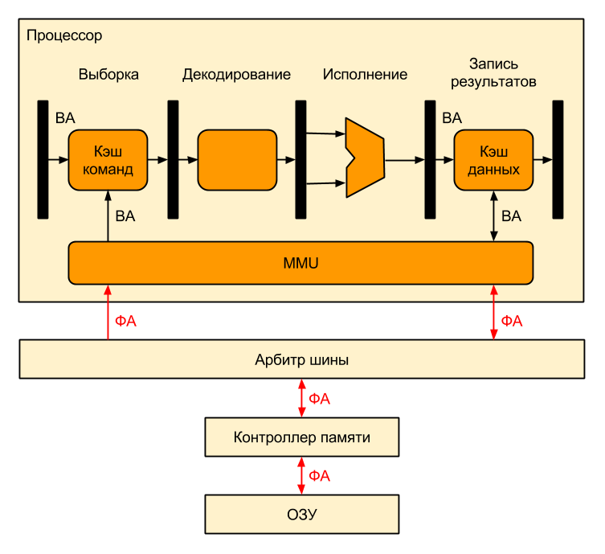
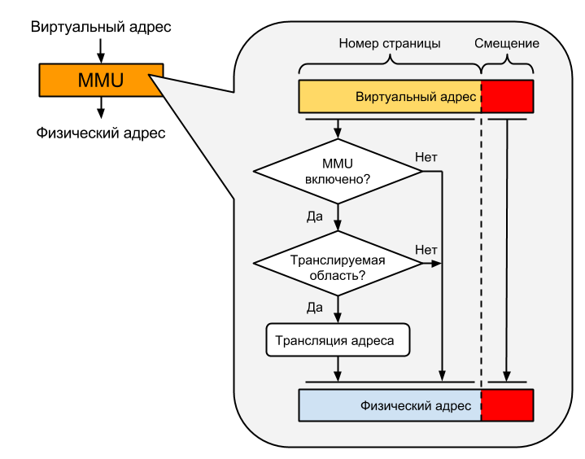
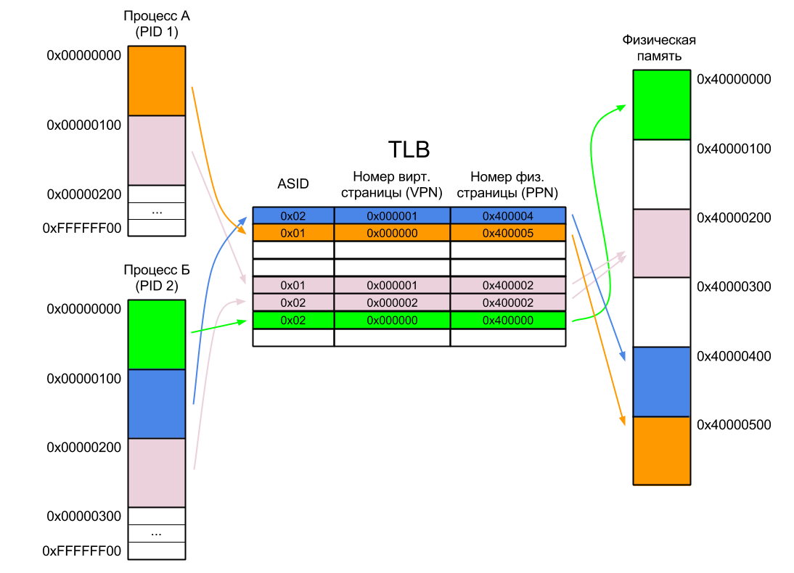
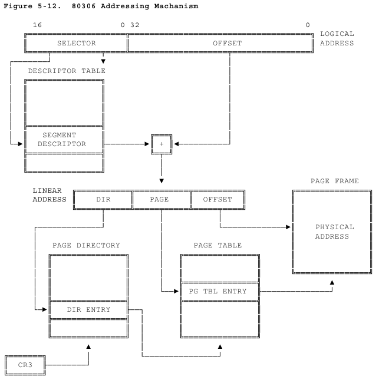
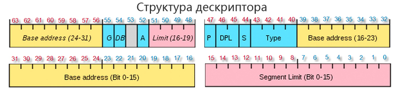
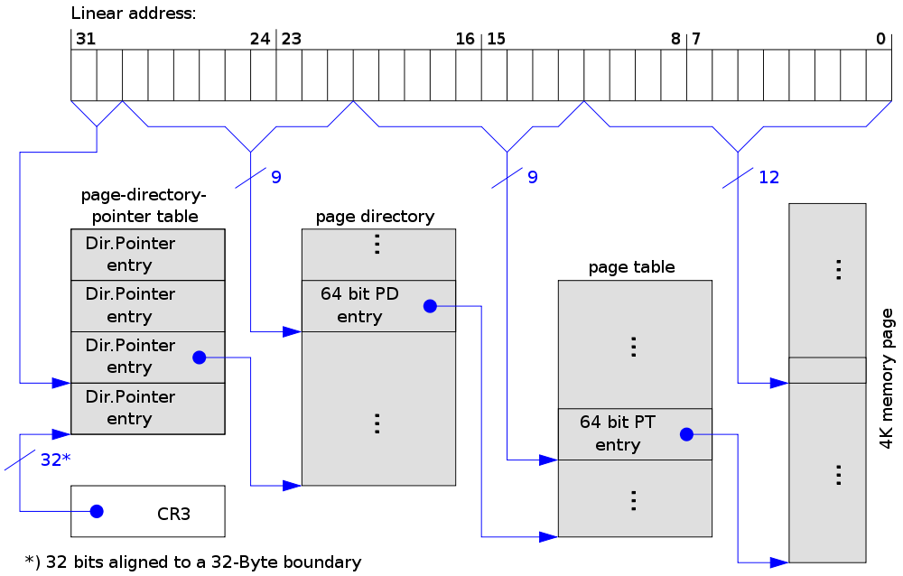

Источники:

- https://ru.wikipedia.org/wiki/Виртуальная_память
- https://ru.wikipedia.org/wiki/Подкачка_страниц
- https://habr.com/company/intel/blog/238091/
- https://habr.com/post/128991/
- https://habr.com/post/211150/

# Виртуальная память

В системе с виртуальной памятью используемые программами адреса, называемые виртуальными адресами, транслируются в физические адреса памяти компьютера. Эту трансляцию выполняет специальный блок процессора или чипсета, называемый **MMU (memory management unit)**. Для программы основная память выглядит как непрерывное адресное пространство вне зависимости от наличия у компьютера соответствующего объема оперативной памяти. Соотнесением физический и виртуальной памяти, перемещением фрагментов между основным и вторичным хранилищами занимается операционная система.

## Основные термины

- **Реальный режим работы процессора** - Режим работы процессоров, когда нет виртуальной памяти, а любому процессу доступна вся память компьютера. До появления процессоров 80286 это был единственный режим работы.
- **Защищенный режим работы процессора** - Режим работы, использующий механизм виртуальной адресации памяти. 
- **Своп/подкачка страниц** - механизм виртуальной памяти, когда отдельные неактивные фрагменты памяти перемещаются из ОЗУ на диск, освобождая ОЗУ для загрузки других активных фрагментов памяти. Такими фрагментами являются страницы памяти.
- **Страничная память** - Способ организации виртуальной памяти, при котором единицей отображения виртуальных адресов на физические является регион постоянного размера - страница. Типичный размер страницы - 4 КБ.

Страницы памяти являются минимальной единицей выделяемой памяти, то есть даже запрос на 1 байт от приложения приведет к выделению ему страницы памяти. Пользовательский поток обращается к памяти с помощью адреса виртуальной памяти, который делится на номер страницы и смещение внутри страницы.

## Принцип работы

Процессор преобразует номер виртуальной страницы в адрес соответствующей ей физической страницы при помощи буфера **TLB (translation look-aside buffer)**. 

Если это сделать не удалось, то нужно дозаполнить буфер, обратившись к таблице страниц (т.н. Page Walk), что делает либо сам процессор, либо ОС. 

Если страницы нет в оперативной памяти, то выстреливает событие Page Fault и в процессе его обработки ОС подкачивает страницу с жесткого диска. 

При запросе на выделение памяти ОС может "сбросить" на диск страницы, к которым давно не было обращений.

Критические данные, такие как код и память ядра или код запущенных программ, обычно не свопятся и всегда находятся в оперативной памяти.

## MMU 

Вот так выглядит схема работы процессора с поддержкой виртуальной памяти и блоком MMU, который транслирует виртуальные адреса в физические:



Благодаря такому расположению MMU используется только при промахах кэша, а все остальное время не используется и не тратит электроэнергию.

Вот что происходит внутри MMU:



Выглядит этот процесс так:

1. Процессор подает на вход MMU виртуальный адрес
2. Если MMU выключено или если виртуальный адрес попал в нетранслируемую область, то физический адрес просто приравнивается к виртуальному
3. Если MMU включено и виртуальный адрес попал в транслируемую область, производится трансляция адреса, то есть замена номера виртуальной страницы на номер соответствующей ей физической страницы (смещение внутри страницы одинаковое):

- Если запись с нужным номером виртуальной страницы есть в TLB, то номер физической страницы берется из нее же
- Если нужной записи в TLB нет, то приходится искать ее в таблицах страниц, которые операционная система размещает в нетранслируемой области ОЗУ (чтобы не было промаха TLB при обработке предыдущего промаха). Поиск может быть реализован как аппаратно, так и программно — через обработчик исключения, называемого страничной ошибкой (page fault). Найденная запись добавляется в TLB, после чего команда, вызвавшая промах TLB, выполняется снова.

## TLB

**TLB (translation look-aside buffer)** - это специализированный кэш внутри процессора, содержащий фиксированный набор записей (от 8 до 4096), каждая из которых содержит соответствие адреса виртуальной памяти адресу физической памяти. Если адрес отсутствует в TLB, то происходит процесс **преобразования адреса** и запись полученного адреса в TLB, что занимает в 10-60 раз больше времени.

Рассмотрим работу TLB на простом примере. Допустим, у нас есть два процесса А и Б. Каждый из них существует в своем собственном адресном пространстве и ему доступны все адреса от нуля до 0xFFFFFFFF. Адресное пространство каждого процесса разбито на страницы по 256 байт (это число я взял с потолка — обычно размер страницы не меньше одного килобайта), т.е. адрес первой страницы каждого процесса равен нулю, второй — 0x100, третьей — 0x200 и так далее вплоть до последней страницы по адресу 0xFFFFFF00. Разумеется, процесс не обязательно должен занимать все доступное ему пространство. В нашем случае Процесс А занимает всего две страницы, а Процесс Б — три. Причем одна из страниц общая для обоих процессов.

Также у нас есть 1536 байт физической памяти, разбитой на шесть страниц по 256 байт (размер страниц виртуальной и физической памяти всегда одинаков), причем память эта отображается в физическое адресное пространство процессора с адреса 0x40000000 (ну вот так ее припаяли к процессору).



В TLB первая колонка - `ASID (address space identifier)`: это 8 бит, в которые записан PID процесса. Это нужно для того, чтобы процесс Б не читал данные процесса А, когда пытается обратиться к тому же виртуальному адресу `0x00000000`, к которому ранее обращался А.

В современных процессорах ASID чаще всего 16-битный. 

Если процессор поддерживает виртуализацию, то помимо ASID у него может быть еще и VSID (virtual address Space IDentifier), который содержит номер запущенной на процессоре виртуальной машины.

Даже после добавления ASID могут возникнуть ситуации, когда нужно будет инвалидировать одну или несколько записей или даже весь TLB:

1. Если физическая страница выгружена из оперативной памяти на диск — потому что обратно в память эта страница может быть загружена по совсем другому адресу, то есть виртуальный адрес не изменится, а физический изменится
2. Если операционная система изменила PID процесса — потому что и ASID станет другим
3. Если операционная система завершила процесс

А еще есть множество веселых проблем (омонимы, синонимы, когерентность) с инвалидацией кеша процессора при переключении процессов, которые описаны [здесь](https://habr.com/post/211150/).

В результате эти проблемы привели к тому, что в некоторых процессорах часть уровней экша выносят за MMU. В результате, например, в L1 и L2 хранятся виртуальные адреса, а в L3 и L4 - физические.

## Преобразование адреса

На схеме изображены все преобразования адреса по пути из инструкции в реальную память:


Каждое из этих преобразований может вернуть ошибку для адресов, не имеющих представления в следующем по цепочке виде. Устранение подобных проблем — это задача операционных систем и мониторов виртуальных машин, реализующих абстракцию виртуальной памяти.

А вот иллюстрация из мануала к процессору 80386 1986 года. Сейчас адрес подвергается более сложным преобразованияем, но общие принципы те же: 



Рассмотрим каждый из шагов подробнее.

### Эффективный -> линейный

**Этот раздел написан применительно к x86**

Все линейное адресное пространство разбито на сегменты. Адресное пространство каждого процесса имеет по крайней мере 3 сегмента:

- сегмент кода
- сегмент данных
- сегмент стека

В инструкциях ассемблера фигурирует **эффективный адрес**. Он означает сдвиг относительно начала сегмента. 

Начало сегмента записано в т.н. селекторах, хранимых в специальных регистрах. Для x86:

- селектор сегмента кода хранится в регистре CS
- сегмента данных - в DS
- сегмента стека - в CS

**Логический адрес** - это пара чисел, записываемая как `selector:offset`. Причем вместо селектора обычно пишется регистр, где он хранится, например, `ds:0x11223344`.

С селектором тоже все не так просто. Он имеет следующую структуру:

```
| index(13 бит) | TI (1 бит) | RPL (2 бита) |
```

где `index` - индекс дескриптора в таблице дескрипторов.

Таблиц дескрипторов бывает 2: 

1. GDT (global descriptor table) - всегда одна, с момента старта системы не меняется и в свопе не участвует. Адрес нулевого дескриптора хранится в 48-битном системном регистре GDTR.
2. LDT (local descriptor table) - этих таблиц много, но использоваться в данный момент будет та, селектор которой загружен в системный регистр LDTR, который в отличие от GDTR может меняться.

Если в селекторе сегмента, указанном выше, бит TI == 0, то дескриптор сегмента ищется в GDT, а если 1, то в текущей LDT.

Итак, процессор добрался до 64-битного дескриптора сегмента. Вот его структура:



То есть, **базовый адрес** нашего сегмента хранится в адресе, записанном в битах 16-39 и 56-63.

Получив его, можем наконец получить наш линейный адрес по формуле:

**линейный адрес = базовый адрес + эффективный адрес**

### Линейный -> гостевой физический

У этого алгоритма есть множество вариаций в зависимости от режима работы процессора (32-битный, 64-битный или PAE).

Однако общая идея одна и та же: линейный адрес разбивается на несколько частей, каждая из которых служит индексом в одной из системных таблиц, хранящися в памяти. Записи в таблицах - это адреса начала таблицы следующего уровня, или, для последнего уровня - искомая информация о физическом адресе страницы в памяти. Самые младшие биты используются для адресации внутри найденной страницы. 

Пример для режима PAE с размером страниц 4 кбайт:



В разных режимах процессора различается число и емкость этих таблиц. 

### Гостевой физический -> физический

Раньше линейный преобразовывался в реальный физический адрес и на этом процесс кончался. Но с появлением аппаратной виртуализации этот адрес приходится транслировать еще раз.

Это преобразование можно делать программно, или же аппаратно, если процессор поддерживает EPT (Extended Page Table). Алгоритм последнего схож с ранее описанным страничным преобразованием: набор связанных таблиц с общим корнем, последний уровень которых определяет, существует ли физическая страница для указанной гостевой физической.