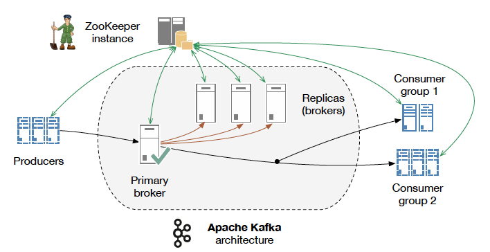

# Kafka

```
I thought that since Kafka was a system optimized for writing, 
using a writer’s name would make sense. I had taken a lot of 
lit classes in college and liked Franz Kafka. 
Plus the name sounded cool for an open source project.

So basically there is not much of a relationship.

Jay Kreps, CEO at Confluent
```



Умные 

## Установка

Проще всего установить через Docker

Образ: wurstmeister/kafka

Запускается через docker-compose,брать с гитхаба этого докерфайла

После установки все .sh скрипты лежат по адресу ```/opt/kafka/bin```, либо ```$KAFKA_HOME/bin```

Дальнейшие инструкции описаны в соответствии с этим способом установки

## Принципы работы

**Сообщение** - массив байт. Кафка не требует какого-либо формата передаваемых данных.

**Ключ сообщения** - тоже массив байт, для кафки никакого специального значения не имеет. Ключи используются лишь для разделения сообщений по партишнам. Сообщения с одинаковым ключом всегда идут в один и тот же партишн.

**Топики** - ну тут все понятно, топики и топики. Топики в кафке не имеют гарантий упорядоченности, точнее имеют только в пределах одного партишна.

**Партишны** - каждый топик разделяется на несколько партишнов. Каждому партишну соответствует один журнал. Каждый партишн может быть расположен на отдельном сервере и иметь несколько реплик, благодаря чему обеспечивается устойчивость. Но при этом всегда у каждого партишна есть **лидер**, который принимает запросы на чтение и запись.

**Продюсер** - пишет сообщения в топик. По дефолту пишет равномерно во все партишны, но можно реализовать специальный партишнер, который будет выбирать партишн по ключу сообщения. Запись происходит всегда в лидера партишна.

**Консюмер** - читает данные из топика в том порядке, в котором они были в него записаны (но опять же, порядок не гарантирован). Консюмеры следят за тем, какие сообщения они уже прочитали из топика, поддерживая в актуальном состоянии *оффсет* партишна. Читает всегда из лидера партишна.

**Оффсет** - целочисленное значение, которое Кафка добавляет к каждому добавленному сообщению. Каждое сообщение имеет уникальный для партишна оффсет. Консюмеры запоминают (в кафе или зукипере) оффсет последнего прочитанного сообщения и благодаря этому могут продолжить с этого же места после перезапуска.

**Группа консюмеров** - это один или несколько консюмеров, которые работают вместе над одним топиком. Внутри группы консюмеров каждый партишн используется только одним консюмером. Благодаря этому внутри группы каждое сообщение читается только один раз одним консюмером (при нормальной работе системы). Если один консюмер фэйлится, то остальные делают ребаланс партишнов, чтобы подхватить партишны упавшего консюмера.

**Лидер группы** - выделенный брокер, один для каждой группы, который управляет распределеним партишнов между консюмерами. Инфу о распределении он шлет *координатору групп*, а тот уже сообщает каждому консюмеру, какой у того партишн.

**Координатор групп** - выделенный брокер, который следит за принадлежностью других брокеров к группам. Разным группам могут быть назначены разные координаторы. Консюмеры шлют координатору heartbeat-сообщения. Если консюмер перестал слать heartbeats, то координатор считает его мертвым и запускает ребаланс партишнов в соответствующей группе.


А если консюмеров в группе больше, чем партишнов в топике, то некоторые консюмеры останутся без работы. Поэтому лучше создавать заведомо много партишнов, чтобы потом можно было спокойно добавлять консюмеров.


**Брокер** - один сервер кафки. Брокер получает сообщения от продюсеров, приваивает им оффсеты и сохраняет на диск. Консюмерам он рассказывает о распределении партишнов и выдает им сообщения со своего диска. Каждый брокер может содержать несколько партишнов или реплик пкартишнов разных топиков

**Контроллер кластера** - один специальный брокер внутри кластера, выбираемый голосованием. Контроллер занимается административными операциями, включая назначение партишнов брокерам и мониторинг отказов брокеров.


**Ретеншн** - период времени, в течение которого сообщения доступны для чтения и по истечении которого они будут удалены с диска. Может быть настроен как по времени, так и по максимальному размеру лога. По дефолту составляет 7 дней, но это зависит от версии кафки. 

**Переизбрание лидера** - голосование между репликами, обычно происходящее когда лидер перестает отвечать (но может происходит и когда все идет хорошо, см. [доклад](/blog/video/kafka-under-highload)). Реплики всегда отстают от лидера на некую дельту, поэтому при переизбрании лидера **всегда происходит потеря данных**.

## Использование

### Вывод всех топиков:

```shell
$KAFKA_HOME/bin/kafka-topics.sh --list --zookeeper zookeeper:2181
```

### Создание топика:

```
$KAFKA_HOME/bin/kafka-topics.sh --create --zookeeper zookeeper:2181 --replication-factor 3 --partitions 1 --topic my-replicated-topic
```

### Вывод информации о состоянии кластера:

```bash-4.3# $KAFKA_HOME/bin/kafka-topics.sh --describe --zookeeper zookeeper:2181** **Topic:my-replicated-topic PartitionCount:1 ReplicationFactor:3 Configs:** ** Topic: my-replicated-topic Partition: 0 Leader: 1004 Replicas: 1004,1003,1005 Isr: 1004,1003,1005```

1003,1004,1005 - это id брокеров

```leader``` - ответственный за все записи и чтения в партишне

```replicas``` - реплики, перечисляются независимо от того, живы они сейчас или нет

```isr``` - in-sync-replicas, т.е. реплики, которые сейчас живы и имеют последнюю версию

### Паблиш сообщений через консоль:

```
$KAFKA_HOME/bin/kafka-console-producer.sh --broker-list localhost:9092 --topic my-replicated-topic
test message 1
test message 2
```

### Консюм сообщений и вывод их в консоль:

```$KAFKA_HOME/bin/kafka-console-consumer.sh --bootstrap-server localhost:9092 --from-beginning --topic my-replicated-topic ```

### Вывод id всех брокеров:

```bash-4.3# $KAFKA_HOME/bin/zookeeper-shell.sh zookeeper:2181 ls /brokers/ids```

### Вывод инфы по id конкретного брокера:

```bash-4.3# $KAFKA_HOME/bin/zookeeper-shell.sh zookeeper:2181 get /brokers/id/1004```

## Возможные проблемы

### После перезапуска брокеров клиенты валятся с по таймауту

Так может происходить из-за того, что после перезапуска брокерам назначились новые ID, а партишны в зукипере остались назначенными на старых. Самое простое решение - брокерам задавать id на старте, чтобы каждый раз был один и тот же. Либо можно вручную ребалансить партишны после перезапуска брокеров

### После падения одного брокера продюсер начал выдавать ошибки

Наверно replication.factor стоял 1, это значение по умолчанию. Он задается либо при создании топика, либо как default.replication.factor при запуске брокера.

А еще должен быть `auto.leader.rebalance.enable` установлен в `true`? но это и так значение по умолчанию.

А еще `leader.imbalance.check.interval.seconds` указывает интервал проверки на необходимость ребаланса, по дефолту 300.

А еще `leader.imbalance.per.broker.percentage` указываем максимум нагрузки на одного брокера, после которого начинается ребалансировка. Дефолт - 10%.

### После подключения новых брокеров им не назначаются автоматически партишны

Ага, так и задумано by-design, и ничего с этим не поделать. Только вручную назначать. Автоматически новым брокерам могут быть назначены только партишны новых топиков.

## Отличия от RabbitMQ

| Kafka | RabbitMQ |
|-------|----------|
| Умные консюмеры, глупый брокер   | Умный брокер, глупые консюмеры  |
| Хранит сообщения в течение указанного времени, после чего удаляет  | Удаляет сообщение только после того, как оно прочитано всеми консюмерами |
| Консюмеры сами должны отслеживать свое положение в каждом логе | Брокер отслеживает положение консюмеров в логе |
| Благодаря тому, что много логики перенесено на косюмеров, может поддерживать большое количество консюмеров и хранить большое количество данных с малым оверхедом | ??? |
| Требует для работы внешний ZooKeeper | Автономен |
| Основной юзкейс - обработка потоков | Основной юзкейс - доставка сообщений, асинхронная реакция серверов на запросы клиентов |
| Скудная маршрутизация посредством групп консюмеров | Возможность сложной маршрутизации через точки обмена |
| Сообщения вытягиваются консюмерами (pull-модель) | Сообщения проталкиваются брокерами (push-модель) |
| 100K+/sec | 20K+/sec |

### Сценарии, в которых лучше использовать Kafka

- поток из точки А в точку Б без слошной маршрутизации, с максимальной пропускной способностью, доставляемый **at-least-once** в **partitioned order** (под partitioned order видимо имеется в виду, что порядок соблюдается только для сообщений, принадлежащих к одному партишну)
- когда приложению требуется доступ к истории потока. До тех пор пока Кафка не удалила сообщения из-за их старости, клиенты могут заказать "повтор" потока, просто указав другой сдвиг.
- Stream Processing
- Event Processing

При этом **обязательно** должно быть допустимо то, что консюмеры сами управляют сдвигом.

### Сценарии, в которых лучше использовать RabbitMQ

- когда нужно, чтобы веб-сервера асинхронно запускали сложные процедуры, не заставляя клиента ждать
- распределение сообщений на несколько получателей
- распределение нагрузки между воркерами
- когда нужен больший контроль над сообщениями
- сложная маршрутизация, интеграция нескольких сервисов/приложений с нетривиальной логикой распределения сообщений

Когда нужна история потока, RabbitMQ используют совместно с Apache Cassandra.