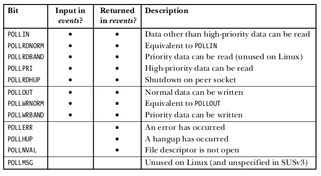

# Работа с аргументами запуска

```cpp
while ((opt = getopt(argc, argv, "nt:")) != -1) {
   switch (opt) {
   case 'n':
       flags = 1;
       break;
   case 't':
       nsecs = atoi(optarg);
       tfnd = 1;
       break;
   default: /* '?' */
       fprintf(stderr, "Usage: %s [-t nsecs] [-n] name\n",
               argv[0]);
       exit(EXIT_FAILURE);
   }
}
```

Третьим аргументом `getopt` принимает список допустимых опций. Если после символа стоит двоеточие, значит эта опция принимает аргумент, тогда `getopt` помещает указатель на текст, последующий за буквой опции, либо весь следующий аргумент, в переменную `optarg`. Если же там 2 двоеточия, то это означает опциональный аргумент, если он отсутствует, то`optarg` будет равен нулю.

`optind` - индекс следующего аргумента, который будет обработан.

# Работа с файлами

3 стандартных дескриптора:

- 0: стандартный ввод
- 1: стандартный вывод
- 2: стандартный поток ошибок

## Системные вызовы для работы с файлами

- `fd = open(pathname, flags, mode)`: открывает указанный файл, возвращает его дескриптор. Если окрыть не удалось, вернется отрицательный дескриптор (ошибку можно будет получить через `errno`). Во флагах через `|` можно указать, что файл открывается на чтение/запись, что его нужно создать, если он не существует. `mode` - разрешения файла, если будет создан новый.
- `numread = read(fd, buffer, count)`: читать `count` байт в буфер. Возвращает количество прочтенных байт, или 0, если достигнут EOF.
- `numwritten = write(fd, buffer, count)`: писать `count` байт из буфера.
- `status = close(fd)`: закрывает дескриптор и все связанные с ним ресурсы ядра

## Пример копирования файла

```c
#include <iostream>
#include <fcntl.h>
#include <unistd.h>

#ifndef BUF_SIZE
#define BUF_SIZE 1024
#endif

int main(int argc, char *argv[]) {
    int inputFd, outputFd, openFlags;

    mode_t filePerms;
    ssize_t numRead;

    char buf[BUF_SIZE];

    if (argc != 3 || argv[1] == "--help") {
        std::cout << "usage: copy old-file new-file" << std::endl;
        exit(EXIT_FAILURE);
    }

    inputFd = open(argv[1], O_RDONLY);
    if (inputFd == -1) exit(EXIT_FAILURE);

    openFlags = O_CREAT | O_WRONLY | O_TRUNC;
    filePerms = S_IRUSR | S_IWUSR | S_IRGRP | S_IWGRP | S_IROTH | S_IWOTH;
    outputFd = open(argv[2], openFlags, filePerms);
    if(outputFd == -1) return 1;

    while(numRead = read(inputFd, buf, BUF_SIZE))
    {
        if(write(outputFd, buf, numRead) != numRead) exit(EXIT_FAILURE);
    }
    if(numRead == -1) exit(EXIT_FAILURE);

    if(close(inputFd) == -1) exit(EXIT_FAILURE);
    if(close(outputFd) == -1) exit(EXIT_FAILURE);

    exit(EXIT_SUCCESS);
}
```

ПРИМЕЧАНИЕ: в C++ стандартный способ работы с файлами - через `ofstream`, `ifstream`, `fstream`:

```cpp
#include <iostream>
#include <fstream>

const static int BUF_SIZE = 4096;

using std::ios_base;

int main(int argc, char** argv) {

   std::ifstream in(argv[1],
      ios_base::in | ios_base::binary);  // Use binary mode so we can
   std::ofstream out(argv[2],            // handle all kinds of file
      ios_base::out | ios_base::binary); // content.
   
   // Make sure the streams opened okay...

   char buf[BUF_SIZE];

   do {
      in.read(&buf[0], BUF_SIZE);      // Read at most n bytes into
      out.write(&buf[0], in.gcount()); // buf, then write the buf to
   } while (in.gcount() > 0);          // the output.

   // Check streams for problems...

   in.close();
   out.close();
}
```

## Неблокирующий ввод/вывод

Если в `open` передать флаг `O_NONBLOCK`, то в случае невозможности выполнить системный вызов I/O (открытие, чтение, запись) будет возвращена ошибка `EAGAIN` или `EWOULDBLOCK` в зависимости от вызова, а не блокировка исполнения как обычно.

Неблокирующий I/O может быть использован с пайпами, очередями FIFO, сокетами, терминалами, псевдотерминалами и т.д. Так как файловые дескрипторы для пайпов и сокетов получаются не через `open`, то для них флаг активируется через вызов `fcntl()`.

Для обычных файлов флаг `O_NONBLOCK` игнорируется, так как кэш буфера ядра и так гарантирует, что I/O над обычными файлами не блокирующий. 

## Манипуляции с дескриптором открытого файла

Системным вызовом `fcntl` можно управлять дескриптором уже открытого файла, например, поменять флаги открытия.

```cpp
#include <unistd.h>
#include <fcntl.h>

int fcntl(int fd, int cmd, ... /* arg */ );
```

Последний аргумент зависит от второго аргумента `cmd`, то есть от того действия, которое мы пытаемся осуществить.

Мы можем:

### получить флаги 

```cpp
int flags, accessMode;
flags = fcntl(fd, F_GETFL);
if(flags == -1) 
	errExit("fcntl");
if(flags & O_SYNC)
	printf("writes are synchronized\n");
```

А вот режим доступа проверить не так просто, но все равно можно:

```cpp
accessMode = flags & O_ACCMODE;
if(accessMode == O_WRONLY || accessMode == O_RDWR)
	printf("file is writable\n");
```

### установить флаги

Можно модифицировать флаги: `O_APPEND`, `O_NONBLOCK`, `O_NOATIME`, `O_ASYNC` и `O_DIRECT`. Попытки модификации других флагов - игнорируются.

Причем указание флага `O_ASYNC` в `open()` тоже игнорируется - его можно установить только через `fcntl()`.

```cpp
fcntl(fd, F_SETFL, O_ASYNC | O_NONBLOCK);
```

## Альтернативные модели I/O

Традиционная модель работы с файлами имеет 2 существенных недостатка:

- работает только с одним дескриптором одновременно
- каждый системный вызов блокирует выполнение, пока передача данных не завершилась

В некоторых приложениях нам бывает нужно:

- проверить, возможен ли ввод/вывод в дескриптор, не блокируя исполнение, если невозможен
- монитортиь несколько дескрипторов, пока ввод/вывод станет доступен на любом из них

Для этого можно использовать неблокирующий I/O или многопроцессность/многопоточность:

- при использовании неблокирующего I/O мы можем открыть N дескрипторов и периодически чтением каждого из них проверять, доступно ли для них I/O. Это, конечно, неэффективно по CPU, а так же при больших интервалах реакция приложения на событие I/O может быть слишком долгой.
- при использовании многопроцессности мы можем создавать новый процесс, чтобы выполнять I/O. Тогда родительский процесс не будет заблокирован, а дочерний заблокируется, пока I/O не будет выполнен. Недостаток - сложно создавать процессы и понадобится какой-то IPC, чтобы сообщать родителю о статусе операции I/O.
- при использовании многопоточности можем создавать для I/O не процесс, а поток. Это менее накладно по ресурсам, но IPC все равно понадобится.

Чтобы избежать этих недостатков для решения задачи слежения за несколькими дескрипторами с целью узнать, когда они станут готовы для I/O (без блокирования) применяются следующие техники

### Мультиплексирование I/O

Позволяет процессу одновременно следить за несколькими дескрипторами, чтобы узнать когда на любом из них становится доступен I/O. 

При этом важно понимать, что событие доступности I/O не означает, что последующий вызов I/O будет передавать данные. Например, для обычных файлов неблокирующий вызов доступен всегда. А вот для сокетов - только когда действительно есть данные для чтения или для отправки.

Самая старая техника, поэтому главное достоинство - портируемость. Главный недостаток - плохая масштабируемость на большие (сотни и тысячи) количества дескрипторов.

Мультиплексирование осуществляется вызовами `select()` и `poll()`.

#### select()

Блокироует выполнение, пока один или несколько дескрипторов не станут готовы

```c
#include <sys/time.h>  /* Включать для портируемости */
#include <sys/select.h>

int select(int nfds, fd_set * readfds, fd_set * writefds, fd_set * exceptfds, struct timeval * timeout );
```

Возвращает количество готовых дескрипторов, 0 при таймауте, -1 при ошибке. Если какой-либо дескриптор указан в нескольких наборах, то он будет учтен соответствующее количество раз.

- `nfds` - число, на 1 большее, чем самый большой дескриптор среди наборов
- `readfds` - набор дескрипторов на чтение
- `writefds` - набор дескрипторов на запись
- `exceptfds` - набор дескрипторов, у которых мы ждем т.н. exception condition (это не имеет ничего общего с ошибками)
- `timeout` - указывает интервал, в течение которого вызов `select()` заблокирует выполнение, либо же `NULL`, если нужно ждать бесконечно. Если указать `timeval { tv_sec=0, tv_usec=0}`, то блокировки не будет вообще, просто сразу ответит, какие дескрипторы уже готовы.

Вместо любого из наборов можно передать `NULL`, если этот класс событий нас не интересует.

Наборы могут иметь размерность, не большую, чем константа `FD_SETSIZE`, в Линуксе она равна 1024. 

С типом `fd_set` работаем посредством следующих операций:

```c
#include <sys/select.h>
void FD_ZERO(fd_set * fdset );	// инициализирует набор, делая его пустым
void FD_SET(int fd , fd_set * fdset );	// добавляет дескриптор в набор
void FD_CLR(int fd , fd_set * fdset );	// удаляет дескриптор из набора
int FD_ISSET(int fd , fd_set * fdset );	// возвращает 1, если дескриптор есть в наборе, иначе 0
```

Вызов `select()` модифицирует переданные в него наборы `fd_set` таким образом, что после завершения они содержат набор готовых дескрипторов. Но чтобы узнать эти дескрипторы, придется для каждого из интересующих нас дескрипторов, вызвать `FD_ISSET`.

#### poll() 

Работает так же, как и `select()`, разница лишь в API. В `poll()` мы предоставляем список дескрипторов, где для каждого указан набор интересующих событий

```c
#include <poll.h>
int poll(struct pollfd fds[], nfds_t nfds, int timeout);

```

Возвращает количество готовых дескрипторов, 0 при таймауте, -1 при ошибке.

`fds[]` содержит массив дескрипторов. Сртуктура `pollfd` имеет следующий вид:

```c
struct pollfd {
	int fd;			// дескриптор
	short events;	// бит-маска интересующих ивентов
	short revents;	// бит-маска выстреливших ивентов
}
```

`nfds` - количество элементов в массиве `fds`.

Далее приведен список битов, которые могут быть выставлены для `events` и `revents`:



Аргумент `timeout` ведет себя так же, как и у `select()`, только с другими ключевыми значениями:

- -1: блокировать без ограничений по времени
- 0: не блокировать,сразу возвращать
- >0: означает миллисекунды, сколько ждем


### Signal-driven I/O

Процесс просит у ядра послать сигнал, когда I/O становится доступен на определенном дескрипторе. На большом количестве дескрипторов эта техника работает лучше, чем мультиплексирование.

Алгоритм использования таков:

1. Создаем хэндлер для сигнала `SIGIO`.
2. Вызовом `fnctl()` устанавливаем владельца дескриптора файла, то есть процесс, который будет получать сигналы о готовености I/O. Обычно это текущий процесс: `fcntl(fd, F_SETOWN, pid);`
3. Через `fcntl()` устанавливаем дескриптору флаг `O_NONBLOCK`
4. Через `fnctl()` включаем signal-driven i/o, выставив флаг `O_ASYNC`. Это может быть объединено с предыдущим шагом:

	```c
	flags = fcntl(fd, F_GETFL); 
	fcntl(fd, F_SETFL, flags | O_ASYNC | O_NONBLOCK);
	```
5. Вызывающий процесс теперь может заниматься своими делами. Когда I/O станет досутпен, ядро сгенерит сигнал и вызовет указанный хэндлер
6. Signal-driven I/O генерирует edge-triggered нотификации. Это значит, что при получении нотификации нужно в цикле читать данные из дескриптора до тех пор, пока не получим ошибку `EAGAIN` или `EWOULDBLOCK`.

### epoll

Техника, доступная только в линуксе. Объединяет достоинства предыдущих двух техник.

По сравению с signal-driven имеет преимущества:

- не нужно работать с сигналами
- монжо указать, какой конкретно ивет нас интересует - готовность к чтению, или к записи
- можно выбрать между level-triggered и edge-triggered нотификациями.

Чтобы использовать аналогичные фичи в модели signal-driven I/O, все равно придется использовать непортируемые линукс-специфичные фичи.

### libevent

Сторонняя библиотека, предоставляющая слой абстракции для мониторинга за файловыми дескрипторами. Использует все вышеперечисленные (и не только) техники и может включать/выключать их в зависимости от ОС.

### Типы нотификаций

- Level-triggered: выстреливается, когда дескриптор становится доступен для осуществления системного вызова I/O без блокирования. После этого можно выполнить (а можно и не выполнять) необходимую I/O операцию и повторить мониторинг, чтобы узнать, когда I/O станет доступен снова. Важно, что нам необязательно читать все доступные данные, можем прочитать сколько угодно и повторить мониторинг, просто если мы прочитали не все, то событие выстрелит сразу же.
- Edge-triggered: выстреливается, когда произошла некоторая I/O активность на дескрипторе (нарпример, стали доступны данные для чтения). Отличие в том, что событие не выстрелит, пока не произойдет следующее событие I/O (например, доступна следующая порция данных на чтение). Кроме того, мы обычно не знаем, сколько именно данных нам стало доступно для неблокирующего I/O. Поэтому обычно мы помещаем дескриптор в неблокирующий режим и совершаем операции в цикле, пока не получим ошибку `EAGAIN` или `EWOULDBLOCK`.

| I/O model        | Level-triggered? | Edge-triggered? |
|------------------|------------------|-----------------|
| select(), poll() |        X         |                 |
| signal-driven    |                  |        X        |
| epoll            |        X         |        X        |

# Сигналы

Сигналы - это, иными словами, "программные прерывания". Они могут быть вызваны ядром в любой момент при наступлении интересующего события, а после выполнения хэндлера, выполнение продолжается с той же строчки, на которой было прервано.

## Подписка на сигнал

Есть два способа: `signal()` и `sigaction()`.

### signal()

Этот вызов более старый, но имеет более простое API. Однако у него есть различия в поведении среди различных имплементаций UNIX, поэтому `signal()` не рекомендуется к использованию в кросс-платформенных системах.

```c
#include <signal.h>

void ( *signal(int sig, void (*handler)(int)) ) (int);
```

- `handler` - указатель на функцию, принимающую `int` и возвращающую ничего
- `signal` - фукнция, принимающая `int` и `pointer`, а возвращающая указатель на функцию, принимающую `int` и возвращающую ничего.

На самом деле `signal` возвращает указатель на предыдущий хэндлер. Это нужно для установки "временных" хэндлеров, которые можно потом откатить:

```c
void (*oldHandler)(int);

oldHandler = signal(SIGINT, newHandler);

/// здесь сигнал SIGINT обрабатывается новым хэндлером

signal(SIGINT, oldHandler); // возвращаем старый хэндлер
```

Вместо указателя на хэндлер можно подавать:

- `SIG_DFL` - откатиться к дефолтному хэндлеру
- `SIG_IGN` - игнорировать сигнал

### sigaction()

Имеет более сложный API, но зато позволяет получить хэндлер, не меняя его, а так же позволяет установить некоторые атрибуты, контролирующие, что произойдет, когда хэндлер будет вызван. Помимо этого, `sigaction()` более портируем, чем `signal()`.

```c
#include <signal.h>

int sigaction(int sig, const struct sigaction *act, struct sigaction *oldact);

struct sigaction {
	void (*sa_handler)(int);	// адрес хэндлера
	sigset_t sa_mask;			// сигналы, заблокированные во время работы хэндлера
	int sa_flags;				// флаги, контролирующие работу хэндлера
	void (*sa_restorer)(void);	// не для использования
};
```

Так же, как и в `signal()`, вместо поля `sa_handler` можно подать `SIG_IGN` или `SIG_DFL`.

`sa_mask` позволяет перечислить сигналы, которым нельзя прерывать выполнение этого хэндлера. Сигнал, который вызван в хэндлер, автоматически занесен в фильтр, то есть сам себя рекурсивно хэндлер сигнала прервать не может.

Вручную добавлять и убирать сигналы из фильтра процесса можно вызовом `sigprocmask()`.

### Наборы сигналов

Несколько сигналов могут быть объединены в страктуру `sigset_t`. Для управления таким множеством есть специальные функции:

```c
#include <signal.h>

int sigemptyset(sigset_t *set);		// инициализация нулями, то есть исключает все сигналы
int sigfillset(sigset_t *set);		// инициализация единицами, то есть включает все сигналы

int sigaddset(sigset_t *set, int sig);	// добавление сигнала в набор
int sigdelset(sigset_t *set, int sig);	// удаление сигнала из набора

int sigismember(const sigset_t *set, int sig); // 1, если сигнал входит в набор, иначе 0

int sigandset(sigset_t *dest, sigset_t *left, sigset_t *right);	// кладет пересечение left и right в dest
int sigorset(sigset_t *dest, sigset_t *left, sigset_t *right);	// кладет объединение left и right в dest

int sigisemptyset(const sigset_t *set);		// 1, если набор пустой, иначе 0
```


### kill()

С помощью вызова `kill()` можно послать сигнал другому процессу или группе процессов

```c
#include <signal.h>

int kill(pid_t pid, int sig);
```


### pause()

Системный вызов `pause()` прерывает исполнение до тех пор, пока не будет вызван какой-либо хэндлер сигнала

```c
#include <unistd.h>

int pause(void);
```

Всегда возвращает -1 и выставляет `errno` в `EINTR`.