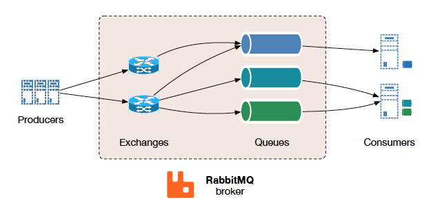
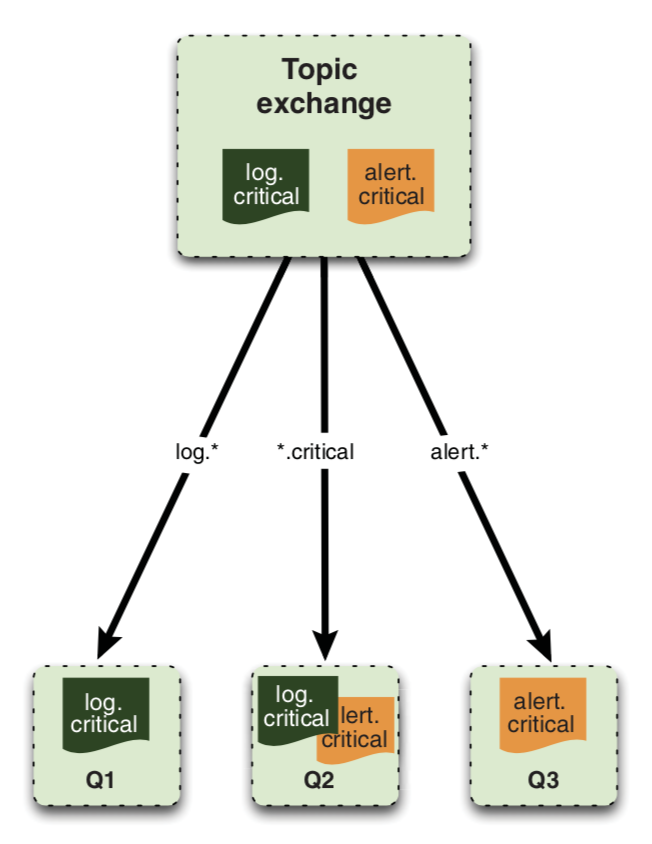
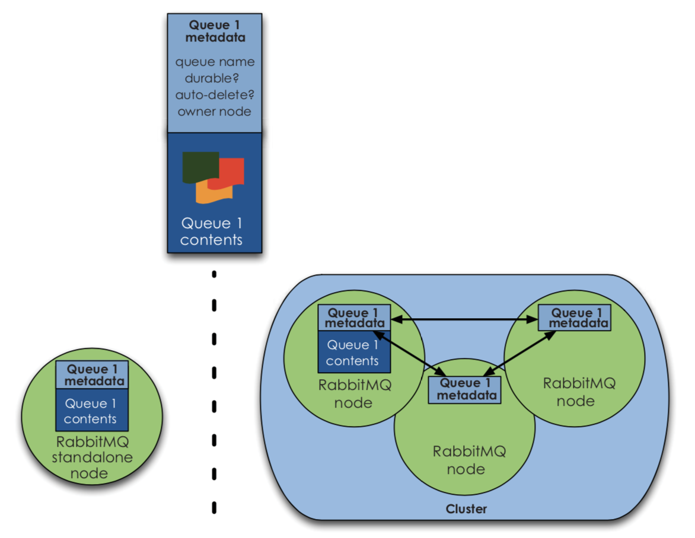

# RabbitMQ

Отличия от Кафки смотреть в [статье про Кафку](./kafka)

## Терминология

Queue - очередь

Binding - привязка

Exchange - точка обмена

Topic - топик

Routing key - ключ роутинга

Binding key - ключ привязки

Payload - тело сообщения

Acknowledgement - подтверждение

## Принципы работы

Продюсеры создают сообщения и шлют их на брокера.

Сообщения состоят из ключа роутинга, идентификатора точки обмена и тела сообщения.

Консюмеры подсоединяются к брокеру, подписываются на *очередь* и принимают из нее сообщения. Ключ сообщения и идентификатор точки обмена консюмер не получает - только тело. После получения **каждого** сообщения консюмер должен послать **acknowledgement**, вручную или автоматически. Пока не послать подтверждение, следующее сообщение в этот консюмер не придет.

Прежде чем читать или писать сообщения в очередь, приложение должно поднять *AMQP-канал*. Это виртуальный канал связи внутри TCP-соединения, по которому посылаются команды AMQP. Таких каналов может быть много внутри одного TCP-соединения и они нужны, чтобы каждому потоку не приходилось открывать свое TCP-соединение, что было бы очень дорого (TCP-соединения не потокобезопасны, могут использоваться не больше чем одним потоком на запись и не больше чем одним - на чтение).

### Создание новых очередей

И консюмеры и продюсеры могут создавать новые очереди командой *queue.declare*, но консюмеры не могут использовать команду, пока подписаны на другую очередь в этом же канале.

Для очередей могут быть заданы специальные свойства:

- **exclusive**: очередь становится приватной и только текущее приложение может быть ее консюмером
- **auto-delete**: очередь автоматически удаляется, когда от нее отписывается последний консюмер.
- **durable**: сообщения не теряются при рестарте RabbitMQ. 

Если нужна временная очередь для текущего приложения, то можно создать ее со свойствами **exclusive** и **auto-delete**.

Если попытаться записать сообщение в несуществующую очередь, то оно будет просто проигнорировано, поэтому лучше всегда заранее ее явно создавать. Если при попытке создания окажется, что очередь с такими же параметрами уже есть, то Rabbit не сделает ничего и вернет успех.

### Точки обмена / exchanges

Продюсеры шлют сообщения не напрямую в очереди, а в точки обмена (exchange). Очереди *привязываются* к эксченджам посредством ключей привязок. Получив сообщение в эксчендж, канал на сервере сравнивает ключ роутинга сообщения (который может быть и пустым), с имеющимся ключами привязок. Найдя соответствие, канал посылает сообщение в нужную очередь. Если соответствие не найдено, то сообщение игнорируется.

Такое разделение позволяет изолировать продюсера от логики распределения сообщений по очередям.

Используя такую схему, можно реализовывать разные паттерны рассылки сообщений:

- **direct**: сообщение шлется в одну конкретную очередь. Создаем дефолтную точку обмена с пустым именем. При создании очереди, она автоматически будет привязана к дефолтной точке обмена, используя имя очереди в качестве ключа привязки. После этого достаточно слать сообщения в точку обмена без имени с названием очереди вместо ключа роутинга.
- **fanout**: каждое сообщение шлется сразу на несколько очередей. Для реализации нужно привязать все заинтересованные очереди к одной точке обмена под одним и тем же ключом привязки. Потом этот ключ используем в качестве ключа роутинга и готово.
- **topic**: используем символ * в ключах привязок, легче объяснить картинкой

Для того, чтобы указать правило привязки *match-all*, нужно использовать символ "#". Его отличие от * в том, что * считает знак "." разделителем частей и матчит любой текст только лишь в соответствующей части ключа. То есть logs.* === logs.critical, но logs.* != logs.critical.minor.

### Виртуальные хосты

Внутри одного сервера RabbitMQ можно запустить несколько виртуальных инстансов RabbitMQ, которые будут друг от друга полностью изолированы. При старте RabbitMQ автоматически создает один дефолтный vhost. 

Добавление и удаление виртуальных хостов осуществляется командами `rabbitmqctl add_vhost [vhost_name]` и `rabbitmqctl delete_vhost [vhost_name]`.

### Гарантии доставки

Чтобы сообщения не терялись никогда, должны быть выполнены 3 условия:

1. очередь должна быть durable
2. точка обмена тоже должна быть durable
3. для сообщения должен быть указан *delivery mode=2*. 

Только в этом случае гарантируется надежное хранение сообщения вплоть до момента, когда поступит подтверждение от консюмера, получившего его. После этого RabbitMQ помечает сообщение, как мусор для сборщика мусора.

#### Confirm mode

Для повышенных гарантий доставки на стороне продюсера, можно перевести канал в confirm mode. В этом режиме каждому сообщению присваивается уникальный идентификатор. Когда сообщение доставлено всем нужным очередям, канал отправит продюсеру *publisher confirm* с идентификатором сообщения и атрибутом метода = Ack. Если сообщение и очереди устойчивы (durable), то конфирм придет только после того, как сообщение будет записано на диск.

Если из-за внутренних ошибок RabbitMQ сообщение утеряно, то в продюсер будет отправлен конфирм с атрибутом метода = Nack.

### Dead letter queue

Можно настроить очереди так, чтобы недоставленные сообщния отсылались на специальный exchange при следующих условиях:

- очередь превышает заданное количество сообщений
- очередь превышает заданное количество байт
- TTL истекло

## Кластеризация

### Очереди

По дефолту в кластере содержимое очередей - **не реплицируется**. Сообщения очереди хранятся только на владельце очереди - то есть узле, к которому был присоединен клиент, создающий очередь. Всем остальным узлам доступны только метаданные об очереди и указатель на владельца очереди. 

Когда узел умирает, все его очереди и привязки пропадают. При этом если на нем была durable очередь и после смерти узла мы попытаеся ее пересоздать на другом узле, то получим ошибку 404 NOT FOUND. Это нужно, чтобы сообщения из очереди не пропали, если умерший узел вдруг оживет. Таким образом, единственный способ получить доступ к этой очереди опять - это оживить умерший узел. Если же очередь не была durable, то ее можно пересоздать без проблем.

### Точки обмена

Всей маршрутизацией занимаются каналы, поэтому на эксченджи ограничения, касающиеся очередей, не накладываются. Эксченджи реплицируются и переобъявлять их в случае смерти узлов не нужно. 

Если же узел, на котором находится канал, умирает до того как канал успел отправить сообщение в нужную очередь, то сообщение теряется. Решение - AMQP-транзакции, или publisher confirms.

### Mirrored queues

В версии 2.6.0 было реализовано отражение очередей. То есть, очереди теперь реплицируются, но в режиме master-slave. Если мастер умирает, то старейший слэйв становится новым мастером.

При создании очереди нужно указать атрибут `x-ha-policy`. ЗНачение может быть либо `all` - тогда очередь будет реплицироваться на все узлы, либо `nodes` - и тогда в атрибуте `x-ha-policy-params` можно перечислить список узлов, на которые нужно реплицировать, но тогда, если хоть один из узлов недоступен, то очередь создать не удастся.

В случае зеркальных очередей канал при роутинге вернет мастер-очередь и список зеркальных очередей. А при использовании publisher confirmation, он придет только после того как сообщение досттигнет всех зеркальных очередей.