# Microservices Architectural Design Patterns Playbook

[Курс на Pluralsight](https://app.pluralsight.com/player?course=microservices-architectural-design-patterns-playbook)

## How to Scope Microservices Using Bounded Contexts

**Bounded Context** это *конкретная ответственность*, обусловленная *четкой границей*. Например, IT-отдел и отдел бухгалтерии в компании - это два разных баундед контекста. У обоих отделов очень четкие зоны ответственности и их границы четко определены. У каждого из них своя внутренняя организация и между собой они общаются исключительно посредством внешних контрактов. Внутри IT отдела тоже могут быть свои баундед котексты - например, команда разработки и команда администрирования. Эти команды занимаются своими делами и не лезут в код друг друга. 

#### Примеры баундед контекстов:

- приложение
- слой UI
- слой домена
- любой объект со скрытой внутренней реализацией

#### Чтобы выделить баундед контексты для микросервисов, нужно:

Определить ключевые доменные сущности (**core domain concepts**). Например, в системе доставки посылок это будут доставки, заказы и водители.

Каждая из этих сущностей становится началом для своего баундед контекста. 

Каждая из ключевых сущностей будет иметь свои внутренние модели (**supporting concepts**). Ключевая и поддерживающие концепции будут формировать внутренний язык контекста. Это должен быть язык, который не содержит технических терминов и понятен экспертам этой предметной области.

Для общения с другими контекстами каждый контекст определяет разделяемые модели (**shared models**), нужные чтобы внутренние модели могли изменяться независимо от внешнего контракта.

Баундед контекст принадлежит одной команде разработки, имеет один репозиторий и одну базу данных.

В дальнейшем в наш микросервис включаются только те сущности (**supporting concepts**), которые напрямую связаны с его корневой сущностью. Определить, связана ли сущность с корневой сущностью, поможет внутренний язык суб-домена. Если во внутреннем языке есть такие термины, которые описывают предлагаемую для включения сущность, то значит ее можно включить. 

Иногда приходится эту сущность переименовать. Например, если наша ключевая сущность - Order, то доп. сущность Product следует переименовать в Order Item, так как такой термин есть во внутреннем языке контекста заказа, а Product - нет. 

Если и переименование не помогает, то точно эта сущность должна идти в другой микросервис, либо же основать свой. 

Если сущность сочетается с языком лишь частично, то тоже ее нужно в отдельный микросервис.

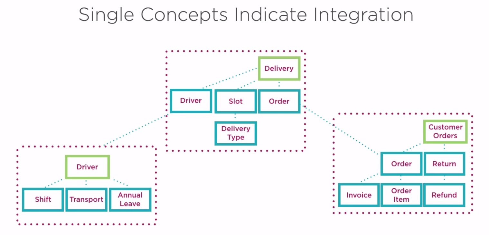

## How to Architect Asynchronous Microservices

2 основных способа реализовать асинхронное общение между микросервисами:

1. через очереди
2. через коллбэки. То есть клиент вместе в вызовом сообщает сервису свой эндпойнт, куда сообщить результат

### Queueing patterns

- **Competing Workers Pattern** - есть N воркеров, работающих с одной очередью. Каждое событие обрабатывается только одним. Позволяет масштабировать нагрузку.
- **Fanout Pattern** - есть N тасков, каждый работает с одним и тем же событием. Событие из очереди посылается всем N таскам и они начинают параллельно его обрабатывать.

## How to Architect API-based Microservices

Архитектурные стили API:

- Pragmatic REST
- HATEOAS (Hypermedia as the Engine of Application State) /True REST
- RPC
- SOAP

### Архитектурные паттерны API

#### Facade

Просто API, живущий в бизнес-слое, который внутри себя обращается к нескольким другим API. Нужен, чтобы клиенту не приходилось работать с несколькими API, а мог работать с одним.

#### Proxy

Сервис, который проксирует вызовы к другому сервису и добавляет какую-то свою логику - например, валидация ввода, преобразование вывода, проверка безопасности.

#### Stateless

Клиент запоминает стейт и шлет его с каждым запросом. Сервисы становятся взаимозаменяемыми. Недостаток - сильно увеличивается трафик.

## How to Compose Microservices Together

Рассмотрим основные паттерны

### Broker Composition Pattern

Здесь тупо очередь. API положило сообщение в очередь и сразу вернуло результат клиенту. Как будем результат получать тут не показано.

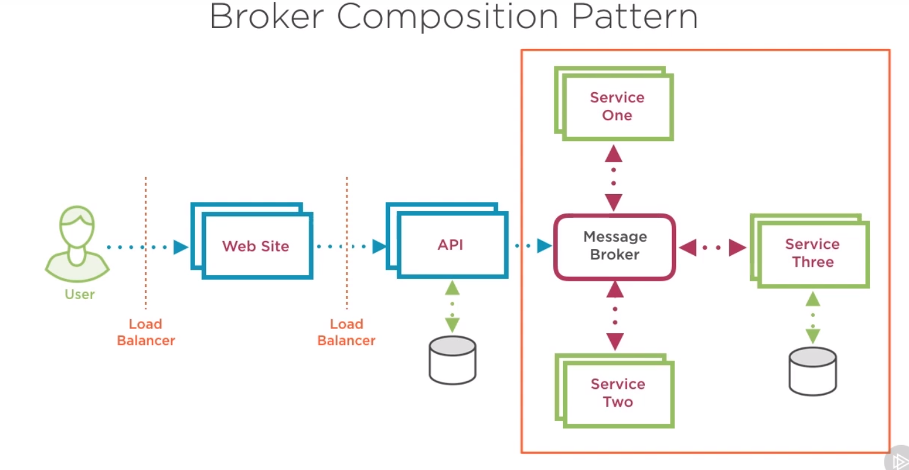

### Aggregate Composition Pattern

Web App берет на себя функцию аггрегатора, то есть обращается к нескольким сервисам и объединяет их результаты как надо клиенту.

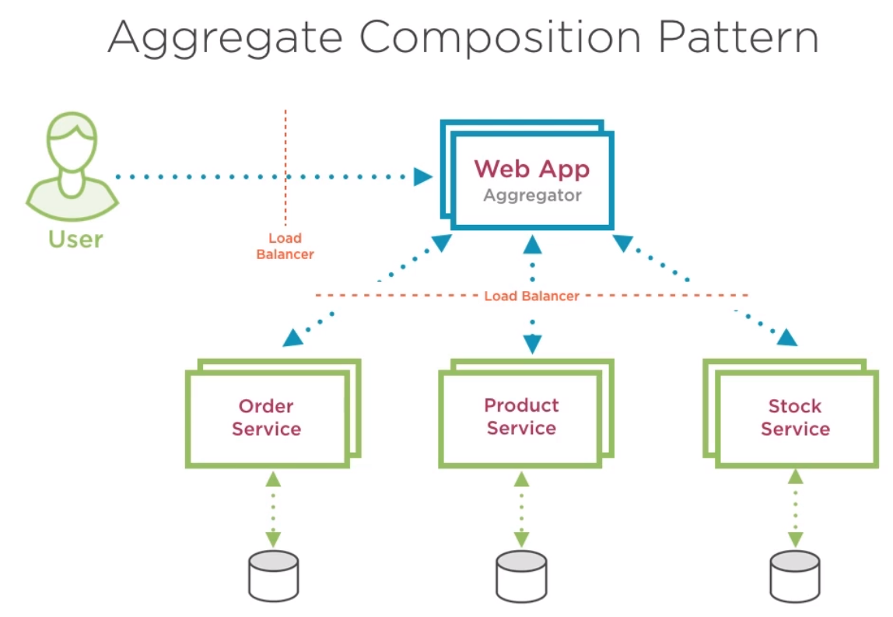

### Chained Composition Pattern

Здесь Web Site делает вызов только к Order Service, а затем Order Service вызывает Product Service, который вызывает Stock Service. Скорее всего это все будет работать синхронно, поэтому лучше не делать эту цепочку слишком длинной.

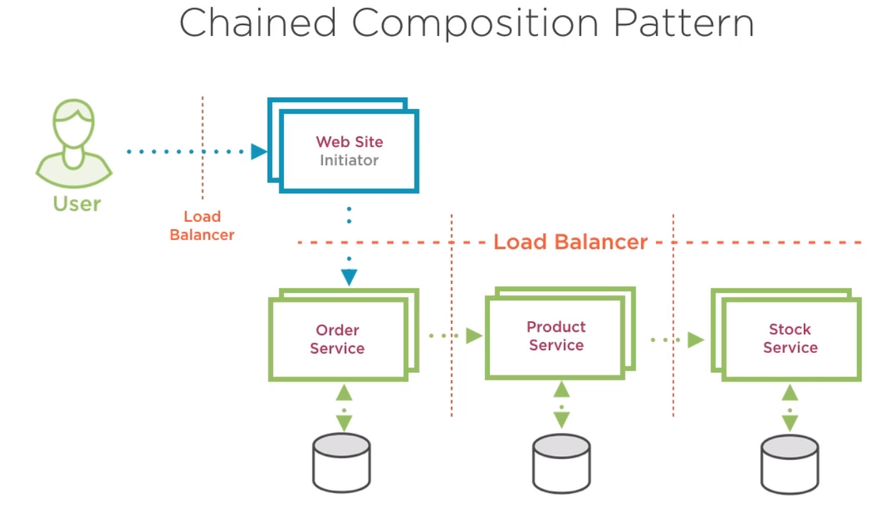

### Proxy Composition Pattern

Похоже на Aggregate Composition Pattern, только API Gateway на этой схеме никак результаты не обрабатывает, он только проксирует вызовы, ну и может содержать доп. функционал типа аутентификации или валидации.

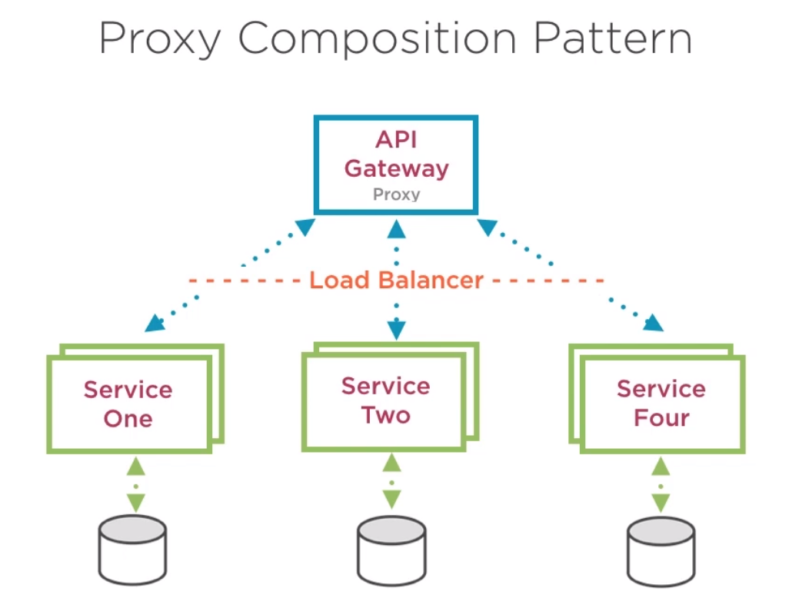

### Branch Composition Pattern

Здесь совмещение Aggregate Composition Pattern, где на разных ветвях могут быть применены разные паттерны. В примере на левой ветке Broker, то есть асинхронные вызовы, а на правой - Chained, то есть синхронные.

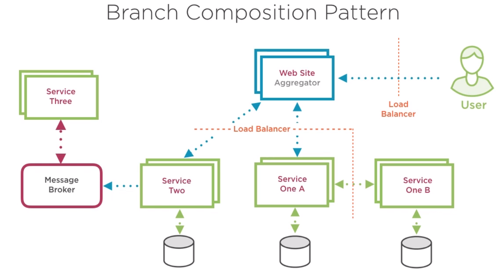

## How to Achieve Data Consistency Across Microservices

### Two Phase Commit 

(сунуть ссылку на страницу в блоге, где он описан)

В настоящее время считается анти-паттерном, потому что:
- зависит от централизованного менеджера транзакций
- что если на этапе голосования один из узлов не отвечает?
- все еще возможны проблемы на этапе коммита
- после голосования узлам приходится лочить ресурсы, пока не придет команда на коммит. Это роняет производительность. А что если коммита ждать долго, или он вообще не придет?
- сложности с мастабированием менеджера транзакций
- сильно забивает трафиком сеть

### Saga pattern

Разбиваем транзакцию на серию запросов к сервисам. Выполняем их последовательно через **Saga execution coordinator** (SEC). Процесс выполнения, старт, успех или провал каждого запроса SEC записывает в журнал саги (**Saga log**). Журналом может быть отдельный сервис со своей БД.

Если один из запросов обламывается, то SEC шлет предыдущим сервисам запросы откатов предыдущих запросов. Такие запросы называются **Compensating requests**. Они обязательно должны быть идемпотентными, то есть безопасными для повторного вызова.

Важно, что если SEC падает посреди выполнения саги, то он после перезапуска должен уметь продолжить ее с того же места.

Пример неудачной саги:

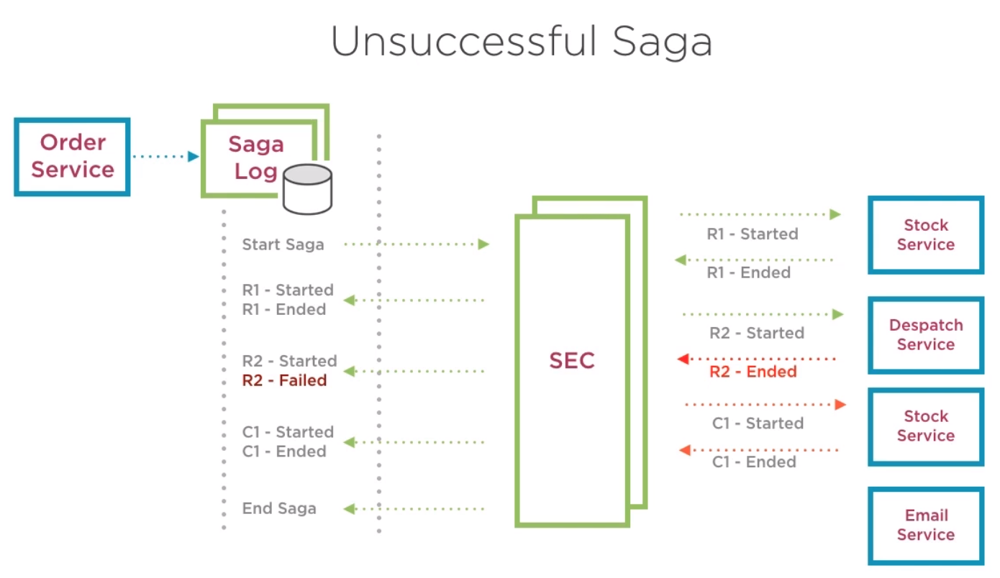

## How to Make Microservices More Resilient

### Timeouts Design Pattern

Все запросы должны иметь явно заданный таймаут. Это поможет избежать ситуаций, когда заняты все потоки и все ждут ответа.

### Circuit Breaker Design Pattern

Это враппер над вызовами. Он считает количество ошибочных вызовов и когда это количество достигает некоего предела, то "разрывает цепь" - то есть при последующих попытках вызова сразу возвращает ошибку. После некоторого количества попыток ресеттится и снова пытается сделать реальный вызов.

Логику работы circuit breaker обязательно логировать и мониторить.

Тулзы:

- [Thepollyproject.org]
- Hystrix

### Retry Design Pattern

Используется, если ошибки носят временный характер, например:

- потеря сети
- временная недоступность сервиса
- таймаут из-за загруженности сервиса

В этих случаях мы можем повторить попытку сразу же, либо подождав некоторую задержку. Повторные попытки обязательно нужно логировать и мониторить.

### Bulkheads Design Pattern

Это подход к проектированию систем, означающий что при отказе одного сервиса остальные должны продолжать нормально работать.

Используемые техники:

- **Separation using Criticality**. Например, если в системе есть критичное приложение с небольшой нагрузкой и некритичное с высокой, то имеет смысл сделать для них две разных очереди, чтобы критичное обслуживалось вовремя.
- **Isolating Microservices**. Одну базу данных должен использовать только один сервис. Если в сервисе есть две критических функции, то имеет смысл разделить его на 2 сервиса с двумя базами данных.
- **Redundancy**. Для каждого сервиса нужно запускать несколько инстансов.

## How to implement Microservices Centralized Logging

- Логирование должно быть централизованным, то есть все микросервисы пишут логи на один и тот же сервер.
- Формат логов должен быть одинаковым среди всех микросервисов. Обязательные поля: уровень логирования, дата и время, ID транзакции (Correlation ID), информация о хосте и приложении микросервиса, само сообщение. В идеале должна быть разделяемая библиотека логирования.
- У транзакции должен быть свой ID, который переходит вместе с ней с микросервиса на микросервис, чтобы можно было по логам отслеживать ее прогресс
- Уровни логирования как минимум должны содержать **Info**, **Debug**, **Error**.

Популярные тулзы:

- **Elasticsearch** - поисковый движок
- **Logstash** - инструмент для управления логами и ивентами
- **Kibana** - плагин Elasticsearch для визуализации данных в браузере, предназначенный в основном для визуализации данных Logstash

## How to provide reporting from distributed microservices data

Далее основные паттерны

### Reporting Service Calls

Есть отдельный микросервис для репортинга, а каждый микросервис приложения имеет в паре микросервис с Reporting API для него. Сервис репортинга сам через это API вытягивает нужные ему данные, джойнит их как ему надо и сохраняет их в своем хранилище.

Reporting API должен быть спроектирован специальным образом, чтобы поддерживать вытягивание данных батчами. Например, принимать на вход список айдишников, или принимать callback address, на который он сможет сообщить результат долгой операции.

Недостаток здесь в том, что у нас получается два сервиса (сам микросервис и его Reporting API), которые используют одну и ту же БД, а это считается анти-паттерном. В качестве решения можно использовать CQRS, то есть БД реплицируется в отдельную реплику только для чтения, из которой читает Reporting API.

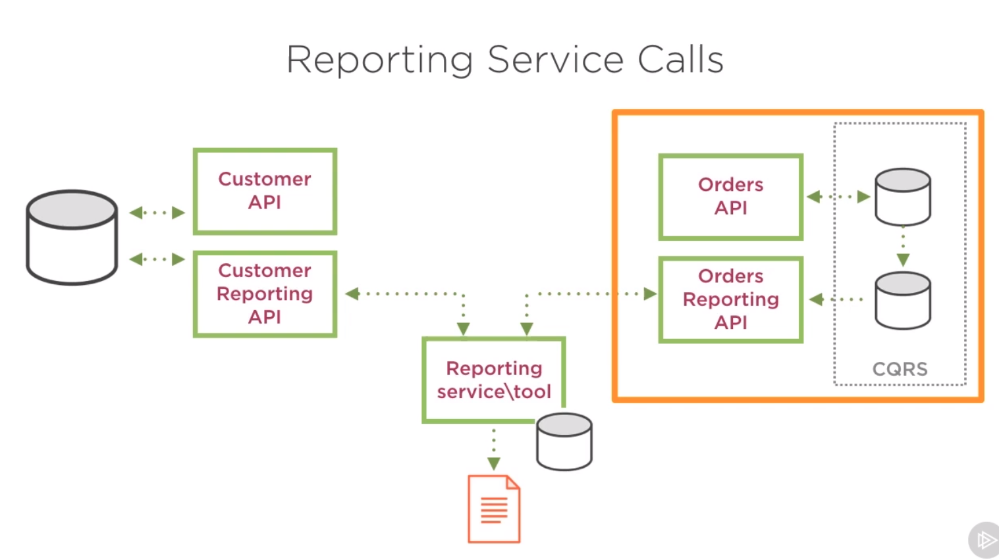

### Data Push Application

У каждого микросервиса в паре есть Data Push App, который берет нужные для репортинга данные и пушит их в БД сервиса репортинга, к которой имеет доступ. Затем сервис репортинга джойнит данные из этой БД и выдает отчеты.

Data Push App может сам трансформировать данные в удобный для отчетов вид.

Преимущество в том, что Data Push App может вообще не работать с HTTP, а подсоединяться напрямую к двум базам и перегонять данные из одной в другую.

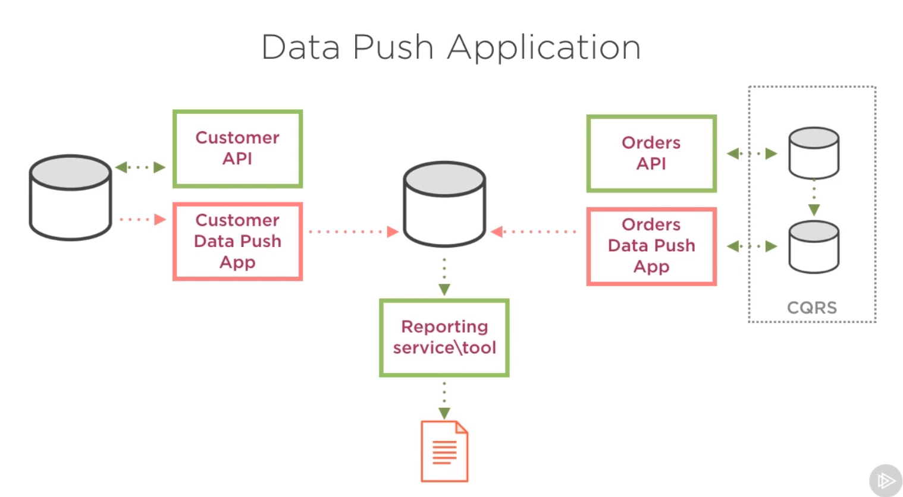

### Reporting Event Subscribers

микросервис логики при каждом изменении данных создает запись о событии в специальной очереди событий. Затем Event Subscriber берет это событие из очереди и записывает в Event Sourcing Database для отчетов. После этого отдельный reporting service строит по этой базе отчеты.

Преимущество - изоляция сервиса логики от системы отчетов, т.к. сервис логики не знает, куда и зачем он пишет событие.

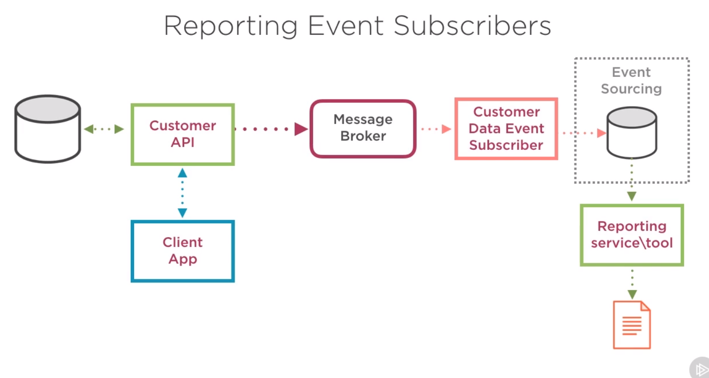

### Reporting Events via Gateway

Похож на предыдущий подход, но мы выделяем специальный API Gateway, который будет на каждый вызов делать две вещи: 1. проксировать вызов на нужный сервис, 2. создавать сообщение с ивентом в очереди события для репортинга.

Преимущество - наш сервис вообще не парится насчет отчетов, а логика по публикации данных для отчетов изолирована в API Gateway.

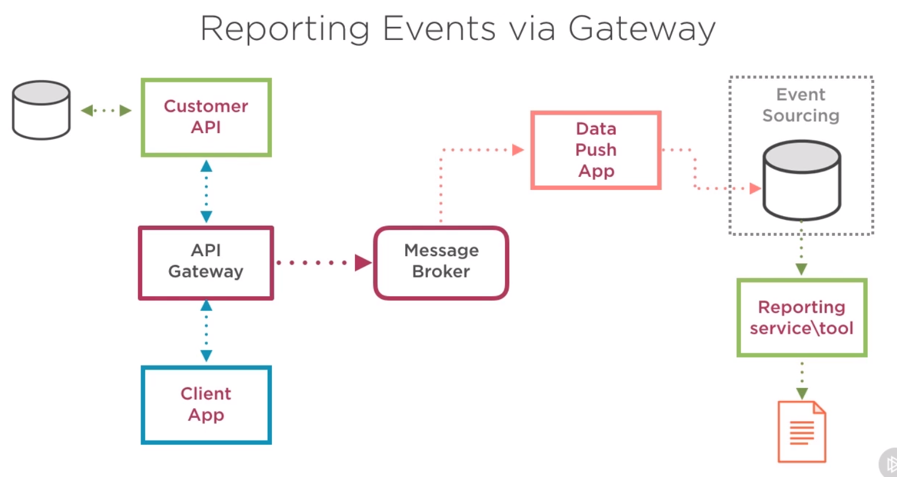

### Using Backup Imports for Reporting

Нужен налаженный процесс бэкапирования БД и отдельный сервис, который копирует бэкап базы, а потом из копии бэкапа достает данные и перекладывает их в БД репортинга. Затем сервис репортинга джойнит данные из этой БД для генерации отчетов.

Основное преимущество - абсолютно не влияет на нормальный процесс работы системы.

Недостаток - задержки, нужно много места на диске.

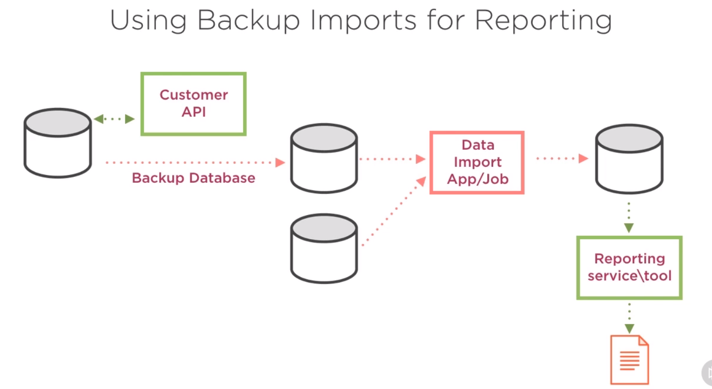

### ETL and Data-warehouses

Отдельная ETL-система, которая имеет доступ ко всем БД, сама читает оттуда данные, трансформирует и пишет в БД репортинга. 

Преимущество - процессы Extract, Transform, Load могут работать параллельно. Подход существует давно и есть много инструментов для его реализации.

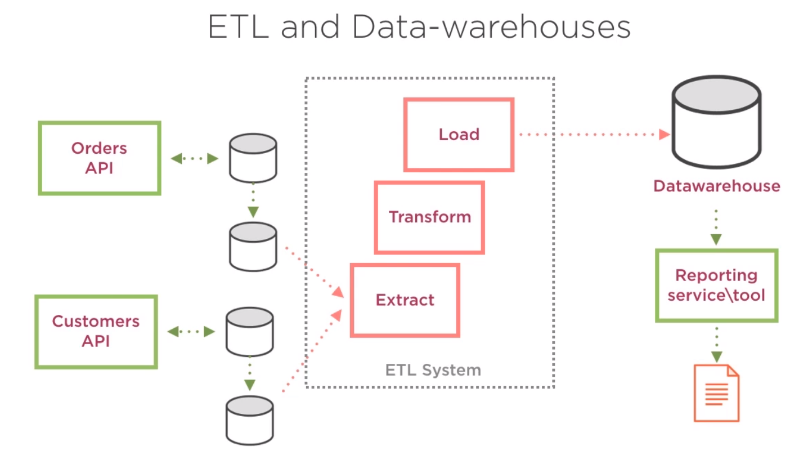

## How to Manage Microservices Configuration

Варианты конфигурирования серверов:

1. Через сервер развертывания. На деплоймент сервере хранится вся конфигурация для всех сервисов и он при развертывании сервисов инжектит в них конфигурацию. Также этим образом можно указывать разную конфигурацию для разных сред. Недостаток - если нужно поменять конфигурацию, то сервис придется передеплоить.

2. Внешний сервис конфигурации. Все сервисы знают о центральном сервисе конфигурации и получают от него конфигурацию через его API. Преимущество - можно динамически менять конфигурацию. Недостаток - сервис конфигурации может быть недоступен, нужно хэндлить ошибки. Еще нужно заботиться о безопасности доступа к конфигурации.

3. Использование специальных инструментов для управления конфигурацией: **Chef**, **Puppet**, **Ansible**. Они позволяют в одном месте изменять конфигурацию и пушить ее на все сервера.

## How to Manage Microservices Registration and Discovery

### Client Side Discovery

Клиентское приложение получает из реестра сервисов список адресов для нужного ему API и само балансирует нагрузку между этими адресами. А все сервисы при старте должны регистрироваться в рееестре сервисов. При остановке они должны разрегистрироваться, поэтому тут должен быть какой-то health check. Недостаток - все теперь зависят от реестра сервисов, а клиентское приложение должно содержать дополнительную логику по получению и выбору адресов.

### Server Side Discovery

Клиентское приложение делает запрос на балансировщик, а он уже делает запрос в реестр сервисов и выбирает, на какой адрес проксировать запрос.

### Service Registration

В качестве Service Registry API может быть свой небольшой сервис, принимающий запросы по REST API

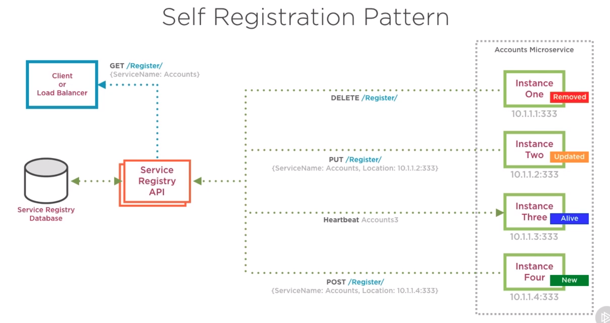

Либо можно использовать готовые продукты для этого. Такие продукты обычно умеют сами обнаруживать сервисы, что позволяет избавить код сервисов от необходимости регистрации в реестре.

К таким готовым продуктам относятся:

- Consul
- etcd
- Zookeeper (хотя тут не уверен, все-таки регистрацию нужно самостоятельно делать)
- Docker Swarm
- Kubernetes (там помимо оркестрации еще и discovery & registration из коробки есть)
- Baker Street
- SmartStack

## How to Monitor Microservices

Основные метрики, которые нужно мониторить:

- количество доступных ресурсов на хостах (CPU, память, диск, сеть)
- количество потребляемых ресурсов на хостах
- доступность хостов каждого сервиса (можно дергать специальный метод, который возвращает статичный ответ, либо ответ с некоторой статистикой о текущем состоянии)
- средняя задержка ответа
- количество успешных и ошибочных ответов от эндпойнтов
- количество ошибок, эксепшнов, таймаутов
- доступность сторонних сервисов, от которых зависим
- метрики и статистики, специфичные для конкретного микросервиса

Для алертов должны быть обозначены несколько пределов:

- Normal: пределы нормального функционирования, алертов не шлем
- Warning: система работает, но как-то не очень, скоро могут начаться проблемы
- Critical: система не работает, нужны срочные действия

Лимиты для алертов можно взять из логов и данных мониторинга, оставшихся с предыдущих проблем, либо же снять при нагрузочном тестировании.

В сообщения алертов бывает полезно вставить ссылку на соответствующий раздел документации, чтобы поддержка могла разобраться самостоятельно.

**Инструменты**:

- StatsD
- Graphite
- New Relic
- PRTG
- Nagios
- Windows performance counters
- Bespoke dashboards
- Cloud provider tools (i.e. Azure Application Insights)