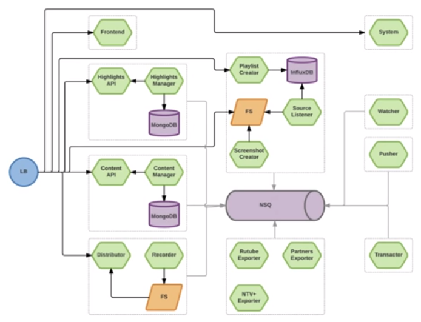
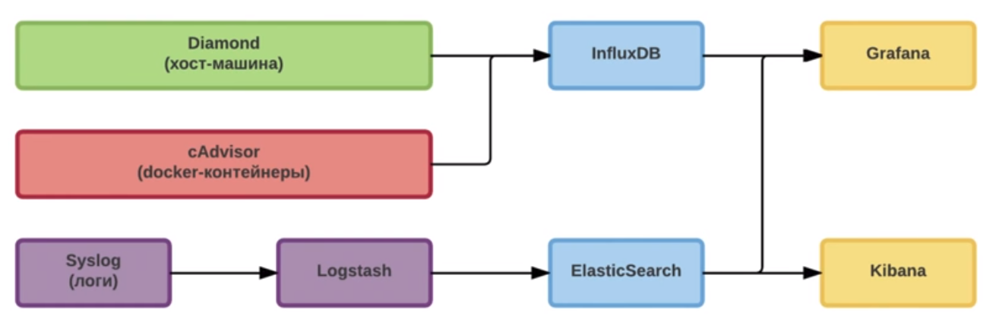
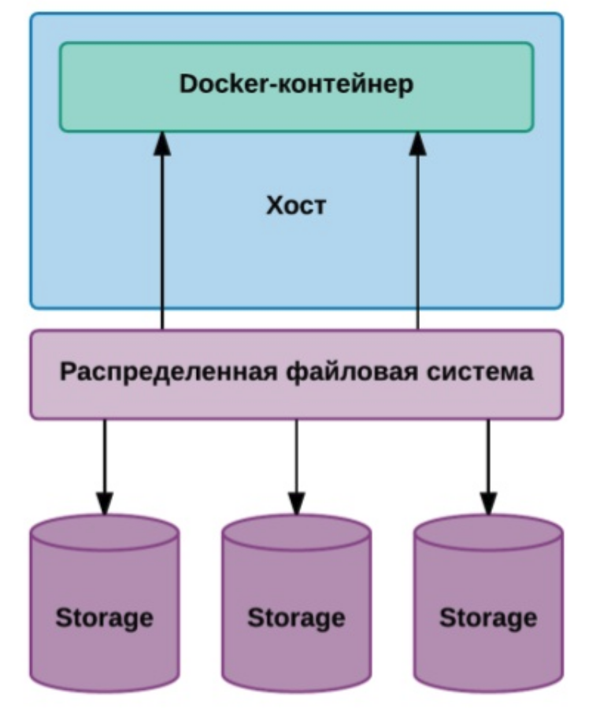
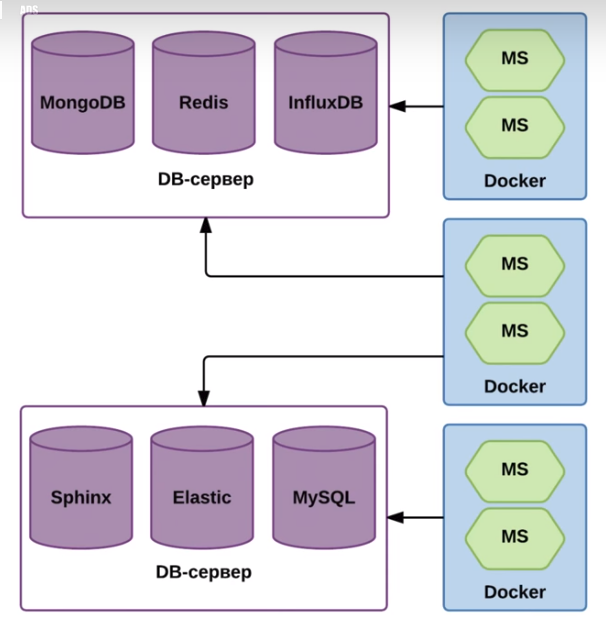

Кусок архитектуры М-Тех, который занимается нарезкой видео из лайв-потока:



Зеленым обозначены микросервисы. Здесь их 17, и это 1/20 часть всей системы. То есть всего около 340 микросервисов. С учетом того, что некоторые сервисы разворачиваются в нескольких экземплярах, получается 1120 нод.

## Насколько мелким должен быть микросервис?

Настолько, чтобы он был независимым!

### Как проверить независимость:

1. Бизнес-задача сервиса должна описываться одним простым предложением. Если не получается - значит можно еще поделить. Например, "показать картинки на таймлайне видеоредактора". Если на эта картинку, например, нужно вотермарк наложить, то это надо делать в этом же сервисе. То есть делить нужно **не технически**, а по бизнес-задачам, иначе грануляция будет слишком высокая. Общие вещи - копипастятся и кладутся в отдельную папку vendor.
2. У сервиса должно быть больше одного потребителя. Если один - значит слишком мелко поделили.
3. Деплой сервиса не должен приводить к деплою других сервисов. Если приводит - значит есть зависимость нашего сервиса от другого, значит слишком мелко поделили.

### Требования к микросервису:

- скрывает внутренние детали реализации
- деплоится независимо
- падая, не роняет все остальное
- легко мониторится
- реализует бизнес-модель
- полностью децентрализован

## Конфигурация

### Что пробовали?

- файлы конфигурации при деплое разливать по всем целевым машинам. Минус: сложно менять конфигурацию для одной ноды, количество загрузок конфигов растет линейно с ростом машин.
- файлы конфигурации класть в контейнер. Минус: при изменении конфига нужно пересобрать и передеплоить контейнет.
- выставлять переменные окружения (рекомендуется в https://12factor.net/)
	- при сборке контейнера (`ENV DB=...`). Минус: на этапе деплоя нет информации, где это будет лежать
	- при запуске контейнера. Минус: на этапе запуска нет возможности абстрагироваться от системы запуска.

### Решение

- общее K/V хранилище (у них consul)
- сервис должен быть заточен под смену конфигурации
- микс вариаций с приоритетами:
	- <СЕРВИС>/ (/conf/ms/recorder)
	- <СЕРВИС>/<ВЕРСИЯ>/ (/conf/ms/recorder/0.12)
	- <СЕРВИС>/<СРЕДА>/
	- <СЕРВИС>/<ВЕРСИЯ>/<СРЕДА>/
	- <СЕРВИС>/<ВЕРСИЯ>/<НОДА>/

Конфиги хранятся в тех же репозиториях, что и проекты.

Утилита **git2consul** при деплое загружает конфиги в consul.

Стартовый путь:
`/conf/ms/<ИМЯ СЕРВИСА>/<BUILD NO>/`

Все секретные данные (сертификаты, пароли к внешним сервисам, соль) хранятся в отдельных проектах, загружаются в **Vault** (https://www.vaultproject.io/), а в основном конфиге указывается путь, по которому их можно достать.

## Мониторинг

Zabbix / Cacti / Nagios

Проблема в том, что при использовании микросервисов отказ в одном сервисе влечет за собой отказы во всей цепочке сервисов, зависимых от него. В результате из-за одной ошибки получаем десятки алертов.

### Как решать?

- вместо полноценного мониторинга - строим dashboard.
- алерты по статистическим и пороговым значениям вместо бинарных
- на одном дэшболде сводить графики хост-машин и статистики по docker-демону



**Diamond** собирает метрики с хост-машины, **cAdvisor** - с контейнера. Потом это все собирается в **InfluxDB** и выводится в **Grafana**.

Логи из контейнеров собираются через **Syslog**, аггрегируются в **Logstash**, загоняются в **ElasitSearch**. Оттуда метрики по логам загоняются в **Grafana**, а общая работа с логами ведется в **Kibana**.

Трейсинг запросов: **OpenZipkin**

Альтернативы:

- cAdvisor - нет альтернатив, есть **telegraf**, но он пока сырой.
- InfluxDB - альтернативой может быть **Prometheus**, но он не умеет горизонтально масштабироваться, а InfluxDB умеет, но за деньги. Еще можно сделать сборку метрик в **ElasticSearch**, но он менее производителен и более требователен к ресурсам.

Еще недостатки Prometheus:

- хорош, когда нужно собирать данные с готовых стандартных компонент, которых очень много. Если таких компонент мало и плюс к этому нужны метрики по бизнес-логике, то нужно много писать кода на стороне клиента и разбираться во внутренней логике работы Prometheus
- нельзя использовать как events time-series db, то есть мы не можем кидать туда события, чтобы он потом сам посчитал метрики. Нужно заранее самому считать метрики на клиенте и кидать их уже в готовом виде.
- сложно делать интегрированные метрики. например, персентили времени отклика клиентам по всем серверам фронтенда. Это сделать в Prometheus невозможно вообще.

### Общие рекомендации

1. Сбор метрик - это важно, но еще важнее постоянный анализ полученных данных
2. Система мониторинга должна быть более надежной и масштабируемой, чем то, что она контролирует
3. Система должна быть оптимизирована для распределенных, недолговечных, облачных, контейнеризованных микросервисов
4. Собирайте метрики часто и очень часто, стремитесь к интервалам < 10 сек, иначе разовые всплески можно пропустить

## Тестирование

Не нужно тестировать взаимодействие с другими сервисами, нужно тестировать только контракт каждого сервиса.

Сложно тестировать ситуации, когда сервис доступен, но отвечает медленно, эпизодически или некорректно. В этой ситуации поможет паттерн **Circuit Breaker** и утилита, его реализующая - **Hystrix**. 

Полезным будет сделать тестовый кластер из нескольких Raspberry Pi. Из него можно спокойно выдергивать сеть, питание, ставить туда медленные или сбойные флешки.

## Хранение

### Что пробовали

- проброс файловой системы в контейнер. Минусы: на одной машине данные пробросили, а на другой их нет. То есть нарушается изоляция.
- "Собирающие контейнеры" - на бэкэнд ставится проксирующий nginx, он пробрасывает трафик на фронтенд, а у себя собирает всю проходящую через него статику и за несколько итераций получается контейнер, где собраны все данные. Минусы: на монолите прекрасно работает, на микросервисах - нет.
- Shared data volume - заранее создается волюм, именуется, аттачится к нескольким контейнерам сервисов и таким образом получаем отдельный контейнер с данными, который можно деплоить вместе с контейнером сервисов.
- Flocker - сторонний менеджер волюмов данных. В отличие от стандартных волюмов докера, которые привязаны к одному серверсу, волюмы Флокера мобильны и могут быть использованы с любым контейнером. Минус: работает конечно через сеть, а большие объемы данных через сеть гонять неудобно.

### Решение

Тут я не очень понял, поэтому далее цитата:

```
Используем **Ceph**, выделили отдельный storage cluster, подняли распределенную файловую систему, часть машин из докер-кластера помечается определенными метками. Когда запускаются контейнеры, то микросервисы, которые требуют такого типа хранения, ориентируются на эти метки. То есть разливаем именно на это подмножество машин.
```



#### Для баз данных:

- выделенные сервера
- особая конфигурация машин
- расширенная сеть

Базы крутятся не в докере, потому что у них особые требования к ресурсам.



Для инстансов БД используется особая схема именования, поэтому каждый сервис знает, как найти свою базу в этом кластере.

При этом здесь не нарушается паттерн "одна БД на сервис", потому что внутри сервера есть, например, 10 инстансов монги и каждый микросервис использует свой инстанс.

## Обнаружение сервисов

Используется реестр сервисов:

- **consul** - K/V хранилище, DNS, health-check, работа с несколькими ДЦ из коробки
- **etcd** - K/V хранилище
	- skydock - Health-Check, регистрация docker-контейнеров
	- skydns - DNS
- **Apache Zookeeper** - вариация K/V хранилища, сервис блокировок, вариация на тему DNS

## Оркестрация

- **docker swarm [1.2.2]** - доставка, регистрация, масштабирование (consul)
- **nomad [0.3.2]** - доставка, регистрация, масштабирование (consul). Самый простой для разработчика, запуск одной командой. Но и сильно ограничен по функционалу.
- **kubernetes [1.2.4] - доставка, регистрация, масштабирование, LB (etcd)
- **mesos [0.28.1]** (marathon [1.1.1]) - доставка, регистрация, масштабирование, LB (zookeeper, HAProxy)

## Разрешение адресов в момент деплоя

Есть проблема в том, что на момент разработки неизвестно, на какие адреса будет развернута система и следовательно неизвестно, кому по каким адресам обращаться. Эта проблема решена комбинацией nginx и consul.

Для consul используется следующий шаблон конфига nginx:

```
{{range services}}
	{{ if in .Tags "demo" }}
		{{if .Tags | join "," | regexMatch "urlprefix-"}} #urlprefix-/playlist
			upstream {{.Name}} { 
				least_conn; 
				{{range service .Name}}server {{.Address}}:{{.Port}} max_fails=3 fail_timeout=30 weight=1;{{end}} 
			} 
		{{end}}
	{{end}}
{{end}} 

server { 
	listen 80 default_server; 

	location /health { 
		add_header Content-Type text/plain; 
		return 200 'OK'; 
	} 

	{{range services}}
		{{ if in .Tags "demo" }}
			{{if .Tags | join "," | regexMatch "urlprefix-"}}
				{{range .Tags}}{{ if . | contains "urlprefix-" }}
					location {{. | replaceAll "urlprefix-" ""}} { 
						{{end}}{{end}} 
						proxy_pass http://{{.Name}}/; # / в конце означает обрезку проксируемого пути
						proxy_set_header Host $host; 
						proxy_set_header X-Real-IP $remote_addr; 
					} 
			{{end}}
		{{end}}
	{{end}} 
}
```

В первом куске шаблона: `services` - это список **живых** сервисов, полученный из consul. Затем выбирается подмножество с тэгом demo, заем из них выбираем те сервисы, которым нужен роутинг (т.е. те, у которых в тэге есть флаг urlprefix). Если все эти условия выполнились, то генерится списко апстримов.

Во втором куске, который в разделе server: эти апстримы подключаются на те роуты, которые заявлены как требующие роутинга.

Результат работы шаблона:

```
upstream playlistapi { 
	least_conn; 
	server 10.1.1.2:5100 max_fails=3 fail_timeout=30 weight=1; 
} 
 

... 


location /playlist { 
	proxy_pass http://playlistapi/; 
	proxy_set_header Host $host; 
	proxy_set_header X-Real-IP $remote_addr; 
}
```

Исходники примера здесь: http://bit.ly/1TE1KdM 

## Чек-лист

- Как конфигурировать?
- Как мониторить и считать метрики?
- Как сервисы будут находить друг друга
- Как сервис будет взаимодействовать с остальными частями проекта?
- Как тестировать сервис и систему целиком?
- Как обрабатывать сбои связанных сервисов?
- Как переезжать на новую версию?
- Как масштабировать под нагрузкой?