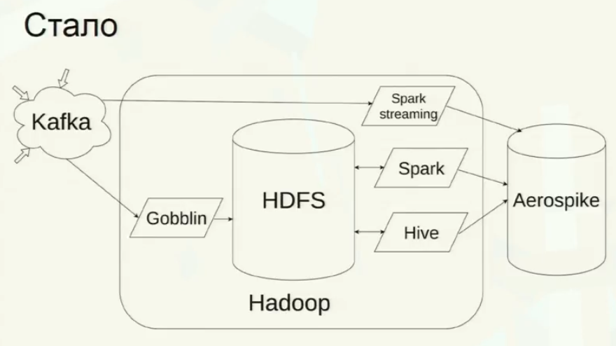

<iframe width="660" height="375" src="https://www.youtube.com/embed/BtmYjTO1EpI" frameborder="0" allow="accelerometer; autoplay; encrypted-media; gyroscope; picture-in-picture" allowfullscreen></iframe>

# Брокер сообщений Kafka в условиях повышенной нагрузки

Вот так сейчас выглядит система сбора информации о пользователях с разных сервисов раблера:



Разные сервисы публикуют нужную информацию в Kafka.

**Gobblin** - решение от LinkedIn для ETL информации из разных источников в Hadoop. Говоря проще, это map-reduce задача, которая крутится на Hadoop, берет данные из кафки и кладет в HDFS.

**Spark streaming** - постоянно висит на хадупе, откусывает от кафки микробатчи информации, обрабатывает их и кладет в базу. HDFS полностью минуется, все происходит в памяти, поэтому можно обрабатывать потоковые данные в реал-тайме.

Не-потоковые данные кладутся в HDFS, потом оттуда берутся спарком и хайвом, обрабатываются и результаты обработки кладутся в базу Aerospike для пользования внешним миром.

Благодаря такой архитектуре, задержка между наступлением события и его появлением в Aerospike составляет около минуты.

## Переизбрание лидеров

При переизбрании лидеров всегда происходит потеря данных. При этом переизбрание может происходить само по себе, даже когда все идет хорошо.

Чтобы при этом не было потери данных, нужно указать параметр `request.required.acks`, который контроллирует, когда клиенту будет выслано подтверждение.

Если `request.required.acks` равен:

- 0: подтверждения нет вообще
- 1: перед подтверждением запись только в мастер
- -1 или all: количество записей настраивается для каждого топика индивидуально параметром `min.insync.replicas.per.topic`. 

Если указать `min.insync.replicas.per.topic`, равное `replication.factor`, то при выходе из строя любой реплики, запись перестает работать вообще. Поэтому рекомендуется указывать `min.insync.replicas.per.topic` меньшее, чем `replication.factor`.

В рамблере:

```
min.insync.replicas.per.topic = 2
replication.factor = 3
```

## Сохранение отступов

- **автоматическое сохранение**: возможна потеря данных

- **ручное сохранение**: возможны дубли данных

- **сохранение вне Kafka**: а вот здесь можно обеспечить exactly once. Консюмер после получения данных **атомарно** сохраняет в свою БД и полученные данные и сдвиг. Если база, куда сохраняем, транзакционная, то проблем в атомарном сохранении нет. А вот если это, например, HDFS, то придется костылить:

```sh
hdfs dfs -mv /tmp/file1 /logs/file
hdfs dfs -mv /tmp/file2 /logs/file
hdfs dfs -mv /tmp/offsets /runtime/offsets
```

Здесь воркер перемещает 2 файла данных и сдвиг в HDFS. Если он упал после первой операции, то при следующем старте он опять получит это сообщение от кафки, после чего посмотрит в HDFS и увидит, что первый файл уже сохранен. Поэтому сохранит только второй файл и сдвиг.

## Неравномерное распределение нагрузки

Даже при нормальной работе кластера Kafka ошибается. В результате этого она может неравномерно рапределять партиции и лидеров по брокерам.

Например, у нас есть 3 брокера:

- первый брокер имеет лидера партиции 0, лидера партиции 1, лидера партиции 2
- второй брокер имеет реплику 0, реплику 1, реплику 2
- третий брокер не имеет ничего

Симптомы: 

- сильная задержка в обработке
- резкое возрастание нагрузки на одних нодах и падение на других
- повышение общего количества трафика из-за того, что кафка постоянно запускает переизбрание лидеров
- кафка медленно отвечает на простейшие запросы, отдельные ноды отвечают по несколько минут
- падения консюмеров с ошибками типа "не могу получить лидеров", "не могу получить отступы"

Решение:

Автоматизированного решения нет, нужно распределять вручную. В кафку можно скормить конфиг, в котором расписано, на каких нодах какие партиции должны лежать и какие из них должны быть лидерами.

Конечно, это стоит делать только для самых "толстых" топиков, через которые проходит наибольшее количество информации.

Другое решение - повысить репликацию. Вот почему оно работает: в описанном выше примере фактор репликации равен 2, потому при отказе брокера 1 кафка переносит все лидеры на брокер 2 и вся нагрузка переезжает на него. Если бы фактор репликации был 3, то лидеры распределились бы равномерно между 2 и 3 брокером и нагрузка бы разделилась между ними.

## RAID

Кафка не дружит с RAID 5. Когда терятся блок данных и начинается восстановление - кафка резко просаживается.

Рекомендуется использовать RAID 10.

## Что мониторить?

Узкие места:

- сеть
- диски
- распределение нагрузок по нодам
- распределение лидеров толстых топиков

Переизбрание лидеров

Рассинхронизация партиций:

- число несинхронных партиций (UnderReplicatedPartitions)
- максимальный лаг репликации (ReplicaFetcherManager.MaxLag)

Время ответа на простейшие запросы (сигнал того, что с кафкой начало происходить что-то плохое)