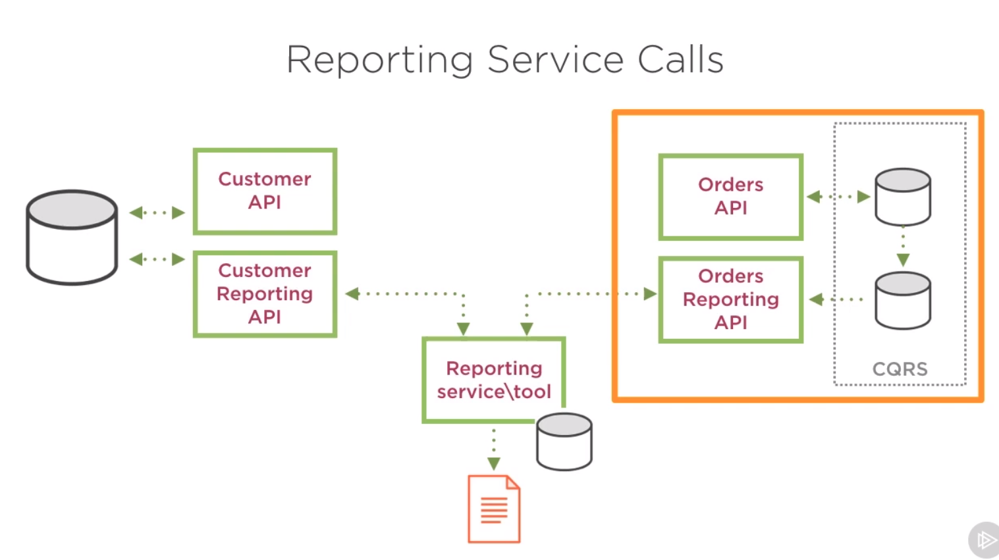

# Microservices Architectural Design Patterns Playbook

[Курс на Pluralsight](https://app.pluralsight.com/player?course=microservices-architectural-design-patterns-playbook)

## How to implement Microservices Centralized Logging

- Логирование должно быть централизованным, то есть все микросервисы пишут логи на один и тот же сервер.
- Формат логов должен быть одинаковым среди всех микросервисов. Обязательные поля: уровень логирования, дата и время, ID транзакции (Correlation ID), информация о хосте и приложении микросервиса, само сообщение. В идеале должна быть разделяемая библиотека логирования.
- У транзакции должен быть свой ID, который переходит вместе с ней с микросервиса на микросервис, чтобы можно было по логам отслеживать ее прогресс
- Уровни логирования как минимум должны содержать **Info**, **Debug**, **Error**.

Популярные тулзы:

- **Elasticsearch** - поисковый движок
- **Logstash** - инструмент для управления логами и ивентами
- **Kibana** - плагин Elasticsearch для визуализации данных в браузере, предназначенный в основном для визуализации данных Logstash

## How to provide reporting from distributed microservices data

Далее основные паттерны

### Reporting Service Calls

Есть отдельный микросервис для репортинга, а каждый микросервис приложения имеет в паре микросервис с Reporting API для него. Сервис репортинга сам через это API вытягивает нужные ему данные, джойнит их как ему надо и сохраняет их в своем хранилище.

Reporting API должен быть спроектирован специальным образом, чтобы поддерживать вытягивание данных батчами. Например, принимать на вход список айдишников, или принимать callback address, на который он сможет сообщить результат долгой операции.

Недостаток здесь в том, что у нас получается два сервиса (сам микросервис и его Reporting API), которые используют одну и ту же БД, а это считается анти-паттерном. В качестве решения можно использовать CQRS, то есть БД реплицируется в отдельную реплику только для чтения, из которой читает Reporting API.

### Data Push Application

У каждого микросервиса в паре есть Data Push App, который берет нужные для репортинга данные и пушит их в БД сервиса репортинга, к которой имеет доступ. Затем сервис репортинга джойнит данные из этой БД и выдает отчеты.

Data Push App может сам трансформировать данные в удобный для отчетов вид.

Преимущество в том, что Data Push App может вообще не работать с HTTP, а подсоединяться напрямую к двум базам и перегонять данные из одной в другую.

### Reporting Event Subscribers

микросервис логики при каждом изменении данных создает запись о событии в специальной очереди событий. Затем Event Subscriber берет это событие из очереди и записывает в Event Sourcing Database для отчетов. После этого отдельный reporting service строит по этой базе отчеты.

Преимущество - изоляция сервиса логики от системы отчетов, т.к. сервис логики не знает, куда и зачем он пишет событие.

### Reporting Events via Gateway

Похож на предыдущий подход, но мы выделяем специальный API Gateway, который будет на каждый вызов делать две вещи: 1. проксировать вызов на нужный сервис, 2. создавать сообщение с ивентом в очереди события для репортинга.

Преимущество - наш сервис вообще не парится насчет отчетов, а логика по публикации данных для отчетов изолирована в API Gateway.

### Using Backup Imports for Reporting

Нужен налаженный процесс бэкапирования БД и отдельный сервис, который копирует бэкап базы, а потом из копии бэкапа достает данные и перекладывает их в БД репортинга. Затем сервис репортинга джойнит данные из этой БД для генерации отчетов.

Основное преимущество - абсолютно не влияет на нормальный процесс работы системы.

Недостаток - задержки, нужно много места на диске.

### ETL and Data-warehouses

Отдельная ETL-система, которая имеет доступ ко всем БД, сама читает оттуда данные, трансформирует и пишет в БД репортинга. 

Преимущество - процессы Extract, Transform, Load могут работать параллельно. Подход существует давно и есть много инструментов для его реализации.

## How to Manage Microservices Configuration

Варианты конфигурирования серверов:

1. Через сервер развертывания. На деплоймент сервере хранится вся конфигурация для всех сервисов и он при развертывании сервисов инжектит в них конфигурацию. Также этим образом можно указывать разную конфигурацию для разных сред. Недостаток - если нужно поменять конфигурацию, то сервис придется передеплоить.

2. Внешний сервис конфигурации. Все сервисы знают о центральном сервисе конфигурации и получают от него конфигурацию через его API. Преимущество - можно динамически менять конфигурацию. Недостаток - сервис конфигурации может быть недоступен, нужно хэндлить ошибки. Еще нужно заботиться о безопасности доступа к конфигурации.

3. Использование специальных инструментов для управления конфигурацией: **Chef**, **Puppet**, **Ansible**. Они позволяют в одном месте изменять конфигурацию и пушить ее на все сервера.

## How to Manage Microservices Registration and Discovery

### Client Side Discovery

Клиентское приложение получает из реестра сервисов список адресов для нужного ему API и само балансирует нагрузку между этими адресами. А все сервисы при старте должны регистрироваться в рееестре сервисов. При остановке они должны разрегистрироваться, поэтому тут должен быть какой-то health check. Недостаток - все теперь зависят от реестра сервисов, а клиентское приложение должно содержать дополнительную логику по получению и выбору адресов.

### Server Side Discovery

Клиентское приложение делает запрос на балансировщик, а он уже делает запрос в реестр сервисов и выбирает, на какой адрес проксировать запрос.

### Service Registration

В качестве Service Registry API может быть свой небольшой сервис, принимающий запросы по REST API

Либо можно использовать готовые продукты для этого. Такие продукты обычно умеют сами обнаруживать сервисы, что позволяет избавить код сервисов от необходимости регистрации в реестре.

К таким готовым продуктам относятся:

- Consul
- etcd
- Zookeeper (хотя тут не уверен, все-таки регистрацию нужно самостоятельно делать)
- Docker Swarm
- Kubernetes (там помимо оркестрации еще и discovery & registration из коробки есть)
- Baker Street
- SmartStack

## How to Monitor Microservices

Основные метрики, которые нужно мониторить:

- количество доступных ресурсов на хостах (CPU, память, диск, сеть)
- количество потребляемых ресурсов на хостах
- доступность хостов каждого сервиса (можно дергать специальный метод, который возвращает статичный ответ, либо ответ с некоторой статистикой о текущем состоянии)
- средняя задержка ответа
- количество успешных и ошибочных ответов от эндпойнтов
- количество ошибок, эксепшнов, таймаутов
- доступность сторонних сервисов, от которых зависим
- метрики и статистики, специфичные для конкретного микросервиса

Для алертов должны быть обозначены несколько пределов:

- Normal: пределы нормального функционирования, алертов не шлем
- Warning: система работает, но как-то не очень, скоро могут начаться проблемы
- Critical: система не работает, нужны срочные действия

Лимиты для алертов можно взять из логов и данных мониторинга, оставшихся с предыдущих проблем, либо же снять при нагрузочном тестировании.

В сообщения алертов бывает полезно вставить ссылку на соответствующий раздел документации, чтобы поддержка могла разобраться самостоятельно.

**Инструменты**:

- StatsD
- Graphite
- New Relic
- PRTG
- Nagios
- Windows performance counters
- Bespoke dashboards
- Cloud provider tools (i.e. Azure Application Insights)